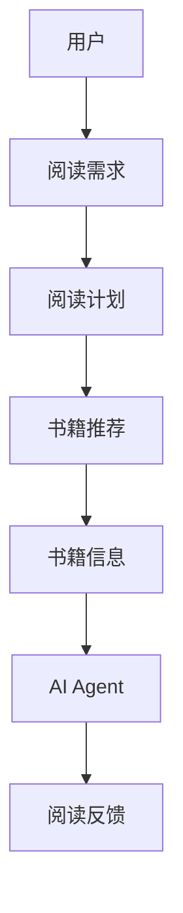
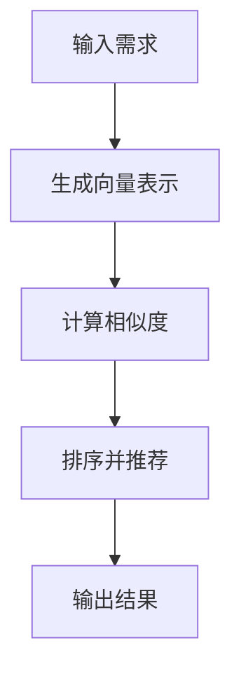
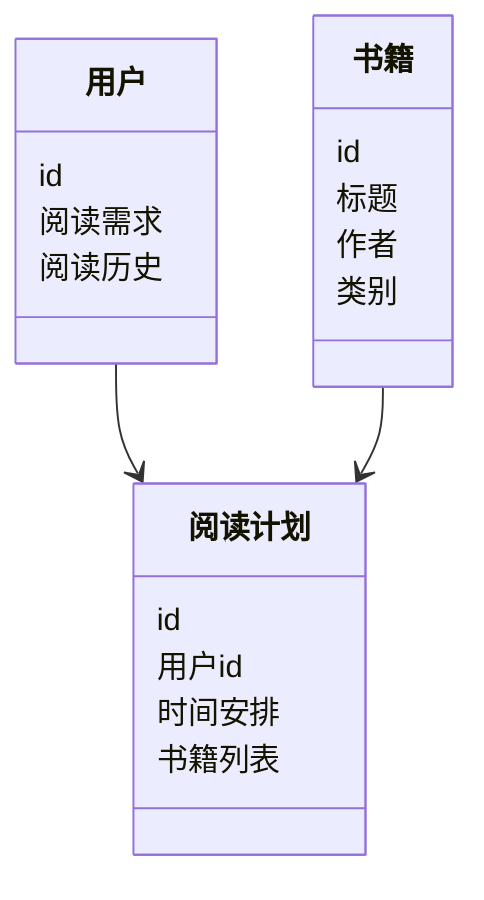
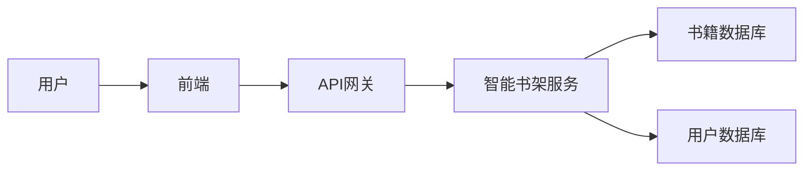
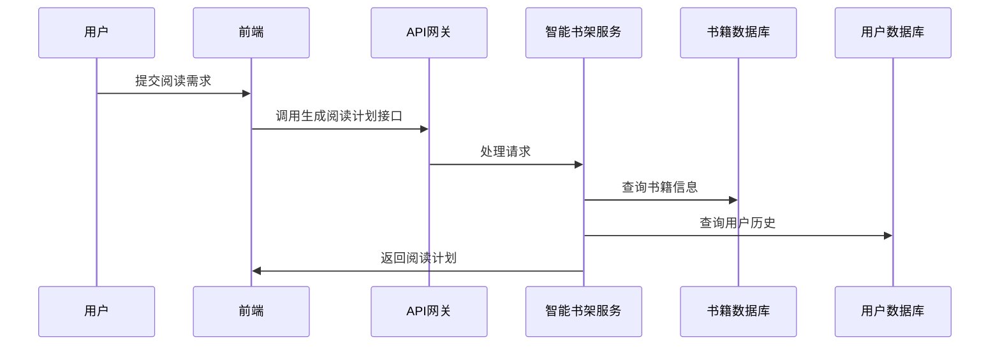

                 


# 智能书架：AI Agent的阅读计划制定助手

## 关键词：AI Agent，阅读计划，智能书架，生成式AI，检索式AI，阅读推荐

## 摘要：本文深入探讨了AI Agent在阅读计划制定中的应用，分析了智能书架的核心概念、算法原理、系统架构，并通过实际案例展示了AI Agent如何帮助用户制定高效的阅读计划。文章从问题背景、核心概念、算法实现到系统设计，全面解析了智能书架的构建过程，为读者提供了从理论到实践的详尽指南。

---

## 第1章: 智能书架的背景与概念

### 1.1 智能书架的背景介绍

#### 1.1.1 阅读计划制定的痛点与挑战
在信息爆炸的时代，用户每天面对海量书籍和文章，选择合适的阅读材料变得困难。传统的阅读计划制定方法依赖于手动筛选，耗时且效率低下。此外，每个人的阅读需求不同，如何个性化地推荐书籍成为一个挑战。

#### 1.1.2 AI Agent在阅读计划中的作用
AI Agent（人工智能代理）能够通过自然语言处理和机器学习技术，分析用户的阅读目标、兴趣和时间安排，自动生成个性化的阅读计划。AI Agent能够实时调整推荐内容，确保阅读计划的高效性和相关性。

#### 1.1.3 智能书架的核心目标与价值
智能书架的核心目标是通过AI技术，帮助用户高效制定和执行阅读计划。其价值在于提升阅读效率，优化知识吸收，并通过个性化推荐满足用户的深层需求。

### 1.2 AI Agent的基本概念与原理

#### 1.2.1 什么是AI Agent
AI Agent是一种智能实体，能够感知环境并采取行动以实现目标。在阅读计划制定中，AI Agent充当用户的代理，收集信息、分析需求并执行推荐任务。

#### 1.2.2 AI Agent的分类与特点
AI Agent可以分为基于规则的代理和基于学习的代理。基于规则的代理通过预定义规则进行决策，而基于学习的代理通过机器学习模型自适应地优化推荐结果。

#### 1.2.3 AI Agent在阅读计划中的应用
AI Agent在阅读计划中的应用包括需求分析、内容推荐和进度跟踪。它能够根据用户的反馈动态调整推荐策略，确保阅读计划的灵活性和高效性。

### 1.3 智能书架的核心功能与优势

#### 1.3.1 智能书架的功能模块
智能书架的主要功能模块包括用户需求分析、内容推荐、阅读计划生成和进度跟踪。这些模块协同工作，为用户提供全面的阅读管理服务。

#### 1.3.2 AI Agent在智能书架中的具体应用
AI Agent在智能书架中用于需求分析、内容推荐和反馈优化。它能够理解用户的阅读目标，并通过数据分析生成最优的阅读计划。

#### 1.3.3 智能书架的优势与创新点
智能书架的优势在于个性化推荐和动态调整能力。其创新点在于结合生成式AI和检索式AI，提供更精准和灵活的阅读推荐服务。

---

## 第2章: 智能书架的核心概念与联系

### 2.1 AI Agent与阅读计划的关系

#### 2.1.1 AI Agent如何辅助阅读计划制定
AI Agent通过分析用户需求，生成个性化的阅读计划，并实时调整推荐内容以适应用户的反馈。

#### 2.1.2 阅读计划的结构化表示
阅读计划可以表示为一个结构化的数据模型，包括目标、时间安排和推荐书籍。AI Agent通过解析这些数据模型优化推荐策略。

#### 2.1.3 AI Agent在阅读计划中的决策逻辑
AI Agent基于用户反馈和阅读数据，调整推荐策略。它通过分析用户的行为和偏好，优化阅读计划的执行效果。

### 2.2 生成式AI与检索式AI的对比分析

#### 2.2.1 生成式AI的基本原理
生成式AI通过生成模型生成新的内容。在阅读计划中，生成式AI可以用于生成个性化的阅读建议。

#### 2.2.2 检索式AI的基本原理
检索式AI通过检索模型从现有数据中找到最相关的结果。在阅读计划中，检索式AI用于推荐已有的书籍和资源。

#### 2.2.3 两种AI模式在阅读计划中的应用对比
生成式AI适用于个性化建议的生成，而检索式AI适用于基于现有数据的推荐。两者结合可以提供更全面的阅读推荐服务。

### 2.3 智能书架的实体关系图



---

## 第3章: 智能书架的算法原理

### 3.1 生成式AI模型的算法原理

#### 3.1.1 Transformer模型的基本结构
Transformer模型由编码器和解码器组成，广泛应用于生成式任务。在阅读计划中，生成式AI用于生成个性化的阅读建议。

#### 3.1.2 注意力机制的数学模型
注意力机制通过计算输入序列中每个位置的重要性，生成加权后的表示。其数学公式如下：
$$
\text{Attention}(Q, K, V) = \text{softmax}\left(\frac{QK^T}{\sqrt{d_k}}\right)V
$$

#### 3.1.3 梯度下降与损失函数
生成式AI模型通过梯度下降优化损失函数。常用的损失函数包括交叉熵损失和KL散度。

### 3.2 检索式AI模型的算法原理

#### 3.2.1 向量空间模型的构建
检索式AI模型将文本表示为向量，并通过计算向量之间的相似度进行检索。常用的方法包括TF-IDF和Word2Vec。

#### 3.2.2 相似度计算的数学公式
余弦相似度计算公式如下：
$$
\text{相似度}(A, B) = \frac{A \cdot B}{\|A\|\|B\|}
$$

#### 3.2.3 基于余弦相似度的检索算法
检索式AI通过计算书籍向量与用户需求向量的余弦相似度，推荐最相关的书籍。

### 3.3 智能书架算法的实现流程



---

## 第4章: 智能书架的系统分析与架构设计

### 4.1 问题场景介绍
智能书架系统需要处理用户的阅读需求，分析书籍信息，并生成个性化的阅读计划。系统需要处理大量的书籍数据和用户反馈。

### 4.2 系统功能设计

#### 4.2.1 领域模型


### 4.3 系统架构设计

#### 4.3.1 系统架构图


### 4.4 系统交互设计

#### 4.4.1 交互流程图


---

## 第5章: 智能书架的项目实战

### 5.1 环境安装

#### 5.1.1 安装Python环境
使用Anaconda安装Python 3.8及以上版本。

#### 5.1.2 安装依赖库
安装TensorFlow、Keras和Scikit-learn等库：
```bash
pip install tensorflow keras scikit-learn
```

### 5.2 系统核心实现

#### 5.2.1 阅读需求分析
通过自然语言处理技术分析用户的阅读需求，提取关键词和主题。

#### 5.2.2 内容推荐实现
基于生成式AI和检索式AI的结合，推荐最相关的书籍。

### 5.3 实际案例分析

#### 5.3.1 案例背景
用户希望在一个月内阅读三本关于人工智能的书籍。

#### 5.3.2 实施步骤
1. 分析用户的阅读目标和时间安排。
2. 生成个性化的阅读计划。
3. 根据用户反馈调整推荐内容。

---

## 第6章: 总结与展望

### 6.1 本章小结
智能书架通过AI Agent帮助用户高效制定阅读计划，结合生成式和检索式AI提供精准推荐。

### 6.2 注意事项
在实际应用中，需注意数据隐私和模型的可解释性问题。

### 6.3 未来展望
未来，智能书架可以结合增强学习和边缘计算，提供更智能和个性化的阅读服务。

---

## 第7章: 最佳实践与拓展阅读

### 7.1 最佳实践
定期更新书籍数据库，收集用户反馈以优化推荐算法。

### 7.2 小结
智能书架是一个结合AI技术的高效工具，能够显著提升用户的阅读效率和体验。

### 7.3 注意事项
在实际应用中，需关注模型的实时性和用户隐私保护。

### 7.4 拓展阅读
建议读者进一步学习生成式AI和检索式AI的结合应用，探索其在其他领域的潜力。

--- 

以上是《智能书架：AI Agent的阅读计划制定助手》的技术博客文章的完整内容，涵盖了从背景到实现的各个层面，提供了丰富的技术细节和实践指导。

