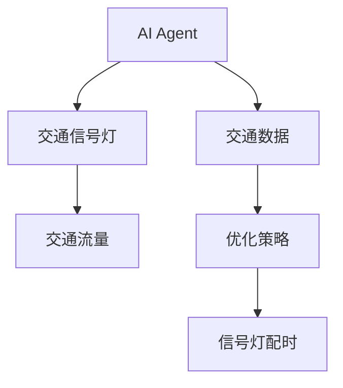
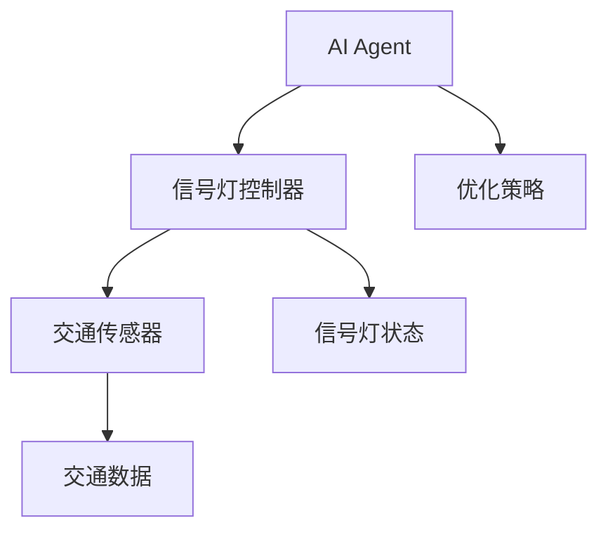
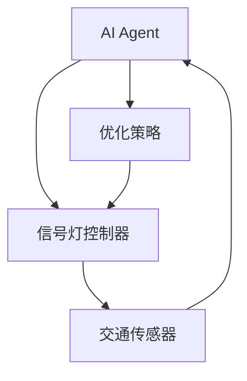

                 


# 智能交通灯：AI Agent的实时流量控制

> **关键词**：智能交通灯、AI Agent、实时流量控制、强化学习、系统架构设计

> **摘要**：本文探讨了AI Agent在智能交通灯实时流量控制中的应用，详细分析了传统交通灯控制系统的问题、AI Agent的核心概念、算法原理、系统架构设计以及项目实战实现。通过强化学习算法，AI Agent能够实时优化交通信号灯控制策略，有效缓解交通拥堵，提高道路通行效率。

---

## 第1章 智能交通灯的背景与问题背景

### 1.1 传统交通灯控制系统的问题

#### 1.1.1 传统交通灯控制的局限性
传统交通灯控制系统通常采用固定的周期性信号模式，难以根据实际交通流量的变化进行实时调整。这种模式在交通高峰期或特殊情况下容易导致交通拥堵，降低了道路通行效率。

#### 1.1.2 交通拥堵与信号灯协调的挑战
交通拥堵问题日益严重，尤其是在大城市中。信号灯控制作为交通管理的重要组成部分，其协调优化对缓解拥堵至关重要。然而，传统信号灯控制缺乏灵活性和实时性，难以应对复杂的交通场景。

#### 1.1.3 城市交通管理的智能化需求
随着城市化进程的加快，交通流量急剧增加，对交通管理的智能化需求也日益迫切。引入AI技术，特别是AI Agent（智能体），能够实现交通信号灯的实时优化控制，提升交通效率。

### 1.2 AI Agent在交通管理中的应用

#### 1.2.1 AI Agent的基本概念
AI Agent（智能体）是指能够感知环境、做出决策并采取行动的智能系统。它具备自主性、反应性、目标导向和社交能力等特征。

#### 1.2.2 AI Agent在实时流量控制中的优势
AI Agent能够实时收集和分析交通数据，根据实际情况动态调整信号灯控制策略。相比传统系统，AI Agent具备更高的灵活性和适应性，能够有效应对复杂的交通场景。

#### 1.2.3 AI Agent与传统交通灯控制的对比
- **传统交通灯控制**：基于固定周期或预设规则，缺乏灵活性。
- **AI Agent控制**：基于实时数据和动态优化，具备高度适应性。

### 1.3 智能交通灯系统的定义与特点

#### 1.3.1 智能交通灯系统的定义
智能交通灯系统是一种结合AI技术的实时交通控制系统，通过AI Agent感知交通流量，动态调整信号灯配时，优化交通流量。

#### 1.3.2 智能交通灯的核心特点
- **实时性**：能够实时感知和响应交通流量变化。
- **智能化**：基于AI算法进行决策和优化。
- **灵活性**：能够根据不同交通场景调整控制策略。

#### 1.3.3 智能交通灯系统的边界与外延
智能交通灯系统通常与交通监控系统、大数据平台等其他交通管理系统协同工作，形成一个完整的智能交通管理体系。

---

## 第2章 AI Agent与智能交通灯的核心概念

### 2.1 AI Agent的定义与核心原理

#### 2.1.1 AI Agent的基本定义
AI Agent是一种智能实体，能够感知环境、处理信息、做出决策并采取行动。它具备感知、决策和行动三大核心能力。

#### 2.1.2 AI Agent的核心原理
AI Agent通过传感器或数据源获取环境信息，利用算法进行分析和决策，然后通过执行器或输出模块采取行动。其核心在于算法的优化和决策的准确性。

#### 2.1.3 AI Agent的属性特征对比表格
| 属性 | 描述 |
|------|------|
| 自主性 | 能够自主决策和行动 |
| 反应性 | 能够实时感知环境变化并做出反应 |
| 目标导向 | 以实现特定目标为导向 |
| 社交能力 | 能够与其他系统或智能体协同工作 |

### 2.2 智能交通灯系统的概念结构

#### 2.2.1 概念结构图


#### 2.2.2 核心要素组成
- **AI Agent**：负责感知交通数据并生成优化策略。
- **交通数据**：包括车流量、行人流量等实时数据。
- **优化策略**：AI Agent生成的信号灯配时方案。
- **信号灯配时**：基于优化策略调整信号灯的配时。

#### 2.2.3 实体关系图
```mermaid
erd
    系统：AI Agent
    实体：交通信号灯
    属性：信号灯状态、配时方案
    关系：AI Agent控制交通信号灯
```

---

## 第3章 AI Agent在智能交通灯中的算法原理

### 3.1 强化学习算法在AI Agent中的应用

#### 3.1.1 强化学习的基本原理
强化学习是一种机器学习方法，通过智能体与环境的交互，学习最优策略以最大化累计奖励。其核心在于通过试错和奖励机制优化决策。

#### 3.1.2 Q-learning算法的实现
Q-learning算法是强化学习的一种经典算法，适用于离散动作空间的问题。其核心公式为：
$$ Q(s, a) = Q(s, a) + \alpha [r + \gamma \max Q(s', a') - Q(s, a)] $$
其中：
- \( s \)：当前状态
- \( a \)：当前动作
- \( r \)：奖励
- \( \gamma \)：折扣因子
- \( \alpha \)：学习率

#### 3.1.3 算法流程图
```mermaid
graph TD
    Start --> Init(Q)
    Init(Q) --> Choose action(a)
    Choose action(a) --> Take action(a)
    Take action(a) --> Get reward(r)
    Get reward(r) --> Update Q
    Update Q --> Loop until convergence
    Loop until convergence --> End
```

### 3.2 实时流量优化算法

#### 3.2.1 实时优化算法的数学模型
实时优化算法的目标是最小化交通拥堵，最大化道路通行效率。其数学模型可以表示为：
$$ \min_{x} \sum_{t} c(t, x(t)) $$
其中：
- \( c(t, x(t)) \)：时刻 \( t \) 的拥堵成本
- \( x(t) \)：时刻 \( t \) 的信号灯配时

#### 3.2.2 算法的数学公式
实时优化算法基于强化学习，通过不断调整信号灯配时优化交通流量。其优化过程可以表示为：
$$ x(t+1) = x(t) + \epsilon \cdot \nabla Q(x(t)) $$
其中：
- \( \epsilon \)：步长
- \( \nabla Q(x(t)) \)：Q函数的梯度

#### 3.2.3 算法的实现步骤
1. 收集实时交通数据。
2. 使用强化学习算法优化信号灯配时。
3. 根据优化结果调整信号灯状态。
4. 实时更新优化策略。

---

## 第4章 智能交通灯系统的架构设计

### 4.1 系统架构概述

#### 4.1.1 系统架构图


#### 4.1.2 系统功能模块划分
- **AI Agent模块**：负责数据分析和策略优化。
- **信号灯控制器模块**：负责执行信号灯控制。
- **交通传感器模块**：负责采集交通数据。

### 4.2 系统接口设计

#### 4.2.1 系统接口定义
- **输入接口**：接收交通传感器数据。
- **输出接口**：发送信号灯控制指令。

#### 4.2.2 接口交互流程图
```mermaid
graph TD
    Start --> A[AI Agent]
    A --> B[信号灯控制器]
    B --> C[交通传感器]
    C --> A
    Loop until convergence --> End
```

### 4.3 系统交互设计

#### 4.3.1 系统交互流程图


#### 4.3.2 交互过程的详细描述
1. AI Agent接收交通传感器数据。
2. AI Agent根据数据生成优化策略。
3. 信号灯控制器根据优化策略调整信号灯配时。
4. 循环上述过程，实时优化交通流量。

---

## 第5章 项目实战与实现

### 5.1 环境安装与配置

#### 5.1.1 开发环境的选择
推荐使用Python作为开发语言，搭配深度学习框架如TensorFlow或PyTorch。

#### 5.1.2 依赖库的安装
安装必要的库，如numpy、pandas、scikit-learn等。

### 5.2 核心算法的实现

#### 5.2.1 AI Agent的实现代码
```python
import numpy as np

class AI_Agent:
    def __init__(self, state_space, action_space):
        self.state_space = state_space
        self.action_space = action_space
        self.Q = np.zeros((state_space, action_space))
    
    def choose_action(self, state):
        if np.random.random() < 0.1:
            return np.random.randint(self.action_space)
        else:
            return np.argmax(self.Q[state])
    
    def learn(self, state, action, reward, next_state):
        self.Q[state, action] += 0.1 * (reward + 0.9 * np.max(self.Q[next_state]) - self.Q[state, action])
```

#### 5.2.2 交通灯控制系统的实现代码
```python
import time

class Traffic_Light_System:
    def __init__(self, agent):
        self.agent = agent
        self.current_state = 0
        self.signal = 'green'
    
    def update(self):
        action = self.agent.choose_action(self.current_state)
        self.agent.learn(self.current_state, action, reward, next_state)
        self.current_state = next_state
        self.signal = 'green' if action == 0 else 'red'
    
    def run(self):
        while True:
            self.update()
            time.sleep(1)
```

### 5.3 实际案例分析

#### 5.3.1 案例描述
在某繁忙交叉路口，AI Agent通过实时分析车流量和行人流量，动态调整信号灯配时，有效缓解交通拥堵。

#### 5.3.2 案例分析
- 在高峰期，AI Agent会延长绿灯时间，减少红灯等待。
- 在低谷期，AI Agent会缩短绿灯时间，提高信号灯的使用效率。

---

## 总结与展望

### 5.4 最佳实践 tips
- 确保实时数据的准确性和及时性。
- 定期更新优化算法，以应对交通场景的变化。
- 与其他交通管理系统协同工作，形成完整的智能交通体系。

### 5.5 小结
本文详细介绍了AI Agent在智能交通灯实时流量控制中的应用，从算法原理到系统架构设计，再到项目实战实现，全面展示了如何利用AI技术优化交通信号灯控制，提高道路通行效率。

### 5.6 注意事项
- 确保系统的安全性，防止恶意攻击。
- 在实际应用中，考虑网络延迟和数据传输的稳定性。
- 定期维护和更新系统，以应对交通环境的变化。

### 5.7 拓展阅读
- 《强化学习入门》
- 《智能交通系统设计与实现》
- 《AI Agent在交通管理中的应用研究》

---

通过本文的详细讲解，读者可以深入了解AI Agent在智能交通灯实时流量控制中的应用，掌握其核心概念、算法原理和系统架构设计，并能够实际操作相关代码实现。

