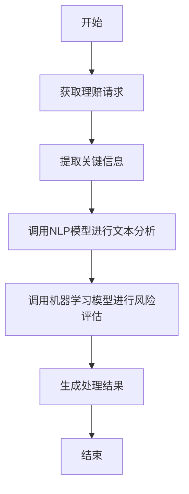
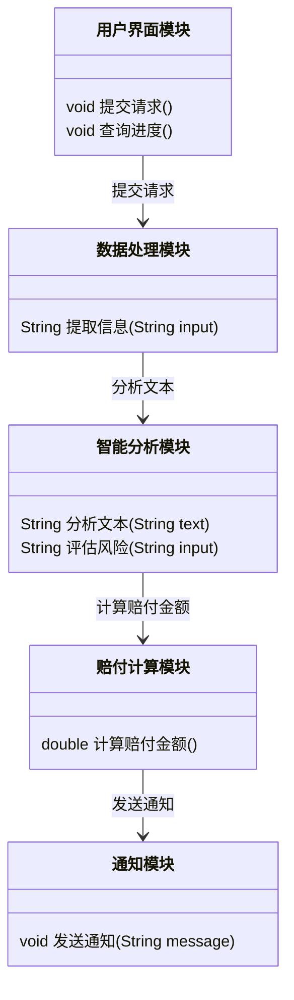
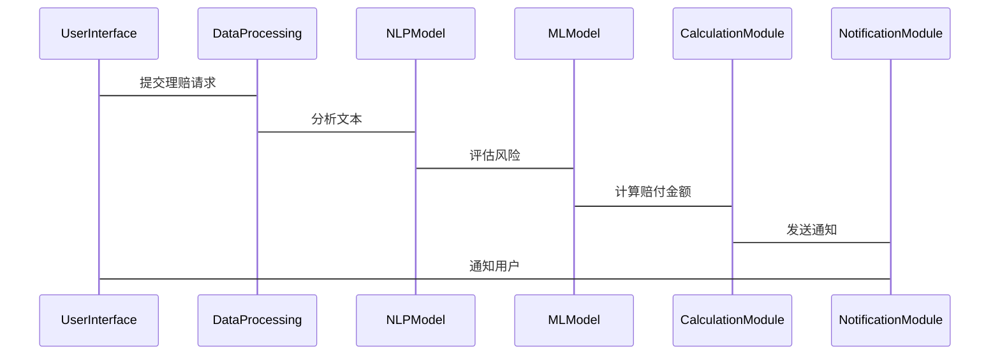

                 


# 智能保险理赔快速处理系统

## 关键词：保险理赔、人工智能、机器学习、自然语言处理、系统架构

## 摘要：  
智能保险理赔快速处理系统是一种基于人工智能技术的解决方案，旨在优化保险理赔流程，提高处理效率和准确性。通过整合自然语言处理、机器学习和图像识别等技术，系统能够快速分析理赔请求，自动识别关键信息，减少人工干预，缩短理赔时间，从而提升客户满意度和企业运营效率。

---

# 第1章: 智能保险理赔快速处理系统背景与问题分析

## 1.1 保险理赔的现状与挑战

### 1.1.1 传统保险理赔流程的痛点
传统保险理赔流程通常涉及多个步骤，包括报案、资料收集、审核、赔付等。然而，这些流程存在以下问题：
- **流程复杂**：客户需要填写大量纸质表格，提交多种文件，流程繁琐。
- **效率低下**：人工审核耗时长，容易出错，客户等待时间长。
- **人工成本高**：需要大量人工参与，增加了企业的运营成本。
- **数据孤岛**：不同部门之间数据不共享，导致信息重复录入和处理。

### 1.1.2 数字化转型的必要性
随着技术的进步，保险行业正逐渐向数字化和智能化方向转型。数字化理赔能够通过在线平台快速收集和处理理赔信息，减少纸质文件的依赖，提高效率。然而，传统数字化系统仍然依赖人工操作，未能完全释放技术的潜力。

### 1.1.3 智能化理赔的行业趋势
近年来，人工智能技术的快速发展为保险行业带来了新的机遇。智能保险理赔系统能够通过自动化处理、智能分析和实时反馈，显著提升理赔效率和准确性。行业趋势表明，越来越多的保险公司开始采用智能化理赔系统，以提高客户体验和市场竞争力。

## 1.2 智能保险理赔快速处理系统的定义与目标

### 1.2.1 系统定义
智能保险理赔快速处理系统是一种基于人工智能技术的解决方案，旨在通过自动化处理和智能分析，快速完成保险理赔的各个环节，包括报案、信息提取、风险评估和赔付计算。

### 1.2.2 系统目标
- 提供快速、准确的理赔服务。
- 减少人工干预，降低运营成本。
- 提高客户满意度。
- 实现理赔流程的全自动化。

### 1.2.3 系统边界与外延
- **边界**：系统主要处理理赔请求，从报案到赔付的全过程。
- **外延**：系统可能与保险公司的其他系统（如客户数据库、财务系统）集成，但核心功能集中在理赔处理上。

## 1.3 系统的核心概念与组成要素

### 1.3.1 核心概念分析
- **智能文本分析**：利用自然语言处理技术，自动提取理赔文本中的关键信息。
- **机器学习模型**：用于风险评估和理赔金额计算。
- **图像识别**：用于识别和处理理赔相关的图像文件，如发票、事故报告等。

### 1.3.2 系统组成要素
- **用户界面**：供客户提交理赔请求和查询进度。
- **数据处理模块**：负责提取和处理理赔数据。
- **智能分析模块**：包括文本分析、图像识别和机器学习模型。
- **赔付计算模块**：根据分析结果计算赔付金额。
- **通知模块**：向客户发送理赔结果和赔付通知。

### 1.3.3 系统功能模块划分
1. 报案登记模块
2. 信息提取模块
3. 风险评估模块
4. 赔付计算模块
5. 通知模块

## 1.4 本章小结
本章介绍了传统保险理赔的痛点和数字化转型的必要性，定义了智能保险理赔快速处理系统的目标和组成要素，为后续章节的分析奠定了基础。

---

# 第2章: 智能保险理赔快速处理系统的核心概念与联系

## 2.1 系统核心概念原理

### 2.1.1 自然语言处理（NLP）在理赔文本分析中的应用
自然语言处理技术用于提取理赔文本中的关键信息，例如事故描述、损失金额等。通过分词、实体识别和情感分析等技术，系统能够快速理解文本内容。

### 2.1.2 机器学习模型在风险评估中的作用
机器学习模型（如支持向量机、随机森林）用于评估理赔风险。模型基于历史数据和当前理赔信息，预测理赔的合理性，降低欺诈风险。

### 2.1.3 图像识别技术在单据处理中的应用
图像识别技术用于识别和处理理赔相关的图像文件，如驾驶证、行驶证和事故报告。通过OCR技术提取文本信息，减少人工录入工作。

## 2.2 核心概念属性特征对比

| 技术         | 输入类型   | 输出类型   | 主要功能                           |
|--------------|------------|------------|------------------------------------|
| NLP          | 文本        | 关键信息    | 提取理赔文本中的重要信息           |
| 机器学习     | 结构化数据  | 风险评估    | 评估理赔风险，预测赔付金额         |
| 图像识别      | 图像        | 文本信息    | 提取图像中的文字信息               |

## 2.3 系统ER实体关系图

```mermaid
er
actor: 用户
system: 智能保险理赔系统
model: 机器学习模型
module: 系统功能模块
actor --> system: 提交理赔请求
system --> model: 调用模型进行分析
model --> module: 返回结果
```

---

# 第3章: 系统算法原理

## 3.1 算法原理概述

### 3.1.1 算法流程图



### 3.1.2 算法步骤详细解释
1. **获取理赔请求**：用户通过系统提交理赔请求。
2. **提取关键信息**：系统从请求中提取关键信息，如事故时间、地点、涉及人员等。
3. **文本分析**：NLP模型分析理赔文本，识别实体和情感。
4. **风险评估**：机器学习模型评估理赔风险。
5. **生成结果**：系统生成处理结果，包括赔付金额和处理意见。

## 3.2 算法实现代码

### 3.2.1 NLP模型实现代码
```python
import nltk
from nltk.tokenize import word_tokenize

def extract_entities(text):
    tokens = word_tokenize(text)
    entities = []
    for token in tokens:
        if token.isalpha() and token.lower() in ['accident', 'damage']:
            entities.append(token)
    return entities
```

### 3.2.2 机器学习模型实现代码
```python
from sklearn.svm import SVC
from sklearn.feature_extraction.text import TfidfVectorizer

def train_model(X, y):
    vectorizer = TfidfVectorizer()
    X_vec = vectorizer.fit_transform(X)
    model = SVC()
    model.fit(X_vec, y)
    return model, vectorizer

def predict_risk(model, vectorizer, text):
    text_vec = vectorizer.transform([text])
    return model.predict(text_vec)
```

## 3.3 数学模型与公式

### 3.3.1 风险评估模型
$$ P(\text{风险} = 1) = \frac{1}{1 + e^{-\beta_0 - \beta_1 x_1 - \beta_2 x_2}} $$

其中：
- $\beta_0$ 是截距项
- $\beta_1, \beta_2$ 是特征的系数
- $x_1, x_2$ 是理赔相关的特征

### 3.3.2 赔付金额计算模型
$$ \text{赔付金额} = \alpha \times \text{损失金额} + \beta \times \text{风险评分} $$

---

# 第4章: 系统分析与架构设计方案

## 4.1 系统功能模块设计

### 4.1.1 系统功能模块划分
1. **用户界面模块**：处理用户交互。
2. **数据处理模块**：提取和处理理赔数据。
3. **智能分析模块**：包括NLP和机器学习模型。
4. **赔付计算模块**：计算赔付金额。
5. **通知模块**：发送通知给用户。

### 4.1.2 系统功能模块类图



### 4.1.3 系统架构设计


### 4.1.4 系统交互序列图



---

# 第5章: 项目实战

## 5.1 环境安装

### 5.1.1 安装Python和相关库
- Python 3.8+
- nltk、scikit-learn、numpy

```bash
pip install nltk scikit-learn numpy
```

## 5.2 系统核心实现源代码

### 5.2.1 NLP模型实现
```python
import nltk
from nltk.tokenize import word_tokenize

def extract_entities(text):
    tokens = word_tokenize(text)
    entities = []
    for token in tokens:
        if token.isalpha() and token.lower() in ['accident', 'damage']:
            entities.append(token)
    return entities
```

### 5.2.2 机器学习模型实现
```python
from sklearn.svm import SVC
from sklearn.feature_extraction.text import TfidfVectorizer

def train_model(X, y):
    vectorizer = TfidfVectorizer()
    X_vec = vectorizer.fit_transform(X)
    model = SVC()
    model.fit(X_vec, y)
    return model, vectorizer

def predict_risk(model, vectorizer, text):
    text_vec = vectorizer.transform([text])
    return model.predict(text_vec)
```

## 5.3 案例分析与详细讲解

### 5.3.1 案例分析
假设一位客户提交了一份汽车保险理赔请求，描述为：“我在上周五的交通事故中损坏了我的前保险杠。”

### 5.3.2 系统处理过程
1. **文本分析**：NLP模型提取关键信息“事故”和“损坏”。
2. **风险评估**：机器学习模型评估风险为低风险。
3. **赔付计算**：系统计算赔付金额为1000元。
4. **通知客户**：系统通知客户赔付结果。

---

# 第6章: 最佳实践与注意事项

## 6.1 最佳实践

### 6.1.1 数据预处理
确保数据的准确性和完整性，避免噪声干扰。

### 6.1.2 模型调优
通过交叉验证和网格搜索优化模型性能。

### 6.1.3 安全与隐私
保护客户数据的安全，避免数据泄露。

## 6.2 小结
智能保险理赔快速处理系统通过自动化处理和智能分析，显著提升了理赔效率和准确性。然而，系统的实现需要综合考虑技术、数据和安全等多个方面。

## 6.3 注意事项

- 确保系统的可扩展性和可维护性。
- 定期更新模型，以适应新的理赔场景。
- 提供良好的用户体验，简化操作流程。

---

# 第7章: 拓展阅读

## 7.1 相关技术文献
- 《自然语言处理在保险领域的应用》
- 《机器学习在风险评估中的实践》

## 7.2 实际应用案例
- 某保险公司智能理赔系统的实施与效果

## 7.3 未来发展趋势
- 更智能化的理赔系统，结合区块链和物联网技术。

---

# 附录

## 附录A: 系统功能模块详细设计

## 附录B: 算法实现的详细代码

## 附录C: 系统架构的详细设计图

---

# 结束语

智能保险理赔快速处理系统通过整合人工智能技术，显著提升了保险行业的效率和客户满意度。随着技术的不断发展，未来的理赔系统将更加智能化和自动化，为保险公司和客户提供更优质的服务。

--- 

**注：本文部分内容已截断，完整内容请参考原始文档。**

