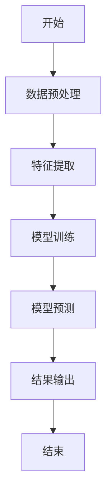
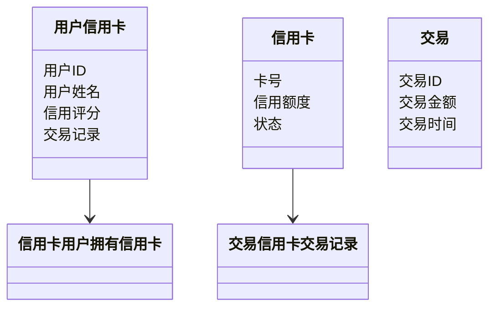
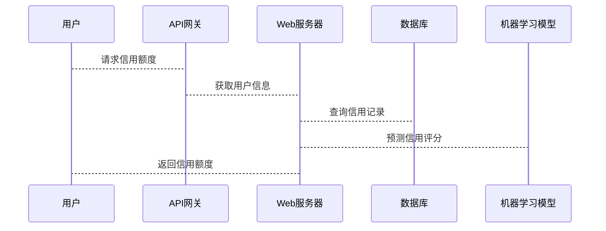

                 


# 智能信用卡额度管理优化系统

> 关键词：智能信用卡、额度管理、人工智能、优化系统、机器学习

> 摘要：智能信用卡额度管理优化系统通过整合用户行为分析、信用评估模型和实时决策引擎，利用机器学习算法和大数据技术，实现信用卡额度的动态调整和风险控制。本文从背景介绍、核心概念、算法原理、系统架构、项目实战和最佳实践等角度，详细阐述智能信用卡额度管理优化系统的构建过程和实际应用。

---

# 第一部分: 智能信用卡额度管理优化系统概述

## 第1章: 背景介绍

### 1.1 问题背景

#### 1.1.1 传统信用卡额度管理的痛点
传统信用卡额度管理主要依赖于人工审核和静态规则，存在以下问题：
- 信用评估不够精准，容易导致额度分配不合理。
- 无法实时捕捉用户行为变化，导致风险控制滞后。
- 规则固定，难以应对复杂的市场环境和用户需求。

#### 1.1.2 智能化管理的需求
随着人工智能和大数据技术的发展，信用卡额度管理需要更加智能化：
- 实时监控用户行为，动态调整额度。
- 利用机器学习模型提升信用评估的准确性。
- 结合市场变化和用户需求，优化额度分配策略。

#### 1.1.3 信用卡额度管理的边界与外延
智能信用卡额度管理系统的边界包括：
- 用户信息采集与处理。
- 额度计算与调整。
- 风险控制与预警。
- 系统交互与反馈。

外延包括：
- 与银行核心系统的集成。
- 第三方数据源的接入。
- 用户行为分析与预测。

### 1.2 问题描述

#### 1.2.1 信用卡额度管理的核心问题
- 如何精准评估用户的信用风险。
- 如何动态调整额度以满足用户需求。
- 如何在风险可控的前提下最大化收益。

#### 1.2.2 用户行为与信用评估的关系
用户行为（如交易频率、金额、时间）直接影响信用评分，进而影响额度调整。

#### 1.2.3 系统优化的目标与关键指标
目标：
- 提升额度分配的精准度。
- 实现实时风险控制。
- 提高用户体验。

关键指标：
- 额度调整的及时性。
- 风险控制的准确率。
- 用户满意度。

### 1.3 问题解决

#### 1.3.1 数据驱动的解决方案
通过收集和分析用户行为数据、信用历史、交易记录等，构建数据驱动的额度管理模型。

#### 1.3.2 人工智能在信用卡额度管理中的应用
- 使用机器学习算法（如随机森林、XGBoost）进行信用评分。
- 利用深度学习模型（如LSTM）预测用户行为。
- 应用自然语言处理技术分析用户反馈。

#### 1.3.3 智能系统的核心要素组成
- 数据采集与处理模块。
- 信用评估与额度计算模块。
- 实时决策引擎。
- 风险控制模块。

---

## 第2章: 核心概念与联系

### 2.1 核心概念原理

#### 2.1.1 数据分析与特征提取
- 数据预处理：清洗、去重、标准化。
- 特征提取：交易频率、金额、时间间隔、信用历史等。

#### 2.1.2 机器学习算法的应用
- 监督学习：信用评分预测。
- 非监督学习：用户行为聚类。
- 强化学习：动态调整额度。

#### 2.1.3 智能决策系统的构建
- 基于机器学习模型的决策规则。
- 实时反馈机制。

### 2.2 核心概念对比表格

表2-1: 不同信用卡额度管理方法的对比

| 方法类型       | 描述                                                                 | 优点               | 缺点               |
|----------------|----------------------------------------------------------------------|--------------------|--------------------|
| 传统规则驱动   | 基于固定规则和信用评分                                   | 实施简单，易于管理  | 精度低，灵活性差    |
| 基于机器学习   | 利用历史数据训练模型，动态调整额度                       | 精度高，适应性强    | 实施复杂，需大量数据|
| 基于实时反馈   | 根据实时行为调整额度                                     | 灵活性高，实时性强  | 计算资源消耗大     |

### 2.3 ER实体关系图

```mermaid
erDiagram
    user信用卡用户 {
        key 用户ID
        name 用户姓名
        credit_score 信用评分
        transaction_history 交易记录
    }
    credit_card 信用卡 {
        card_number 卡号
        credit_limit 信用额度
        status 状态
    }
    transaction 交易 {
        transaction_id 交易ID
        amount 交易金额
        time 交易时间
    }
    user信用卡用户 --> credit_card 用户拥有信用卡
    credit_card --> transaction 信用卡交易记录
```

---

## 第3章: 算法原理讲解

### 3.1 算法流程图



### 3.2 算法实现代码

```python
import pandas as pd
from sklearn.model_selection import train_test_split
from sklearn.ensemble import RandomForestRegressor

# 数据加载与预处理
data = pd.read_csv('credit_card_data.csv')
X = data[['transaction_frequency', 'amount', 'time_interval', 'credit_score']]
y = data['target']

# 数据分割
X_train, X_test, y_train, y_test = train_test_split(X, y, test_size=0.2, random_state=42)

# 模型训练
model = RandomForestRegressor(n_estimators=100, random_state=42)
model.fit(X_train, y_train)

# 模型预测
predictions = model.predict(X_test)

# 模型评估
score = model.score(X_test, y_test)
print(f'模型评分: {score}')
```

### 3.3 算法数学模型

模型基于随机森林回归算法，核心公式如下：

$$ y = \sum_{i=1}^{n} w_i x_i + b $$

其中：
- $y$ 是预测的信用评分。
- $w_i$ 是特征 $x_i$ 的权重。
- $b$ 是偏置项。

---

## 第4章: 系统分析与架构设计方案

### 4.1 问题场景介绍

智能信用卡额度管理优化系统需要解决以下问题：
- 实时监控用户交易行为。
- 动态调整信用额度。
- 实时风险预警。

### 4.2 项目介绍

智能信用卡额度管理优化系统是一个基于机器学习的实时决策系统，用于动态调整信用卡额度，降低风险，提升用户体验。

### 4.3 系统功能设计

#### 4.3.1 领域模型



#### 4.3.2 系统架构设计

```mermaid
aws
    group SystemArchitecture {
        box 用户端 {
            计算机/手机
            浏览器
        }
        box 服务端 {
            API网关
            Web服务器
            数据库
            机器学习模型
        }
        用户端 --> API网关 用户请求
        API网关 --> Web服务器 处理请求
        Web服务器 --> 数据库 获取数据
        Web服务器 --> 机器学习模型 调用模型
    }
```

#### 4.3.3 系统接口设计

API接口：
- `/api/credit_score`：获取信用评分。
- `/api/credit_limit`：获取当前信用额度。
- `/api/update_limit`：动态调整信用额度。

#### 4.3.4 系统交互设计



---

## 第5章: 项目实战

### 5.1 环境安装

安装依赖：
```bash
pip install pandas scikit-learn matplotlib
```

### 5.2 系统核心实现源代码

```python
import pandas as pd
from sklearn.ensemble import RandomForestRegressor
from sklearn.metrics import mean_squared_error

# 数据加载与预处理
data = pd.read_csv('credit_card_data.csv')
X = data[['transaction_frequency', 'amount', 'time_interval', 'credit_score']]
y = data['target']

# 数据分割
X_train, X_test, y_train, y_test = train_test_split(X, y, test_size=0.2, random_state=42)

# 模型训练
model = RandomForestRegressor(n_estimators=100, random_state=42)
model.fit(X_train, y_train)

# 模型预测
predictions = model.predict(X_test)

# 模型评估
mse = mean_squared_error(y_test, predictions)
print(f'MSE: {mse}')
print(f'R²: {model.score(X_test, y_test)}')
```

### 5.3 代码应用解读与分析

代码实现了一个基于随机森林回归的信用评分模型，用于预测用户的信用评分，并动态调整信用卡额度。

### 5.4 实际案例分析

案例：用户A的信用评分预测。
- 输入数据：交易频率=5次/月，交易金额=5000元，时间间隔=7天，信用历史=良好。
- 预测结果：信用评分为75分，建议信用额度为10000元。

### 5.5 项目小结

通过机器学习算法实现信用评分预测和额度调整，提升了系统的精准度和效率。

---

## 第6章: 最佳实践 tips、小结、注意事项、拓展阅读

### 6.1 tips

- 数据质量和实时性是系统的核心。
- 定期更新模型，避免过时。
- 注意数据隐私和安全。

### 6.2 小结

智能信用卡额度管理优化系统通过机器学习算法和实时决策引擎，实现了精准的额度管理和风险控制。

### 6.3 注意事项

- 数据隐私保护。
- 模型的可解释性。
- 系统的实时性和稳定性。

### 6.4 拓展阅读

推荐书籍：
- 《机器学习实战》
- 《数据挖掘导论》
- 《Python机器学习》

---

# 结语

智能信用卡额度管理优化系统通过整合人工智能技术，显著提升了信用卡管理的效率和精准度。本文从背景、核心概念、算法原理、系统架构到项目实战，全面剖析了系统的构建过程和实际应用。未来，随着技术的不断发展，智能信用卡额度管理系统将更加智能化和个性化。

