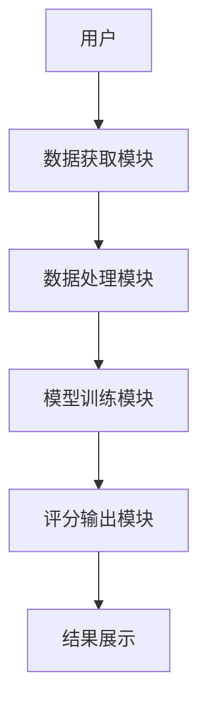

                 


---

# 《智能信用评分系统》

---

## 关键词

- 智能信用评分系统
- 人工智能
- 机器学习
- 深度学习
- 数据处理
- 系统架构

---

## 摘要

智能信用评分系统是一种基于人工智能技术的信用评估工具，通过机器学习算法和大数据分析，实现对个人或企业的信用评分。本文将详细介绍智能信用评分系统的背景、核心概念、算法原理、系统架构、项目实战以及最佳实践，帮助读者全面理解如何利用人工智能技术构建高效、精准的信用评分系统。

---

## 目录

---

# 第一部分: 智能信用评分系统概述

## 第1章: 智能信用评分系统背景介绍

### 1.1 信用评分的定义与重要性

#### 1.1.1 信用评分的定义
信用评分是根据个人或企业的信用历史、财务状况、行为记录等信息，量化其信用风险的过程。

#### 1.1.2 信用评分的重要性
- 信用评分是金融行业中的核心工具，用于评估借款人的还款能力。
- 传统的信用评分方法依赖于人工审核，效率低、成本高。
- 智能信用评分系统通过自动化和智能化的方式，提高评估效率和准确性。

#### 1.1.3 智能信用评分系统的核心目标
- 提高信用评估的效率和准确性。
- 减少人为错误，降低金融风险。
- 提供个性化的信用评估服务。

### 1.2 传统信用评分与智能信用评分的对比

#### 1.2.1 传统信用评分方法
- 主要依赖人工审核和简单的统计模型。
- 数据来源有限，难以覆盖复杂的信用行为。
- 评估结果可能存在主观性和片面性。

#### 1.2.2 智能信用评分方法的优势
- 基于机器学习和大数据分析，能够处理海量数据。
- 可以实时更新信用评分，提高评估的动态性。
- 通过模型优化，提升信用评分的准确性和稳定性。

#### 1.2.3 传统与智能评分的差异对比

| 对比维度 | 传统评分 | 智能评分 |
|----------|----------|----------|
| 数据来源 | 线性数据 | 多维数据 |
| 模型复杂度 | 简单 | 复杂 |
| 评估效率 | 低 | 高 |
| 评估结果 | 主观 | 客观 |

### 1.3 智能信用评分系统的边界与外延

#### 1.3.1 系统的边界
- 输入：信用相关数据（如交易记录、还款历史、行为数据等）。
- 输出：信用评分结果和相关建议。

#### 1.3.2 系统的外延
- 信用评分系统可以与其他金融系统集成，如贷款审批、信用报告生成等。
- 可以扩展到企业信用评估、供应链金融等领域。

#### 1.3.3 系统的核心要素组成

| 核心要素 | 描述 |
|----------|------|
| 数据源 | 信用相关数据 |
| 模型算法 | 机器学习算法 |
| 训练数据 | 历史信用数据 |
| 评估指标 | 准确率、召回率等 |

### 1.4 本章小结

---

## 第2章: 智能信用评分系统的概念体系

### 2.1 智能信用评分系统的概念结构

#### 2.1.1 概念层次分解
- 顶层概念：信用评分系统。
- 中层概念：数据处理、模型训练、评分输出。
- 底层概念：数据源、算法、评估指标。

#### 2.1.2 概念之间的关系
- 数据源是模型训练的基础。
- 模型训练是评分输出的核心。
- 评分输出是系统的最终目标。

#### 2.1.3 概念的属性特征
- 数据源：类型、数量、质量。
- 模型训练：算法类型、训练数据量、评估指标。
- 评分输出：评分范围、评分解释性。

### 2.2 核心概念的属性对比表

| 概念 | 属性 | 描述 |
|------|------|------|
| 数据源 | 类型 | 结构化数据、非结构化数据 |
| 模型训练 | 算法类型 | 逻辑回归、随机森林、神经网络 |
| 评分输出 | 评分范围 | 0-100分 |

### 2.3 ER实体关系图

```mermaid
erDiagram
    actor 用户 {
        +id 用户ID
        +name 用户名称
        +credit_score 信用评分
    }
    actor 评分系统 {
        +id 系统ID
        +algorithm 算法类型
        +training_data 训练数据
    }
    用户 --> 评分系统 : 请求评分
    评分系统 --> 用户 : 返回评分结果
```

### 2.4 本章小结

---

## 第3章: 智能信用评分系统的算法原理

### 3.1 机器学习算法

#### 3.1.1 逻辑回归

##### 3.1.1.1 算法原理
- 逻辑回归是一种用于分类的算法，常用于二分类问题。
- 公式：$$ P(y=1|x) = \frac{1}{1 + e^{-\beta x}} $$
- 逻辑回归通过 sigmoid 函数将线性回归的结果映射到概率空间。

##### 3.1.1.2 优缺点
- 优点：简单易懂、计算效率高。
- 缺点：只能处理线性关系，不适合复杂数据。

##### 3.1.1.3 实际案例
- 案例：根据用户的还款历史和收入预测信用评分。

#### 3.1.2 随机森林

##### 3.1.2.1 算法原理
- 随机森林是一种基于决策树的集成算法。
- 通过 bagging 技术生成多棵决策树，最终通过投票或加权的方式得出结果。

##### 3.1.2.2 优缺点
- 优点：抗过拟合能力强、适合复杂数据。
- 缺点：计算复杂度较高。

##### 3.1.2.3 实际案例
- 案例：根据用户的多维数据（如交易记录、社交数据）预测信用评分。

#### 3.1.3 神经网络

##### 3.1.3.1 算法原理
- 神经网络是一种模拟人脑神经网络的算法。
- 包括输入层、隐藏层和输出层，通过反向传播算法进行训练。

##### 3.1.3.2 优缺点
- 优点：适合处理非线性关系，表达能力强。
- 缺点：计算复杂度高，需要大量数据支持。

##### 3.1.3.3 实际案例
- 案例：通过用户的信用历史和行为数据，使用深度学习模型预测信用评分。

### 3.2 深度学习算法

#### 3.2.1 卷积神经网络（CNN）

##### 3.2.1.1 算法原理
- CNN 适用于处理图像数据，但在信用评分系统中可以用于处理结构化数据。
- 包括卷积层、池化层和全连接层。

##### 3.2.1.2 优缺点
- 优点：适合处理高维数据。
- 缺点：需要大量数据支持，计算复杂度高。

##### 3.2.1.3 实际案例
- 案例：通过用户的交易记录图像，使用 CNN 进行信用评分。

#### 3.2.2 循序神经网络（RNN）

##### 3.2.2.1 算法原理
- RNN 适用于处理序列数据，如时间序列数据。
- 通过 LSTM 或 GRU 处理长序列数据。

##### 3.2.2.2 优缺点
- 优点：适合处理序列数据，记忆能力较强。
- 缺点：训练复杂，计算资源消耗大。

##### 3.2.2.3 实际案例
- 案例：通过用户的还款历史序列，使用 RNN 进行信用评分。

### 3.3 算法选择与优化

#### 3.3.1 算法选择原则
- 数据类型：结构化数据选择逻辑回归或随机森林，非结构化数据选择深度学习算法。
- 数据量：小数据选择逻辑回归，大数据选择深度学习算法。
- 模型解释性：需要解释性选择逻辑回归，不需要解释性选择深度学习算法。

#### 3.3.2 算法优化策略
- 参数调整：如学习率、正则化参数等。
- 数据增强：如数据清洗、特征工程等。
- 模型融合：如投票法、加权法等。

### 3.4 本章小结

---

## 第4章: 智能信用评分系统的数据处理

### 4.1 数据预处理

#### 4.1.1 数据清洗
- 删除重复数据、处理缺失值、去除异常值。

#### 4.1.2 数据标准化
- 标准化：将数据转换为均值为0，方差为1。
- 缩放：将数据映射到特定范围。

#### 4.1.3 数据增强
- 对图像数据进行旋转、缩放、翻转等操作，增加数据多样性。

### 4.2 特征工程

#### 4.2.1 特征选择
- 基于相关系数、卡方检验等方法选择重要特征。

#### 4.2.2 特征提取
- 使用 PCA 等方法降维，提取主成分。

#### 4.2.3 特征构造
- 根据业务需求构造新特征，如时间特征、行为特征等。

### 4.3 数据分割

#### 4.3.1 训练集、验证集、测试集的划分
- 一般比例为7:1:2，根据数据量调整。

#### 4.3.2 数据平衡
- 对于类别不平衡问题，使用过采样、欠采样等方法平衡数据。

### 4.4 数据处理工具与技术

#### 4.4.1 数据处理工具
- Python 的 pandas 库。
- 数据库查询工具，如 SQL。

#### 4.4.2 数据处理技术
- MapReduce 分布式数据处理。
- Spark 大数据分析框架。

### 4.5 本章小结

---

## 第5章: 智能信用评分系统的模型训练

### 5.1 模型训练流程

#### 5.1.1 数据预处理
- 清洗、标准化、分割数据。

#### 5.1.2 模型选择
- 根据数据类型和业务需求选择合适的模型。

#### 5.1.3 模型训练
- 使用训练数据对模型进行训练，调整超参数。

#### 5.1.4 模型评估
- 使用验证集评估模型性能，调整参数。

### 5.2 模型调优

#### 5.2.1 参数调优
- 调整学习率、正则化参数等，优化模型性能。

#### 5.2.2 模型融合
- 使用投票法、加权法等方法融合多个模型，提升性能。

### 5.3 模型评估指标

#### 5.3.1 分类指标
- 准确率、召回率、F1值。

#### 5.3.2 回归指标
- �均方误差（MSE）、平均绝对误差（MAE）。

#### 5.3.3 混淆矩阵
- TP、FP、FN、TN 的计算。

### 5.4 本章小结

---

## 第6章: 智能信用评分系统的系统实现

### 6.1 系统架构设计

#### 6.1.1 系统功能设计
- 数据获取、数据处理、模型训练、评分输出。

#### 6.1.2 系统架构图


#### 6.1.3 系统接口设计
- API 接口：POST 请求，返回评分结果。

### 6.2 系统实现

#### 6.2.1 数据获取
- 通过 API 获取用户数据。
- 数据格式：JSON、CSV 等。

#### 6.2.2 数据处理
- 使用 pandas 进行数据清洗和特征工程。

#### 6.2.3 模型训练
- 使用 scikit-learn 或 TensorFlow 进行模型训练。

#### 6.2.4 结果分析
- 使用混淆矩阵和评估指标分析模型性能。

### 6.3 系统部署

#### 6.3.1 模型部署
- 使用 Flask 或 Django 部署 API 服务。

#### 6.3.2 模型更新
- 定期重新训练模型，更新参数。

### 6.4 本章小结

---

## 第7章: 智能信用评分系统的案例分析

### 7.1 案例背景介绍

#### 7.1.1 案例目标
- 使用智能信用评分系统评估用户的信用评分。

#### 7.1.2 数据来源
- 用户的交易记录、还款历史、行为数据。

### 7.2 模型选择与实现

#### 7.2.1 模型选择
- 根据数据特征选择合适的算法，如逻辑回归或随机森林。

#### 7.2.2 模型实现
- 使用 Python 编写代码，实现数据处理和模型训练。

### 7.3 案例结果分析

#### 7.3.1 模型性能评估
- 准确率、召回率等指标的分析。

#### 7.3.2 模型优化
- 根据评估结果调整模型参数，优化性能。

### 7.4 案例总结与优化

#### 7.4.1 案例总结
- 模型性能达到预期目标。

#### 7.4.2 模型优化
- 引入更多数据特征，优化模型结构。

### 7.5 本章小结

---

## 第8章: 智能信用评分系统的高级主题

### 8.1 模型的可解释性

#### 8.1.1 模型可解释性的重要性
- 提高用户信任度，满足监管要求。

#### 8.1.2 提高模型可解释性的方法
- 使用 SHAP 值解释模型决策。

### 8.2 模型的鲁棒性

#### 8.2.1 模型鲁棒性的定义
- 模型在数据分布变化下的稳定性和准确性。

#### 8.2.2 提高模型鲁棒性的方法
- 使用数据增强、模型集成等技术。

### 8.3 模型的伦理与合规性

#### 8.3.1 模型的伦理问题
- 避免歧视，确保公平性。

#### 8.3.2 模型的合规性要求
- 符合金融监管机构的要求，如 GDPR 等。

### 8.4 本章小结

---

## 第9章: 智能信用评分系统的最佳实践

### 9.1 系统设计与优化

#### 9.1.1 系统设计原则
- 模块化设计，便于维护和扩展。

#### 9.1.2 系统优化策略
- 使用分布式计算优化性能。

### 9.2 模型部署与维护

#### 9.2.1 模型部署方法
- 使用 Docker 部署模型服务。

#### 9.2.2 模型维护策略
- 定期重新训练模型，更新参数。

### 9.3 模型监控与评估

#### 9.3.1 模型监控指标
- 准确率、召回率、F1 值的实时监控。

#### 9.3.2 模型评估报告
- 定期生成模型评估报告，分析性能变化。

### 9.4 本章小结

---

## 第10章: 智能信用评分系统的未来展望

### 10.1 技术发展趋势

#### 10.1.1 深度学习的进一步应用
- 使用更复杂的深度学习模型，如 Transformer。

#### 10.1.2 多模态数据的融合
- 结合文本、图像等多种数据源，提升模型性能。

### 10.2 应用场景扩展

#### 10.2.1 信用评分的全球化应用
- 在不同国家和地区推广智能信用评分系统。

#### 10.2.2 信用评分与区块链的结合
- 使用区块链技术确保数据安全和不可篡改性。

### 10.3 挑战与机遇

#### 10.3.1 挑战
- 数据隐私和安全问题。
- 模型解释性要求提高。

#### 10.3.2 机遇
- 新技术的引入，如 AI、大数据、区块链等，为信用评分系统带来新的可能性。

### 10.4 本章小结

---

## 结语

智能信用评分系统是人工智能技术在金融领域的典型应用之一。通过本文的详细讲解，读者可以全面了解智能信用评分系统的背景、核心概念、算法原理、系统架构、项目实战以及未来展望。希望本文能够为读者提供有价值的参考，帮助他们在实际应用中更好地利用智能信用评分系统。

---

## 参考文献

（此处可以列出相关的书籍、论文、技术文档等参考文献。）

