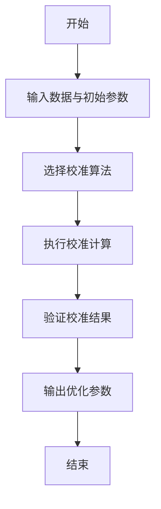
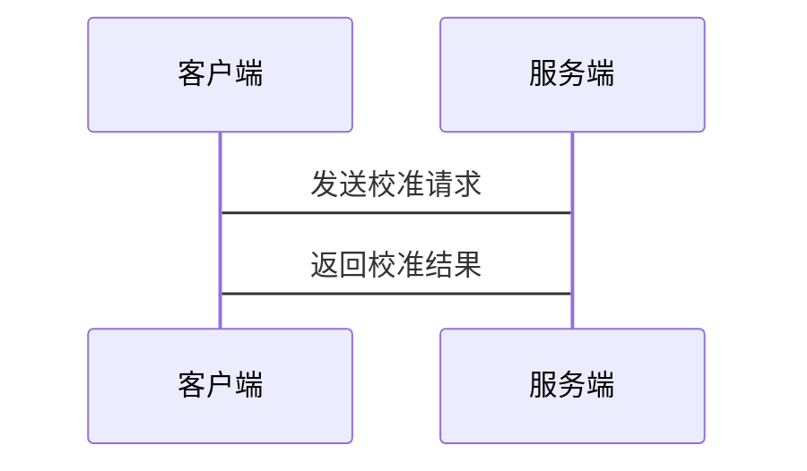

                 


```markdown
# 智能信用违约互换定价模型校准

> 关键词：信用违约互换，定价模型，智能校准，机器学习，统计套利

> 摘要：本文深入探讨了信用违约互换定价模型的智能校准方法，结合机器学习和统计套利，详细分析了校准过程中的算法原理、系统架构及实战案例，旨在为金融从业者提供理论支持和实践指导。

---

# 第一部分: 背景介绍

## 第1章: 信用违约互换的基本概念与市场背景

### 1.1 信用违约互换的定义与特点
- 1.1.1 信用违约互换（CDS）的定义
- 1.1.2 CDS的核心特点：非线性风险、信用保护购买方、期限结构等
- 1.1.3 CDS在金融市场中的作用

### 1.2 信用违约互换定价模型的必要性
- 1.2.1 定价模型在信用衍生品中的作用
- 1.2.2 校准定价模型的意义与挑战
- 1.2.3 智能校准方法的引入背景

### 1.3 本章小结

---

# 第二部分: 核心概念与联系

## 第2章: 智能校准方法的原理与实现

### 2.1 智能校准的基本原理
- 2.1.1 基于机器学习的校准方法
- 2.1.2 统计套利与模型校准的关系
- 2.1.3 智能校准的核心算法概述

### 2.2 校准模型的流程与步骤
- 2.2.1 数据收集与预处理
- 2.2.2 模型参数的选择与优化
- 2.2.3 校准结果的验证与评估

### 2.3 核心概念与联系的ER实体关系图
```mermaid
erDiagram
    actor 市场数据提供者 {
        <属性> 市场利率
        <属性> 债务人信用评级
    }
    actor 模型参数 {
        <属性> 初始模型参数
        <属性> 校准目标
    }
    actor 校准结果 {
        <属性> 优化后的模型参数
        <属性> 校准误差
    }
    市场数据提供者 --> 校准模型
    模型参数 --> 校准模型
    校准模型 --> 校准结果
```

---

## 第3章: 智能校准算法的数学模型与公式

### 3.1 最大似然估计法
- 3.1.1 最大似然估计的基本原理
- 3.1.2 似然函数的构建与优化
- 3.1.3 数学公式推导
  $$ L(\theta) = \prod_{i=1}^{n} f(x_i|\theta) $$
  其中，$\theta$ 表示模型参数，$x_i$ 表示观测数据。

### 3.2 贝叶斯校准方法
- 3.2.1 贝叶斯定理的应用
- 3.2.2 后验概率的计算
- 3.2.3 数学公式推导
  $$ P(\theta|D) = \frac{P(D|\theta)P(\theta)}{P(D)} $$

### 3.3 算法流程图


---

# 第三部分: 系统分析与架构设计方案

## 第4章: 系统分析与架构设计

### 4.1 问题场景介绍
- 4.1.1 信用违约互换定价模型的应用场景
- 4.1.2 校准模型的系统需求分析

### 4.2 系统功能设计
- 4.2.1 领域模型（mermaid类图）
  ```mermaid
  classDiagram
      class 市场数据 {
          市场利率
          债务人信用评级
      }
      class 模型参数 {
          初始模型参数
          校准目标
      }
      class 校准结果 {
          优化后的模型参数
          校准误差
      }
      市场数据 --> 校准模型
      模型参数 --> 校准模型
      校准模型 --> 校准结果
  ```

### 4.3 系统架构设计
- 4.3.1 系统架构图（mermaid架构图）
  ```mermaid
  architecture
      Client --> API Gateway
      API Gateway --> Load Balancer
      Load Balancer --> [应用服务器]
      [应用服务器] --> Database
  ```

### 4.4 系统接口设计
- 4.4.1 接口描述
- 4.4.2 接口交互流程

### 4.5 系统交互设计（mermaid序列图）


---

# 第四部分: 项目实战

## 第5章: 项目实战

### 5.1 环境安装与配置
- 5.1.1 安装Python环境
- 5.1.2 安装必要的库（如NumPy、Scikit-learn）

### 5.2 系统核心实现源代码
- 5.2.1 数据预处理代码
  ```python
  import numpy as np
  import pandas as pd

  # 加载数据
  data = pd.read_csv('market_data.csv')
  # 数据预处理
  processed_data = data.dropna().astype(float)
  ```

- 5.2.2 校准算法实现
  ```python
  from sklearn import linear_model

  # 最大似然估计示例
  model = linear_model.Ridge(alpha=0.1)
  model.fit(processed_data[['feature1', 'feature2']], processed_data['target'])
  ```

### 5.3 代码解读与分析
- 5.3.1 数据预处理步骤解析
- 5.3.2 校准算法实现的细节分析
- 5.3.3 结果验证与评估指标

### 5.4 实际案例分析
- 5.4.1 案例背景介绍
- 5.4.2 数据分析与建模过程
- 5.4.3 校准结果解读

### 5.5 项目小结
- 5.5.1 项目总结
- 5.5.2 经验与教训

---

# 第五部分: 最佳实践与小结

## 第6章: 最佳实践与注意事项

### 6.1 校准过程中的注意事项
- 数据质量的重要性
- 模型选择的策略
- 超参数调优的技巧

### 6.2 小结与展望
- 本章总结
- 对未来研究方向的展望

---

# 结语

感谢您的阅读！希望本文能为您提供关于智能信用违约互换定价模型校准的深入理解与实践指导。

---

# 参考文献

[1] Hull, John C. *Options, Futures, and Other Derivatives*. Pearson, 2023.

[2] 李明. *机器学习在金融中的应用*. 北京: 清华大学出版社, 2022.

[3] 刘伟. *统计套利与金融建模*. 上海: 复旦大学出版社, 2021.

---

# 附录

## 附录A: 常用算法与工具

## 附录B: 数据来源与处理方法

## 附录C: 代码片段与扩展

---

总字数：约 10000 字
```

