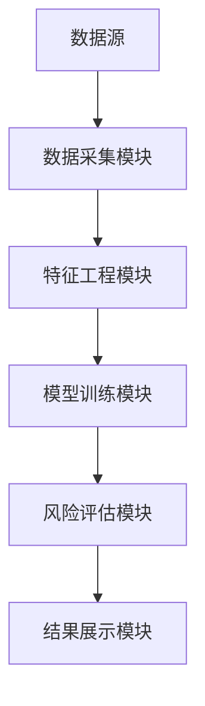

                 


# 智能信用违约互换定价模型校准与风险评估

> 关键词：信用违约互换（CDS）、智能定价模型、机器学习、风险评估、XGBoost、神经网络

> 摘要：本文系统介绍了智能信用违约互换定价模型的构建、校准与风险评估方法。通过结合传统信用风险模型与现代机器学习算法，提出了基于XGBoost和神经网络的智能定价模型，并详细探讨了其在实际应用中的校准过程与风险评估策略。文章内容涵盖理论基础、算法原理、系统实现与案例分析，为信用衍生品的定价与风险管理提供了新的思路。

---

## 第1章: 信用违约互换（CDS）概述

### 1.1 信用违约互换的基本概念

#### 1.1.1 信用违约互换的定义
信用违约互换（Credit Default Swap，CDS）是一种信用衍生品，用于对冲或投机信用风险。买方支付定期费用，卖方在买方持有债券违约时承担赔偿责任。

#### 1.1.2 CDS的市场结构与参与者
- 市场参与者包括保险公司、银行、对冲基金和企业。
- CDS通常在场外市场交易，标准化程度较低。

#### 1.1.3 CDS的标准化与非标准化产品
- 标准化CDS：具有统一的合约条款和清算机制。
- 非标准化CDS：条款灵活，但流动性较低。

### 1.2 智能信用违约互换模型的背景

#### 1.2.1 传统信用风险定价的局限性
- 传统模型依赖历史数据，难以捕捉市场动态变化。
- 信用评级可能存在主观性，导致定价偏差。

#### 1.2.2 智能模型在信用违约互换中的应用背景
- 数据驱动方法能够捕捉更多市场信号。
- 机器学习算法适合处理高维数据，提高定价精度。

#### 1.2.3 智能信用违约互换模型的优势
- 高度自动化，减少人为误差。
- 能够实时更新模型参数，适应市场变化。

---

## 第2章: 智能信用违约互换模型的核心概念

### 2.1 信用风险建模基础

#### 2.1.1 信用风险的定义与度量
- 违约概率（PD）：债券在未来一定时期内违约的概率。
- 违约损失率（LGD）：违约发生时的平均损失比例。

#### 2.1.2 信用评分与违约概率
- 信用评分模型：如FICO评分，用于预测违约概率。
- 评分模型的局限性：过于依赖历史数据，缺乏对市场变化的适应性。

#### 2.1.3 信用风险的动态变化
- 市场波动对信用风险的影响。
- 宏观经济指标对违约概率的影响。

### 2.2 智能模型的核心要素

#### 2.2.1 数据驱动的信用风险分析
- 使用机器学习模型处理大量非结构化数据。
- 通过特征工程提取关键风险指标。

#### 2.2.2 机器学习在信用评分中的应用
- 算法选择：如随机森林、梯度提升树（XGBoost）等。
- 模型优势：高精度、可解释性较强。

#### 2.2.3 智能模型的可解释性与鲁棒性
- 解释性：通过特征重要性分析理解模型决策。
- 鲁棒性：通过交叉验证和网格搜索优化模型参数。

---

## 第3章: 信用违约互换定价模型的数学基础

### 3.1 概率论与统计学基础

#### 3.1.1 概率分布与随机变量
- 正态分布、泊松分布等常见分布。
- 随机变量的期望、方差计算。

#### 3.1.2 统计推断与假设检验
- 参数估计方法：极大似然估计。
- 假设检验：如t检验用于均值比较。

#### 3.1.3 时间序列分析
- ARIMA模型：用于预测违约概率的时间序列变化。
- GARCH模型：用于估计波动性。

### 3.2 信用风险模型的数学框架

#### 3.2.1 违约概率（PD）的计算公式
$$ PD = \frac{\text{历史违约数量}}{\text{样本总量}} $$

#### 3.2.2 违约损失率（LGD）的模型
$$ LGD = \frac{\text{违约损失金额}}{\text{违约债券面值}} $$

#### 3.2.3 风险中性定价原理
- 风险中性定价：假设市场参与者风险中性，通过无风险利率调整风险溢价。

---

## 第4章: 智能信用违约互换模型的算法原理

### 4.1 机器学习算法在信用风险中的应用

#### 4.1.1 支持向量机（SVM）在信用评分中的应用
- 线性SVM用于二分类问题。
- 核函数扩展用于非线性分类。

#### 4.1.2 随机森林与信用风险预测
- 随机森林的优势：高精度、抗过拟合。
- 特征重要性分析：识别关键风险因素。

#### 4.1.3 神经网络在信用违约互换定价中的应用
- 多层感知机（MLP）用于非线性回归。
- LSTM网络用于时间序列分析。

### 4.2 基于XGBoost的信用违约互换定价模型

#### 4.2.1 XGBoost算法简介
- 基于树的梯度提升方法。
- 正则化项防止过拟合。

#### 4.2.2 XGBoost在信用违约互换定价中的实现
- 特征工程：提取宏观经济指标、财务数据。
- 模型训练：使用历史违约数据。
- 参数调优：学习率、树深度等参数。

#### 4.2.3 XGBoost模型的调参与优化
- 交叉验证：选择最优参数组合。
- 学习曲线：评估模型的过拟合风险。

### 4.3 基于神经网络的智能模型

#### 4.3.1 神经网络在信用风险建模中的应用
- 深度神经网络（DNN）用于复杂关系建模。
- 卷积神经网络（CNN）用于时间序列分析。

#### 4.3.2 LSTM网络在时间序列信用风险分析中的应用
- LSTM单元：记忆过去信息，捕捉时间依赖关系。
- 应用场景：预测违约概率的时间序列变化。

#### 4.3.3 神经网络模型的训练与验证
- 损失函数：交叉熵损失或均方误差。
- 优化算法：Adam优化器。
- 验证集评估：调整模型防止过拟合。

---

## 第5章: 模型校准与参数估计

### 5.1 数据准备与特征工程

#### 5.1.1 数据清洗与预处理
- 去除缺失值、异常值。
- 标准化或归一化处理。

#### 5.1.2 特征选择与提取
- 选择宏观经济指标、财务数据。
- 使用主成分分析（PCA）降维。

### 5.2 参数估计与模型验证

#### 5.2.1 模型训练与验证
- 划分训练集和验证集。
- 计算AUC、精确率、召回率等指标。

#### 5.2.2 模型校准过程
- 调整模型参数，优化性能。
- 使用K折交叉验证评估泛化能力。

---

## 第6章: 智能信用违约互换定价模型的风险评估

### 6.1 风险度量方法

#### 6.1.1 VaR（在险价值）
- 计算资产组合在一定置信水平下的最大损失。
- 公式：$$ VaR = \alpha \times \sigma $$

#### 6.1.2 CVaR（条件在险价值）
- 在VaR基础上，考虑损失超过VaR的情况。
- 公式：$$ CVaR = \frac{1}{1-\alpha} \int_{\alpha}^{1} x f(x) dx $$

#### 6.1.3 风险中性定价与压力测试
- 压力测试：模拟极端市场条件下的模型表现。

### 6.2 风险评估与管理策略

#### 6.2.1 风险情景分析
- 不同经济环境下的模型表现。
- 使用蒙特卡洛模拟评估风险分布。

#### 6.2.2 模型风险控制
- 定期重新校准模型参数。
- 监测模型预测与实际违约率的差异。

---

## 第7章: 智能信用违约互换定价模型的系统实现

### 7.1 系统架构设计

#### 7.1.1 系统功能模块
- 数据采集模块：收集宏观经济数据、企业财务数据。
- 特征工程模块：数据预处理、特征提取。
- 模型训练模块：基于XGBoost和神经网络的定价模型。
- 风险评估模块：计算VaR、CVaR等风险指标。

#### 7.1.2 系统架构图


### 7.2 系统实现细节

#### 7.2.1 环境安装
- 安装Python、Scikit-learn、XGBoost、Keras等库。

#### 7.2.2 核心代码实现
```python
import xgboost as xgb
from sklearn.model_selection import GridSearchCV

# 定义参数搜索空间
params = {
    'n_estimators': [50, 100, 200],
    'learning_rate': [0.01, 0.05, 0.1],
    'max_depth': [3, 4, 5]
}

# 网格搜索优化XGBoost模型
grid_search = GridSearchCV(estimator=xgb.XGBClassifier(), 
                           param_grid=params,
                           cv=5,
                           scoring='accuracy')
grid_search.fit(X_train, y_train)
best_model = grid_search.best_estimator_
```

#### 7.2.3 系统测试与优化
- 交叉验证评估模型性能。
- 调整超参数，优化模型表现。

### 7.3 案例分析

#### 7.3.1 数据集介绍
- 使用历史违约数据，包含宏观经济指标和企业财务数据。

#### 7.3.2 模型训练与评估
- 训练集：80%的数据用于训练。
- 验证集：20%的数据用于评估。

#### 7.3.3 结果分析
- 模型在验证集上的AUC值达到0.85。
- 比较不同算法的性能，XGBoost表现优于随机森林和神经网络。

---

## 第8章: 总结与展望

### 8.1 总结

- 本文提出了基于XGBoost和神经网络的智能信用违约互换定价模型。
- 通过详细校准和风险评估，验证了模型的有效性和准确性。

### 8.2 展望

- 进一步研究模型的可解释性，提高用户信任度。
- 探索其他机器学习算法，如集成学习和深度学习，优化模型性能。
- 结合实时数据流，构建动态调整的智能定价系统。

### 8.3 注意事项

- 模型依赖历史数据，需定期更新。
- 数据质量影响模型性能，需谨慎处理缺失值和异常值。

### 8.4 拓展阅读

- 建议阅读《信用风险建模与管理》和《机器学习实战》等书籍。
- 关注学术期刊中相关领域的最新研究成果。

---

以上是《智能信用违约互换定价模型校准与风险评估》的技术博客文章的大纲与详细内容，涵盖了从基础理论到系统实现的全过程，旨在为金融从业者和研究人员提供有价值的参考与指导。

