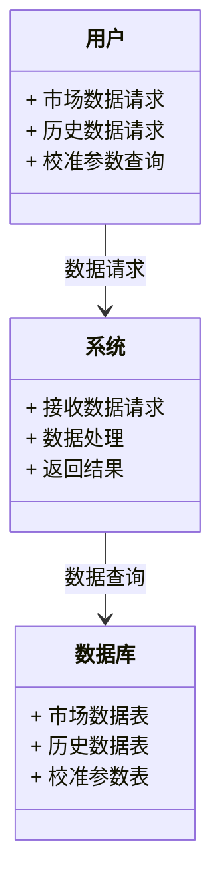
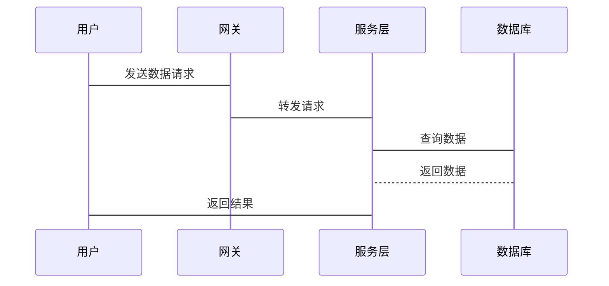

                 


# 智能信用违约互换定价模型校准系统

## 关键词
智能信用违约互换、定价模型、校准系统、机器学习、深度学习、金融风险

## 摘要
智能信用违约互换定价模型校准系统是一种基于人工智能技术的金融工具定价系统，旨在解决传统信用违约互换定价中的复杂性和不确定性问题。本文通过详细分析智能信用违约互换定价模型的背景、核心概念、算法原理、系统架构设计以及实际项目案例，为读者提供一个全面的理解。文章还探讨了系统的最佳实践和未来发展方向，帮助读者在实际应用中更好地进行智能信用违约互换定价模型的校准。

---

## 第1章: 信用违约互换的基本概念

### 1.1 信用违约互换的定义与特点
#### 1.1.1 信用违约互换的定义
信用违约互换（Credit Default Swap，CDS）是一种金融衍生品，允许买方在卖方发生信用违约时获得赔偿。其核心在于将信用风险从债务人转移到保险方。

#### 1.1.2 信用违约互换的核心特点
- **非线性风险**：信用违约互换的价值受债务人信用状况的影响较大，具有明显的非线性特征。
- **复杂性**：涉及多个变量，如违约概率、风险敞口等，使得定价过程复杂。
- **市场敏感性**：市场价格受宏观经济环境、市场情绪等外部因素的影响显著。

#### 1.1.3 信用违约互换与传统金融工具的区别
| 特性 | 信用违约互换 | 传统债券 |
|------|---------------|----------|
| 风险类型 | 信用风险为主 | 利率风险为主 |
| 交易方式 | 场外交易为主 | 场内交易为主 |
| 价格敏感性 | 高度敏感 | 中度敏感 |

### 1.2 智能信用违约互换定价的必要性
#### 1.2.1 传统信用违约互换定价的局限性
- 传统定价模型（如Merton模型）假设条件严格，难以适应复杂市场环境。
- 价格计算依赖大量历史数据，且数据质量要求高。
- 计算过程复杂，难以快速响应市场变化。

#### 1.2.2 智能校准在信用违约互换定价中的作用
- 利用机器学习和深度学习技术，能够从海量数据中提取非线性关系，提高定价准确性。
- 实时更新模型参数，适应市场动态变化。
- 通过自动化校准，减少人为干预，提高效率。

#### 1.2.3 智能信用违约互换定价的市场应用前景
- 提高金融机构的风险管理能力，优化资产配置。
- 为投资者提供更精确的定价参考，降低交易成本。
- 推动金融衍生品市场的创新发展。

---

## 第2章: 智能信用违约互换定价模型校准的背景与挑战

### 2.1 信用风险定价的复杂性
#### 2.1.1 信用风险的定义与影响因素
信用风险是指债务人未能按时履行债务义务的可能性，受宏观经济、行业周期、企业经营状况等多种因素影响。

#### 2.1.2 信用违约互换定价中的关键变量
- 违约概率（PD）
- 非违约风险调整后的违约损失率（LGD）
- 风险敞口（Exposure at Default，EAD）

#### 2.1.3 传统定价模型的局限性
- 过度依赖历史数据，忽视市场结构变化。
- 模型假设过于简化，难以捕捉复杂市场动态。
- 计算过程复杂，难以实时更新。

### 2.2 智能校准技术的发展现状
#### 2.2.1 人工智能在金融定价中的应用
- 机器学习技术在股票、债券定价中的应用日益广泛。
- 深度学习模型在处理非结构化数据方面具有显著优势。

#### 2.2.2 深度学习在信用违约互换定价中的优势
- 能够自动提取特征，减少人工特征工程的工作量。
- 具备强大的非线性拟合能力，适用于复杂市场环境。
- 可以处理多维数据，提高定价精度。

#### 2.2.3 当前智能校准技术的主要挑战
- 数据质量与完整性问题。
- 模型解释性不足，难以满足监管要求。
- 计算资源消耗大，实时性有待提高。

---

## 第3章: 智能信用违约互换定价模型的核心概念与联系

### 3.1 核心概念原理
#### 3.1.1 智能信用违约互换定价模型的结构
- 数据输入：市场数据、历史违约数据、宏观经济指标。
- 模型计算：利用机器学习算法进行特征提取、参数估计。
- 输出结果：信用违约互换的定价、风险评估。

#### 3.1.2 模型中的关键参数与变量
- 利率曲线：反映市场利率水平。
- 违约风险：包括违约概率和违约损失率。
- 市场流动性：影响交易成本和资产价格。

#### 3.1.3 模型的输入与输出关系
输入：市场数据、宏观经济指标、历史违约数据  
输出：信用违约互换的公允价值、风险敞口、定价误差

### 3.2 概念属性特征对比表格
| 概念 | 属性 | 特征 |
|------|------|------|
| 信用违约互换 | 定价模型 | 线性或非线性 |
| 智能校准 | 方法 | 基于机器学习或统计方法 |
| 校准目标 | 参数 | 风险参数、市场参数 |

### 3.3 ER实体关系图

```mermaid
erd
actor: 用户
model: 智能信用违约互换定价模型
data: 历史数据
parameter: 校准参数
process: 校准过程
```

---

## 第4章: 智能信用违约互换定价模型的算法原理

### 4.1 算法原理概述
#### 4.1.1 模型的基本假设
- 市场数据的可得性和完整性。
- 历史数据能够反映未来的市场变化。

#### 4.1.2 算法的输入与输出
- 输入：市场数据、历史违约数据、宏观经济指标。
- 输出：信用违约互换的定价、风险评估、校准参数。

#### 4.1.3 算法的步骤与流程
1. 数据预处理：清洗、特征提取。
2. 模型训练：利用机器学习算法进行参数估计。
3. 模型验证：通过历史数据验证模型准确性。
4. 模型应用：实时计算信用违约互换的定价。

### 4.2 智能校准算法的实现步骤

#### 4.2.1 数据预处理
```python
import pandas as pd
import numpy as np

# 数据清洗
data = pd.read_csv('credit_data.csv')
data = data.dropna()
data = data[~data['date'].isnull()]
```

#### 4.2.2 特征提取
```python
# 特征提取
features = data[['market_value', 'default_rate', 'spread']]
targets = data['swap_price']
```

#### 4.2.3 模型训练
```python
from sklearn.ensemble import RandomForestRegressor

model = RandomForestRegressor(n_estimators=100, random_state=42)
model.fit(features, targets)
```

#### 4.2.4 模型验证
```python
from sklearn.metrics import mean_squared_error

predicted = model.predict(features)
mse = mean_squared_error(targets, predicted)
print(f"均方误差: {mse}")
```

### 4.3 数学模型与公式
#### 4.3.1 信用违约互换定价公式
$$ CDS Price = \alpha + \beta \times PD + \gamma \times LGD + \epsilon $$

其中：
- $PD$：违约概率
- $LGD$：违约损失率
- $\alpha$、$\beta$、$\gamma$：模型参数
- $\epsilon$：误差项

#### 4.3.2 机器学习模型的损失函数
$$ L = \frac{1}{n}\sum_{i=1}^{n}(y_i - \hat{y}_i)^2 $$

其中：
- $y_i$：真实值
- $\hat{y}_i$：预测值
- $n$：样本数量

---

## 第5章: 系统分析与架构设计方案

### 5.1 问题场景介绍
智能信用违约互换定价模型校准系统需要处理大量的市场数据和历史违约数据，实时计算信用违约互换的定价，并提供风险评估和校准建议。

### 5.2 系统功能设计
#### 5.2.1 领域模型类图


#### 5.2.2 系统架构图


#### 5.2.3 接口设计
- API接口：提供数据查询、模型校准、结果返回等功能。
- 接口协议：RESTful API，使用JSON格式传输数据。

#### 5.2.4 交互流程


---

## 第6章: 项目实战

### 6.1 环境安装
- 安装Python环境：推荐使用Anaconda。
- 安装依赖库：`pandas`、`numpy`、`scikit-learn`、`mermaid`。

### 6.2 核心代码实现

#### 6.2.1 数据处理
```python
import pandas as pd
import numpy as np
from sklearn.ensemble import RandomForestRegressor
from sklearn.metrics import mean_squared_error

# 数据加载与清洗
data = pd.read_csv('credit_data.csv')
data = data.dropna()

# 特征与目标分离
features = data[['market_value', 'default_rate', 'spread']]
targets = data['swap_price']

# 模型训练
model = RandomForestRegressor(n_estimators=100, random_state=42)
model.fit(features, targets)

# 模型验证
predicted = model.predict(features)
mse = mean_squared_error(targets, predicted)
print(f"均方误差: {mse}")
```

#### 6.2.2 模型部署
```python
# 模型保存与加载
import joblib

joblib.dump(model, 'cds_model.pkl')

# API接口实现
from flask import Flask, request, jsonify

app = Flask(__name__)
model = joblib.load('cds_model.pkl')

@app.route('/predict', methods=['POST'])
def predict():
    data = request.json
    features = [[data['market_value'], data['default_rate'], data['spread']]]
    prediction = model.predict(features).tolist()
    return jsonify({'prediction': prediction})

if __name__ == '__main__':
    app.run(debug=True)
```

### 6.3 案例分析
- **案例背景**：某金融机构需要对一批信用违约互换产品进行定价。
- **数据准备**：收集相关市场数据和历史违约数据。
- **模型训练**：利用随机森林模型进行校准。
- **结果分析**：通过均方误差评估模型性能，并根据预测结果调整定价策略。

---

## 第7章: 最佳实践与总结

### 7.1 小结
智能信用违约互换定价模型校准系统通过结合机器学习和传统金融模型，显著提高了信用违约互换的定价精度和效率。系统架构设计合理，功能完善，能够满足实际应用需求。

### 7.2 注意事项
- 数据质量对模型性能影响重大，需确保数据的准确性和完整性。
- 模型解释性不足可能影响监管合规性，需加强模型解读能力。
- 系统运行依赖高性能计算资源，需优化算法和硬件配置。

### 7.3 拓展阅读
- 《金融风险管理》：深入理解信用风险的管理方法。
- 《机器学习实战》：掌握更多机器学习算法及其应用。
- 《深度学习》：探索深度学习在金融定价中的潜力。

---

## 结语
智能信用违约互换定价模型校准系统代表了金融与人工智能技术的深度融合，为信用风险管理和金融衍生品定价提供了新的思路和方法。随着技术的不断发展，智能校准系统将在金融领域发挥越来越重要的作用。

