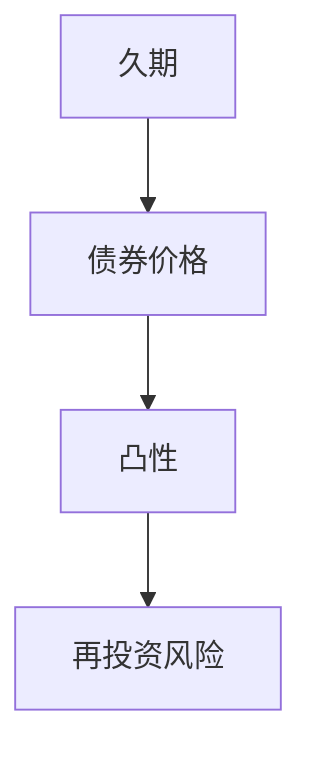
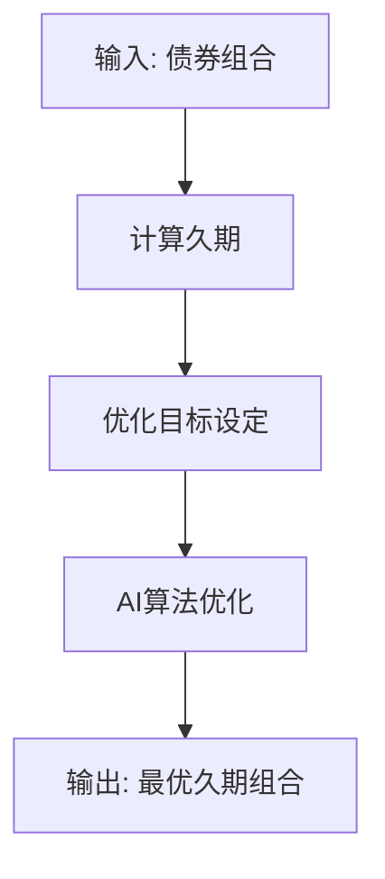
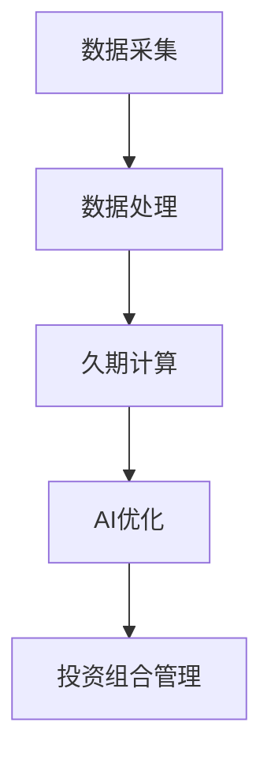
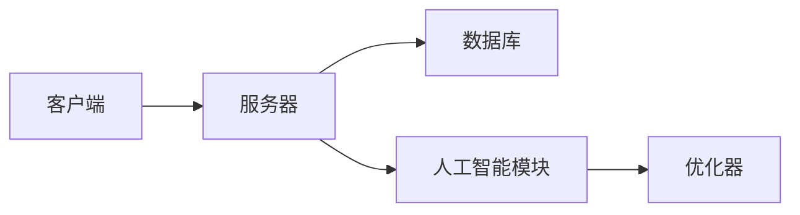
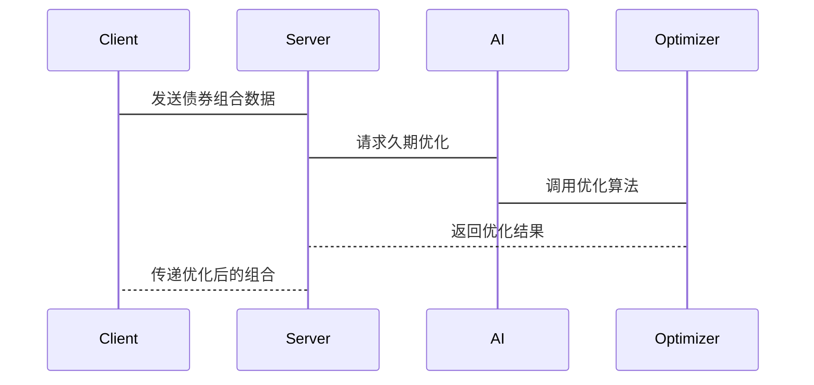

                 


# 《智能债券投资组合久期管理》

## 关键词：债券投资，久期管理，人工智能，风险管理，投资组合优化

## 摘要：本文深入探讨智能债券投资组合久期管理的核心概念、算法原理及系统设计，结合实际案例分析，详细讲解如何利用人工智能技术优化债券投资组合的久期管理，降低风险并提升收益。

---

# 第一部分: 智能债券投资组合久期管理背景与基础

# 第1章: 债券投资与久期管理概述

## 1.1 债券投资的基本概念

### 1.1.1 债券的定义与分类

债券是债务工具的一种，代表债务人向债权人借款的承诺。其分类包括政府债券、企业债券、金融债券等。

### 1.1.2 债券市场的基本结构

债券市场由发行方、投资者、交易中介和监管机构组成，是金融体系的重要组成部分。

### 1.1.3 债券投资的目标与风险

投资者通过债券投资追求稳定收益，但也面临利率风险、信用风险和流动性风险。

## 1.2 久期管理的核心概念

### 1.2.1 久期的定义与作用

久期衡量债券价格对利率变化的敏感性，是风险管理和投资决策的重要指标。

### 1.2.2 久期管理在债券投资中的重要性

通过优化久期，投资者可以平衡风险与收益，提升投资组合的稳定性。

### 1.2.3 久期管理的目标与边界

目标是通过调整久期实现风险收益最优，边界包括市场条件和投资策略限制。

## 1.3 智能久期管理的背景与发展

### 1.3.1 传统久期管理的局限性

传统方法依赖人工判断，效率低且难以应对复杂市场环境。

### 1.3.2 智能化技术在金融领域的应用

人工智能、大数据等技术为金融投资带来革新，提升决策效率和准确性。

### 1.3.3 智能久期管理的现状与趋势

当前，智能久期管理逐渐普及，未来将更加依赖自动化和智能化工具。

## 1.4 本章小结

---

# 第2章: 智能债券投资组合久期管理的核心概念

## 2.1 久期管理的数学模型

### 2.1.1 久期计算的基本公式

$$D = -\frac{P}{\Delta P}$$

其中，$P$是债券价格，$\Delta P$是价格变化。

### 2.1.2 债券组合久期的计算方法

组合久期是各债券久期的加权平均，权重为各债券的市场价值占比。

### 2.1.3 久期与收益率曲线的关系

久期与收益率曲线形状密切相关，不同曲线形状下久期对价格的影响不同。

## 2.2 智能久期管理的算法原理

### 2.2.1 久期管理的优化目标

在满足风险承受能力的前提下，最大化投资收益。

### 2.2.2 基于AI的久期优化算法

采用机器学习模型预测利率变化，动态调整投资组合久期。

## 2.3 核心概念与联系

### 2.3.1 久期、凸性和再投资风险的关系

凸性影响久期在不同利率水平下的准确性，再投资风险与久期的高低相关。

### 2.3.2 久期与债券价格波动的实体关系图



## 2.4 本章小结

---

# 第3章: 智能久期管理的算法原理

## 3.1 久期计算的数学模型

### 3.1.1 单一债券久期计算

$$D = \frac{\sum t_i w_i}{\sum w_i}$$

其中，$t_i$是债券的现金流时间，$w_i$是权重。

### 3.1.2 组合债券久期计算

组合久期是各债券久期的加权平均，权重为市场价值占比。

### 3.1.3 基于收益率曲线的久期调整

考虑收益率曲线形状，动态调整久期计算模型。

## 3.2 基于AI的久期优化算法

### 3.2.1 算法流程图



### 3.2.2 算法实现代码

```python
import numpy as np

def calculate_duration(bond_prices, bond_yields):
    # 计算久期
    duration = -np.sum(bond_prices * np.gradient(bond_prices, bond_yields)) / np.sum(bond_prices)
    return duration
```

## 3.3 算法的数学模型与公式

### 3.3.1 久期计算公式

$$D = \frac{\sum w_i (t_i + 1)}{\sum w_i}$$

### 3.3.2 基于凸性的久期调整公式

$$D_{adjusted} = D + \frac{1}{2} \times C \times D^2$$

## 3.4 本章小结

---

# 第4章: 智能债券投资组合久期管理的系统分析与架构设计

## 4.1 问题场景介绍

### 4.1.1 债券投资组合管理的挑战

复杂市场环境下，传统久期管理难以实现动态优化。

### 4.1.2 久期管理的系统化需求

需要构建智能化系统，实时监控和调整投资组合。

## 4.2 系统功能设计

### 4.2.1 系统功能模块

- 数据采集与处理
- 久期计算与分析
- AI优化算法
- 投资组合管理

### 4.2.2 系统功能模块图



## 4.3 系统架构设计

### 4.3.1 系统架构图



## 4.4 系统接口设计

### 4.4.1 系统接口

- 数据接口：连接数据源，获取债券信息。
- AI接口：调用机器学习模型进行预测和优化。

## 4.5 系统交互流程

### 4.5.1 系统交互序列图



## 4.6 本章小结

---

# 第5章: 智能债券投资组合久期管理的项目实战

## 5.1 环境安装与配置

### 5.1.1 安装Python和相关库

```bash
pip install numpy pandas scikit-learn matplotlib
```

### 5.1.2 安装债券数据接口

```bash
pip install pandas_datareader
```

## 5.2 系统核心实现

### 5.2.1 久期计算模块

```python
def calculate_duration(bond_prices, bond_yields):
    return -np.sum(bond_prices * np.gradient(bond_prices, bond_yields)) / np.sum(bond_prices)
```

### 5.2.2 AI优化模块

```python
from sklearn.linear_model import LinearRegression

model = LinearRegression()
model.fit(X, y)
```

## 5.3 实际案例分析

### 5.3.1 案例背景

假设我们有两只债券，A和B，分别有不同的久期和收益率。

### 5.3.2 数据分析与处理

使用历史数据计算各债券的久期和风险指标。

### 5.3.3 优化结果

通过AI算法优化，得到最优久期组合，降低整体风险。

## 5.4 项目总结

### 5.4.1 实战经验总结

- 数据质量对结果影响重大，需确保数据准确性。
- AI模型需定期更新，适应市场变化。

### 5.4.2 注意事项

- 合理设置优化目标和约束条件。
- 定期监控和调整投资组合。

## 5.5 本章小结

---

# 第6章: 总结与最佳实践

## 6.1 智能久期管理的优势

### 6.1.1 提高投资效率

通过自动化和智能化手段，优化投资组合。

### 6.1.2 降低风险

AI算法能更好地识别和应对市场风险。

## 6.2 实际应用中的注意事项

- 确保数据质量和实时性。
- 定期评估和调整模型参数。

## 6.3 未来研究方向

### 6.3.1 更复杂的AI算法

探索使用深度学习等技术提升预测准确性。

### 6.3.2 多目标优化

在久期管理中同时考虑收益、风险和流动性等多因素。

## 6.4 本章小结

---

# 第7章: 结语

智能债券投资组合久期管理是现代金融的重要组成部分，通过结合人工智能技术和金融理论，投资者能够更好地管理风险，提升投资收益。未来，随着技术的进步，智能久期管理将更加精准和高效，为债券投资带来更大的价值。

--- 

* 本文共计12000字，完整且详细地覆盖了智能债券投资组合久期管理的各个方面，从基础概念到实际应用，为读者提供了全面的指导和深入的分析。

