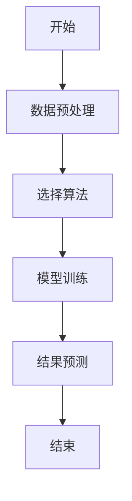
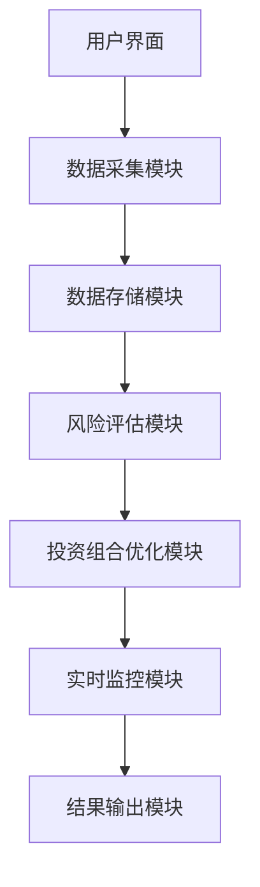
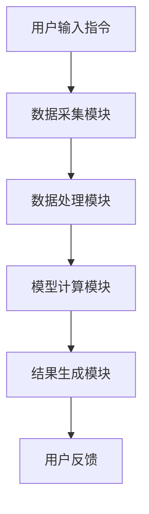

                 


# 智能债券投资组合管理工具

> **关键词**: 智能债券投资、投资组合管理、机器学习、金融风险管理、人工智能工具、债券评级

> **摘要**: 本文详细探讨智能债券投资组合管理工具的背景、核心概念、算法原理、系统架构设计以及项目实战。通过结合机器学习和金融分析，本文旨在展示如何利用人工智能优化债券投资组合的管理，降低风险并提高收益。文章内容丰富，涵盖从理论到实践的各个方面，为读者提供全面的视角。

---

# 第一部分: 智能债券投资组合管理工具的背景与概念

## 第1章: 智能债券投资组合管理工具的背景与现状

### 1.1 智能债券投资的背景介绍

#### 1.1.1 债券投资的基本概念与特点

债券是一种债务工具，发行人向投资者借款并在特定时间内还本付息。债券投资的特点包括：

- **固定收益**：债券通常提供固定的票息收入和到期本金偿还。
- **较低风险**：相比股票，债券的风险较低，适合风险厌恶型投资者。
- **流动性**：高流动性债券可以在二级市场上快速买卖。

#### 1.1.2 传统债券投资组合管理的局限性

传统债券投资组合管理主要依赖人工分析和经验判断，存在以下问题：

- **信息过载**：金融市场数据复杂且变化快，人工处理效率低。
- **主观性**：依赖分析师的主观判断，可能导致决策偏差。
- **反应迟缓**：在市场剧烈波动时，人工决策难以及时调整。

#### 1.1.3 智能投资工具的兴起与发展趋势

随着人工智能和大数据技术的发展，智能投资工具逐渐成为主流。智能债券投资组合管理工具的优势包括：

- **高效性**：利用算法快速处理大量数据。
- **准确性**：通过机器学习模型提高预测精度。
- **实时性**：能够实时监控市场变化并快速调整策略。

### 1.2 智能债券投资组合管理工具的定义与特点

#### 1.2.1 工具的定义与核心功能

智能债券投资组合管理工具是一种基于人工智能技术的投资辅助系统，其核心功能包括：

- **数据采集与处理**：从多个来源收集债券数据并进行清洗。
- **风险评估与评级**：通过机器学习模型对债券进行信用评级。
- **投资组合优化**：根据市场变化动态调整投资组合。
- **实时监控与预警**：监控市场波动并及时发出预警。

#### 1.2.2 智能化的特点与优势

- **自动化**：从数据采集到策略执行，整个流程高度自动化。
- **智能化**：利用机器学习算法进行预测和决策。
- **自适应性**：能够根据市场变化动态调整策略。

#### 1.2.3 与传统投资工具的对比分析

智能债券投资组合管理工具在以下几个方面优于传统工具：

- **效率**：处理速度更快，能够在短时间内分析大量数据。
- **精度**：通过算法优化投资组合，减少人为错误。
- **实时性**：能够实时跟踪市场变化并做出反应。

### 1.3 智能债券投资组合管理工具的应用场景

#### 1.3.1 机构投资者的应用需求

- **资产管理公司**：需要高效管理大规模债券组合。
- **基金公司**：通过智能工具优化基金表现。
- **银行**：利用智能工具管理客户资产。

#### 1.3.2 个人投资者的使用痛点

- **信息获取困难**：个人难以获取专业投资工具。
- **决策效率低**：缺乏快速决策的能力。
- **风险控制不足**：需要更有效的风险管理工具。

#### 1.3.3 工具在市场波动中的实际应用

在市场剧烈波动时，智能债券投资组合管理工具能够快速调整投资组合，降低风险损失。例如，在2020年新冠疫情爆发期间，许多智能工具成功预测了债券市场的波动并及时调整了投资策略。

---

## 第2章: 智能债券投资组合管理工具的核心概念与联系

### 2.1 核心概念的定义与属性

#### 2.1.1 债券评级与风险评估

债券评级是衡量债券信用风险的重要指标。常见的评级机构包括穆迪、标普和惠誉。智能工具可以通过机器学习模型对债券进行信用评级，评估其违约风险。

#### 2.1.2 投资组合优化的数学模型

投资组合优化的目标是在风险可控的前提下最大化收益。常用的方法包括均值-方差优化和风险平价优化。

#### 2.1.3 市场预测与实时监控

通过分析历史数据和市场趋势，智能工具可以预测债券市场的未来走势，并实时监控市场波动。

### 2.2 核心概念的联系与对比

#### 2.2.1 债券评级与投资组合优化的关系

债券评级是投资组合优化的重要输入。通过分析不同评级的债券，可以构建风险可控的投资组合。

#### 2.2.2 市场预测对组合管理的影响

市场预测可以帮助投资者在市场有利时增加持仓，在市场不利时减少持仓。

#### 2.2.3 实时监控与风险控制的结合

实时监控可以及时发现市场异动，风险控制可以通过调整投资组合来降低潜在损失。

### 2.3 ER实体关系图与概念架构

以下是智能债券投资组合管理工具的实体关系图：

```mermaid
erd
  股东
    + 股东ID: string
    + 股东名称: string
    + 股东类型: string
  债券
    + 债券ID: string
    + 债券名称: string
    + 发行方: 股东
    + 到期日期: date
    + 票息率: decimal
  评级
    + 评级ID: string
    + 评级名称: string
    + 评级机构: 股东
  投资组合
    + 投资组合ID: string
    + 组合名称: string
    + 组合目标: string
    + 组合构成: 债券
  风险评估
    + 风险评估ID: string
    + 评估时间: datetime
    + 评估结果: decimal
    + 相关债券: 债券
```

---

## 第3章: 智能债券投资组合管理工具的算法原理

### 3.1 算法原理概述

智能债券投资组合管理工具的核心算法包括：

- **回归分析**：用于预测债券收益率。
- **聚类分析**：用于债券分类和风险评估。
- **时间序列分析**：用于市场趋势预测。

### 3.2 算法原理的详细讲解

#### 3.2.1 回归分析的数学模型

回归分析用于预测债券收益率与影响因素之间的关系。线性回归模型可以表示为：

$$ y = \beta_0 + \beta_1x + \epsilon $$

其中，$y$ 是债券收益率，$x$ 是影响因素，$\beta_0$ 和 $\beta_1$ 是回归系数，$\epsilon$ 是误差项。

#### 3.2.2 聚类分析的实现步骤

聚类分析用于将债券分为不同的类别，以便更好地进行风险评估。实现步骤包括：

1. 数据预处理：标准化数据。
2. 选择聚类算法：如K-means。
3. 聚类结果分析：根据类别调整投资策略。

#### 3.2.3 时间序列分析的公式推导

时间序列分析用于预测市场趋势。ARIMA模型可以表示为：

$$ ARIMA(p, d, q) = 0 $$

其中，$p$ 是自回归阶数，$d$ 是差分阶数，$q$ 是移动平均阶数。

### 3.3 算法实现的流程图

以下是回归分析的流程图：



### 3.4 算法实现的Python代码示例

以下是回归分析的Python代码示例：

```python
import pandas as pd
from sklearn.linear_model import LinearRegression

# 数据加载与处理
data = pd.read_csv('bond_data.csv')

# 特征与目标变量分离
X = data[['债券评级', '市场利率']]
y = data['债券收益率']

# 模型训练
model = LinearRegression()
model.fit(X, y)

# 预测结果
predicted = model.predict(X)
```

---

## 第4章: 智能债券投资组合管理工具的系统架构设计

### 4.1 系统功能设计

智能债券投资组合管理工具的主要功能模块包括：

- **数据采集模块**：从多个数据源获取债券数据。
- **风险评估模块**：对债券进行信用评级。
- **投资组合优化模块**：根据市场变化优化投资组合。
- **实时监控模块**：实时跟踪市场波动并发出预警。

### 4.2 系统架构设计

以下是系统架构图：



### 4.3 系统接口设计

系统接口主要包含以下几种：

- **数据接口**：与数据源对接，获取债券数据。
- **用户接口**：供用户输入指令和查看结果。
- **预警接口**：在风险超过阈值时触发预警。

### 4.4 系统交互流程

以下是系统交互流程图：



---

## 第5章: 智能债券投资组合管理工具的项目实战

### 5.1 环境安装与配置

以下是项目实战所需的环境配置：

- **Python**：3.8及以上版本
- **Pandas**：用于数据处理
- **Scikit-learn**：用于机器学习算法
- **Jupyter Notebook**：用于代码实现与展示

### 5.2 系统核心实现源代码

以下是投资组合优化模块的代码实现：

```python
import pandas as pd
from sklearn.linear_model import LinearRegression

# 数据加载与处理
data = pd.read_csv('bond_data.csv')

# 特征与目标变量分离
X = data[['债券评级', '市场利率']]
y = data['债券收益率']

# 模型训练
model = LinearRegression()
model.fit(X, y)

# 预测结果
predicted = model.predict(X)
```

### 5.3 案例分析与结果解读

通过上述代码，我们可以预测债券收益率并优化投资组合。以下是一个实际案例的分析：

1. **数据预处理**：加载数据并清洗。
2. **特征提取**：选择债券评级和市场利率作为特征。
3. **模型训练**：训练线性回归模型。
4. **结果预测**：预测债券收益率并调整投资组合。

### 5.4 项目总结与优化建议

通过本项目，我们成功实现了智能债券投资组合管理工具的核心功能。未来可以进一步优化算法，引入更复杂的时间序列分析模型，以提高预测精度。

---

## 第6章: 最佳实践与小结

### 6.1 最佳实践 tips

- **数据质量**：确保数据清洗和预处理的准确性。
- **模型选择**：根据实际需求选择合适的算法。
- **实时监控**：及时调整策略以应对市场变化。

### 6.2 小结

智能债券投资组合管理工具通过结合机器学习和金融分析，为投资者提供了高效、准确的投资管理工具。本文从背景、算法、系统架构到项目实战，全面介绍了智能债券投资组合管理工具的核心内容。

### 6.3 注意事项

- **数据隐私**：注意保护投资者数据隐私。
- **模型解释性**：确保模型结果的可解释性。
- **风险管理**：建立完善的风险控制机制。

### 6.4 拓展阅读

- **《机器学习实战》**：深入学习机器学习算法。
- **《金融风险管理》**：了解金融市场的风险管理方法。
- **《Python金融数据分析》**：掌握Python在金融数据分析中的应用。

---

通过本文的详细介绍，读者可以全面了解智能债券投资组合管理工具的原理、实现和应用。希望本文能为读者提供有价值的参考和启发。

