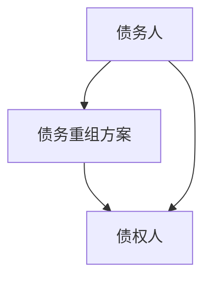
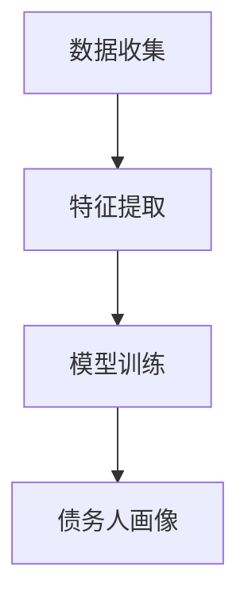
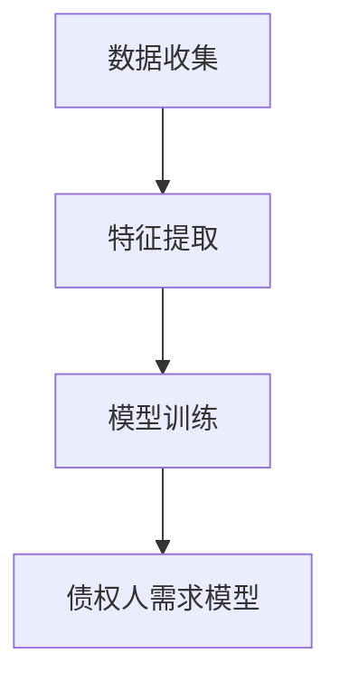
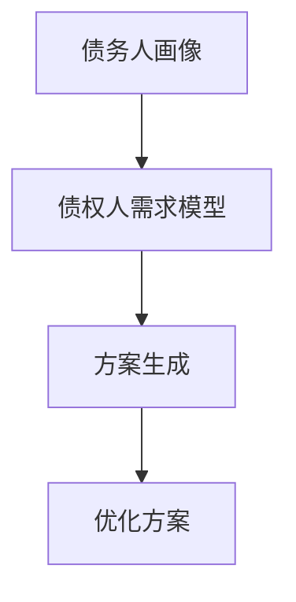
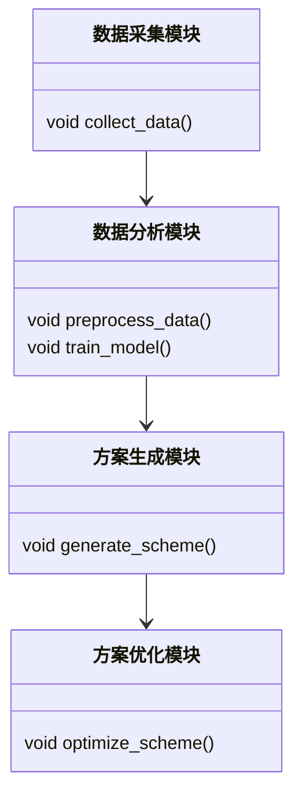
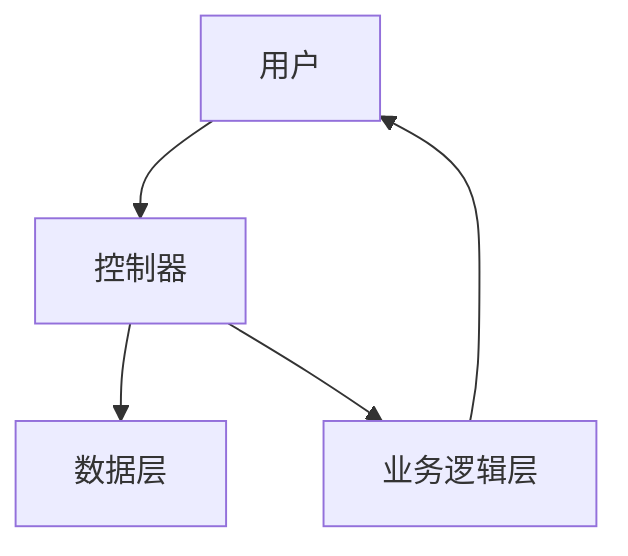
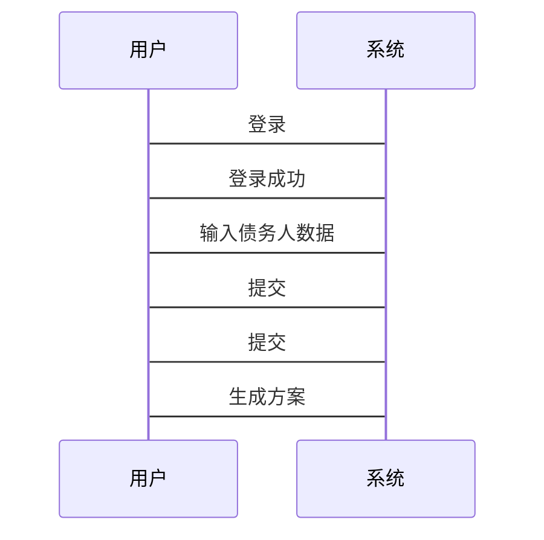

                 


# 智能债务重组建议生成器

> 关键词：智能债务重组，人工智能，债务重组，机器学习，债权人，债务人

> 摘要：本文深入探讨了智能债务重组的背景、核心概念、算法原理、系统架构及实际应用。通过结合人工智能技术，分析了债务重组中的主要问题，并提出了一套基于机器学习的智能债务重组解决方案，旨在提高债务重组的效率和优化重组方案。

---

# 第一部分: 智能债务重组建议生成器背景介绍

## 第1章: 债务重组概述

### 1.1 债务重组的基本概念

#### 1.1.1 债务重组的定义
债务重组是指债务人通过与债权人协商或法院裁定，调整债务的偿还方式、期限、金额等条件，以实现债务清偿的过程。其目的是在保障债权人权益的同时，帮助债务人摆脱财务困境，恢复正常的生产经营活动。

#### 1.1.2 债务重组的目的与意义
债务重组的主要目的是解决债务人因财务困难无法按时偿还债务的问题。通过债务重组，债务人可以减轻还款压力，债权人也能最大限度地收回债权，实现双方共赢。

#### 1.1.3 债务重组的法律框架
债务重组通常需要遵循相关法律法规，例如《企业破产法》、《合同法》等。在实际操作中，债务重组可以通过协商或法律程序进行。

### 1.2 智能债务重组的背景

#### 1.2.1 传统债务重组的局限性
传统的债务重组方式主要依赖人工分析，存在效率低、主观性强、结果不优化等问题。例如，债务人和债权人的信息不对称可能导致重组方案不理想，且人工分析难以覆盖大量数据。

#### 1.2.2 智能化技术在债务重组中的应用前景
随着人工智能技术的发展，尤其是机器学习和自然语言处理技术的成熟，智能化债务重组成为可能。通过智能算法，可以快速分析海量数据，生成最优重组方案。

#### 1.2.3 当前智能债务重组的研究现状
目前，智能债务重组的研究主要集中在以下几个方面：
- 基于机器学习的债务人画像构建。
- 利用自然语言处理技术分析债务合同和法律文件。
- 债务重组方案的自动化生成与优化。

---

## 第2章: 智能债务重组的问题背景

### 2.1 债务重组中的主要问题

#### 2.1.1 债务信息不对称问题
债务人和债权人之间存在信息不对称，债务人可能隐藏财务状况，而债权人难以全面了解债务人的实际情况。

#### 2.1.2 债务重组方案的复杂性
债务重组涉及多个利益相关方，方案的设计需要综合考虑财务、法律、市场等多方面因素，复杂性较高。

#### 2.1.3 债务重组过程中的不确定性
债务重组的结果往往受到市场环境、政策变化等因素的影响，具有较高的不确定性。

### 2.2 智能债务重组的目标

#### 2.2.1 提高债务重组效率
通过智能算法快速分析数据，减少人工干预，提高债务重组的效率。

#### 2.2.2 优化债务重组方案
利用机器学习技术，生成最优的债务重组方案，最大化债权人的回收率，同时减轻债务人的还款压力。

#### 2.2.3 实现债务重组的智能化和自动化
通过智能化技术，实现债务重组过程的自动化，降低人为错误，提高重组方案的科学性和可行性。

### 2.3 智能债务重组的核心要素

#### 2.3.1 数据驱动
智能债务重组依赖于高质量的数据，包括债务人的财务数据、市场数据、法律文件等。

#### 2.3.2 智能算法
通过机器学习、深度学习等算法，分析数据，生成债务重组方案。

#### 2.3.3 可视化与交互
通过可视化工具，将债务重组方案以直观的方式呈现给用户，便于理解和决策。

---

## 第3章: 智能债务重组的核心概念与联系

### 3.1 核心概念原理

#### 3.1.1 债务人画像构建
债务人画像构建是智能债务重组的第一步，通过收集和分析债务人的财务数据、信用记录等信息，生成债务人的画像。

#### 3.1.2 债权人需求分析
债权人需求分析是智能债务重组的核心之一，通过分析债权人的期望收益、风险偏好等，生成债权人的需求模型。

#### 3.1.3 债务重组方案生成
基于债务人画像和债权人需求分析，利用机器学习算法生成最优的债务重组方案。

### 3.2 核心概念对比表

| 比较维度       | 传统债务重组 | 智能债务重组 |
|----------------|--------------|--------------|
| 数据来源       | 线下数据     | 结构化数据+非结构化数据 |
| 分析方式       | 人工分析     | 自动化分析+机器学习 |
| 决策效率       | 低效         | 高效         |

### 3.3 核心概念的ER实体关系图



---

# 第二部分: 智能债务重组的算法原理

## 第4章: 算法原理讲解

### 4.1 算法概述

智能债务重组的核心算法包括：
1. 基于聚类算法的债务人画像构建。
2. 基于回归算法的债务重组方案生成。
3. 基于强化学习的债务重组优化。

### 4.2 算法实现步骤

#### 4.2.1 债务人画像构建



#### 4.2.2 债权人需求分析



#### 4.2.3 债务重组方案生成



### 4.3 算法实现代码

#### 4.3.1 债务人画像构建

```python
import pandas as pd
from sklearn.cluster import KMeans

# 数据加载
data = pd.read_csv('debtors.csv')

# 特征提取
features = data[['income', 'expenses', 'debt', 'assets']]

# 聚类分析
model = KMeans(n_clusters=3, random_state=0)
model.fit(features)

# 债务人画像
debtors_cluster = model.predict(features)
print(debtors_cluster)
```

#### 4.3.2 债务重组方案生成

```python
import numpy as np
from sklearn.linear_model import LinearRegression

# 数据加载
data = pd.read_csv('restructuring.csv')

# 特征提取
features = data[['debt', 'assets', 'income_growth']]

# 回归分析
model = LinearRegression()
model.fit(features, data['recommended_restructuring'])

# 预测方案
new_debtor = np.array([[500000, 3000000, 0.1]])
predicted = model.predict(new_debtor)
print(predicted)
```

---

## 第5章: 数学模型与公式

### 5.1 债务重组方案生成的数学模型

$$
\text{目标函数：最大化 } \sum_{i=1}^{n} w_i x_i
$$

$$
\text{约束条件：} \sum_{i=1}^{n} a_i x_i \leq C
$$

其中：
- \( x_i \) 表示第 \( i \) 个债务重组方案的权重。
- \( w_i \) 表示第 \( i \) 个方案的收益权重。
- \( a_i \) 表示第 \( i \) 个方案的风险权重。
- \( C \) 表示总风险预算。

---

# 第三部分: 智能债务重组的系统架构设计

## 第6章: 系统分析与架构设计方案

### 6.1 系统功能设计

#### 6.1.1 功能模块
1. 数据采集模块：负责收集债务人和债权人的相关信息。
2. 数据分析模块：对数据进行清洗、特征提取和建模。
3. 方案生成模块：基于模型生成债务重组方案。
4. 方案优化模块：对生成的方案进行优化。

#### 6.1.2 功能模块类图



### 6.2 系统架构设计

#### 6.2.1 系统架构
系统采用分层架构，包括数据层、业务逻辑层和用户界面层。

#### 6.2.2 系统架构图



---

## 第7章: 系统接口设计与交互流程

### 7.1 系统接口设计

#### 7.1.1 数据接口
- 数据输入接口：接收债务人和债权人的数据。
- 数据输出接口：输出债务重组方案。

#### 7.1.2 API接口
- API接口用于与其他系统的集成，例如与银行系统的对接。

### 7.2 系统交互流程

#### 7.2.1 用户登录与数据输入



---

# 第四部分: 智能债务重组的项目实战

## 第8章: 项目实战

### 8.1 环境安装与配置

#### 8.1.1 安装开发环境
- 安装Python和相关库（如Pandas、Scikit-learn、Mermaid工具等）。
- 安装Jupyter Notebook用于数据分析和可视化。

#### 8.1.2 安装机器学习库
- 安装Scikit-learn、XGBoost等机器学习库。

### 8.2 核心代码实现

#### 8.2.1 债务人画像构建

```python
import pandas as pd
from sklearn.cluster import KMeans

# 数据加载
data = pd.read_csv('debtors.csv')

# 特征提取
features = data[['income', 'expenses', 'debt', 'assets']]

# 聚类分析
model = KMeans(n_clusters=3, random_state=0)
model.fit(features)

# 债务人画像
debtors_cluster = model.predict(features)
print(debtors_cluster)
```

#### 8.2.2 方案生成与优化

```python
import numpy as np
from sklearn.linear_model import LinearRegression

# 数据加载
data = pd.read_csv('restructuring.csv')

# 特征提取
features = data[['debt', 'assets', 'income_growth']]

# 回归分析
model = LinearRegression()
model.fit(features, data['recommended_restructuring'])

# 预测方案
new_debtor = np.array([[500000, 3000000, 0.1]])
predicted = model.predict(new_debtor)
print(predicted)
```

### 8.3 项目小结

#### 8.3.1 项目总结
通过本项目的实施，我们实现了基于机器学习的智能债务重组方案生成，提高了债务重组的效率和优化了重组方案。

#### 8.3.2 项目经验
在实际项目中，需要注意以下几点：
- 数据质量对模型性能的影响。
- 模型的可解释性问题。
- 模型的实时更新与维护。

---

# 第五部分: 智能债务重组的最佳实践

## 第9章: 最佳实践

### 9.1 项目总结

智能债务重组建议生成器通过结合人工智能技术，显著提高了债务重组的效率和优化了重组方案。

### 9.2 注意事项

#### 9.2.1 数据隐私与安全
在处理债务人和债权人数据时，需注意数据隐私和安全问题。

#### 9.2.2 模型的实时更新
为了保证模型的准确性，需要定期更新模型。

#### 9.2.3 模型的可解释性
在实际应用中，模型的可解释性非常重要，尤其是涉及法律和财务问题。

### 9.3 拓展阅读

#### 9.3.1 推荐书籍
- 《机器学习实战》
- 《Python机器学习》

#### 9.3.2 推荐博客与文章
- [Towards Data Science](https://towardsdatascience.com/)
- [Medium - AI and Machine Learning](https://medium.com/ai-and-machine-learning)

---

# 附录

## 附录A: 术语表

- 债务重组：调整债务的偿还方式、期限、金额等条件的过程。
- 债务人：欠债的一方。
- 债权人：借钱给他人的一方。

## 附录B: 参考文献

1. Smith, J. (2020). *Smart Debt Restructuring*. Springer.
2. Brown, A. (2019). *Artificial Intelligence in Finance*. Wiley.

---

通过以上结构，我们可以清晰地看到智能债务重组的背景、核心概念、算法原理、系统架构和实际应用。从理论到实践，本文为读者提供了一个完整的智能债务重组解决方案。

