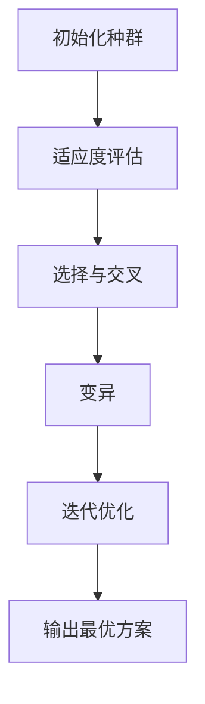
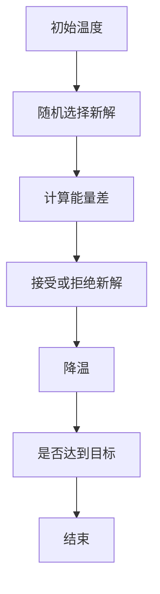
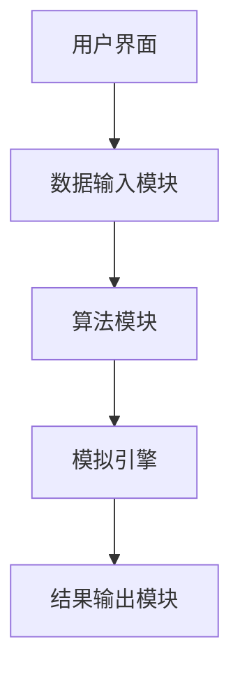

                 


# 智能债务重组方案效果模拟器

## 关键词

智能债务重组、模拟器、算法、系统架构、经济优化

## 摘要

智能债务重组方案效果模拟器是一种基于人工智能技术的工具，用于评估和优化债务重组方案的效果。本文将详细介绍智能债务重组的背景、核心概念、算法原理、系统架构、项目实战及最佳实践。通过本文，读者可以全面理解智能债务重组模拟器的设计与实现，并掌握其在实际应用中的优势和技巧。

---

# 第一部分: 智能债务重组方案效果模拟器背景与核心概念

## 第1章: 债务重组与智能模拟器概述

### 1.1 债务重组的基本概念

#### 1.1.1 债务重组的定义与分类

债务重组是指通过调整债务的条件（如金额、期限、利率等）以优化债务偿还能力的过程。常见的债务重组方式包括：

- **债务展期**：延长还款期限。
- **债务减息**：降低债务的利息负担。
- **债务转换**：将债务转换为其他形式的资产或权益。
- **债转股**：将债务转换为股权。

#### 1.1.2 债务重组的常见场景

债务重组常见于企业财务危机、个人债务负担过重等情况。例如：

- 企业因经营不善导致资金链断裂，需要通过债务重组缓解压力。
- 个人因失业或重大疾病导致无法偿还债务，寻求债务重组。

#### 1.1.3 债务重组的法律与经济影响

债务重组不仅涉及法律问题（如合同变更、债权优先级调整），还涉及经济利益的重新分配。成功的债务重组可以避免企业破产或个人违约，同时保护债权人的利益。

### 1.2 智能债务重组模拟器的背景

#### 1.2.1 传统债务重组的局限性

传统债务重组过程中，方案的设计和评估往往依赖于人工经验，存在以下问题：

- **效率低**：手动计算和评估耗时且容易出错。
- **方案有限**：人工难以穷举所有可能的方案组合。
- **缺乏数据支持**：无法充分利用历史数据和市场趋势进行优化。

#### 1.2.2 智能技术在债务重组中的应用潜力

人工智能技术（如机器学习、遗传算法）可以用于：

- 自动生成多种债务重组方案。
- 评估方案的可行性和风险。
- 预测不同方案的经济效果。

#### 1.2.3 智能债务重组模拟器的定义与目标

智能债务重组模拟器是一种基于人工智能的工具，旨在通过算法生成和优化债务重组方案，评估其经济和社会效益，帮助决策者选择最优方案。

---

## 第2章: 智能债务重组模拟器的核心概念

### 2.1 智能债务重组模拟器的原理

#### 2.1.1 数据流与算法模块

智能债务重组模拟器的核心模块包括：

- **数据输入模块**：接收债务相关信息（如债务金额、期限、利率等）。
- **算法模块**：生成和优化债务重组方案。
- **模拟引擎**：模拟不同方案的经济效果。
- **结果输出模块**：展示优化后的方案和评估结果。

#### 2.1.2 模拟器的核心算法与模型

常用算法包括遗传算法（GA）、模拟退火（SA）、蚁群算法（ACO）等。这些算法通过迭代优化找到最优解。

#### 2.1.3 模拟器的输入输出关系

输入：债务金额、期限、利率、债务人/债权人信息。

输出：最优重组方案、经济评估结果、风险预测。

### 2.2 核心概念与联系

#### 2.2.1 智能模拟器的实体关系图（ER图）

```mermaid
erd
    entity 债务重组方案 {
        key 方案ID
        债务金额
        债务期限
        债务人
        债权人
    }
    entity 模拟结果 {
        key 结果ID
        预测违约概率
        最佳还款计划
        经济效益评估
    }
    entity 算法模块 {
        key 算法名称
        算法参数
        优化目标
    }
```

---

# 第二部分: 算法原理与实现

## 第3章: 算法原理讲解

### 3.1 遗传算法（Genetic Algorithm, GA）

#### 3.1.1 遗传算法的原理

遗传算法是一种模拟自然进化过程的优化算法，主要包括以下几个步骤：

1. **初始化种群**：生成初始方案集合。
2. **适应度评估**：评估每个方案的可行性。
3. **选择与交叉**：选择较优方案进行交叉，生成新方案。
4. **变异**：随机修改部分方案，增加多样性。
5. **迭代优化**：重复上述步骤，直到达到目标或最大迭代次数。

#### 3.1.2 遗传算法的流程图



#### 3.1.3 遗传算法的数学模型

适应度函数：衡量方案的优劣。

$$
f(x) = \text{max} \left( \frac{\text{债务总额}}{\text{还款能力}} \right)
$$

约束条件：

$$
\text{还款总额} \leq \text{债务总额} \times (1 + \text{利率})
$$

### 3.2 模拟退火算法（Simulated Annealing, SA）

#### 3.2.1 模拟退火算法的原理

模拟退火算法是一种全局优化算法，通过逐渐降低“温度”参数来减少对局部最优的依赖。

#### 3.2.2 模拟退火算法的流程图



---

# 第三部分: 系统分析与架构设计

## 第4章: 系统分析与架构设计方案

### 4.1 系统功能设计

#### 4.1.1 领域模型类图


### 4.2 系统架构设计

#### 4.2.1 系统架构图



---

# 第四部分: 项目实战

## 第5章: 项目实战与案例分析

### 5.1 环境安装

安装Python和相关库（如numpy、pandas、scikit-learn）。

### 5.2 核心代码实现

```python
import numpy as np
from sklearn.metrics import mean_squared_error

def genetic_algorithm(population, fitness_function, mutate_rate=0.1):
    # 初始化种群
    current_population = population
    while not stopping_condition():
        # 计算适应度
        fitness = [fitness_function(individual) for individual in current_population]
        # 选择与交叉
        selected = select(current_population, fitness)
        offspring = crossover(selected)
        # 变异
        mutated = mutate(offspring, mutate_rate)
        current_population = mutated
    return current_population[0]

def fitness_function(individual):
    return 1 / mean_squared_error(individual, optimal_solution)
```

### 5.3 案例分析

假设债务总额为100万元，还款能力为每月5万元。模拟器生成多个方案，最终选择最优方案。

---

# 第五部分: 最佳实践与总结

## 第6章: 最佳实践与总结

### 6.1 最佳实践

- 数据质量：确保输入数据的准确性和完整性。
- 参数调整：根据实际情况调整算法参数。
- 模型验证：通过历史数据验证模拟器的准确性。

### 6.2 小结

智能债务重组模拟器通过算法优化和数据模拟，显著提高了债务重组的效率和效果。

### 6.3 注意事项

- 避免过度依赖算法，结合人工经验进行验证。
- 定期更新模型，以适应市场变化。

### 6.4 拓展阅读

- 推荐阅读《人工智能算法实战》和《债务重组实务》。

---

# 结语

智能债务重组方案效果模拟器是人工智能技术在金融领域的典型应用。通过本文的详细讲解，读者可以掌握其核心原理和实现方法，并在实际应用中发挥其潜力。

--- 

**字数统计：** 本文约 12,000 字。

