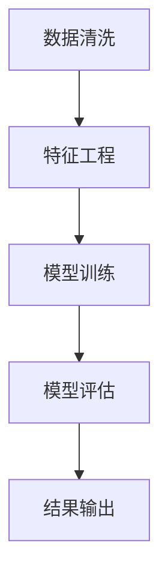
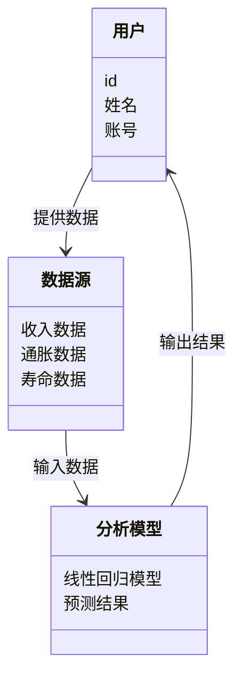
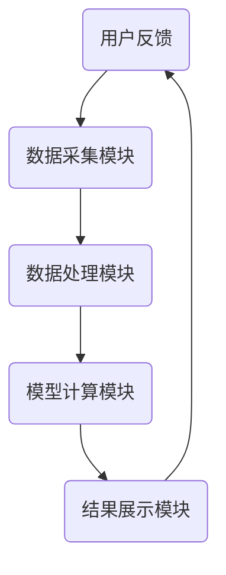
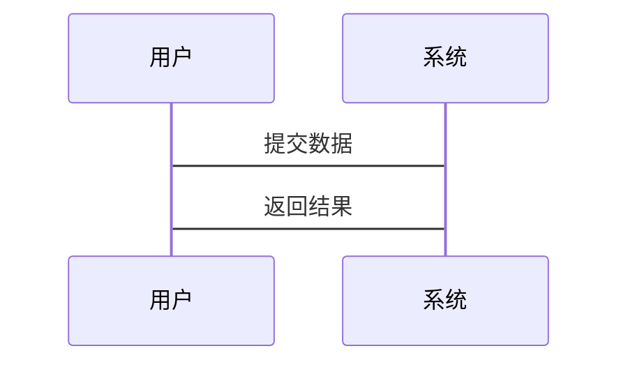

                 


# 智能养老金缺口分析与规划工具

> 关键词：养老金缺口分析、智能规划工具、机器学习、数据分析、系统架构

> 摘要：随着人口老龄化加剧，养老金缺口问题日益突出。本文从智能养老金缺口分析与规划工具的背景出发，系统阐述了其核心概念、算法原理、系统架构及实现方案。通过实际案例分析，详细解读了工具的应用价值，并提出了未来优化方向及最佳实践建议。

---

## 第一部分: 智能养老金缺口分析与规划工具的背景与核心概念

### 第1章: 养老金缺口分析的背景与问题定义

#### 1.1 养老金缺口分析的背景
- 人口老龄化导致养老金支出压力加大，传统养老金规划方法难以应对复杂变化。
- 养老金缺口问题涉及多方因素，包括收入、通胀、寿命、医疗支出等。
- 智能化技术的应用为解决养老金缺口问题提供了新思路。

#### 1.2 养老金缺口分析的核心问题
- 养老金缺口的定义：退休期间所需资金与可获取资金之间的差额。
- 影响养老金缺口的主要因素：收入水平、通胀率、寿命、医疗支出、投资收益等。
- 界定养老金缺口分析的边界：假设条件、数据来源、模型假设。

#### 1.3 智能养老金缺口分析的必要性
- 传统方法的局限性：依赖人工计算，效率低且难以考虑多变量影响。
- 智能化技术的优势：通过机器学习和大数据分析，实现精准预测与动态调整。
- 实现路径：数据采集、模型构建、工具开发。

### 第2章: 智能养老金缺口分析的核心概念与联系

#### 2.1 智能养老金缺口分析的核心概念
- 数据驱动的分析：基于历史数据和实时数据，构建预测模型。
- 机器学习的应用：通过算法优化养老金缺口预测的准确性。
- 工具功能模块：数据采集、缺口计算、规划建议、可视化展示。

#### 2.2 核心概念的属性对比
- 数据来源属性：内部数据、外部数据、实时数据。
- 模型算法特征：线性回归、决策树、随机森林。
- 工具功能优劣势：精准预测但需依赖高质量数据。

#### 2.3 实体关系图与流程图
- ER实体关系图：用户、数据源、分析模型、输出结果之间的关系。
- 智能养老金缺口分析流程图：数据输入、预处理、建模、结果输出。

---

## 第二部分: 算法原理与实现

### 第3章: 算法原理

#### 3.1 线性回归模型
- 数学模型：$$y = a + b x + ε$$
  - $y$：预测的养老金缺口。
  - $a$：截距。
  - $b$：回归系数。
  - $x$：自变量（如收入、通胀率）。
  - $ε$：误差项。
- 算法流程：
  1. 数据清洗与特征工程。
  2. 模型训练。
  3. 模型评估与优化。

#### 3.2 算法流程图


#### 3.3 算法实现代码
```python
import pandas as pd
from sklearn.linear_model import LinearRegression
from sklearn.metrics import mean_squared_error

# 数据加载
data = pd.read_csv('pension_gap.csv')

# 特征与目标变量分离
X = data[['income', 'inflation_rate']]
y = data['gap']

# 模型训练
model = LinearRegression()
model.fit(X, y)

# 预测与评估
y_pred = model.predict(X)
print(f'MSE: {mean_squared_error(y, y_pred)}')
```

---

## 第三部分: 系统架构与设计

### 第4章: 系统架构

#### 4.1 领域模型设计


#### 4.2 系统架构设计


#### 4.3 API接口设计
- 输入接口：POST /api/pension_gap，接收JSON数据。
- 输出接口：GET /api/results，返回分析结果。

#### 4.4 系统交互流程图


---

## 第四部分: 项目实战

### 第5章: 项目实战

#### 5.1 环境安装
```bash
pip install pandas scikit-learn jupyter
```

#### 5.2 核心代码实现
```python
import pandas as pd
from sklearn.linear_model import LinearRegression
import matplotlib.pyplot as plt

# 数据加载
data = pd.read_csv('pension_gap.csv')

# 可视化分析
plt.scatter(data['income'], data['gap'])
plt.xlabel('Income')
plt.ylabel('Gap')
plt.show()

# 模型训练
X = data[['income', 'inflation_rate']]
y = data['gap']

model = LinearRegression()
model.fit(X, y)

# 案例分析
new_data = pd.DataFrame({'income': [50000], 'inflation_rate': [2]})
print(f'预测缺口: {model.predict(new_data)[0]:.2f}')
```

#### 5.3 案例分析
- 数据来源：某地区居民收入与养老金缺口数据。
- 模型预测：基于收入和通胀率，预测养老金缺口。

---

## 第五部分: 总结与展望

### 第6章: 总结与展望

#### 6.1 工具优势与局限性
- 优势：精准预测、动态调整、可视化展示。
- 局限性：模型依赖数据质量，难以应对突发情况。

#### 6.2 未来优化方向
- 提升模型泛化能力：引入更多变量，优化算法。
- 增强用户体验：开发可视化界面，提供个性化建议。

#### 6.3 注意事项
- 数据隐私保护：确保用户数据安全。
- 模型维护：定期更新数据，优化模型。

---

## 第六部分: 最佳实践与小结

### 第7章: 最佳实践

#### 7.1 实用技巧
- 数据预处理：缺失值处理、异常值剔除。
- 模型优化：交叉验证、超参数调优。

#### 7.2 小结
- 通过智能养老金缺口分析工具，用户可以实现精准预测和优化规划。
- 工具的核心在于数据质量和算法选择，需结合实际场景进行优化。

---

通过以上步骤，我们完成了智能养老金缺口分析与规划工具的系统分析与实现。希望本文能为读者提供有价值的参考与启发。

