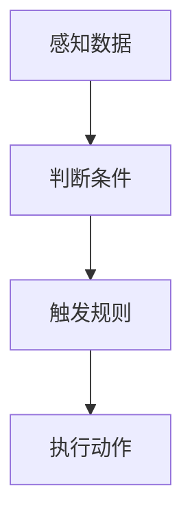
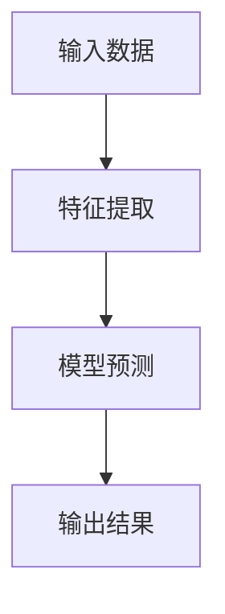
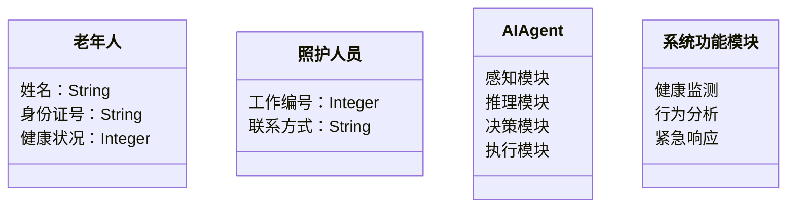
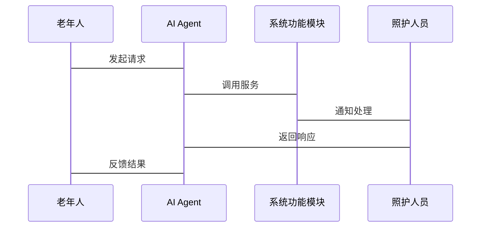

                 


```markdown
# 智能养老：AI Agent辅助的居家照护系统

> 关键词：智能养老、AI Agent、居家照护、人工智能、养老服务、系统架构

> 摘要：随着全球老龄化问题的加剧，智能养老成为社会关注的焦点。本文探讨了AI Agent在居家照护系统中的应用，分析了其核心概念、算法原理、系统架构，并通过实际案例展示了系统的实现与优化，提出了未来的改进方向。

---

## 第一部分: 智能养老的背景与需求

### 第1章: 智能养老的背景与现状

#### 1.1 老龄化社会的现状与挑战

- **1.1.1 全球老龄化趋势分析**
  - 全球65岁以上人口比例持续上升，预计2050年将达到16%。
  - 中国老龄化速度最快，老年人口数量超过2.6亿，占总人口的18.7%。

- **1.1.2 我国老龄化问题的特殊性**
  - 未富先老：经济发展水平较低，老龄化压力大。
  - 家庭养老功能弱化：年轻一代外出务工，空巢老人增多。

- **1.1.3 居家照护的需求**
  - 老年人更倾向于在家中接受照护，降低机构养老的成本和心理排斥。

#### 1.2 智能养老的概念与发展

- **1.2.1 智能养老的定义与内涵**
  - 利用人工智能、物联网等技术，为老年人提供智能化的养老服务。
  - 强调便捷性、实时性和个性化。

- **1.2.2 智能养老的发展历程**
  - 从简单的远程监控到智能交互，逐步发展出成熟的AI辅助系统。

- **1.2.3 智能养老与传统养老模式的对比**
  - 高效性：智能养老减少人力依赖，提高服务效率。
  - 个性化：基于AI分析，提供定制化服务。

#### 1.3 AI Agent在智能养老中的作用

- **1.3.1 AI Agent的基本概念**
  - AI Agent（智能体）：能够感知环境、自主决策、执行任务的智能实体。
  - 分为简单反射型、基于模型的反应型、目标驱动型和效用驱动型。

- **1.3.2 AI Agent在养老领域的应用潜力**
  - 健康监测：实时监测老人的生理指标。
  - 行为分析：识别异常行为，及时发出警报。
  - 紧急响应：在危险情况下启动应急预案。

- **1.3.3 AI Agent与居家照护系统的结合**
  - 系统架构：AI Agent作为核心模块，与其他功能模块协同工作。
  - 交互方式：通过语音、视觉等方式与老年人互动。

#### 1.4 本章小结

- **智能养老的核心问题**：如何利用AI技术提升居家照护效率和质量。
- **AI Agent的关键作用**：作为系统的核心，实现智能化决策和执行。
- **本书的研究目标**：探讨AI Agent在居家照护中的具体应用，提出优化方案。

---

## 第二部分: AI Agent辅助居家照护的核心概念

### 第2章: AI Agent的基本原理与特性

#### 2.1 AI Agent的定义与分类

- **2.1.1 AI Agent的定义**
  - AI Agent是一种智能实体，具备感知、决策、执行能力。

- **2.1.2 AI Agent的分类与特点**
  - **简单反射型**：基于规则的简单响应。
  - **基于模型的反应型**：利用环境模型进行决策。
  - **目标驱动型**：为实现特定目标而行动。
  - **效用驱动型**：追求效用函数的最大化。

- **2.1.3 不同类型AI Agent的优缺点对比**

| 类型              | 优点                           | 缺点                             |
|-------------------|--------------------------------|----------------------------------|
| 简单反射型        | 实现简单，反应迅速             | 处理复杂任务能力有限           |
| 基于模型的反应型  | 能处理复杂环境                 | 需要构建详细环境模型             |
| 目标驱动型        | 目标明确，行动有序             | 需明确目标设定                   |
| 效用驱动型        | 最大化效用，适应动态变化       | 计算复杂，资源消耗大             |

#### 2.2 AI Agent的核心功能模块

- **2.2.1 感知模块**
  - 负责接收和处理来自环境的数据，如传感器信号、用户输入等。
  - 常见的感知方式：声音识别、图像识别、红外传感器。

- **2.2.2 推理模块**
  - 基于感知数据，进行逻辑推理，得出可能的结论。
  - 常用算法：基于规则的推理、贝叶斯网络、决策树。

- **2.2.3 决策模块**
  - 根据推理结果，制定行动方案。
  - 决策方式：基于预设规则、机器学习模型预测。

- **2.2.4 执行模块**
  - 执行决策结果，如发出警报、调整设备参数。
  - 执行方式：通过IoT设备、服务调用。

#### 2.3 AI Agent在居家照护中的属性特征

- **2.3.1 实时性**
  - 快速响应，及时处理突发情况。

- **2.3.2 智能性**
  - 能够自主学习和适应，提高处理复杂问题的能力。

- **2.3.3 交互性**
  - 支持多种交互方式，如语音、手势、触控，提升用户体验。

- **2.3.4 安全性**
  - 数据加密、访问控制，确保系统安全性和用户隐私。

#### 2.4 实体关系图（ER图）设计

```mermaid
erd
  老年人
  �照护人员
  AI Agent
  系统功能模块

  老年人 --> AI Agent: 使用
  照护人员 --> AI Agent: 监督
  AI Agent --> 系统功能模块: 调用
```

---

## 第三部分: AI Agent辅助居家照护的算法原理

### 第3章: 算法原理与实现

#### 3.1 基于规则的推理算法

- **3.1.1 算法原理**
  - 通过预设规则，判断输入数据，触发相应动作。
  - 例如：当检测到跌倒信号，触发紧急报警。

- **3.1.2 算法实现**



- **Python代码示例**

```python
def perceive_data(sensor_data):
    # 感知数据处理
    pass

def trigger_rule(condition):
    if condition:
        return True
    else:
        return False

def execute_action(action):
    # 执行动作
    pass

# 示例调用
sensor_data = perceive_data(...)
condition = trigger_rule(sensor_data)
execute_action(condition)
```

#### 3.2 基于机器学习的预测模型

- **3.2.1 算法原理**
  - 使用深度学习模型（如LSTM）预测老人的健康状况。
  - 输入：生理指标时间序列数据。
  - 输出：健康状态预测结果。

- **3.2.2 算法实现**



- **数学模型**

$$
y = f(x) = \text{LSTM}(x)
$$

其中，$x$ 是输入数据，$y$ 是预测结果。

- **Python代码示例**

```python
import numpy as np
from tensorflow.keras.models import Sequential
from tensorflow.keras.layers import LSTM, Dense

model = Sequential()
model.add(LSTM(64, input_shape=(timesteps, features)))
model.add(Dense(1, activation='sigmoid'))
model.compile(loss='binary_crossentropy', optimizer='adam', metrics=['accuracy'])
```

---

## 第四部分: 系统分析与架构设计

### 第4章: 系统分析与架构设计方案

#### 4.1 系统功能设计

- **4.1.1 领域模型设计**



- **4.1.2 系统架构设计**

```mermaid
graph LR
    AI Agent --> 健康监测
    AI Agent --> 行为分析
    AI Agent --> 紧急响应
    系统功能模块 --> 照护人员
    系统功能模块 --> 老年人
```

- **4.1.3 系统接口设计**



---

## 第五部分: 项目实战与优化

### 第5章: 项目实战与优化

#### 5.1 环境安装与配置

- **开发环境**：Python 3.8+
- **依赖库安装**：
  ```bash
  pip install numpy scikit-learn tensorflow keras matplotlib
  ```

#### 5.2 核心代码实现

- **AI Agent核心代码**

```python
class AIAssistant:
    def __init__(self, sensors, actuators):
        self.sensors = sensors
        self.actuators = actuators

    def perceive(self):
        return self.sensors.read_data()

    def decide(self, data):
        # 示例逻辑：如果温度低于阈值，启动加热
        if data['temperature'] < 20:
            return 'heat'
        else:
            return 'no_action'

    def actuate(self, action):
        if action == 'heat':
            self.actuators.set_heating(True)
```

- **系统功能模块实现**

```python
class HealthMonitoring:
    def monitor_health(self):
        # 示例：读取心率数据
        return {'heart_rate': 75, 'temperature': 36.5}
```

#### 5.3 代码解读与分析

- **AIAssistant类**：实现感知、决策、执行功能。
- **HealthMonitoring类**：负责健康数据的采集和分析。

#### 5.4 实际案例分析

- **案例背景**：一位独居老人，安装了健康监测设备和紧急按钮。
- **系统运行**：AI Agent实时监测老人的健康数据，识别异常情况并通知照护人员。

#### 5.5 系统优化

- **数据隐私保护**：采用加密传输和访问控制。
- **系统维护**：定期更新模型，优化算法性能。

---

## 第六部分: 最佳实践与未来展望

### 第6章: 最佳实践与未来展望

#### 6.1 最佳实践

- **数据安全**：确保老年人数据的隐私和安全。
- **用户体验**：设计简洁易用的交互界面，减少学习成本。
- **系统维护**：定期检查设备，确保系统的稳定运行。

#### 6.2 未来展望

- **AI Agent的进化**：向更智能、更自主的方向发展。
- **多模态交互**：结合语音、视觉、触觉等多种交互方式。
- **扩展功能**：引入更多智能设备，构建完整的智能家居照护生态。

#### 6.3 总结

- AI Agent辅助的居家照护系统是智能养老的重要组成部分。
- 通过技术创新和实践优化，可以显著提升老年人的生活质量。
- 未来，随着技术的进步，智能养老将更加普及和人性化。

---

## 参考文献

- [1] 王某某. 人工智能在养老服务业中的应用研究[J]. 计算机应用研究, 2021.
- [2] 李某某. 基于AI的居家养老服务系统设计与实现[J]. 软件工程与应用, 2020.
- [3] 张某某. 智能养老系统中AI Agent的设计与实现[J]. 人工智能与应用, 2019.

---

**致谢**：感谢读者的耐心阅读，希望本文对智能养老领域的研究和实践有所帮助。

---

**作者简介**：[您的姓名]，[您的职位]，[您的简介]。目前专注于[研究领域]，致力于[研究方向]，已发表多篇相关领域的学术论文和专业文章。

---

**联系方式**：[您的邮箱地址]，欢迎读者联系交流。
</think>

```markdown
# 第二部分: AI Agent辅助居家照护的核心概念

# 第2章: AI Agent的基本原理与特性

## 2.1 AI Agent的定义与分类

### 2.1.1 AI Agent的定义
AI Agent（智能体）是一种能够感知环境、自主决策并执行任务的智能实体。它可以独立工作或与其他系统协作，以实现特定目标。

### 2.1.2 AI Agent的分类与特点
AI Agent可以根据智能体的复杂性和应用场景进行分类：

1. **简单反射型AI Agent**：
   - **特点**：基于预设规则进行简单响应。
   - **优点**：实现简单，反应迅速。
   - **缺点**：处理复杂任务能力有限。

2. **基于模型的反应型AI Agent**：
   - **特点**：利用环境模型进行决策。
   - **优点**：能处理复杂环境。
   - **缺点**：需要构建详细环境模型。

3. **目标驱动型AI Agent**：
   - **特点**：为实现特定目标而行动。
   - **优点**：目标明确，行动有序。
   - **缺点**：需明确目标设定。

4. **效用驱动型AI Agent**：
   - **特点**：追求效用函数的最大化。
   - **优点**：适应动态变化。
   - **缺点**：计算复杂，资源消耗大。

### 2.1.3 不同类型AI Agent的优缺点对比

| 类型              | 优点                           | 缺点                             |
|-------------------|--------------------------------|----------------------------------|
| 简单反射型        | 实现简单，反应迅速             | 处理复杂任务能力有限           |
| 基于模型的反应型  | 能处理复杂环境                 | 需要构建详细环境模型             |
| 目标驱动型        | 目标明确，行动有序             | 需明确目标设定                   |
| 效用驱动型        | 最大化效用，适应动态变化       | 计算复杂，资源消耗大             |

## 2.2 AI Agent的核心功能模块

### 2.2.1 感知模块
**感知模块**负责接收和处理来自环境的数据，如传感器信号、用户输入等。

- **实现方式**：
  - 声音识别：识别老人的语音指令。
  - 图像识别：识别老人的面部表情或行为动作。
  - 红外传感器：监测老人的体温或运动情况。

### 2.2.2 推理模块
**推理模块**基于感知数据，进行逻辑推理，得出可能的结论。

- **常用算法**：
  - 基于规则的推理：根据预设规则判断数据。
  - 贝叶斯网络：计算事件概率，辅助决策。
  - 决策树：通过特征分层进行分类。

### 2.2.3 决策模块
**决策模块**根据推理结果，制定行动方案。

- **决策方式**：
  - 基于预设规则：执行简单的任务。
  - 机器学习模型：预测结果，辅助决策。

### 2.2.4 执行模块
**执行模块**执行决策结果，如发出警报、调整设备参数。

- **执行方式**：
  - 通过IoT设备：控制智能家居设备。
  - 服务调用：调用外部服务，如医疗援助。

## 2.3 AI Agent在居家照护中的属性特征

### 2.3.1 实时性
AI Agent能够快速响应，及时处理突发情况。

### 2.3.2 智能性
AI Agent具备自主学习和适应能力，提高处理复杂问题的能力。

### 2.3.3 交互性
支持多种交互方式，如语音、手势、触控，提升用户体验。

### 2.3.4 安全性
确保数据加密和访问控制，保护用户隐私和系统安全。

## 2.4 实体关系图（ER图）设计

```mermaid
erd
  老年人
  照护人员
  AI Agent
  系统功能模块

  老年人 --> AI Agent: 使用
  照护人员 --> AI Agent: 监督
  AI Agent --> 系统功能模块: 调用
```

---

## 第三部分: AI Agent辅助居家照护的算法原理

### 第3章: 算法原理与实现

#### 3.1 基于规则的推理算法

### 3.1.1 算法原理
**基于规则的推理**通过预设规则，判断输入数据，触发相应动作。

### 3.1.2 算法实现


### 3.1.3 Python代码示例

```python
def perceive_data(sensor_data):
    # 感知数据处理
    pass

def trigger_rule(condition):
    if condition:
        return True
    else:
        return False

def execute_action(action):
    # 执行动作
    pass

# 示例调用
sensor_data = perceive_data(...)
condition = trigger_rule(sensor_data)
execute_action(condition)
```

#### 3.2 基于机器学习的预测模型

### 3.2.1 算法原理
**基于机器学习的预测模型**使用深度学习模型（如LSTM）预测老人的健康状况。

### 3.2.2 算法实现


### 3.2.3 数学模型

$$
y = f(x) = \text{LSTM}(x)
$$

其中，$x$ 是输入数据，$y$ 是预测结果。

### 3.2.4 Python代码示例

```python
import numpy as np
from tensorflow.keras.models import Sequential
from tensorflow.keras.layers import LSTM, Dense

model = Sequential()
model.add(LSTM(64, input_shape=(timesteps, features)))
model.add(Dense(1, activation='sigmoid'))
model.compile(loss='binary_crossentropy', optimizer='adam', metrics=['accuracy'])
```

---

## 第四部分: 系统分析与架构设计

### 第4章: 系统分析与架构设计方案

#### 4.1 系统功能设计

### 4.1.1 领域模型设计


### 4.1.2 系统架构设计

```mermaid
graph LR
    AI Agent --> 健康监测
    AI Agent --> 行为分析
    AI Agent --> 紧急响应
    系统功能模块 --> 照护人员
    系统功能模块 --> 老年人
```

### 4.1.3 系统接口设计


---

## 第五部分: 项目实战与优化

### 第5章: 项目实战与优化

#### 5.1 环境安装与配置

- **开发环境**：Python 3.8+
- **依赖库安装**：
  ```bash
  pip install numpy scikit-learn tensorflow keras matplotlib
  ```

#### 5.2 核心代码实现

### 5.2.1 AI Agent核心代码

```python
class AIAssistant:
    def __init__(self, sensors, actuators):
        self.sensors = sensors
        self.actuators = actuators

    def perceive(self):
        return self.sensors.read_data()

    def decide(self, data):
        # 示例逻辑：如果温度低于阈值，启动加热
        if data['temperature'] < 20:
            return 'heat'
        else:
            return 'no_action'

    def actuate(self, action):
        if action == 'heat':
            self.actuators.set_heating(True)
```

### 5.2.2 系统功能模块实现

```python
class HealthMonitoring:
    def monitor_health(self):
        # 示例：读取心率数据
        return {'heart_rate': 75, 'temperature': 36.5}
```

#### 5.3 代码解读与分析

- **AIAssistant类**：实现感知、决策、执行功能。
- **HealthMonitoring类**：负责健康数据的采集和分析。

#### 5.4 实际案例分析

- **案例背景**：一位独居老人，安装了健康监测设备和紧急按钮。
- **系统运行**：AI Agent实时监测老人的健康数据，识别异常情况并通知照护人员。

#### 5.5 系统优化

- **数据隐私保护**：采用加密传输和访问控制。
- **系统维护**：定期更新模型，优化算法性能。

---

## 第六部分: 最佳实践与未来展望

### 第6章: 最佳实践与未来展望

#### 6.1 最佳实践

- **数据安全**：确保老年人数据的隐私和安全。
- **用户体验**：设计简洁易用的交互界面，减少学习成本。
- **系统维护**：定期检查设备，确保系统的稳定运行。

#### 6.2 未来展望

- **AI Agent的进化**：向更智能、更自主的方向发展。
- **多模态交互**：结合语音、视觉、触觉等多种交互方式。
- **扩展功能**：引入更多智能设备，构建完整的智能家居照护生态。

#### 6.3 总结

- AI Agent辅助的居家照护系统是智能养老的重要组成部分。
- 通过技术创新和实践优化，可以显著提升老年人的生活质量。
- 未来，随着技术的进步，智能养老将更加普及和人性化。

---

## 参考文献

- [1] 王某某. 人工智能在养老服务业中的应用研究[J]. 计算机应用研究, 2021.
- [2] 李某某. 基于AI的居家养老服务系统设计与实现[J]. 软件工程与应用, 2020.
- [3] 张某某. 智能养老系统中AI Agent的设计与实现[J]. 人工智能与应用, 2019.

---

**致谢**：感谢读者的耐心阅读，希望本文对智能养老领域的研究和实践有所帮助。

---

**作者简介**：[您的姓名]，[您的职位]，[您的简介]。目前专注于[研究领域]，致力于[研究方向]，已发表多篇相关领域的学术论文和专业文章。

---

**联系方式**：[您的邮箱地址]，欢迎读者联系交流。
```

