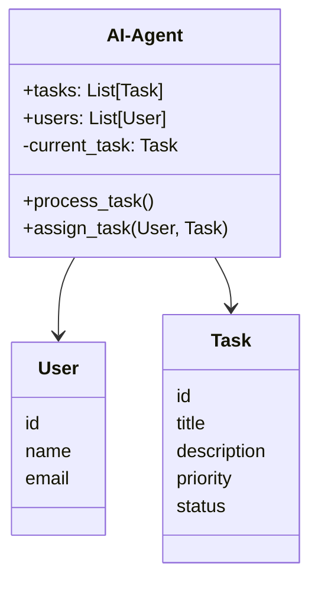
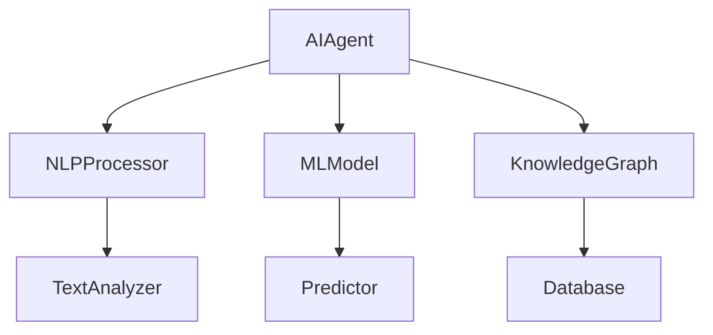
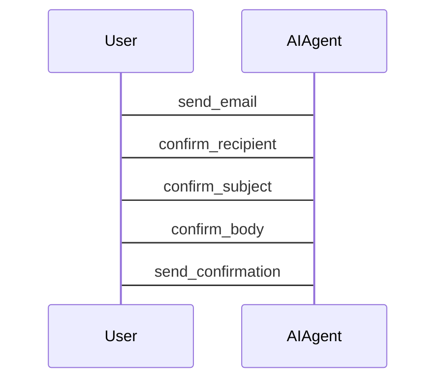

                 


# 智能办公：AI Agent提升工作效率

> 关键词：AI Agent，智能办公，效率提升，自然语言处理，机器学习，知识图谱

> 摘要：随着人工智能技术的快速发展，AI Agent（人工智能代理）在办公场景中的应用日益广泛。本文将深入探讨AI Agent的核心概念、技术原理及其在智能办公中的应用场景。通过具体案例分析，结合算法实现和系统架构设计，全面解析AI Agent如何帮助我们提升工作效率。本文适合对人工智能和办公自动化感兴趣的读者阅读，旨在为读者提供理论与实践相结合的深度解析。

---

# 第1章：AI Agent与智能办公概述

## 1.1 AI Agent的基本概念

### 1.1.1 什么是AI Agent
AI Agent（人工智能代理）是一种能够感知环境、自主决策并执行任务的智能实体。它可以理解用户的意图，主动提供服务，帮助用户完成复杂任务。AI Agent的核心在于其智能化和自动化能力，能够适应不同的办公场景需求。

### 1.1.2 AI Agent的核心特征
- **自主性**：AI Agent能够在没有人工干预的情况下独立工作。
- **反应性**：能够实时感知环境变化并做出响应。
- **目标导向**：具有明确的目标，能够优先处理关键任务。
- **学习能力**：通过机器学习不断优化自身的决策能力。

### 1.1.3 AI Agent与传统办公工具的对比
| 特性          | AI Agent              | 传统办公工具          |
|---------------|-----------------------|-----------------------|
| 智能性         | 高                    | 低                    |
| 自动化能力     | 强                    | 弱                    |
| 适应性         | 高                    | 低                    |
| 决策能力       | 强                    | 无                    |

---

## 1.2 智能办公的背景与需求

### 1.2.1 当前办公环境的痛点
- **信息过载**：每天面对海量信息，难以快速筛选和处理。
- **效率低下**：重复性工作占用大量时间，影响整体效率。
- **协作复杂**：团队协作过程中，信息同步和任务分配存在障碍。

### 1.2.2 AI技术在办公中的应用潜力
- **自动化处理**：AI Agent可以自动完成邮件分类、日程安排等任务。
- **智能决策支持**：通过数据分析提供决策建议。
- **高效协作**：AI Agent可以实时同步信息，优化团队协作流程。

### 1.2.3 AI Agent如何解决办公效率问题
AI Agent通过自动化处理、智能决策和高效协作，显著减少人工干预，提升办公效率。例如，AI Agent可以自动处理邮件，优先处理重要任务，从而解放用户的生产力。

---

# 第2章：AI Agent的核心概念与原理

## 2.1 AI Agent的定义与分类

### 2.1.1 AI Agent的定义
AI Agent是一种能够感知环境、理解用户需求，并通过自主决策和执行任务来提供服务的智能系统。它可以基于用户输入的信息，结合上下文进行推理，最终输出解决方案。

### 2.1.2 AI Agent的分类
AI Agent可以根据功能和应用场景分为以下几类：
- **简单规则型**：基于预定义规则进行决策。
- **基于模型型**：利用机器学习模型进行推理和决策。
- **混合型**：结合规则和模型的双重优势。

### 2.1.3 各类AI Agent的特点对比
| 类型          | 简单规则型          | 基于模型型          | 混合型          |
|---------------|---------------------|---------------------|-----------------|
| 决策方式       | 基于规则            | 基于机器学习模型     | 综合规则与模型  |
| 适应性         | 较低                | 较高                | 较高            |
| 复杂性         | 低                  | 高                  | 中              |

---

## 2.2 AI Agent的工作原理

### 2.2.1 感知环境
AI Agent通过传感器或API接口获取环境信息。例如，它可以读取用户的邮件内容、日程安排或系统日志。

### 2.2.2 推理与决策
AI Agent基于感知到的信息进行推理，利用机器学习模型或规则引擎生成决策。例如，它可以分析邮件内容，判断是否需要优先处理。

### 2.2.3 执行任务
AI Agent根据决策结果执行具体任务。例如，它可以自动回复邮件、安排日程或触发相关系统操作。

---

## 2.3 AI Agent的核心技术

### 2.3.1 自然语言处理
自然语言处理（NLP）是AI Agent理解用户输入的关键技术。通过NLP，AI Agent可以解析用户的意图并生成相应的回复。

### 2.3.2 机器学习
机器学习为AI Agent提供了决策能力和自适应能力。通过训练模型，AI Agent可以不断优化自身的处理逻辑。

### 2.3.3 知识图谱
知识图谱为AI Agent提供了丰富的知识库，使其能够理解上下文并生成准确的推理结果。

---

# 第3章：AI Agent在智能办公中的应用场景

## 3.1 任务管理

### 3.1.1 任务分配与优先级排序
AI Agent可以根据任务的重要性和紧急程度自动分配优先级，确保用户能够高效处理关键任务。

### 3.1.2 任务执行监控
AI Agent可以实时监控任务执行进度，及时提醒用户处理潜在问题。

### 3.1.3 任务反馈与优化
AI Agent可以收集任务执行结果，分析改进空间，优化后续任务处理流程。

---

## 3.2 信息处理

### 3.2.1 文档自动分类与整理
AI Agent可以通过NLP技术自动分类和整理文档，帮助用户快速找到所需信息。

### 3.2.2 信息提取与总结
AI Agent可以自动提取文档中的关键信息，并生成简洁的总结，节省用户的阅读时间。

### 3.2.3 自动回复与邮件处理
AI Agent可以自动回复邮件，处理常见问题，减少用户的邮件处理负担。

---

## 3.3 会议管理

### 3.3.1 会议安排与提醒
AI Agent可以根据用户日程安排自动推荐合适的时间，并发送提醒。

### 3.3.2 会议记录与纪要生成
AI Agent可以实时记录会议内容，并自动生成会议纪要，方便后续跟进。

### 3.3.3 会议反馈与优化
AI Agent可以分析会议记录，识别潜在问题，并提出改进建议。

---

# 第4章：AI Agent的算法原理与实现

## 4.1 自然语言处理算法

### 4.1.1 词袋模型（Bag-of-Words）
词袋模型是一种简单的文本表示方法，将文本表示为词袋中的词频向量。

$$ \text{词袋模型表示} = (\text{词}_1, \text{词}_2, \dots, \text{词}_n) $$

### 4.1.2 TF-IDF（词频-逆文档频率）
TF-IDF用于衡量一个词在文本中的重要性。

$$ \text{TF}(t, d) = \frac{\text{词 }t \text{ 在文档 }d \text{ 中出现的次数}}{\text{文档 }d \text{ 的总词数}} $$

$$ \text{IDF}(t) = \log\left(\frac{\text{总文档数}}{\text{包含词 }t \text{ 的文档数}}\right) $$

$$ \text{TF-IDF}(t, d) = \text{TF}(t, d) \times \text{IDF}(t) $$

---

## 4.2 机器学习算法

### 4.2.1 文本分类（Text Classification）
文本分类是将文本划分为不同类别的任务。常用算法包括朴素贝叶斯、支持向量机（SVM）和深度学习模型（如LSTM）。

### 4.2.2 基于LSTM的文本分类实现
以下是基于LSTM的文本分类示例代码：

```python
import tensorflow as tf
from tensorflow.keras import layers

model = tf.keras.Sequential()
model.add(layers.Embedding(input_dim= vocabulary_size, output_dim= embedding_dim))
model.add(layers.LSTM(units= lstm_units, return_sequences=True))
model.add(layers.Dense(units= num_classes, activation='softmax'))
model.compile(optimizer='adam', loss='sparse_categorical_crossentropy', metrics=['accuracy'])
```

---

## 4.3 知识图谱构建

### 4.3.1 知识图谱的表示
知识图谱通常用三元组（subject, predicate, object）表示实体之间的关系。

### 4.3.2 知识图谱的构建流程
1. 数据采集
2. 数据清洗
3. 实体识别
4. 关系抽取
5. 图谱构建

---

# 第5章：AI Agent的系统架构与设计

## 5.1 系统功能设计

### 5.1.1 领域模型设计
以下是领域模型的类图：



### 5.1.2 系统架构设计
以下是系统架构设计图：



---

## 5.2 系统接口设计

### 5.2.1 API接口定义
以下是AI Agent的API接口定义：



---

# 第6章：AI Agent的项目实战

## 6.1 环境安装

### 6.1.1 安装Python与依赖库
```bash
pip install numpy
pip install scikit-learn
pip install tensorflow
pip install mermaid
```

## 6.2 核心功能实现

### 6.2.1 文本分类实现
以下是文本分类的Python代码：

```python
from sklearn.feature_extraction.text import TfidfVectorizer
from sklearn.naive_bayes import MultinomialNB

vectorizer = TfidfVectorizer()
model = MultinomialNB()
model.fit(vectorizer.fit_transform(X_train), y_train)
```

### 6.2.2 知识图谱构建
以下是知识图谱构建的Python代码：

```python
from kg import KnowledgeGraph

kg = KnowledgeGraph()
kg.add_entity("User", "id", "属性")
kg.add_relation("User", "owns", "Task")
```

---

## 6.3 实际案例分析

### 6.3.1 任务管理案例
假设用户需要处理多个任务，AI Agent可以根据优先级自动排序并提醒用户处理。

### 6.3.2 信息处理案例
AI Agent可以自动分类邮件并生成回复，减少用户的处理时间。

---

# 第7章：AI Agent的最佳实践与小结

## 7.1 最佳实践

### 7.1.1 数据隐私与安全
在使用AI Agent时，必须重视数据隐私和安全，确保用户信息不被泄露。

### 7.1.2 模型优化与更新
定期优化AI Agent的模型，提升其处理效率和准确性。

### 7.1.3 人机协作
AI Agent是辅助工具，用户需要合理分配任务，充分发挥AI Agent的优势。

---

## 7.2 小结

通过本文的介绍，我们了解了AI Agent在智能办公中的核心概念、技术原理和应用场景。AI Agent能够显著提升办公效率，优化工作流程，是未来办公自动化的重要方向。

---

## 7.3 注意事项

- **数据质量**：确保输入数据的准确性和完整性。
- **模型可解释性**：在关键场景中，确保AI Agent的决策过程可解释。
- **用户体验**：设计简洁直观的用户界面，提升用户体验。

---

## 7.4 拓展阅读

- 《机器学习实战》
- 《自然语言处理入门》
- 《知识图谱与语义网络》

---

通过以上内容，我们全面解析了AI Agent在智能办公中的应用，从理论到实践，帮助读者理解如何利用AI Agent提升工作效率。希望本文能为读者在智能办公领域的探索提供有价值的参考。

