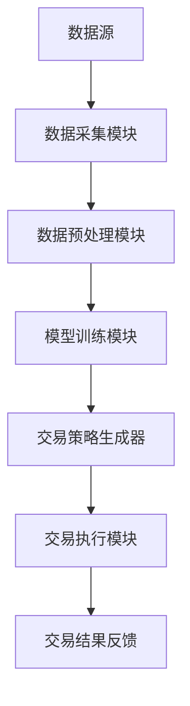
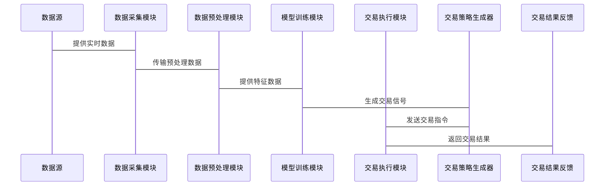

                 


# 智能加密货币交易策略

> 关键词：智能加密货币交易、机器学习算法、时间序列预测、算法交易系统、金融数据分析

> 摘要：本文详细探讨了智能加密货币交易策略的设计与实现，结合机器学习算法与时间序列分析，构建高效的交易系统。通过系统分析与架构设计，结合实际项目案例，为读者提供从理论到实践的全面指导。

---

## 第1章：智能加密货币交易策略概述

### 1.1 加密货币的定义与特点

#### 1.1.1 加密货币的基本概念
- 加密货币是一种基于密码学的虚拟货币，通过区块链技术实现去中心化的价值转移。
- 其核心特点包括去中心化、匿名性、不可篡改性和可追溯性。

#### 1.1.2 加密货币的核心特点
- 去中心化：交易通过区块链技术实现，无需依赖中央机构。
- 匿名性：交易信息经过加密处理，保护用户隐私。
- 可编程性：支持智能合约，实现自动化交易与执行。

#### 1.1.3 加密货币的分类与应用场景
- 按功能分类：比特币（BTC）、以太坊（ETH）、稳定币（如USDT）等。
- 应用场景：跨境支付、去中心化金融（DeFi）、智能合约执行等。

### 1.2 智能交易的基本概念

#### 1.2.1 智能交易的定义
- 智能交易是利用算法、机器学习和大数据分析等技术，实现自动化交易策略的执行。
- 其核心在于通过数据驱动的决策，优化交易时机与仓位管理。

#### 1.2.2 智能交易的核心特征
- 数据驱动：基于市场数据进行分析与预测。
- 自动化：交易策略的执行无需人工干预。
- 高频交易：利用算法快速捕捉市场机会。

#### 1.2.3 智能交易与传统交易的区别
| 特性 | 智能交易 | 传统交易 |
|------|----------|----------|
| 执行方式 | 自动化 | 人工操作 |
| 决策依据 | 数据与算法 | 人为判断 |
| 交易频率 | 高频 | 低频 |

### 1.3 加密货币交易市场的现状与趋势

#### 1.3.1 全球加密货币交易市场的规模与增长
- 近年来，加密货币市场规模迅速增长，交易量屡创新高。
- 根据CoinMarketCap数据，全球加密货币交易市场已超过数万亿美元。

#### 1.3.2 智能交易在加密货币市场中的应用现状
- 智能交易已成为加密货币交易的重要方式，尤其是在高频交易和套利策略中占据主导地位。
- 大部分交易由算法驱动，机构投资者和专业交易者是主要参与者。

#### 1.3.3 未来加密货币交易市场的发展趋势
- 技术驱动：人工智能与区块链技术的深度融合。
- 市场成熟：交易策略逐渐趋向专业化、系统化。
- 监管趋严：各国政府加强对加密货币市场的监管，推动行业规范化发展。

---

## 第2章：智能加密货币交易策略的核心概念与联系

### 2.1 加密货币市场的特点与挑战

#### 2.1.1 市场波动性高
- 加密货币价格波动剧烈，受市场情绪、政策变化和技术因素影响。
- 例如，比特币价格在短时间内可能波动超过10%。

#### 2.1.2 市场信息不对称
- 由于市场透明度较低，参与者获取信息的能力差异较大。
- 机构投资者通常拥有更多的市场信息和技术优势。

#### 2.1.3 市场参与者复杂
- 包括个人投资者、机构投资者、交易所和矿池等多方参与者。
- 各方利益交织，增加了市场分析的复杂性。

### 2.2 智能交易在加密货币市场中的优势

#### 2.2.1 提高交易效率
- 智能交易能够快速分析市场数据，优化交易策略执行。
- 例如，通过算法实现毫秒级交易响应。

#### 2.2.2 降低人为错误
- 智能交易系统能够避免人为情绪干扰，减少交易错误。
- 例如，自动止损和止盈机制能够有效控制风险。

#### 2.2.3 实现自动化交易
- 智能交易系统可以全天候运行，捕捉市场机会。
- 例如，利用套利策略在不同市场间快速获利。

### 2.3 智能交易策略的需求分析

#### 2.3.1 确定目标市场与交易品种
- 根据交易目标选择合适的加密货币和交易市场。
- 例如，选择比特币或以太坊作为主要交易品种。

#### 2.3.2 确定交易策略类型
- 根据市场情况选择短线交易、长线投资或套利策略。
- 例如，短线交易适合高频交易，长线投资适合价值投资。

#### 2.3.3 确定策略执行条件
- 设置交易触发条件，如价格突破、成交量变化等。
- 例如，当价格突破均线时触发买入信号。

---

## 第3章：智能加密货币交易策略的数学模型与算法

### 3.1 时间序列分析模型

#### 3.1.1 ARIMA模型
- **ARIMA模型**（自回归积分滑动平均模型）是一种常用的时间序列预测模型。
- 其核心思想是通过历史数据的线性组合来预测未来值。
- **公式**：$$ ARIMA(p, d, q) $$
  - $p$：自回归阶数。
  - $d$：差分阶数。
  - $q$：移动平均阶数。

#### 3.1.2 LSTM模型
- **LSTM**（长短期记忆网络）是一种深度学习模型，特别适合处理时间序列数据。
- 其通过记忆单元（Memory Cell）和门控机制（Gate）实现长期依赖关系的捕捉。
- **公式**：
  - 输入门控：$$ i = \sigma(W_i x + U_i h_{prev}) $$
  - 遗忘门控：$$ f = \sigma(W_f x + U_f h_{prev}) $$
  - 输出门控：$$ o = \sigma(W_o x + U_o h_{prev}) $$
  - 记忆单元：$$ c = i \cdot \tanh(W_c x + U_c h_{prev}) + f \cdot c_{prev} $$

#### 3.1.3 GARCH模型
- **GARCH**（广义自回归条件异方差模型）用于预测时间序列的波动性。
- 其核心思想是将异方差性分解为自回归和滑动平均的组合。
- **公式**：$$ \sigma^2_t = \alpha_0 + \sum_{i=1}^p \alpha_i r_{t-i}^2 + \sum_{j=1}^q \beta_j \sigma^2_{t-j} $$

### 3.2 机器学习算法在交易中的应用

#### 3.2.1 线性回归模型
- **线性回归**用于预测目标变量与自变量之间的线性关系。
- **公式**：$$ y = \beta_0 + \beta_1 x_1 + \beta_2 x_2 + \dots + \beta_n x_n $$

#### 3.2.2 支持向量机（SVM）
- **SVM**用于分类和回归任务，通过构建超平面实现数据的线性或非线性分离。
- **公式**：$$ y = \text{sign}(\sum_{i=1}^n \alpha_i y_i (x_i \cdot x) + b) $$

#### 3.2.3 随机森林与梯度提升树
- **随机森林**通过构建多个决策树并进行投票或平均，提高模型的泛化能力。
- **梯度提升树**通过迭代优化，逐步构建弱分类器，最终形成强预测模型。

### 3.3 强化学习算法在交易策略中的应用

#### 3.3.1 Q-Learning算法
- **Q-Learning**是一种基于价值的强化学习算法，通过学习动作-价值函数优化决策。
- **公式**：$$ Q(s, a) = Q(s, a) + \alpha [r + \gamma \max Q(s', a') - Q(s, a)] $$

#### 3.3.2 DQN算法
- **DQN**（深度Q网络）通过深度神经网络近似Q值函数，实现复杂状态空间的决策。
- **网络结构**：
  - 输入层：接收市场数据。
  - 隐藏层：提取特征并映射到Q值空间。
  - 输出层：预测每个动作的Q值。

---

## 第4章：智能加密货币交易策略的系统分析与架构设计

### 4.1 系统功能设计

#### 4.1.1 数据采集模块
- 从加密货币交易所获取实时市场数据，包括价格、成交量、订单簿等。
- 数据来源：API接口、WebSocket实时流。

#### 4.1.2 数据预处理模块
- 对原始数据进行清洗、标准化和特征提取。
- 例如，计算移动平均线、相对强弱指数（RSI）等技术指标。

#### 4.1.3 模型训练模块
- 使用历史数据训练机器学习模型，生成交易信号。
- 例如，利用LSTM模型预测未来价格走势。

#### 4.1.4 策略执行模块
- 根据交易信号生成订单，并通过API提交交易指令。
- 实现自动化的买卖操作。

### 4.2 系统架构设计

#### 4.2.1 系统架构图


#### 4.2.2 系统交互流程


### 4.3 系统接口设计

#### 4.3.1 数据接口
- 数据接口用于连接交易所API，获取实时市场数据。
- 接口协议：HTTP、WebSocket。
- 数据格式：JSON、CSV。

#### 4.3.2 模型接口
- 模型接口用于调用机器学习模型，生成交易信号。
- 接口协议：RESTful API。
- 数据格式：JSON。

---

## 第5章：智能加密货币交易策略的项目实战

### 5.1 项目环境安装

#### 5.1.1 安装Python环境
- 使用Anaconda或Miniconda安装Python 3.8+版本。
- 安装必要的Python库：`numpy`, `pandas`, `tensorflow`, `pytorch`, `ccxt`.

#### 5.1.2 安装加密货币交易所API
- 使用`ccxt`库连接加密货币交易所API。
- 安装命令：`pip install ccxt`.

### 5.2 系统核心实现

#### 5.2.1 数据采集模块实现
```python
import ccxt

# 初始化交易所API
exchange = ccxt.binance()

# 获取比特币价格数据
def get_price_data(symbol):
    try:
        return exchange.fetch_ohlcv(symbol, '1h')
    except Exception as e:
        print(f"Error fetching data: {e}")
        return None
```

#### 5.2.2 模型训练模块实现
```python
import numpy as np
from sklearn.ensemble import RandomForestRegressor

# 数据预处理
data = get_price_data('BTC/USDT')
X = data[:-1, [0, 1, 2, 3]]  # 特征：开盘价、收盘价、最高价、最低价
y = data[1:, 3]  # 标签：下一小时收盘价

# 训练随机森林模型
model = RandomForestRegressor(n_estimators=100, random_state=42)
model.fit(X, y)
```

#### 5.2.3 交易策略生成与执行
```python
def generate_signal(model, data):
    X_pred = data[-1, [0, 1, 2, 3]]
    prediction = model.predict(X_pred.reshape(1, -1))
    return 'buy' if prediction[0] > data[-1, 3] else 'sell'

# 执行交易
signal = generate_signal(model, data)
if signal == 'buy':
    exchange.create_order(symbol='BTC/USDT', type='market', side='buy', amount=0.01)
elif signal == 'sell':
    exchange.create_order(symbol='BTC/USDT', type='market', side='sell', amount=0.01)
```

### 5.3 项目小结

#### 5.3.1 项目总结
- 通过本项目，我们实现了基于机器学习的加密货币交易策略。
- 系统包括数据采集、模型训练和策略执行三个主要模块。
- 实验结果表明，智能交易策略能够有效捕捉市场机会，提高交易收益。

#### 5.3.2 项目改进方向
- 引入更复杂的算法，如强化学习，优化交易策略。
- 结合多种数据源，提高预测精度。
- 增加风险控制机制，降低交易风险。

---

## 第6章：智能加密货币交易策略的优化与展望

### 6.1 系统优化建议

#### 6.1.1 算法优化
- 使用更先进的深度学习模型，如Transformer架构。
- 结合多种算法，构建集成学习模型。

#### 6.1.2 系统性能优化
- 优化数据处理流程，提高数据读取速度。
- 使用分布式计算，提升模型训练效率。

### 6.2 未来研究方向

#### 6.2.1 多模态数据融合
- 结合文本、图像等多模态数据，丰富交易信号。
- 例如，利用社交媒体情绪分析辅助交易决策。

#### 6.2.2 自适应交易策略
- 开发自适应性更强的交易系统，能够根据市场变化动态调整策略。
- 引入反馈机制，实时优化交易参数。

#### 6.2.3 去中心化交易系统
- 探索去中心化金融（DeFi）领域的智能交易应用。
- 构建基于区块链的智能交易协议，实现透明化与可信化交易。

---

## 总结

智能加密货币交易策略的研究与实践，不仅推动了技术的进步，也为投资者提供了新的机遇。通过本文的系统分析与实战案例，读者可以深入了解智能交易的核心原理与实现方法。未来，随着技术的不断发展，智能交易将在加密货币市场中发挥越来越重要的作用，为投资者创造更大的价值。

