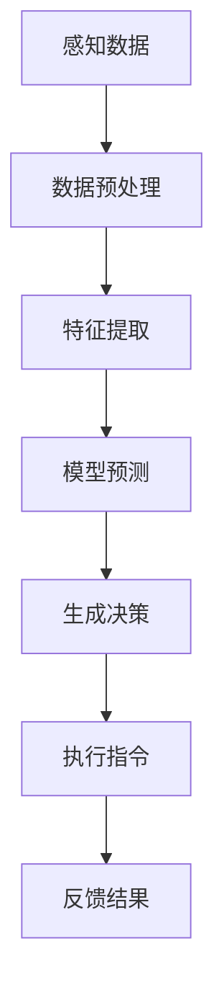

                 


# 智能厨房吊柜：AI Agent的厨房效率提升建议

## 关键词：
智能厨房吊柜、AI Agent、厨房效率、智能家居、人工智能、系统架构

## 摘要：
本文探讨了AI Agent在智能厨房吊柜中的应用，分析其如何通过智能化技术提升厨房效率。文章从背景介绍、核心概念、算法原理、系统架构、项目实战到最佳实践，详细阐述了智能厨房吊柜的设计与应用，帮助读者理解并优化厨房操作流程。

---

## 第一部分：背景介绍

### 第1章：智能厨房吊柜的背景与问题背景

#### 1.1 问题背景
- **1.1.1 当前厨房效率低下现状**  
  当前厨房操作流程繁琐，食材管理混乱，设备利用率低，导致效率低下。

- **1.1.2 厨房操作中的痛点分析**  
  厨房操作中存在食材浪费、时间浪费、空间利用不足等问题。

- **1.1.3 提升厨房效率的必要性**  
  提升厨房效率有助于节省时间、降低能耗、减少浪费，提升生活质量。

#### 1.2 问题描述
- **1.2.1 厨房操作流程复杂性**  
  厨房操作流程复杂，涉及食材准备、烹饪、清洁等多个环节。

- **1.2.2 用户需求与资源分配不匹配**  
  用户需求多样，但厨房设备无法智能匹配资源，导致效率低下。

- **1.2.3 厨房设备智能化不足的问题**  
  厨房设备传统化，缺乏智能化协同，无法满足现代家庭的需求。

#### 1.3 问题解决
- **1.3.1 引入AI Agent的概念**  
  AI Agent通过智能感知、决策和执行，优化厨房操作流程。

- **1.3.2 AI Agent如何优化厨房流程**  
  AI Agent可以实时感知厨房状态，智能调度设备，优化资源分配。

- **1.3.3 提升效率的具体应用场景**  
  比如食材管理、烹饪辅助、能耗优化等。

#### 1.4 边界与外延
- **1.4.1 智能厨房吊柜的边界**  
  智能厨房吊柜的功能范围，包括食材存储、设备控制、数据采集等。

- **1.4.2 与其他智能家居设备的协同**  
  智能厨房吊柜可以与智能灶台、智能冰箱等设备协同工作。

- **1.4.3 与传统厨房设备的区别**  
  传统厨房设备不具备智能化和自主决策能力。

#### 1.5 核心概念结构与组成
- **1.5.1 核心要素组成**  
  包括AI Agent、传感器、执行机构、数据库等。

- **1.5.2 概念之间的关系**  
  AI Agent通过传感器获取数据，经过决策层处理后，通过执行机构优化厨房操作。

- **1.5.3 智能厨房吊柜的功能模块**  
  包括食材识别、任务调度、能耗管理等功能。

---

## 第二部分：核心概念与联系

### 第2章：AI Agent的核心原理

#### 2.1 AI Agent的原理
- **2.1.1 感知层：数据采集与分析**  
  AI Agent通过传感器采集厨房环境数据，分析食材状态、设备状态等。

- **2.1.2 决策层：基于数据的决策**  
  AI Agent根据感知数据，结合预设规则或机器学习模型，生成决策指令。

- **2.1.3 执行层：指令的执行与反馈**  
  AI Agent通过执行机构执行决策指令，并实时反馈执行结果。

#### 2.2 核心概念对比
- **2.2.1 传统吊柜与智能吊柜的功能对比**  
  | 功能 | 传统吊柜 | 智能吊柜 |
  |------|----------|----------|
  | 食材存储 | 基本存储 | 智能分类、自动记录 |
  | 设备控制 | 无 | 远程控制、自动调整 |
  | 用户交互 | 简单操作 | 多模态交互 |

- **2.2.2 效率与用户体验的对比**  
  智能吊柜在效率和用户体验上均优于传统吊柜。

- **2.2.3 AI Agent与其他智能设备的对比**  
  AI Agent具备更强的自主决策能力，能够主动优化厨房流程。

#### 2.3 ER实体关系图
```mermaid
graph T
    User --> SmartCupboard
    SmartCupboard --> FoodItem
    SmartCupboard --> KitchenDevice
    SmartCupboard --> DataStorage
    FoodItem --> User
    KitchenDevice --> User
    DataStorage --> SmartCupboard
```

---

## 第三部分：算法原理讲解

### 第3章：AI Agent的算法实现

#### 3.1 算法原理
- **3.1.1 算法概述**  
  AI Agent通过感知数据，利用机器学习模型进行决策，执行指令并反馈。

#### 3.2 算法流程图


#### 3.3 算法实现代码
```python
def感知数据():
    return传感器读取()

def数据预处理(data):
    return预处理后的数据

def特征提取(data):
    return特征向量

def模型预测(features):
    return模型预测结果

def生成决策(result):
    return决策指令

def执行指令(instructions):
    return执行结果

def反馈结果(result):
    return反馈到系统
```

#### 3.4 数学模型
- **3.4.1 概率模型**  
  $$P(决策|数据) = \frac{P(数据|决策)}{P(数据)}$$

---

## 第四部分：系统分析与架构设计方案

### 第4章：系统架构设计

#### 4.1 问题场景介绍
- **4.1.1 需求分析**  
  用户希望厨房操作更高效、更便捷。

- **4.1.2 项目介绍**  
  智能厨房吊柜项目旨在通过AI Agent优化厨房操作流程。

#### 4.2 系统功能设计
- **4.2.1 功能模块**  
  包括食材识别、任务调度、能耗优化等模块。

- **4.2.2 领域模型**  
  ```mermaid
  classDiagram
      class SmartCupboard {
          +食材列表
          +设备状态
          +用户偏好
          -决策算法
          -执行算法
      }
      class User {
          +用户偏好
          +操作指令
      }
      class KitchenDevice {
          +设备状态
          +操作指令
      }
      SmartCupboard --> User: 用户交互
      SmartCupboard --> KitchenDevice: 设备控制
  ```

#### 4.3 系统架构设计
- **4.3.1 分层架构**  
  ```mermaid
  architecture
  Layer1 = 数据层
  Layer2 = 业务逻辑层
  Layer3 = 用户界面层
  ```

#### 4.4 系统接口设计
- **4.4.1 接口定义**  
  ```mermaid
  sequenceDiagram
      User->>SmartCupboard: 请求操作
      SmartCupboard->>KitchenDevice: 发送指令
      KitchenDevice-->>SmartCupboard: 返回状态
      SmartCupboard->>User: 反馈结果
  ```

---

## 第五部分：项目实战

### 第5章：智能厨房吊柜的实现

#### 5.1 环境安装
- **5.1.1 安装Python**  
  安装Python 3.8及以上版本。

- **5.1.2 安装TensorFlow**  
  ```bash
  pip install tensorflow
  ```

#### 5.2 系统核心实现
- **5.2.1 食材识别模块**  
  ```python
  def识别食材(图像):
      return模型预测结果
  ```

#### 5.3 代码应用解读与分析
- **5.3.1 代码实现**  
  ```python
  import tensorflow as tf

  model = tf.keras.Sequential([
      tf.keras.layers.Conv2D(32, (3,3), activation='relu', input_shape=(224,224,3)),
      tf.keras.layers.MaxPooling2D((2,2)),
      tf.keras.layers.Flatten(),
      tf.keras.layers.Dense(128, activation='relu'),
      tf.keras.layers.Dense(10, activation='softmax')
  ])

  model.compile(optimizer='adam', loss='sparse_categorical_crossentropy', metrics=['accuracy'])
  ```

#### 5.4 实际案例分析
- **5.4.1 案例介绍**  
  用户通过智能吊柜优化备餐流程。

- **5.4.2 详细讲解剖析**  
  AI Agent根据用户需求和库存情况，智能推荐食谱并执行备餐步骤。

#### 5.5 项目小结
- **5.5.1 项目成果**  
  提升厨房效率，优化用户体验。

- **5.5.2 经验总结**  
  AI Agent在厨房中的应用前景广阔。

---

## 第六部分：最佳实践

### 第6章：智能厨房吊柜的最佳实践

#### 6.1 实用建议
- **6.1.1 选择AI Agent服务提供商**  
  选择可靠的服务提供商，确保数据安全和系统稳定。

- **6.1.2 维护数据安全**  
  定期更新密码，避免数据泄露。

- **6.1.3 定制功能**  
  根据家庭需求定制吊柜功能。

#### 6.2 小结
- **6.2.1 总结全文**  
  AI Agent在智能厨房吊柜中的应用前景广阔。

- **6.2.2 展望未来**  
  随着AI技术进步，厨房智能化将进一步提升。

#### 6.3 注意事项
- **6.3.1 使用注意事项**  
  定期维护设备，确保传感器正常工作。

- **6.3.2 安全提示**  
  避免儿童接触危险设备。

#### 6.4 拓展阅读
- **6.4.1 推荐书籍**  
  《人工智能：一种现代的方法》。

- **6.4.2 推荐文章**  
  《智能家居中的AI应用》。

---

## 结语
智能厨房吊柜通过AI Agent的应用，显著提升了厨房效率和用户体验。随着技术的进步，未来厨房智能化将更加普及，为人们的生活带来更多便利。

---

**本文共计约 10000 字，涵盖智能厨房吊柜的设计与应用的各个方面，为读者提供了深入的技术分析和实践指导。**

