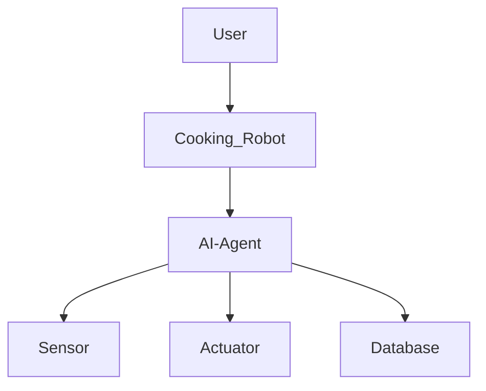
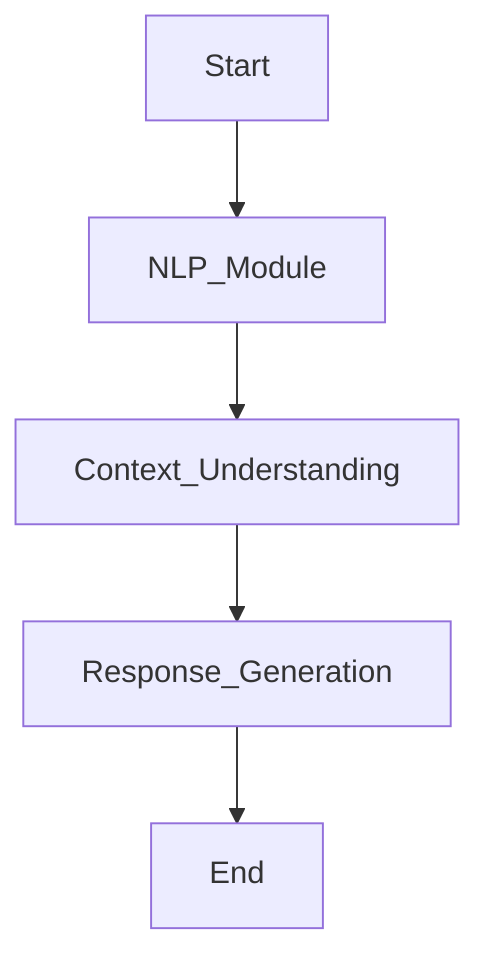
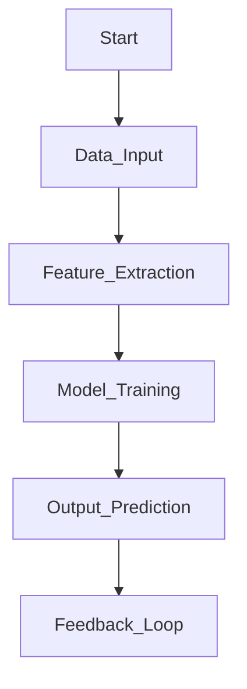
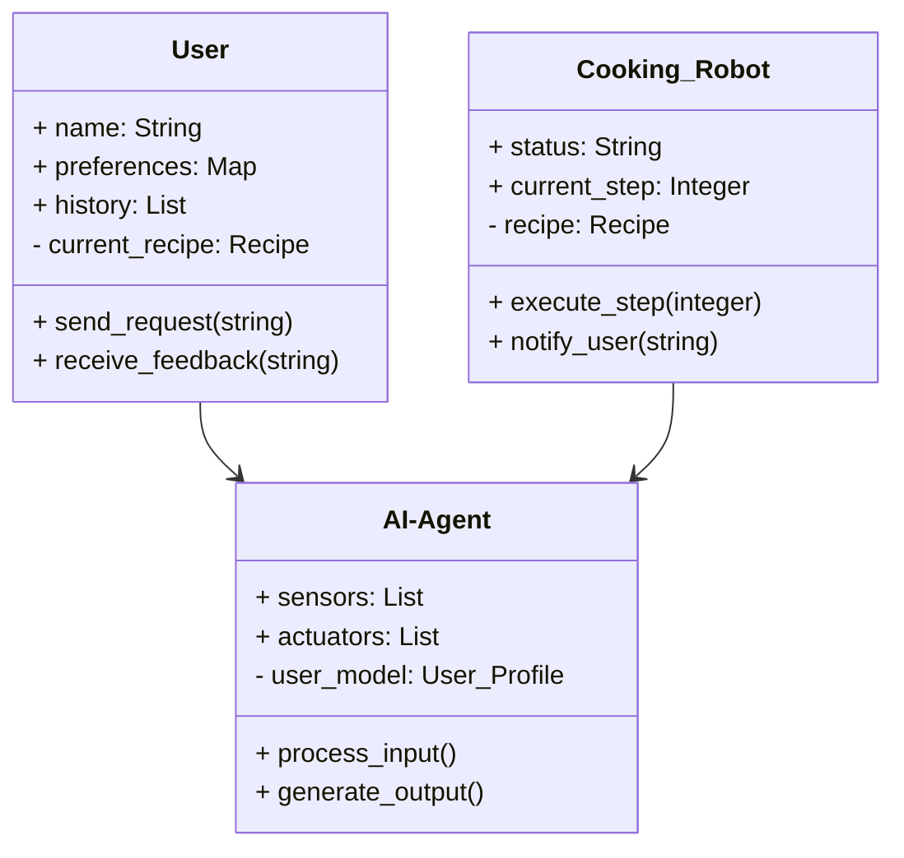
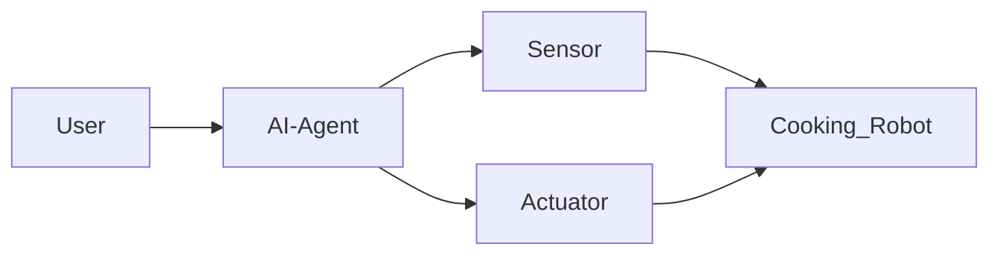
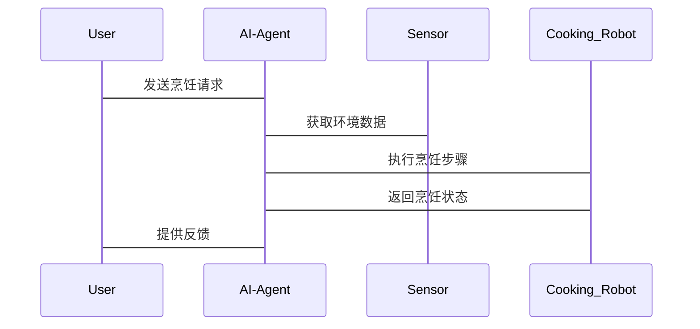

                 


# 智能厨房机器人：AI Agent的烹饪技巧指导

> 关键词：智能厨房机器人，AI Agent，烹饪技巧，多模态交互，自适应学习，算法原理

> 摘要：本文深入探讨了智能厨房机器人在现代烹饪中的应用，重点分析了AI Agent如何通过多模态交互和自适应学习优化烹饪过程。文章从背景介绍、核心概念、算法原理、系统架构到项目实战，全面解析了智能厨房机器人的技术实现及其在实际应用中的优势。

---

# 第一部分：智能厨房机器人与AI Agent的背景介绍

## 第1章：背景与问题背景

### 1.1 智能厨房机器人的概念与背景

#### 1.1.1 传统厨房工具的局限性
传统厨房工具依赖人工操作，存在效率低、精准度差、安全风险高等问题。例如，手动搅拌和切割不仅耗时，还可能因操作不当引发意外。

#### 1.1.2 智能化烹饪工具的兴起
随着人工智能和物联网技术的发展，智能烹饪工具逐渐普及。这些工具通过自动化和智能化提升烹饪效率和质量，如智能搅拌机和自动烹饪机。

#### 1.1.3 AI Agent在智能厨房中的角色
AI Agent作为智能厨房的核心，负责协调多种设备和用户交互，优化烹饪流程。它通过自然语言处理和视觉识别，为用户提供个性化的烹饪指导。

### 1.2 智能厨房机器人的问题背景

#### 1.2.1 烹饪过程中的复杂性
烹饪涉及多步骤操作，每个步骤都需要精确控制时间和温度，稍有偏差可能影响最终效果。例如，烘焙蛋糕需要严格控制温度和搅拌时间。

#### 1.2.2 用户需求的多样性
不同用户对烹饪的偏好各异，有的喜欢健康饮食，有的注重烹饪效率。传统厨房工具难以满足个性化需求。

#### 1.2.3 当前技术的不足
现有智能厨房设备多局限于单一功能，缺乏智能化和个性化。例如，大多数智能烤箱只能按照预设程序运行，无法根据用户反馈调整烹饪参数。

### 1.3 智能厨房机器人解决问题的核心思路

#### 1.3.1 AI Agent的智能化处理
AI Agent通过自然语言处理和机器学习，分析用户的烹饪需求，提供个性化的指导和建议。例如，用户询问“如何制作低脂蛋糕”，AI Agent会推荐低脂食谱并实时调整烹饪参数。

#### 1.3.2 多模态交互技术的应用
多模态交互结合视觉、听觉和触觉反馈，提升用户体验。例如，用户通过语音指令启动烹饪程序，机器人通过视觉识别监测烹饪进度，并通过触觉反馈提醒用户调整食材。

#### 1.3.3 自适应学习机制的构建
自适应学习机制使AI Agent能够根据用户的反馈不断优化烹饪策略。例如，用户对某道菜的口感不满意，AI Agent会记录反馈并调整下次烹饪的参数。

### 1.4 智能厨房机器人概念的结构与外延

#### 1.4.1 核心功能模块
- **用户交互模块**：负责接收用户的指令和反馈。
- **烹饪控制模块**：协调各种烹饪设备的操作。
- **AI推理模块**：分析用户需求并生成烹饪方案。
- **数据存储模块**：记录用户偏好和烹饪数据。

#### 1.4.2 边界与外延
智能厨房机器人的边界在于其功能模块，外延则包括与智能家居系统的集成，如与智能音箱和智能冰箱的数据互通。

#### 1.4.3 核心要素的组成
- **AI算法**：支持多模态交互和自适应学习的核心算法。
- **传感器**：用于监测烹饪环境和食材状态的各类传感器。
- **执行机构**：如机械臂和加热元件，用于实际烹饪操作。

## 第2章：AI Agent的核心概念与联系

### 2.1 AI Agent的基本原理

#### 2.1.1 AI Agent的定义与分类
AI Agent是指能够感知环境并采取行动以实现目标的智能体。根据智能水平，可分为反应式和认知式AI Agent。

#### 2.1.2 多模态交互的基本原理
多模态交互整合了视觉、听觉和触觉等多种交互方式，提升用户体验。例如，用户通过语音指令启动烹饪程序，机器人通过视觉识别监测烹饪进度，并通过触觉反馈提醒用户调整食材。

#### 2.1.3 自适应学习的机制
自适应学习通过机器学习算法不断优化AI Agent的行为。例如，用户对某道菜的口感不满意，AI Agent会记录反馈并调整下次烹饪的参数。

### 2.2 核心概念的对比分析

#### 2.2.1 AI Agent与传统AI的区别
- **AI Agent**具备自主决策能力，能够根据环境变化实时调整行为。
- **传统AI**通常基于固定规则和数据进行推理，缺乏自主性和适应性。

#### 2.2.2 多模态交互与单一交互的对比
- **多模态交互**提供了更丰富和直观的交互方式，提升用户体验。
- **单一交互**依赖单一感官输入，用户体验较为局限。

#### 2.2.3 自适应学习与其他学习方式的差异
- **自适应学习**能够根据反馈实时调整模型参数，适用于动态环境。
- **监督学习**需要大量标注数据，缺乏实时性和灵活性。

### 2.3 实体关系与架构设计



---

## 第3章：AI Agent的算法原理

### 3.1 多模态交互算法

#### 3.1.1 自然语言处理流程


#### 3.1.2 视觉识别算法
```python
def visual_recognition(image):
    processed_image = preprocess(image)
    features = extract_features(processed_image)
    prediction = model.predict(features)
    return prediction
```

### 3.2 自适应学习算法

#### 3.2.1 算法流程


#### 3.2.2 数学模型
- **概率分布模型**：用于分类任务，如$P(y|x) = \frac{P(x|y)P(y)}{P(x)}$。
- **优化函数**：如最小化损失函数$L = \sum (y_i - \hat{y_i})^2$。

---

## 第4章：系统分析与架构设计方案

### 4.1 系统场景介绍
智能厨房机器人用于家庭和餐厅，帮助用户高效、精准地完成烹饪任务。

### 4.2 系统功能设计

#### 4.2.1 领域模型


### 4.3 系统架构设计

#### 4.3.1 模块划分
- **用户交互层**：处理用户输入和输出。
- **AI处理层**：负责数据处理和推理。
- **设备控制层**：协调烹饪设备的操作。

#### 4.3.2 架构图


### 4.4 系统接口设计

#### 4.4.1 接口定义
- **用户输入接口**：接收用户的语音或文本指令。
- **设备控制接口**：发送指令到烹饪设备。

### 4.5 系统交互设计

#### 4.5.1 交互流程


---

## 第5章：项目实战

### 5.1 环境安装
- **硬件**：智能厨房机器人、传感器、烹饪设备。
- **软件**：安装Python、TensorFlow、ROS（机器人操作系统）。

### 5.2 核心代码实现

#### 5.2.1 自然语言处理模块
```python
import tensorflow as tf
from tensorflow.keras import layers

# 定义模型
model = tf.keras.Sequential([
    layers.Embedding(input_dim=10000, output_dim=16),
    layers.SimpleRNN(units=16),
    layers.Dense(1, activation='sigmoid')
])
```

#### 5.2.2 视觉识别模块
```python
import cv2
import numpy as np

def preprocess(image):
    # 图像预处理
    processed_image = cv2.resize(image, (224, 224))
    processed_image = processed_image / 255.0
    return processed_image

def model_predict(model, image):
    features = model.predict(processed_image)
    return features
```

### 5.3 案例分析

#### 5.3.1 实际案例
用户通过语音指令启动蛋糕烘焙程序，AI Agent根据用户反馈调整烹饪参数，确保最终成品符合用户口味。

#### 5.3.2 代码应用解读
AI Agent通过分析用户的历史数据和偏好，动态调整烹饪方案，提升用户体验。

### 5.4 项目总结
智能厨房机器人通过AI Agent实现了高效、个性化的烹饪指导，未来随着技术进步，其应用将更加广泛。

---

## 第6章：最佳实践与未来展望

### 6.1 最佳实践 tips
- 定期更新AI模型，保持其性能。
- 确保设备安全，防止操作失误。

### 6.2 小结
智能厨房机器人通过AI Agent优化烹饪流程，为用户提供高效、个性化的烹饪体验。

### 6.3 注意事项
- 注意数据隐私，防止用户信息泄露。
- 定期维护设备，确保其正常运行。

### 6.4 拓展阅读
推荐阅读《人工智能在家庭自动化中的应用》和《多模态交互技术的最新进展》。

---

# 结语
智能厨房机器人结合AI Agent技术，正在改变我们的烹饪方式。随着技术的不断进步，未来的厨房将更加智能化和个性化，为用户带来更便捷、更美味的烹饪体验。

