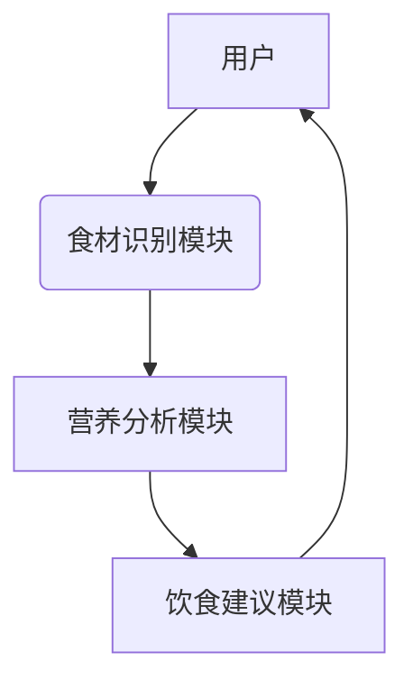

                 


# 智能厨房案板：AI Agent的食材营养分析

## 关键词：AI Agent、食材营养分析、智能厨房、机器学习、计算机视觉

## 摘要：本文深入探讨了AI Agent在食材营养分析中的应用，通过系统化的分析方法，详细讲解了如何利用AI技术实现食材的识别、营养成分的计算以及个性化的饮食建议。文章从理论到实践，全面解析了智能厨房案板的构建过程，为读者提供了一套完整的解决方案。

---

# 第一部分: AI Agent的基础知识与食材营养分析的背景

## 第1章: AI Agent的基本概念与应用

### 1.1 AI Agent的定义与特点

#### 1.1.1 什么是AI Agent
AI Agent（人工智能代理）是指能够感知环境并采取行动以实现目标的智能实体。它能够通过传感器获取信息，利用算法进行决策，并通过执行器与环境交互。AI Agent可以是软件程序，也可以是嵌入在物理设备中的智能系统。

#### 1.1.2 AI Agent的核心特点
- **自主性**：AI Agent能够在没有外部干预的情况下自主运行。
- **反应性**：能够实时感知环境变化并做出响应。
- **目标导向**：所有行动都围绕实现特定目标展开。
- **学习能力**：通过数据和经验不断优化自身的决策能力。

#### 1.1.3 AI Agent与传统软件的区别
AI Agent与传统软件的区别在于其智能化和自主性。传统软件按照预设的规则运行，而AI Agent能够根据环境输入动态调整行为，并通过学习不断提高性能。

### 1.2 AI Agent的应用场景

#### 1.2.1 厨房场景中的AI Agent
在厨房环境中，AI Agent可以作为智能助手，帮助用户完成食材识别、营养分析、食谱推荐等一系列任务。它能够通过摄像头、传感器等设备获取厨房环境的信息，并通过算法进行处理。

#### 1.2.2 智能厨房案板的功能与优势
智能厨房案板是一种集成AI技术的厨房工具，它能够实时分析食材的营养成分，并为用户提供个性化的饮食建议。其优势在于高效、精准和便捷，能够帮助用户实现健康饮食。

#### 1.2.3 用户需求与AI Agent的结合
用户的多样化需求，如健康饮食、营养均衡、个性化食谱等，都可以通过AI Agent来实现。AI Agent能够根据用户的饮食习惯和健康状况，提供个性化的建议和解决方案。

## 第2章: 食材营养分析的背景与挑战

### 2.1 食材营养分析的重要性

#### 2.1.1 营养均衡的重要性
合理的饮食结构是维持人体健康的基础。通过科学的食材搭配，可以确保摄入的营养成分均衡，预防疾病，提高生活质量。

#### 2.1.2 食材搭配的科学性
不同食材的营养成分各不相同，科学的搭配能够最大化营养吸收，避免营养过剩或不足。AI Agent可以通过分析食材的营养成分，优化食材的搭配方案。

#### 2.1.3 用户对健康饮食的需求
现代社会人们对健康饮食的需求日益增长，越来越多的人希望了解食材的营养成分，并根据自身需求选择合适的食谱。AI Agent能够满足这一需求，提供个性化的饮食建议。

### 2.2 AI Agent在食材营养分析中的作用

#### 2.2.1 AI Agent如何辅助食材选择
AI Agent可以通过图像识别技术识别食材种类，并结合数据库中的营养成分信息，为用户提供食材的选择建议。

#### 2.2.2 AI Agent如何优化食材搭配
AI Agent可以通过算法分析不同食材的营养成分，优化食材的搭配，确保营养均衡。例如，它可以推荐低热量、高蛋白的食材组合，帮助用户实现减脂目标。

#### 2.2.3 AI Agent如何提升用户体验
通过提供个性化的饮食建议和实时的营养分析，AI Agent能够显著提升用户体验。用户可以更加轻松地实现健康饮食目标，同时享受智能化的服务。

### 2.3 食材营养分析的挑战

#### 2.3.1 数据获取的困难性
食材的营养成分数据需要通过实验室检测或数据库查询获取，数据获取的难度和成本较高。

#### 2.3.2 数据的多样性与复杂性
不同食材的营养成分种类繁多，且不同食材的检测方法和数据格式也各不相同，这增加了数据处理的复杂性。

#### 2.3.3 模型的准确性和可解释性
AI Agent的准确性依赖于模型的训练数据和算法的选择。如何提高模型的准确性和可解释性，是食材营养分析中的一个挑战。

---

# 第二部分: 食材营养分析的核心概念

## 第3章: 食材的基本属性与营养成分

### 3.1 食材的基本属性

#### 3.1.1 食材的分类
食材可以分为蔬菜、水果、肉类、谷物、乳制品等类别。不同类别的食材具有不同的营养成分和热量。

#### 3.1.2 食材的营养成分
食材的主要营养成分包括碳水化合物、蛋白质、脂肪、维生素、矿物质等。不同食材的营养成分比例不同，因此在搭配时需要综合考虑。

#### 3.1.3 食材的热力学属性
食材的热力学属性包括热量、卡路里等指标，这些指标是衡量食材能量的重要标准。

### 3.2 食材营养成分的分析方法

#### 3.2.1 实验室检测
通过实验室检测可以精确测量食材的营养成分，但这种方法成本高、周期长，不适合大规模应用。

#### 3.2.2 数据库查询
利用权威的营养成分数据库，如USDA数据库，可以快速获取食材的营养成分信息。这种方法快速、便捷，但依赖于数据库的准确性和完整性。

#### 3.2.3 AI分析
通过图像识别和自然语言处理等技术，AI Agent可以自动识别食材种类，并结合数据库中的营养成分信息进行分析。这种方法能够实现快速、准确的营养分析。

## 第4章: AI Agent的食材营养分析模型

### 4.1 模型的输入与输出

#### 4.1.1 输入数据的格式
AI Agent的输入可以是图像、文本或传感器数据。例如，用户可以通过拍照上传食材图片，AI Agent通过图像识别技术获取食材种类和重量信息。

#### 4.1.2 输出结果的展示
AI Agent的输出可以是营养成分的详细报告、食谱推荐或健康建议。用户可以根据报告调整饮食结构，优化健康状况。

#### 4.1.3 模型的可解释性
模型的可解释性是指用户能够理解模型的决策过程。通过解释模型的算法和数据来源，可以增强用户对AI Agent的信任。

### 4.2 模型的核心算法

#### 4.2.1 图像识别算法
图像识别是AI Agent实现食材识别的基础。常用的算法包括卷积神经网络（CNN）和区域卷积神经网络（RCNN）。这些算法能够从图像中提取特征，识别食材种类。

#### 4.2.2 营养成分预测算法
营养成分预测算法可以通过回归分析实现。模型可以基于食材种类和重量，预测其热量、蛋白质、脂肪等营养成分的含量。

#### 4.2.3 食材搭配优化算法
食材搭配优化可以通过遗传算法或模拟退火算法实现。模型可以基于营养需求，优化食材的搭配方案，确保营养均衡。

---

# 第三部分: AI Agent的系统架构与项目实战

## 第5章: 系统架构设计

### 5.1 系统功能设计

#### 5.1.1 食材识别模块
食材识别模块负责接收用户的输入，识别食材种类。它可以通过摄像头或文件上传获取食材图片，并利用图像识别算法进行识别。

#### 5.1.2 营养分析模块
营养分析模块负责根据食材种类和重量，计算其营养成分。它需要访问权威的营养成分数据库，并结合模型预测结果进行分析。

#### 5.1.3 饮食建议模块
饮食建议模块根据用户的健康目标和饮食习惯，提供个性化的食谱推荐和健康建议。它可以通过机器学习算法生成推荐结果。

### 5.2 系统架构图



### 5.3 接口设计

#### 5.3.1 图像识别接口
```python
def recognize_food(image_path):
    # 使用图像识别算法识别食材种类
    return food_type
```

#### 5.3.2 营养分析接口
```python
def analyze_nutrition(food_type, weight):
    # 调用营养成分数据库获取数据
    return nutrition_info
```

#### 5.3.3 饮食建议接口
```python
def generate_recommendation(nutrition_info, health_goal):
    # 基于营养需求生成食谱推荐
    return recipe_recommendation
```

## 第6章: 项目实战

### 6.1 环境安装

#### 6.1.1 安装Python
```bash
python --version
```

#### 6.1.2 安装依赖库
```bash
pip install numpy matplotlib scikit-learn tensorflow
```

### 6.2 核心代码实现

#### 6.2.1 图像识别模型
```python
import tensorflow as tf
from tensorflow.keras import layers

model = tf.keras.Sequential([
    layers.Conv2D(32, (3,3), activation='relu', input_shape=(224, 224, 3)),
    layers.MaxPooling2D((2,2)),
    layers.Flatten(),
    layers.Dense(128, activation='relu'),
    layers.Dense(10, activation='softmax')
])
model.compile(optimizer='adam', loss='sparse_categorical_crossentropy', metrics=['accuracy'])
model.fit(train_data, train_labels, epochs=10, validation_data=(test_data, test_labels))
```

#### 6.2.2 营养成分预测
```python
import pandas as pd
from sklearn.linear_model import LinearRegression

data = pd.read_csv('nutrition.csv')
model = LinearRegression()
model.fit(data[['food_type', 'weight']], data['calories'])
predictions = model.predict(new_data[['food_type', 'weight']])
```

### 6.3 案例分析与结果解读

#### 6.3.1 案例分析
假设用户上传了一张鸡胸肉的图片，AI Agent识别出食材种类为鸡胸肉，重量为100克。营养分析模块计算出鸡胸肉的热量为165卡路里，蛋白质含量为26克，脂肪含量为3.6克。

#### 6.3.2 结果解读
AI Agent根据用户的健康目标（如减脂），推荐搭配西兰花和糙米，形成一个低热量、高蛋白的食谱。用户可以根据推荐的食谱进行烹饪，实现健康饮食目标。

## 第7章: 最佳实践与小结

### 7.1 最佳实践
- 数据的准确性和完整性是模型性能的关键。建议使用权威的营养成分数据库，并确保数据的及时更新。
- 在模型训练过程中，需要进行充分的交叉验证，避免过拟合和欠拟合问题。
- 在实际应用中，需要考虑用户的隐私保护，确保数据的安全性和合规性。

### 7.2 小结
本文详细探讨了AI Agent在食材营养分析中的应用，从理论到实践，全面解析了智能厨房案板的构建过程。通过系统的分析和实战案例，展示了AI技术在健康饮食领域的巨大潜力。

### 7.3 注意事项
- 在实际应用中，需要确保模型的准确性和可解释性，避免误导用户。
- 数据的获取和处理需要遵守相关法律法规，保护用户隐私。
- 在模型优化过程中，需要关注计算效率和资源消耗，确保系统的稳定运行。

### 7.4 拓展阅读
- 《机器学习实战》：深入讲解机器学习算法的实现和应用。
- 《计算机视觉导论》：系统介绍图像处理和计算机视觉的基本原理。
- 《营养学基础》：全面介绍食材的营养成分及其对人体的影响。

---

通过本文的详细介绍，读者可以全面了解AI Agent在食材营养分析中的应用，并能够根据实际需求，设计和实现智能厨房案板系统。未来，随着AI技术的不断发展，智能厨房案板将更加智能化、个性化，为用户的健康饮食提供更多便利。

