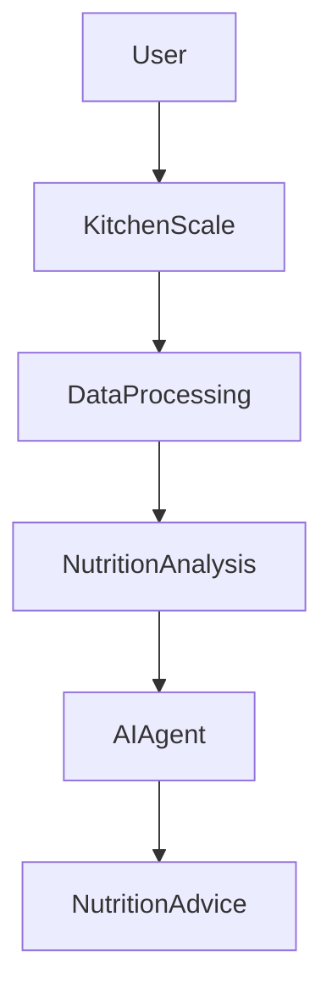
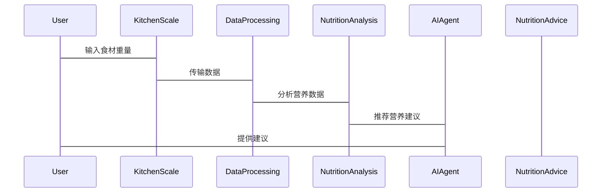

                 


# 智能厨房秤：AI Agent的营养摄入分析与建议

> **关键词**：智能厨房秤、AI Agent、营养摄入分析、健康饮食、人工智能技术

> **摘要**：本文将探讨智能厨房秤与AI Agent结合的营养摄入分析系统。通过分析AI Agent的核心原理、系统架构设计、算法实现及项目实战，详细阐述如何利用人工智能技术实现个性化的营养摄入管理。

---

## 第一章：智能厨房秤与AI Agent的背景与概念

### 1.1 问题背景与目标

#### 1.1.1 营养摄入管理的重要性
现代生活方式的改变导致营养失衡问题日益严重，合理规划每日营养摄入成为健康生活的关键。通过智能设备和AI技术的结合，用户可以更便捷地进行营养管理。

#### 1.1.2 智能厨房秤的发展现状
智能厨房秤作为一种智能家居设备，通过称重功能采集食材数据，并结合AI技术实现营养分析与建议。

#### 1.1.3 AI Agent在营养分析中的潜力
AI Agent能够实时处理数据、提供个性化建议，帮助用户更好地管理饮食健康。

### 1.2 核心概念与问题描述

#### 1.2.1 智能厨房秤的功能特点
- 实时称重与数据采集
- 营养成分数据库查询
- AI Agent驱动的营养分析与建议生成

#### 1.2.2 AI Agent的基本概念与能力
- 智能体（AI Agent）：具备感知、推理、决策能力，能够与用户交互。
- 营养分析：基于食物成分数据库，分析用户摄入的营养数据。

#### 1.2.3 营养摄入分析的数学模型与方法
通过数学模型实现食物热量计算、营养比例分析等。

### 1.3 问题解决与边界定义

#### 1.3.1 智能厨房秤如何辅助营养摄入分析
通过称重获取食材重量，结合数据库中的营养成分表计算热量和营养素含量。

#### 1.3.2 AI Agent在营养建议中的作用
AI Agent根据分析结果提供个性化建议，帮助用户调整饮食结构。

#### 1.3.3 系统的边界与功能范围
- 系统仅限于营养摄入分析与建议，不涉及医疗诊断。
- 数据采集仅限于厨房秤设备。

### 1.4 核心要素与概念结构

#### 1.4.1 系统核心要素分析
- 用户：输入数据并获取建议。
- 智能厨房秤：数据采集设备。
- 数据处理模块：处理食材重量与营养成分。
- 营养分析模块：计算营养数据。
- AI Agent：生成个性化建议。

#### 1.4.2 概念结构图


## 第二章：AI Agent的基本原理与实现

### 2.1 AI Agent的核心原理

#### 2.1.1 AI Agent的定义与分类
- 定义：AI Agent是一种智能体，能够感知环境、自主决策并执行任务。
- 分类：基于规则的AI Agent和基于机器学习的AI Agent。

#### 2.1.2 基于规则的AI Agent实现
通过预定义规则实现简单的逻辑判断。

#### 2.1.3 基于机器学习的AI Agent实现
利用训练数据进行模型训练，实现更复杂的推理与决策。

### 2.2 营养摄入分析的数学模型

#### 2.2.1 营养摄入分析的基本公式
热量计算公式：$$\text{热量} = \text{食材重量} \times \text{热量密度}$$

#### 2.2.2 基于线性回归的营养预测模型
线性回归模型用于预测食物的营养成分。

#### 2.2.3 基于神经网络的营养分析模型
使用神经网络进行更复杂的营养成分分析。

### 2.3 AI Agent与营养分析的结合

#### 2.3.1 数据输入与处理
将食材重量和营养成分数据输入AI Agent。

#### 2.3.2 AI Agent的推理与决策
根据营养数据生成个性化建议。

#### 2.3.3 营养建议的生成与输出
将建议反馈给用户。

### 2.4 核心概念对比表

| 概念       | 描述                                                     |
|------------|----------------------------------------------------------|
| AI Agent   | 具备感知、推理、决策能力的智能体                       |
| 营养摄入分析 | 基于食物成分数据库，分析用户摄入的营养数据             |

### 2.5 本章小结

---

## 第三章：智能厨房秤与AI Agent的系统架构

### 3.1 系统功能设计

#### 3.1.1 用户输入与数据采集
用户通过智能厨房秤输入食材重量。

#### 3.1.2 营养分析与建议生成
系统分析营养数据并生成建议。

#### 3.1.3 人机交互与反馈
用户与系统进行交互，获取建议并反馈意见。

### 3.2 系统架构图


### 3.3 系统接口设计

#### 3.3.1 数据接口
定义数据格式和传输协议。

#### 3.3.2 用户接口
设计用户友好的交互界面。

#### 3.3.3 AI Agent接口
定义AI Agent与系统其他部分的接口。

### 3.4 系统交互流程图



### 3.5 本章小结

---

## 第四章：项目实战与总结

### 4.1 项目环境与工具

#### 4.1.1 开发环境
Python编程语言、TensorFlow框架。

#### 4.1.2 工具选择
智能厨房秤硬件、Python开发工具、数据可视化工具。

### 4.2 核心代码实现

#### 4.2.1 数据处理模块
```python
def calculate_calories(weight, calories_density):
    return weight * calories_density
```

#### 4.2.2 营养分析模块
```python
import tensorflow as tf
model = tf.keras.Sequential([...])
```

### 4.3 案例分析与解读

#### 4.3.1 实际案例
用户称量食物，系统分析并提供建议。

#### 4.3.2 代码实现解读
详细分析代码的功能与实现逻辑。

### 4.4 项目小结

---

## 第五章：总结与展望

### 5.1 项目总结
总结系统的实现过程和主要成果。

### 5.2 未来展望
探讨智能厨房秤与AI Agent技术的未来发展。

### 5.3 注意事项
提醒用户在使用系统时的注意事项。

### 5.4 最佳实践
分享在项目开发中的最佳实践经验。

### 5.5 拓展阅读
推荐相关的技术书籍和论文。

---

通过以上内容，我们系统地探讨了智能厨房秤与AI Agent结合的营养摄入分析系统，从理论到实践，详细阐述了其实现过程和应用价值。

