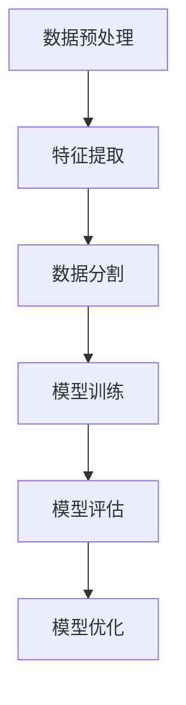
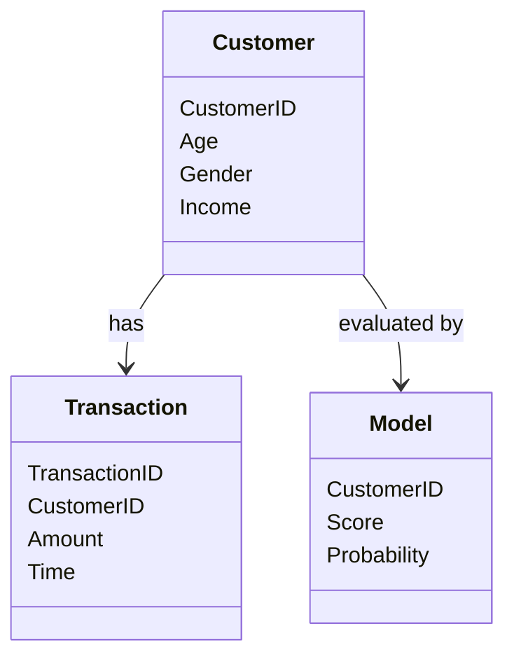
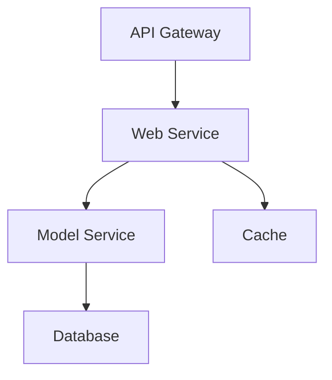

                 


# 智能商业银行客户价值评估模型

## 关键词：
智能商业银行、客户价值评估、人工智能、机器学习、数据挖掘

## 摘要：
本文系统地介绍智能商业银行客户价值评估模型的设计与实现，探讨如何利用智能化技术提升客户价值评估的准确性与效率。通过结合数据分析、机器学习和系统架构设计，本文提出了一种创新的模型构建方法，旨在为商业银行提供更精准的客户价值评估解决方案。

---

# 第一部分: 背景介绍

## 第1章: 问题背景

### 1.1 商业银行客户价值评估的重要性
商业银行客户价值评估是银行精准营销和风险管理的核心环节。通过评估客户价值，银行可以优化资源配置、提升客户满意度和忠诚度，从而实现业务目标。然而，传统评估方法依赖人工经验，存在主观性强、效率低、精准度不足等问题。

### 1.2 当前客户价值评估的痛点与挑战
- 数据孤岛：客户数据分散，难以整合。
- 模型单一：传统模型难以应对复杂客户行为。
- 数据质量：数据缺失、噪声影响评估结果。
- 业务需求变化快：模型需要快速迭代和适应。

### 1.3 智能化技术在客户价值评估中的应用前景
随着人工智能和大数据技术的发展，智能化模型能够处理海量数据，提取深层特征，显著提升客户价值评估的精准性和效率。

## 第2章: 问题描述

### 2.1 客户价值评估的核心目标
- 精准识别高价值客户。
- 优化资源配置，提升营销效果。
- 风险控制，降低不良资产率。

### 2.2 传统客户价值评估方法的局限性
- 依赖人工经验，主观性强。
- 数据维度有限，无法捕捉客户行为全貌。
- 计算复杂度高，难以实时评估。

### 2.3 智能化客户价值评估模型的必要性
智能化模型能够通过机器学习算法，从海量数据中提取有价值的信息，构建动态、实时的客户价值评估体系。

## 第3章: 问题解决思路

### 3.1 数据驱动的客户价值评估方法
通过收集和分析客户的多维度数据，包括交易数据、行为数据、 demographic data等，构建客户画像。

### 3.2 智能化模型在客户价值评估中的应用
利用机器学习算法（如决策树、随机森林、神经网络等）构建客户价值预测模型。

### 3.3 从传统到智能的过渡策略
- 数据整合：建立统一的数据平台。
- 模型迭代：逐步优化传统模型。
- 人机结合：利用人工智能辅助决策。

## 第4章: 模型的边界与外延

### 4.1 模型的适用范围
- 针对个人客户和小微企业客户。
- 适用于客户细分、精准营销和风险管理。

### 4.2 模型的局限性与应用场景限制
- 数据不足可能导致模型准确度下降。
- 模型无法完全替代人工判断。

### 4.3 与其他银行技术的关联与区别
区别于传统评分卡模型，智能化模型更加动态、精准和个性化。

## 第5章: 概念结构与核心要素

### 5.1 模型的核心要素分析
- 数据来源：交易数据、行为数据、客户属性。
- 模型输入：客户特征向量。
- 模型输出：客户价值评分。
- 模型评估：准确率、召回率、F1值。

### 5.2 模型的输入与输出定义
- 输入：客户ID、交易金额、交易频率、客户年龄、性别等。
- 输出：客户价值评分（高、中、低）。

### 5.3 模型的评估指标与优化方向
- 评估指标：准确率、ROC-AUC、KS统计量。
- 优化方向：特征工程、模型调参、实时更新。

---

# 第二部分: 核心概念与联系

## 第6章: 核心概念与联系

### 6.1 模型的核心概念
- 客户价值：客户为银行带来的收入、利润和忠诚度。
- 智能化模型：基于机器学习的预测模型。
- 数据驱动：从数据中提取信息驱动决策。

### 6.2 核心概念的联系
- 客户特征与价值的关系：高收入客户不一定高价值，需结合行为数据。
- 智能模型与数据的关系：模型依赖数据质量，数据驱动模型优化。
- 业务目标与模型输出的关联：模型输出需满足业务需求。

### 6.3 核心概念的属性特征对比
| 概念 | 输入 | 输出 | 方法 |
|------|------|------|------|
| 传统模型 | 客户ID、交易金额 | 客户价值评分 | 统计分析 |
| 智能模型 | 客户ID、交易数据、行为数据 | 预测评分、概率评分 | 机器学习 |

### 6.4 ER实体关系图架构
```mermaid
erd
  id: 唯一标识符
  customer(CustomerID, Age, Gender, Income)
  transaction(TransactionID, CustomerID, Amount, Time)
  model(CustomerID, Score, Probability)
  customer --> transaction: has
  customer --> model: evaluated by
```

---

# 第三部分: 算法原理

## 第7章: 算法原理

### 7.1 算法选择
- 决策树：适合特征重要性分析。
- 随机森林：适合特征工程和模型调优。
- 神经网络：适合复杂非线性关系。

### 7.2 算法流程


### 7.3 算法实现

```python
import pandas as pd
from sklearn.ensemble import RandomForestClassifier
from sklearn.metrics import accuracy_score

# 数据加载与预处理
data = pd.read_csv('customer_data.csv')
X = data.drop(columns=['Score'])
y = data['Score']

# 特征工程
from sklearn.impute import SimpleImputer
from sklearn.preprocessing import StandardScaler

imp = SimpleImputer(missing_values=np.nan, strategy='mean')
X = imp.fit_transform(X)

# 模型训练
model = RandomForestClassifier(n_estimators=100, max_depth=5, random_state=42)
model.fit(X, y)

# 模型评估
y_pred = model.predict(X)
print("Accuracy:", accuracy_score(y, y_pred))
```

### 7.4 数学模型

决策树分类标准：
$$ Gini系数 = \sum_{i=1}^{n} p_i(1-p_i) $$

随机森林概率计算：
$$ P(class) = \frac{\sum_{i=1}^{n} vote_i}{N} $$

---

# 第四部分: 系统分析与架构设计

## 第8章: 系统分析与架构设计

### 8.1 问题场景介绍
商业银行需要实时评估客户价值，支持精准营销和风险管理。

### 8.2 系统功能设计
- 数据采集：收集客户交易、行为数据。
- 数据处理：清洗、特征提取。
- 模型构建：训练、评估、优化。
- 接口开发：API提供价值评分。

### 8.3 领域模型设计


### 8.4 系统架构设计


### 8.5 系统接口设计
- 输入接口：客户ID。
- 输出接口：价值评分、概率评分。
- 交互流程：
    ```mermaid
    sequenceDiagram
        Client -> API Gateway: 请求评估
        API Gateway -> Web Service: 转发请求
        Web Service -> Model Service: 获取模型结果
        Model Service -> Database: 查询数据
        Web Service -> Client: 返回结果
    ```

---

# 第五部分: 项目实战

## 第9章: 项目实战

### 9.1 环境安装
- Python 3.8+
- Jupyter Notebook
- scikit-learn、pandas、numpy

### 9.2 核心代码实现
```python
from sklearn.ensemble import RandomForestClassifier
from sklearn.metrics import classification_report
from sklearn.model_selection import train_test_split

# 数据加载
data = pd.read_csv('customer_data.csv')

# 特征工程
X = data.drop(columns=['Score'])
y = data['Score']

# 数据分割
X_train, X_test, y_train, y_test = train_test_split(X, y, test_size=0.2)

# 模型训练
model = RandomForestClassifier(n_estimators=100)
model.fit(X_train, y_train)

# 模型预测
y_pred = model.predict(X_test)

# 模型评估
print(classification_report(y_test, y_pred))
```

### 9.3 代码解读与分析
- 数据加载：从CSV文件加载数据。
- 特征工程：删除目标变量，保留其他特征。
- 数据分割：将数据分为训练集和测试集。
- 模型训练：使用随机森林训练模型。
- 模型预测：在测试集上进行预测。
- 模型评估：计算准确率、召回率和F1值。

### 9.4 实际案例分析
假设某客户的数据为：
- CustomerID: 1001
- Age: 35
- Gender: 男
- Income: 50000
- TransactionAmount: 10000
- TransactionFrequency: 5

模型预测其价值评分为高，银行可以将其作为目标客户进行精准营销。

---

# 第六部分: 最佳实践

## 第10章: 最佳实践

### 10.1 小结
智能商业银行客户价值评估模型通过机器学习技术，显著提升了评估的准确性和效率。

### 10.2 注意事项
- 数据质量：确保数据完整性和准确性。
- 模型调优：通过网格搜索优化模型参数。
- 实时性：确保模型能够实时更新和响应。

### 10.3 拓展阅读
- 《机器学习实战》
- 《Python机器学习》
- 《数据挖掘导论》

---

# 结语

智能商业银行客户价值评估模型通过结合先进的机器学习算法和系统架构设计，为商业银行提供了高效、精准的客户价值评估解决方案。本文详细介绍了模型的构建过程和实际应用，为读者提供了理论和实践的双重指导。

--- 

# 参考文献

1. 周志华. 《机器学习实战》. 清华大学出版社.
2. 周宝利. 《Python机器学习》. 人民邮电出版社.
3. 冯大华. 《数据挖掘导论》. 北京大学出版社.

