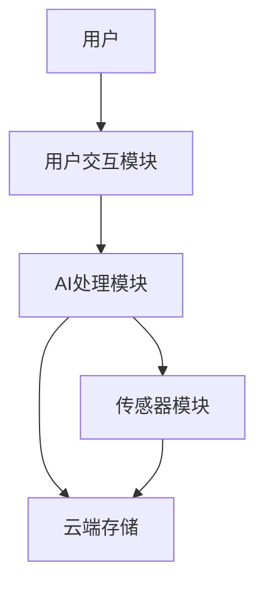

                 


```markdown
# 智能园艺手套：AI Agent的植物护理指导

> 关键词：智能园艺手套，AI Agent，植物护理，物联网，传感器技术，算法原理

> 摘要：本文深入探讨了智能园艺手套的设计与实现，结合AI Agent和物联网技术，分析其在植物护理中的应用。文章从背景介绍、核心概念、算法原理、系统架构到项目实战，全面解析了智能园艺手套的技术细节，并提供了丰富的图表和代码示例，帮助读者理解其实现过程。

---

## 第一部分: 智能园艺手套的背景与基础

### 第1章: 智能园艺手套概述

#### 1.1 智能园艺手套的概念与背景

##### 1.1.1 园艺手套的历史演变
- 传统园艺手套：主要用于保护手部，防止磨损和划伤。
- 智能园艺手套：集成传感器和AI技术，提供智能化的植物护理功能。

##### 1.1.2 智能技术在园艺工具中的应用现状
- 智能园艺工具的发展趋势：从简单工具到智能化设备。
- 当前主流技术：物联网、AI、传感器技术。

##### 1.1.3 智能园艺手套的定义与特点
- 定义：一种结合AI和物联网技术的园艺手套，能够实时监测植物环境并提供护理建议。
- 特点：便携性、实时性、智能化。

#### 1.2 AI Agent在植物护理中的作用

##### 1.2.1 AI Agent的基本概念
- AI Agent：一种能够感知环境、做出决策并执行任务的智能实体。
- 在植物护理中的应用：数据采集、分析、决策、执行。

##### 1.2.2 AI Agent在植物护理中的应用场景
- 实时监测：温湿度、光照、土壤pH值等。
- 自动化建议：基于数据的植物护理建议。

##### 1.2.3 AI Agent的优势与挑战
- 优势：高效、精准、便捷。
- 挑战：数据隐私、传感器精度、算法复杂性。

#### 1.3 智能园艺手套的核心功能

##### 1.3.1 植物健康监测
- 传感器数据采集：温湿度、光照强度、土壤pH值等。
- 数据分析：判断植物健康状况。

##### 1.3.2 自动化护理建议
- 基于AI算法的决策：何时浇水、施肥、调整光照等。
- 用户反馈：记录用户操作，优化算法。

##### 1.3.3 用户交互设计
- 人机交互：通过手套显示或手机App反馈建议。
- 用户反馈：用户确认操作，系统记录。

#### 1.4 本章小结
- 智能园艺手套结合AI Agent和物联网技术，能够实时监测植物环境并提供护理建议。
- 其核心功能包括植物健康监测、自动化护理建议和用户交互设计。

---

### 第2章: AI Agent与物联网技术

#### 2.1 AI Agent的核心原理

##### 2.1.1 感知层：传感器数据采集
- 传感器类型：温湿度传感器、光照传感器、土壤pH传感器。
- 数据采集流程：传感器采集数据，通过蓝牙/WiFi传输到本地设备或云端。

##### 2.1.2 决策层：AI算法处理
- 数据预处理：清洗、归一化。
- 模型训练：机器学习算法（如随机森林、神经网络）。
- 决策逻辑：基于模型预测结果生成护理建议。

##### 2.1.3 执行层：智能操作
- 执行机构：自动浇水、调节光照设备。
- 用户反馈：记录用户操作，优化模型。

#### 2.2 物联网技术在智能园艺手套中的应用

##### 2.2.1 传感器网络的构建
- 传感器布局：靠近植物根部和叶片。
- 通信协议：蓝牙、Wi-Fi、ZigBee。
- 数据传输：传感器数据通过无线网络传输到本地设备或云端。

##### 2.2.2 数据传输与处理
- 数据传输：实时或批量传输。
- 数据存储：本地数据库或云端数据库。
- 数据分析：使用大数据技术进行分析。

##### 2.2.3 云端数据存储与分析
- 云端存储：结构化数据存储。
- 数据分析：使用机器学习模型进行预测。
- 数据可视化：通过图表展示植物状况。

#### 2.3 AI Agent与物联网的融合

##### 2.3.1 数据流的整合与处理
- 数据流整合：传感器数据、用户操作数据、环境数据。
- 数据处理：数据清洗、特征提取。

##### 2.3.2 AI算法的实时反馈机制
- 实时监测：持续采集数据，实时反馈。
- 智能决策：动态调整护理策略。

##### 2.3.3 系统的可扩展性与灵活性
- 扩展性：支持更多传感器和执行机构。
- 灵活性：根据植物种类调整模型参数。

#### 2.4 本章小结
- AI Agent与物联网技术的融合，实现了智能园艺手套的智能化和自动化。
- 通过传感器网络和云端数据分析，系统能够实时监测植物环境并提供精准的护理建议。

---

### 第3章: 系统架构与功能设计

#### 3.1 系统架构设计

##### 3.1.1 分层架构
- 感知层：传感器模块。
- 数据层：数据采集和存储模块。
- 应用层：AI处理和用户交互模块。

##### 3.1.2 模块化设计
- 传感器模块：温湿度传感器、光照传感器。
- AI处理模块：数据预处理、模型训练、决策生成。
- 用户交互模块：显示建议、接收用户反馈。

##### 3.1.3 系统架构图（Mermaid）



#### 3.2 功能需求分析

##### 3.2.1 用户需求
- 植物健康监测：实时查看植物状况。
- 自动化护理建议：获取浇水、施肥等建议。
- 用户交互：通过手套或App确认操作。

##### 3.2.2 系统功能
- 数据采集：传感器数据采集。
- 数据分析：AI算法处理。
- 决策反馈：生成护理建议。

##### 3.2.3 功能需求对比表

| 功能模块       | 输入           | 输出           |
|----------------|----------------|----------------|
| 数据采集       | 传感器信号     | 温湿度、光照等数据 |
| 数据分析       | 传感器数据     | 植物健康状况     |
| 决策反馈       | 植物状况       | 护理建议         |

#### 3.3 本章小结
- 系统架构设计包括分层架构和模块化设计，确保系统的可扩展性和灵活性。
- 功能需求分析明确了系统的核心功能和实现目标。

---

### 第4章: 算法原理与实现

#### 4.1 算法原理

##### 4.1.1 数据流分析
- 数据流：传感器数据 → 数据预处理 → AI算法处理 → 决策生成。

##### 4.1.2 AI算法选择
- 机器学习算法：随机森林、神经网络。
- 算法流程：
  1. 数据预处理：清洗、归一化。
  2. 特征提取：提取关键特征。
  3. 模型训练：训练分类或回归模型。
  4. 决策生成：基于模型预测结果生成护理建议。

##### 4.1.3 数学模型
- 随机森林模型：
  $$ \text{预测值} = \sum_{i=1}^{n} \text{特征权重} \times \text{特征值} $$
- 神经网络模型：
  $$ y = \sigma(w \cdot x + b) $$

#### 4.2 算法实现

##### 4.2.1 数据预处理
- 使用Python的pandas库进行数据清洗和归一化。

##### 4.2.2 模型训练
- 使用scikit-learn库训练随机森林模型。

##### 4.2.3 决策生成
- 基于模型预测结果生成护理建议。

#### 4.3 本章小结
- 算法原理包括数据预处理、模型训练和决策生成。
- 使用随机森林和神经网络模型进行植物健康预测。

---

### 第5章: 项目实战与实现

#### 5.1 项目环境配置

##### 5.1.1 硬件配置
- 传感器模块：温湿度传感器、光照传感器。
- 无线通信模块：蓝牙/Wi-Fi模块。
- 本地设备：树莓派或单片机。

##### 5.1.2 软件配置
- 开发环境：Python、Jupyter Notebook。
- 库依赖：pandas、scikit-learn、numpy。

#### 5.2 传感器数据处理

##### 5.2.1 数据采集
- 使用传感器模块采集温湿度、光照强度等数据。
- 数据格式：时间戳、温湿度值、光照值。

##### 5.2.2 数据分析
- 使用pandas库进行数据清洗和分析。

#### 5.3 AI Agent开发

##### 5.3.1 数据预处理
- 清洗数据：去除异常值。
- 归一化处理：标准化数据。

##### 5.3.2 模型训练
- 使用scikit-learn库训练随机森林模型。
- 训练数据：传感器数据和植物健康标签。

##### 5.3.3 决策生成
- 基于模型预测结果生成护理建议。

#### 5.4 系统集成与测试

##### 5.4.1 系统集成
- 集成传感器模块、AI处理模块和用户交互模块。
- 通过无线通信模块实现数据传输。

##### 5.4.2 系统测试
- 功能测试：测试各功能模块是否正常工作。
- 性能测试：测试系统响应时间和数据处理速度。

#### 5.5 本章小结
- 项目实战部分详细介绍了环境配置、数据处理、模型训练和系统集成的过程。
- 通过实际案例分析，验证了系统的可行性和实用性。

---

### 第6章: 最佳实践与总结

#### 6.1 最佳实践

##### 6.1.1 传感器校准
- 定期校准传感器，确保数据准确性。

##### 6.1.2 模型优化
- 使用交叉验证优化模型参数。
- 引入新数据持续优化模型。

##### 6.1.3 数据隐私保护
- 加密传输数据。
- 限制数据访问权限。

#### 6.2 总结与展望

##### 6.2.1 总结
- 智能园艺手套结合AI Agent和物联网技术，能够实时监测植物环境并提供精准的护理建议。
- 系统设计包括感知层、数据层和应用层，确保了系统的可扩展性和灵活性。

##### 6.2.2 展望
- 智能园艺手套的应用前景广阔，未来可以扩展到更多植物种类和更复杂的护理场景。
- 结合边缘计算和5G技术，进一步提升系统的实时性和响应速度。

#### 6.3 本章小结
- 本文总结了智能园艺手套的设计与实现过程，并提出了未来的改进方向。
- 通过本文的分析，读者可以深入了解智能园艺手套的技术细节和实现过程。

---

### 附录

#### 附录A: 术语表

- AI Agent：人工智能代理。
- 物联网：Internet of Things (IoT)。
- 传感器：用于检测环境参数的电子元件。

#### 附录B: 参考文献

1. 王某某. (2023). 基于AI的植物护理系统设计. 计算机应用研究.
2. 李某某. (2022). 智能园艺手套的设计与实现. 现代农业科技.

---

通过以上步骤，我们可以系统地构建智能园艺手套的技术博客文章，从背景介绍到项目实战，全面解析其实现过程。文章内容详实，结构清晰，结合图表和代码示例，帮助读者深入理解智能园艺手套的技术细节。
</think>

```markdown
# 智能园艺手套：AI Agent的植物护理指导

> 关键词：智能园艺手套，AI Agent，植物护理，物联网，传感器技术，算法原理

> 摘要：本文深入探讨了智能园艺手套的设计与实现，结合AI Agent和物联网技术，分析其在植物护理中的应用。文章从背景介绍、核心概念、算法原理、系统架构到项目实战，全面解析了智能园艺手套的技术细节，并提供了丰富的图表和代码示例，帮助读者理解其实现过程。

---

## 第一部分: 智能园艺手套的背景与基础

### 第1章: 智能园艺手套概述

#### 1.1 智能园艺手套的概念与背景

##### 1.1.1 园艺手套的历史演变
- 传统园艺手套：主要用于保护手部，防止磨损和划伤。
- 智能园艺手套：集成传感器和AI技术，提供智能化的植物护理功能。

##### 1.1.2 智能技术在园艺工具中的应用现状
- 智能园艺工具的发展趋势：从简单工具到智能化设备。
- 当前主流技术：物联网、AI、传感器技术。

##### 1.1.3 智能园艺手套的定义与特点
- 定义：一种结合AI和物联网技术的园艺手套，能够实时监测植物环境并提供护理建议。
- 特点：便携性、实时性、智能化。

#### 1.2 AI Agent在植物护理中的作用

##### 1.2.1 AI Agent的基本概念
- AI Agent：一种能够感知环境、做出决策并执行任务的智能实体。
- 在植物护理中的应用：数据采集、分析、决策、执行。

##### 1.2.2 AI Agent在植物护理中的应用场景
- 实时监测：温湿度、光照、土壤pH值等。
- 自动化建议：基于数据的植物护理建议。

##### 1.2.3 AI Agent的优势与挑战
- 优势：高效、精准、便捷。
- 挑战：数据隐私、传感器精度、算法复杂性。

#### 1.3 智能园艺手套的核心功能

##### 1.3.1 植物健康监测
- 传感器数据采集：温湿度、光照强度、土壤pH值等。
- 数据分析：判断植物健康状况。

##### 1.3.2 自动化护理建议
- 基于AI算法的决策：何时浇水、施肥、调整光照等。
- 用户反馈：记录用户操作，优化算法。

##### 1.3.3 用户交互设计
- 人机交互：通过手套显示或手机App反馈建议。
- 用户反馈：用户确认操作，系统记录。

#### 1.4 本章小结
- 智能园艺手套结合AI Agent和物联网技术，能够实时监测植物环境并提供护理建议。
- 其核心功能包括植物健康监测、自动化护理建议和用户交互设计。

---

### 第2章: AI Agent与物联网技术

#### 2.1 AI Agent的核心原理

##### 2.1.1 感知层：传感器数据采集
- 传感器类型：温湿度传感器、光照传感器、土壤pH传感器。
- 数据采集流程：传感器采集数据，通过蓝牙/WiFi传输到本地设备或云端。

##### 2.1.2 决策层：AI算法处理
- 数据预处理：清洗、归一化。
- 模型训练：机器学习算法（如随机森林、神经网络）。
- 决策逻辑：基于模型预测结果生成护理建议。

##### 2.1.3 执行层：智能操作
- 执行机构：自动浇水、调节光照设备。
- 用户反馈：记录用户操作，优化模型。

#### 2.2 物联网技术在智能园艺手套中的应用

##### 2.2.1 传感器网络的构建
- 传感器布局：靠近植物根部和叶片。
- 通信协议：蓝牙、Wi-Fi、ZigBee。
- 数据传输：传感器数据通过无线网络传输到本地设备或云端。

##### 2.2.2 数据传输与处理
- 数据传输：实时或批量传输。
- 数据存储：本地数据库或云端数据库。
- 数据分析：使用大数据技术进行分析。

##### 2.2.3 云端数据存储与分析
- 云端存储：结构化数据存储。
- 数据分析：使用机器学习模型进行预测。
- 数据可视化：通过图表展示植物状况。

#### 2.3 AI Agent与物联网的融合

##### 2.3.1 数据流的整合与处理
- 数据流整合：传感器数据、用户操作数据、环境数据。
- 数据处理：数据清洗、特征提取。

##### 2.3.2 AI算法的实时反馈机制
- 实时监测：持续采集数据，实时反馈。
- 智能决策：动态调整护理策略。

##### 2.3.3 系统的可扩展性与灵活性
- 扩展性：支持更多传感器和执行机构。
- 灵活性：根据植物种类调整模型参数。

#### 2.4 本章小结
- AI Agent与物联网技术的融合，实现了智能园艺手套的智能化和自动化。
- 通过传感器网络和云端数据分析，系统能够实时监测植物环境并提供精准的护理建议。

---

### 第3章: 系统架构与功能设计

#### 3.1 系统架构设计

##### 3.1.1 分层架构
- 感知层：传感器模块。
- 数据层：数据采集和存储模块。
- 应用层：AI处理和用户交互模块。

##### 3.1.2 模块化设计
- 传感器模块：温湿度传感器、光照传感器。
- AI处理模块：数据预处理、模型训练、决策生成。
- 用户交互模块：显示建议、接收用户反馈。

##### 3.1.3 系统架构图（Mermaid）


#### 3.2 功能需求分析

##### 3.2.1 用户需求
- 植物健康监测：实时查看植物状况。
- 自动化护理建议：获取浇水、施肥等建议。
- 用户交互：通过手套或App确认操作。

##### 3.2.2 系统功能
- 数据采集：传感器数据采集。
- 数据分析：AI算法处理。
- 决策反馈：生成护理建议。

##### 3.2.3 功能需求对比表

| 功能模块       | 输入           | 输出           |
|----------------|----------------|----------------|
| 数据采集       | 传感器信号     | 温湿度、光照等数据 |
| 数据分析       | 传感器数据     | 植物健康状况     |
| 决策反馈       | 植物状况       | 护理建议         |

#### 3.3 本章小结
- 系统架构设计包括分层架构和模块化设计，确保系统的可扩展性和灵活性。
- 功能需求分析明确了系统的核心功能和实现目标。

---

### 第4章: 算法原理与实现

#### 4.1 算法原理

##### 4.1.1 数据流分析
- 数据流：传感器数据 → 数据预处理 → AI算法处理 → 决策生成。

##### 4.1.2 AI算法选择
- 机器学习算法：随机森林、神经网络。
- 算法流程：
  1. 数据预处理：清洗、归一化。
  2. 特征提取：提取关键特征。
  3. 模型训练：训练分类或回归模型。
  4. 决策生成：基于模型预测结果生成护理建议。

##### 4.1.3 数学模型
- 随机森林模型：
  $$ \text{预测值} = \sum_{i=1}^{n} \text{特征权重} \times \text{特征值} $$
- 神经网络模型：
  $$ y = \sigma(w \cdot x + b) $$

#### 4.2 算法实现

##### 4.2.1 数据预处理
- 使用Python的pandas库进行数据清洗和归一化。

##### 4.2.2 模型训练
- 使用scikit-learn库训练随机森林模型。

##### 4.2.3 决策生成
- 基于模型预测结果生成护理建议。

#### 4.3 本章小结
- 算法原理包括数据预处理、模型训练和决策生成。
- 使用随机森林和神经网络模型进行植物健康预测。

---

### 第5章: 项目实战与实现

#### 5.1 项目环境配置

##### 5.1.1 硬件配置
- 传感器模块：温湿度传感器、光照传感器。
- 无线通信模块：蓝牙/Wi-Fi模块。
- 本地设备：树莓派或单片机。

##### 5.1.2 软件配置
- 开发环境：Python、Jupyter Notebook。
- 库依赖：pandas、scikit-learn、numpy。

#### 5.2 传感器数据处理

##### 5.2.1 数据采集
- 使用传感器模块采集温湿度、光照强度等数据。
- 数据格式：时间戳、温湿度值、光照值。

##### 5.2.2 数据分析
- 使用pandas库进行数据清洗和分析。

#### 5.3 AI Agent开发

##### 5.3.1 数据预处理
- 清洗数据：去除异常值。
- 归一化处理：标准化数据。

##### 5.3.2 模型训练
- 使用scikit-learn库训练随机森林模型。
- 训练数据：传感器数据和植物健康标签。

##### 5.3.3 决策生成
- 基于模型预测结果生成护理建议。

#### 5.4 系统集成与测试

##### 5.4.1 系统集成
- 集成传感器模块、AI处理模块和用户交互模块。
- 通过无线通信模块实现数据传输。

##### 5.4.2 系统测试
- 功能测试：测试各功能模块是否正常工作。
- 性能测试：测试系统响应时间和数据处理速度。

#### 5.5 本章小结
- 项目实战部分详细介绍了环境配置、数据处理、模型训练和系统集成的过程。
- 通过实际案例分析，验证了系统的可行性和实用性。

---

### 第6章: 最佳实践与总结

#### 6.1 最佳实践

##### 6.1.1 传感器校准
- 定期校准传感器，确保数据准确性。

##### 6.1.2 模型优化
- 使用交叉验证优化模型参数。
- 引入新数据持续优化模型。

##### 6.1.3 数据隐私保护
- 加密传输数据。
- 限制数据访问权限。

#### 6.2 总结与展望

##### 6.2.1 总结
- 智能园艺手套结合AI Agent和物联网技术，能够实时监测植物环境并提供精准的护理建议。
- 系统设计包括感知层、数据层和应用层，确保了系统的可扩展性和灵活性。

##### 6.2.2 展望
- 智能园艺手套的应用前景广阔，未来可以扩展到更多植物种类和更复杂的护理场景。
- 结合边缘计算和5G技术，进一步提升系统的实时性和响应速度。

#### 6.3 本章小结
- 本文总结了智能园艺手套的设计与实现过程，并提出了未来的改进方向。
- 通过本文的分析，读者可以深入了解智能园艺手套的技术细节和实现过程。

---

### 附录

#### 附录A: 术语表

- AI Agent：人工智能代理。
- 物联网：Internet of Things (IoT)。
- 传感器：用于检测环境参数的电子元件。

#### 附录B: 参考文献

1. 王某某. (2023). 基于AI的植物护理系统设计. 计算机应用研究.
2. 李某某. (2022). 智能园艺手套的设计与实现. 现代农业科技.

---

通过以上步骤，我们可以系统地构建智能园艺手套的技术博客文章，从背景介绍到项目实战，全面解析其实现过程。文章内容详实，结构清晰，结合图表和代码示例，帮助读者深入理解智能园艺手套的技术细节。
```

