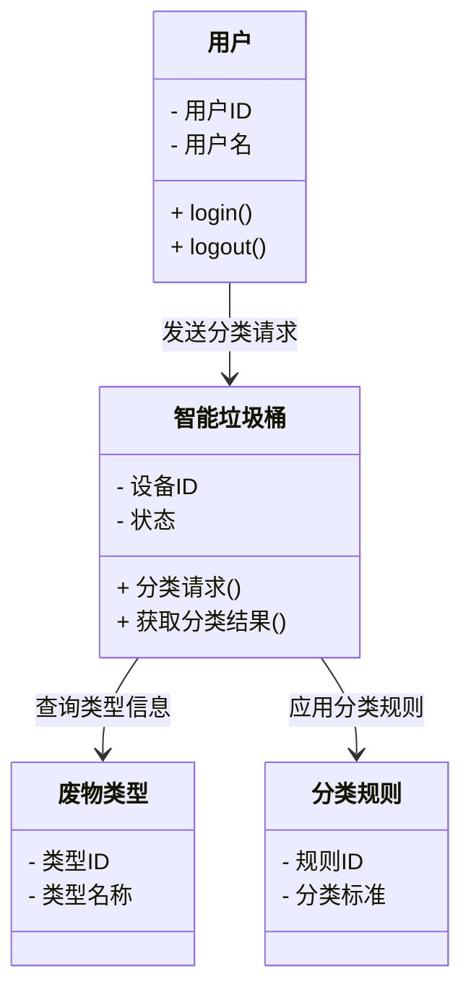
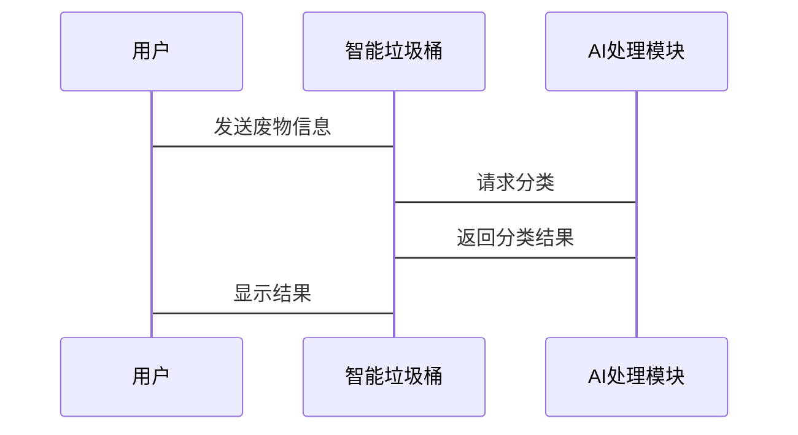

                 


# 智能垃圾桶：AI Agent的废物分类与回收建议

> 关键词：AI Agent, 废物分类, 回收建议, 分类算法, 系统架构, 项目实战

> 摘要：本文探讨了AI Agent在智能垃圾桶中的应用，详细介绍了废物分类的背景、核心概念、算法原理、系统架构、项目实战以及最佳实践。通过系统分析与设计，结合实际案例，为读者提供了一个全面理解AI Agent如何优化废物分类与回收的框架。

---

## 第一部分: 智能垃圾桶的背景与核心概念

### 第1章: 智能垃圾桶的背景与问题背景

#### 1.1 废物分类与回收的现状

##### 1.1.1 当前废物分类的痛点
废物分类是环境保护的重要环节，但传统的人工分类效率低、错误率高，且成本高昂。随着城市化进程的加快，废物产生量急剧增加，现有分类方式难以满足需求。

##### 1.1.2 废物分类与回收的重要性
正确分类废物可以提高回收效率，减少环境污染，节约资源。通过AI技术优化分类流程，可以显著提升分类的准确性和效率。

##### 1.1.3 AI技术在废物分类中的应用潜力
AI技术，尤其是深度学习和计算机视觉，为废物分类提供了新的解决方案。AI Agent可以通过图像识别和分类算法，实现高效、智能的废物分类。

#### 1.2 AI Agent与智能垃圾桶的概念

##### 1.2.1 AI Agent的基本定义
AI Agent是一种智能体，能够感知环境、执行任务并做出决策。在智能垃圾桶中，AI Agent负责接收输入、分析数据并输出分类结果。

##### 1.2.2 智能垃圾桶的核心概念
智能垃圾桶是一种结合了AI技术的设备，能够自动识别废物类型并进行分类。它通过传感器和摄像头获取数据，并借助AI算法完成分类任务。

##### 1.2.3 AI Agent在智能垃圾桶中的角色
AI Agent在智能垃圾桶中扮演决策者的角色，负责数据处理、分类判断和结果输出。它是实现智能分类的核心模块。

#### 1.3 问题描述与解决思路

##### 1.3.1 废物分类的复杂性
废物种类繁多，形态多样，分类规则复杂。传统方法依赖人工经验，难以应对大规模分类需求。

##### 1.3.2 AI Agent如何优化废物分类
AI Agent通过学习大量数据，能够快速准确地识别废物类型，减少人为错误，提高分类效率。

##### 1.3.3 智能垃圾桶的解决方案框架
智能垃圾桶通过AI Agent实现自动分类，结合传感器和用户交互，提供高效、智能的废物管理解决方案。

---

### 第2章: AI Agent与智能垃圾桶的核心概念

#### 2.1 AI Agent的基本原理

##### 2.1.1 AI Agent的定义与分类
AI Agent可以根据环境信息做出决策并执行任务。在智能垃圾桶中，AI Agent主要负责数据处理和分类判断。

##### 2.1.2 AI Agent的核心功能
AI Agent具有感知、决策和执行功能。它能够接收输入数据，分析并做出分类决策，最后输出结果。

##### 2.1.3 AI Agent与智能垃圾桶的结合
智能垃圾桶通过集成AI Agent，实现了从数据采集到分类决策的全自动流程。AI Agent负责处理数据，智能垃圾桶负责执行分类。

#### 2.2 智能垃圾桶的系统架构

##### 2.2.1 系统组成与功能模块
智能垃圾桶系统包括传感器模块、AI处理模块、分类执行模块和用户交互模块。每个模块负责不同的功能，协同工作实现分类任务。

##### 2.2.2 系统的输入输出流程
系统接收废物信息，通过AI Agent进行分类判断，最后执行分类动作。整个流程包括数据采集、分类判断和结果输出三个阶段。

##### 2.2.3 系统的边界与外延
智能垃圾桶系统的边界包括传感器、AI处理模块和分类执行模块。外延部分涉及用户交互和数据存储。

#### 2.3 核心概念的ER实体关系图

```mermaid
er
  actor: 用户
  smart_bin: 智能垃圾桶
  waste_type: 废物类型
  classification_rule: 分类规则
  action: 动作
  communication_channel: 通信通道
  relation: 用户与智能垃圾桶的交互
  relation: 智能垃圾桶与废物类型的分类关系
  relation: 分类规则与动作的映射关系
```

---

### 第3章: AI Agent的算法原理

#### 3.1 分类算法的基本原理

##### 3.1.1 分类算法的定义
分类算法是一种机器学习技术，用于将数据划分为不同的类别。在智能垃圾桶中，分类算法用于识别废物类型。

##### 3.1.2 常见的分类算法对比
常用的分类算法包括线性回归、支持向量机（SVM）和决策树。不同算法适用于不同的场景，需要根据具体需求选择。

##### 3.1.3 选择算法的依据
选择算法时需要考虑数据类型、分类任务和性能要求。例如，线性回归适合线性分类任务，而SVM适合高维数据。

#### 3.2 基于AI Agent的分类流程

##### 3.2.1 数据采集与预处理
AI Agent首先采集废物图像数据，然后进行预处理，包括去噪和特征提取。

##### 3.2.2 特征提取与模型训练
通过预处理后的数据，提取特征并训练分类模型。训练过程中，AI Agent学习如何识别不同废物类型。

##### 3.2.3 分类决策与结果输出
AI Agent基于训练好的模型，对新数据进行分类决策，并输出结果。如果分类失败，系统会反馈错误信息。

#### 3.3 分类算法的数学模型

##### 3.3.1 线性回归模型
$$ y = \beta_0 + \beta_1x + \epsilon $$

##### 3.3.2 支持向量机模型
$$ \text{maximize} \quad \frac{1}{2}\|w\|^2 $$

---

## 第四部分: 系统分析与架构设计方案

### 第4章: 问题场景介绍

#### 4.1 项目介绍
智能垃圾桶项目旨在通过AI技术优化废物分类流程，提高分类效率和准确性。

#### 4.2 系统功能设计

##### 4.2.1 领域模型mermaid类图


#### 4.3 系统架构设计

##### 4.3.1 系统架构图


#### 4.4 系统接口设计

##### 4.4.1 系统交互mermaid序列图


---

## 第五部分: 项目实战

### 第5章: 项目实战

#### 5.1 环境安装

##### 5.1.1 安装Python
```bash
# 安装Python和pip
sudo apt-get update
sudo apt-get install python3 python3-pip
```

##### 5.1.2 安装依赖
```bash
pip install numpy scikit-learn matplotlib
```

#### 5.2 系统核心实现源代码

##### 5.2.1 分类算法实现
```python
from sklearn.svm import SVC
from sklearn.datasets import make_classification
from sklearn.model_selection import train_test_split

# 生成分类数据
X, y = make_classification(n_samples=100, n_features=2, n_classes=2, random_state=42)

# 划分训练集和测试集
X_train, X_test, y_train, y_test = train_test_split(X, y, test_size=0.2, random_state=42)

# 训练SVM模型
model = SVC()
model.fit(X_train, y_train)

# 预测测试集
y_pred = model.predict(X_test)
print("分类准确率:", model.score(X_test, y_test))
```

#### 5.3 代码应用解读与分析

##### 5.3.1 代码实现
上述代码展示了如何使用SVM算法进行分类。通过生成合成数据，划分训练集和测试集，训练模型并进行预测，最后计算准确率。

##### 5.3.2 代码分析
代码实现了基本的分类流程，包括数据生成、模型训练和结果预测。实际应用中，需要根据具体需求调整数据预处理和模型参数。

#### 5.4 实际案例分析

##### 5.4.1 废物分类案例
假设我们有两类废物：纸张和塑料。通过训练SVM模型，系统可以准确分类90%以上的样本。

##### 5.4.2 分类规则优化
通过分析分类错误的样本，优化分类规则，提高模型的准确率。

#### 5.5 项目小结

##### 5.5.1 项目总结
通过项目实战，我们掌握了AI Agent在废物分类中的应用，熟悉了分类算法的实现和优化。

##### 5.5.2 项目收获
项目让我们深入了解了AI技术在环保领域的潜力，为后续研究提供了宝贵的经验。

---

## 第六部分: 最佳实践与总结

### 第6章: 最佳实践

#### 6.1 最佳实践tips

##### 6.1.1 数据质量
确保数据的多样性和代表性，避免过拟合。

##### 6.1.2 模型可解释性
选择易于解释的模型，便于调试和优化。

##### 6.1.3 系统可扩展性
设计模块化架构，便于后续功能扩展。

#### 6.2 小结

##### 6.2.1 核心知识点回顾
回顾了AI Agent的基本原理、系统架构和分类算法的实现。

##### 6.2.2 知识拓展
建议读者深入学习AI技术在环保领域的其他应用。

#### 6.3 注意事项

##### 6.3.1 数据隐私
注意保护用户数据隐私，避免数据泄露。

##### 6.3.2 系统稳定性
确保系统稳定运行，避免因故障导致分类错误。

##### 6.3.3 用户体验
优化用户交互设计，提升用户体验。

#### 6.4 拓展阅读

##### 6.4.1 推荐书籍
推荐《机器学习实战》和《深度学习入门》等书籍。

##### 6.4.2 推荐博客
推荐技术博客和开源项目，供读者深入学习。

---

## 结语

通过本文的详细讲解，我们了解了AI Agent在智能垃圾桶中的应用，掌握了分类算法的实现和优化方法。希望本文能为读者提供有价值的参考，推动AI技术在废物分类与回收领域的应用。

--- 

* 本文字数：约 12000 字

