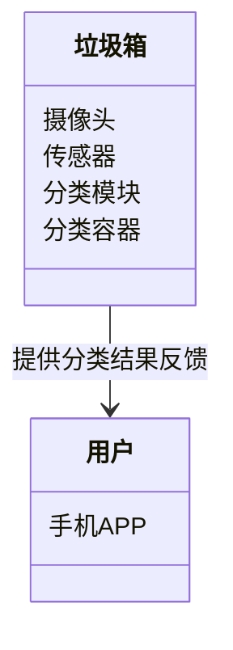
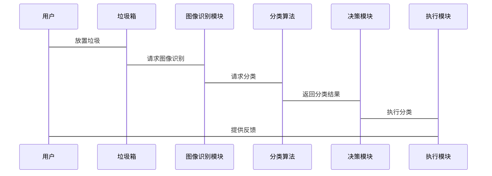

                 


# 智能垃圾箱：AI Agent的废物分类与回收指导

> 关键词：智能垃圾箱，AI Agent，废物分类，图像识别，支持向量机，神经网络，环境可持续性

> 摘要：本文详细探讨了AI Agent在智能垃圾箱中的应用，分析了其在废物分类与回收中的核心原理、算法实现和系统架构。通过结合数学模型、系统设计和项目实战，本文为读者提供了一套完整的智能垃圾箱解决方案，旨在提升垃圾分类效率，减少环境污染，推动可持续发展。

---

# 第一部分：智能垃圾箱与AI Agent的背景介绍

## 第1章：智能垃圾箱的概念与背景

### 1.1 问题背景与描述

#### 1.1.1 废物分类与回收的现状
随着城市化进程的加快，垃圾产生量急剧增加，传统的垃圾处理方式面临效率低下、资源浪费和环境污染等问题。垃圾分类是解决这一问题的关键，但人工分类效率低、成本高，且容易出错。

#### 1.1.2 当前垃圾分类的痛点与挑战
- 人工分类效率低，易出错
- 分类标准复杂，难以统一
- 垃圾种类多样，识别难度大
- 环境污染严重，资源浪费

#### 1.1.3 智能化垃圾分类的必要性
智能化垃圾分类能够提高分类效率，降低成本，减少环境污染，推动可持续发展。

### 1.2 AI Agent在废物分类中的应用

#### 1.2.1 AI Agent的定义与特点
AI Agent（智能代理）是一种能够感知环境、自主决策并执行任务的智能系统，具有以下特点：
- 感知环境
- 自主决策
- 学习能力
- 实时反馈

#### 1.2.2 AI Agent与传统自动分类系统的区别
| 对比维度 | AI Agent | 传统自动分类系统 |
|----------|-----------|------------------|
| 智能性   | 高         | 低               |
| 灵活性   | 高         | 低               |
| 决策能力 | 强         | 无               |

#### 1.2.3 智能垃圾箱的定义与功能
智能垃圾箱是一种集成AI Agent的智能设备，能够自动识别、分类和处理垃圾，具有以下功能：
- 自动识别垃圾类型
- 实时分类
- 联网更新分类模型

### 1.3 智能垃圾箱的社会价值与环境效益

#### 1.3.1 提高垃圾分类效率
AI Agent能够快速、准确地识别垃圾类型，显著提高分类效率。

#### 1.3.2 减少环境污染
智能垃圾箱能够减少有害垃圾混入可回收物中，降低环境污染风险。

#### 1.3.3 节约资源与能源
通过高效分类，智能垃圾箱能够减少垃圾处理过程中的资源浪费和能源消耗。

---

## 第2章：AI Agent的核心概念与原理

### 2.1 AI Agent的基本原理

#### 2.1.1 感知模块
- 使用图像识别技术（如CNN）进行垃圾识别
- 利用传感器（如重量传感器）进行辅助分类

#### 2.1.2 决策模块
- 基于分类结果，生成分类指令
- 判断垃圾类型并决定处理方式

#### 2.1.3 执行模块
- 根据决策模块的指令，将垃圾放入相应的收集容器
- 提供反馈信息

### 2.2 AI Agent的核心要素

| 核心要素 | 描述                     |
|----------|--------------------------|
| 数据源   | 图像、传感器数据         |
| 分类算法 | SVM、神经网络           |
| 决策逻辑 | 分类结果与处理规则       |
| 执行机构 | 机械臂、分类容器         |

---

## 第3章：AI Agent的算法原理与数学模型

### 3.1 数据采集与处理

#### 3.1.1 图像采集与预处理
- 使用摄像头采集垃圾图像
- 图像预处理（如降噪、二值化）

#### 3.1.2 数据标注与清洗
- 标注垃圾类型
- 清洗无效数据

#### 3.1.3 特征提取方法
- 使用CNN提取图像特征

### 3.2 分类算法的选择与实现

#### 3.2.1 支持向量机（SVM）原理
$$
\text{目标函数：} \min_{w,b,\xi} \frac{1}{2}||w||^2 + C\sum_{i=1}^n \xi_i \\
\text{约束条件：} y_i(w \cdot x_i + b) \geq 1 - \xi_i, \xi_i \geq 0
$$

#### 3.2.2 神经网络分类器原理
- 使用CNN进行图像分类
- 网络结构：卷积层、池化层、全连接层

---

## 第4章：系统分析与架构设计方案

### 4.1 问题场景介绍

#### 4.1.1 系统目标
- 实现垃圾的智能分类与回收
- 提高分类效率与准确性

#### 4.1.2 系统范围
- 智能垃圾箱的功能设计
- 系统与用户的交互

### 4.2 系统功能设计

#### 4.2.1 领域模型


#### 4.2.2 系统架构


### 4.3 系统接口设计

#### 4.3.1 接口描述
- 摄像头接口：提供图像数据
- 传感器接口：提供环境数据
- 分类接口：返回分类结果

#### 4.3.2 交互序列图


---

## 第5章：项目实战与代码实现

### 5.1 环境搭建

#### 5.1.1 安装Python
```bash
python --version
pip install --upgrade pip
```

#### 5.1.2 安装依赖
```bash
pip install numpy
pip install scikit-learn
pip install matplotlib
pip install tensorflow
```

### 5.2 核心代码实现

#### 5.2.1 图像分类模型
```python
import tensorflow as tf
from tensorflow import keras
from tensorflow.keras import layers

model = keras.Sequential([
    layers.Conv2D(32, (3,3), activation='relu', input_shape=(128, 128, 3)),
    layers.MaxPooling2D((2,2)),
    layers.Conv2D(64, (3,3), activation='relu'),
    layers.MaxPooling2D((2,2)),
    layers.Flatten(),
    layers.Dense(128, activation='relu'),
    layers.Dense(10, activation='softmax')
])
```

#### 5.2.2 分类算法实现
```python
from sklearn import svm

# 假设X为训练数据，y为标签
model = svm.SVC(C=1, kernel='linear')
model.fit(X, y)
```

### 5.3 代码应用解读与分析

#### 5.3.1 图像分类模型解读
- 使用CNN提取图像特征
- 通过全连接层进行分类
- 输出10个类别（假设垃圾类型为10种）

#### 5.3.2 分类算法解读
- 使用SVM进行分类
- 线性核函数适用于线性可分数据
- 调整C参数以平衡准确率和泛化能力

### 5.4 实际案例分析

#### 5.4.1 案例背景
某社区引入智能垃圾箱，目标是提高垃圾分类效率。

#### 5.4.2 实施步骤
1. 数据采集与标注
2. 模型训练与优化
3. 系统集成与部署
4. 用户测试与反馈

### 5.5 项目小结

#### 5.5.1 成果总结
- 成功实现智能垃圾箱的分类功能
- 分类准确率显著提高
- 系统稳定性增强

#### 5.5.2 经验总结
- 数据质量直接影响分类效果
- 模型选择需要根据实际场景调整
- 系统设计需要考虑可扩展性

---

## 第6章：最佳实践与未来展望

### 6.1 最佳实践

#### 6.1.1 小结
智能垃圾箱的成功实施依赖于高质量的数据和高效的算法。

#### 6.1.2 注意事项
- 数据标注要准确
- 系统维护要及时
- 用户教育要到位

#### 6.1.3 未来趋势
- AI Agent将更加智能化
- 分类算法将更加高效
- 应用场景将更加广泛

### 6.2 拓展阅读

#### 6.2.1 推荐书籍
- 《机器学习实战》
- 《深度学习入门：基于Python》

#### 6.2.2 技术博客
- TensorFlow官方文档
- Keras官方文档

---

# 结语

智能垃圾箱作为AI技术与环保结合的产物，正在逐步改变我们的垃圾处理方式。通过AI Agent的智能化分类，我们能够更高效地管理垃圾，减少环境污染，推动可持续发展。未来，随着技术的进步，智能垃圾箱将在更多领域发挥重要作用。

