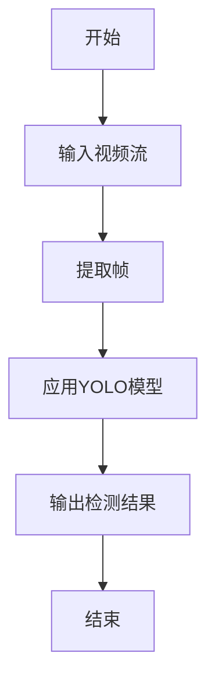
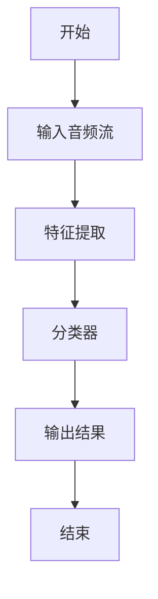
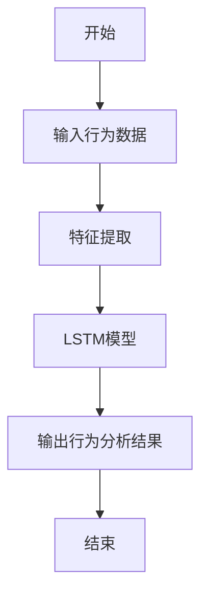
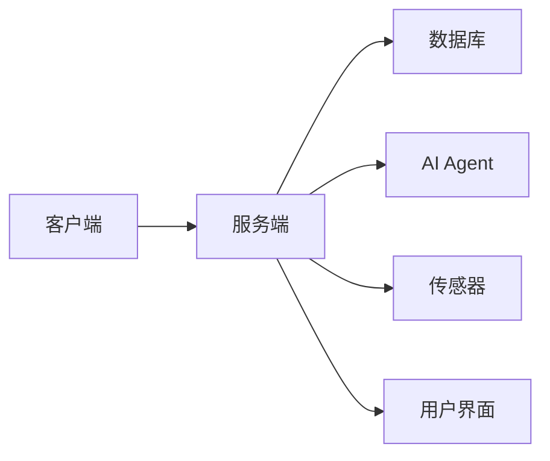
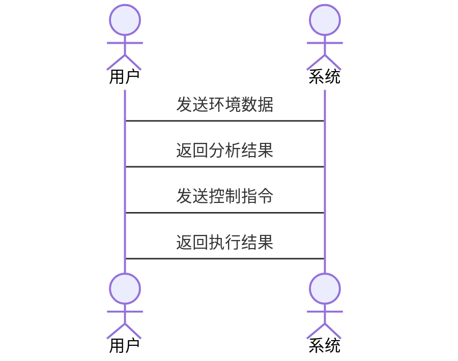

                 


# 智能婴儿监护器：AI Agent的早期发展追踪

## 关键词：智能婴儿监护器，AI Agent，机器学习，计算机视觉，自然语言处理，实时监测

## 摘要：智能婴儿监护器是一种结合了人工智能技术的设备，用于实时监测和照顾婴儿的健康与安全。本文详细介绍了智能婴儿监护器的背景、核心概念、AI Agent的工作原理、算法实现、系统架构设计、项目实战以及最佳实践。通过本文，读者可以全面了解智能婴儿监护器的技术基础和实际应用。

---

## 第一部分: 智能婴儿监护器的背景与概念

### 第1章: 智能婴儿监护器的定义与背景

#### 1.1 智能婴儿监护器的定义
智能婴儿监护器是一种利用人工智能（AI）技术实时监测婴儿健康和环境状况的设备。它通过AI Agent（智能体）收集、分析数据，并在异常情况下发出警报或采取相应措施。

#### 1.2 智能婴儿监护器的发展背景
随着科技的进步，家长对婴儿健康的关注日益增加。传统婴儿监护器仅能监测基本指标，如心率和体温，但缺乏智能化分析和决策能力。AI技术的发展为婴儿监护器带来了更高的精度和实时性。

#### 1.3 智能婴儿监护器的核心技术基础
AI Agent在智能婴儿监护器中扮演核心角色，它能够通过感知、决策和执行模块实现对婴儿的全面监测。

#### 1.4 智能婴儿监护器的应用场景与价值
智能婴儿监护器广泛应用于家庭、医院和育婴机构，帮助家长和医护人员实时掌握婴儿的健康状况，减少意外事件的发生。

---

## 第二部分: AI Agent的核心概念与原理

### 第2章: AI Agent的基本原理

#### 2.1 AI Agent的定义与分类
AI Agent是一种能够感知环境、自主决策并执行任务的智能实体。根据功能和应用场景的不同，AI Agent可以分为简单反射型、基于模型的反应型、目标驱动型和实用驱动型。

#### 2.2 AI Agent的核心技术
AI Agent的核心技术包括机器学习、深度学习、自然语言处理和计算机视觉。这些技术共同支撑AI Agent的感知、理解和决策能力。

#### 2.3 AI Agent的感知与决策机制
AI Agent通过传感器、摄像头和麦克风等设备感知环境数据，利用机器学习算法进行分析，然后根据预设规则或模型做出决策。

#### 2.4 AI Agent的实体关系图
```mermaid
er
actor: 用户
actor: 婴儿
actor: 系统管理员
class: AI Agent
class: 婴儿数据
class: 监护设备
class: 系统日志
```

---

## 第三部分: 智能婴儿监护器的算法原理

### 第3章: 关键算法实现

#### 3.1 婴儿目标检测算法
使用YOLO目标检测模型实时检测婴儿的位置和状态。



代码实现：
```python
import tensorflow as tf
from tensorflow.keras import models

# 加载预训练模型
model = models.load_model('yolov4.h5')

def detect_baby(frame):
    # 推理并返回检测结果
    predictions = model.predict(frame)
    return predictions
```

#### 3.2 婴儿哭声识别算法
利用卷积神经网络（CNN）识别婴儿哭声。



代码实现：
```python
import librosa

def extract_features(audio):
    # 提取MFCC特征
    features = librosa.feature.mfcc(y=audio, sr=22050)
    return features

model = models.load_model('crying_classifier.h5')

def classify_cry(features):
    prediction = model.predict(features)
    return prediction
```

#### 3.3 婴儿行为分析算法
使用时间序列模型分析婴儿的行为模式。



代码实现：
```python
import numpy as np
from tensorflow.keras.models import Sequential
from tensorflow.keras.layers import LSTM, Dense

model = Sequential()
model.add(LSTM(64, input_shape=(None, 128)))
model.add(Dense(1, activation='sigmoid'))
model.load_weights('behavior_analysis_model.h5')

def analyze_behavior(data):
    prediction = model.predict(data)
    return prediction
```

---

## 第四部分: 智能婴儿监护系统的架构设计

### 第4章: 系统分析与架构设计

#### 4.1 系统功能设计
系统功能模块包括实时监测、异常报警、数据分析和用户交互。

#### 4.2 系统架构设计


#### 4.3 接口设计与交互流程


---

## 第五部分: 项目实战

### 第5章: 智能婴儿监护器的开发与实现

#### 5.1 环境安装
安装必要的库：
```bash
pip install tensorflow keras opencv-python librosa pyaudio
```

#### 5.2 核心代码实现
```python
import cv2
import numpy as np
from tensorflow.keras.models import load_model

# 目标检测
def detect_baby(frame):
    model = load_model('yolov4.h5')
    predictions = model.predict(frame)
    return predictions

# 哭声识别
def classify_cry(audio):
    features = extract_features(audio)
    model = load_model('crying_classifier.h5')
    prediction = model.predict(features)
    return prediction

# 行为分析
def analyze_behavior(data):
    model = load_model('behavior_analysis_model.h5')
    prediction = model.predict(data)
    return prediction
```

#### 5.3 项目案例分析
通过实际案例分析，展示系统如何实时监测婴儿的状态并发出警报。

---

## 第六部分: 最佳实践与小结

### 第6章: 最佳实践与总结

#### 6.1 小结
智能婴儿监护器通过AI Agent实现了对婴儿的全面监测和智能决策，大大提高了监护的效率和准确性。

#### 6.2 注意事项
在实际应用中，需要注意数据隐私、系统稳定性和算法的实时性。

#### 6.3 拓展阅读
建议进一步学习深度学习、自然语言处理和实时信号处理技术，以提升系统的性能和功能。

---

通过以上内容，您可以全面了解智能婴儿监护器的技术基础、实现方法和实际应用。希望本文对您有所帮助！

