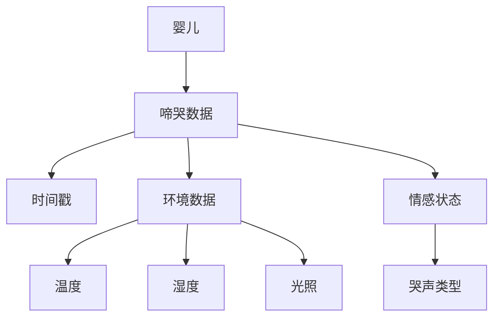
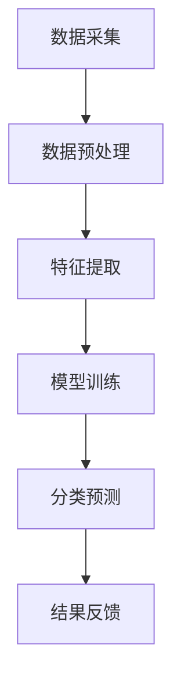
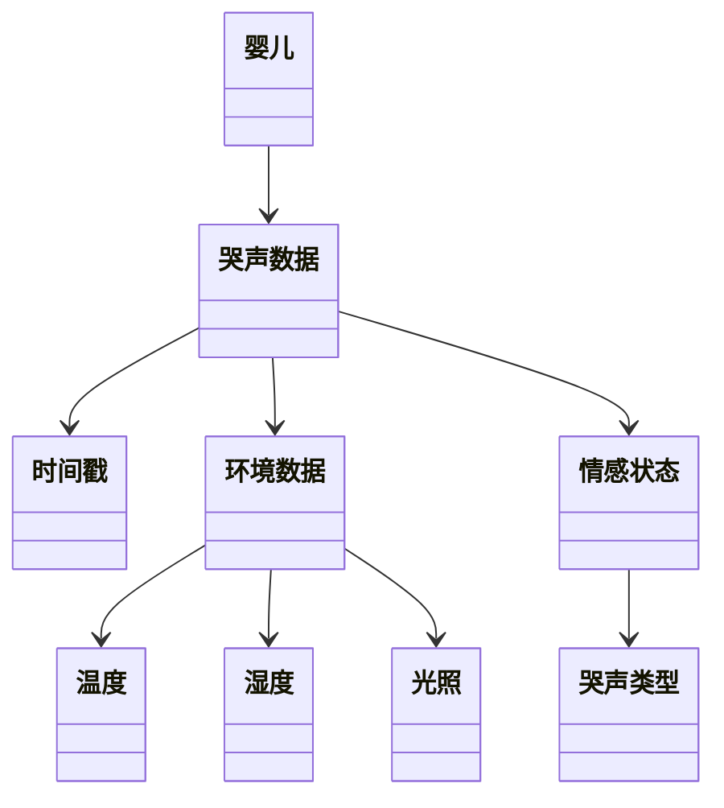
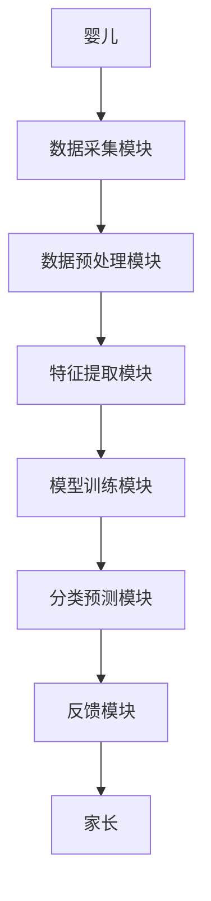
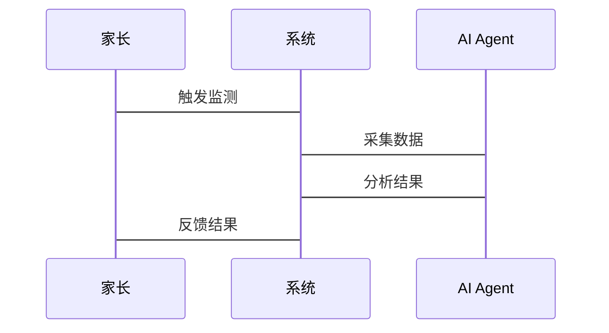

                 


# 智能婴儿监视器：AI Agent的啼哭原因分析

## 关键词：智能婴儿监视器，AI Agent，啼哭分析，机器学习，多模态数据

## 摘要：本文探讨了智能婴儿监视器在分析婴儿啼哭原因方面的应用。通过结合AI Agent和机器学习技术，系统能够识别和分类婴儿哭声，帮助家长快速确定原因。文章详细介绍了技术背景、核心概念、算法原理、系统架构和项目实战，并提出了最佳实践建议。

---

# 第1章: 智能婴儿监视器的背景介绍

## 1.1 问题背景

### 1.1.1 婴儿啼哭问题的普遍性
婴儿啼哭是新生儿期最常见的现象，通常与饥饿、尿布湿了、困倦或身体不适有关。然而，新手父母常常难以准确判断哭声的原因，尤其是在夜间或紧急情况下，这可能导致婴儿的不适甚至健康问题。

### 1.1.2 现有解决方案的局限性
传统方法依赖于家长的经验和直觉，这种方法存在以下问题：
- **误判风险**：家长可能无法准确判断婴儿的哭声原因，尤其是在疲劳或压力情况下。
- **响应延迟**：家长需要花时间分析哭声，这可能导致问题恶化。
- **缺乏数据支持**：缺乏客观的数据分析，难以提供精准的解决方案。

### 1.1.3 AI技术在婴儿监护中的潜力
人工智能（AI）技术能够通过声音分析、环境监测和数据融合，帮助家长快速识别婴儿哭声的原因。AI Agent（智能体）能够实时分析数据，提供及时的反馈，从而提高婴儿护理的效率和准确性。

---

## 1.2 问题描述

### 1.2.1 婴儿啼哭的不同原因
婴儿哭声的原因多种多样，包括：
- **生理需求**：饥饿、尿布湿、困倦。
- **情感需求**：感到孤独或不安。
- **健康问题**：疼痛、发烧或其他身体不适。

### 1.2.2 婴儿啼哭对家长和婴儿的影响
频繁的哭闹可能导致家长睡眠不足，影响他们的工作和生活。同时，婴儿长时间哭闹可能引发焦虑或其他健康问题。

### 1.2.3 婴儿监护的智能化需求
随着技术的发展，家长希望有一个智能化的解决方案，能够实时监测婴儿的状态，并提供及时的反馈。

---

## 1.3 问题解决

### 1.3.1 智能婴儿监视器的核心目标
智能婴儿监视器的目标是通过实时监测婴儿的哭声、环境数据和其他生理指标，分析哭声的原因，并提供相应的建议。

### 1.3.2 AI Agent在婴儿监护中的作用
AI Agent负责数据的采集、分析和反馈，能够快速识别哭声的原因，并通过用户友好的界面通知家长。

### 1.3.3 技术实现的基本思路
- **数据采集**：通过麦克风、环境传感器等设备采集婴儿的哭声和环境数据。
- **数据预处理**：对采集的数据进行降噪和特征提取。
- **模型训练**：使用机器学习算法训练分类模型，识别哭声的原因。
- **实时反馈**：通过AI Agent实时分析数据，并向家长提供反馈。

---

## 1.4 边界与外延

### 1.4.1 智能婴儿监视器的功能边界
- **数据采集**：仅限于婴儿的哭声和环境数据。
- **分析范围**：仅分析哭声的原因，不涉及其他健康问题。
- **反馈机制**：仅提供初步建议，不替代专业医疗诊断。

### 1.4.2 与其他智能设备的关联
智能婴儿监视器可以与其他智能家居设备（如智能灯、空调）联动，根据哭声的原因自动调节环境。

### 1.4.3 技术实现的可行性分析
- **技术可行性**：现有的AI和机器学习技术足以支持哭声分析。
- **数据需求**：需要大量标注的哭声数据进行模型训练。
- **用户接受度**：家长需要接受并信任AI的分析结果。

---

## 1.5 概念结构与核心要素

### 1.5.1 系统组成模块
- **数据采集模块**：负责采集婴儿的哭声和环境数据。
- **AI分析模块**：通过机器学习模型分析哭声的原因。
- **反馈模块**：向家长提供分析结果和建议。

### 1.5.2 核心要素的定义与关系
- **哭声数据**：哭声的时域和频域特征，如频率、幅度和时长。
- **环境数据**：温度、湿度、光照等环境参数。
- **分析模型**：基于机器学习的分类模型，如K近邻算法。

### 1.5.3 系统的输入输出关系
- **输入**：婴儿的哭声和环境数据。
- **输出**：哭声的原因分析和家长反馈。

---

# 第2章: AI Agent的核心概念与联系

## 2.1 核心概念原理

### 2.1.1 AI Agent的基本定义
AI Agent是一种智能体，能够感知环境并采取行动以实现目标。在智能婴儿监视器中，AI Agent负责数据的采集、分析和反馈。

### 2.1.2 基于AI的婴儿啼哭分析原理
- **数据采集**：通过麦克风采集婴儿的哭声。
- **特征提取**：提取哭声的时域和频域特征。
- **分类模型**：使用机器学习算法（如K近邻）分类哭声的原因。

### 2.1.3 多模态数据分析的实现方式
多模态数据包括声音、环境和生理数据。通过融合这些数据，可以更准确地分析婴儿的哭声原因。

---

## 2.2 核心概念属性特征对比

### 表2-1: 不同AI技术的特征对比

| 技术 | 输入数据 | 输出结果 | 优势 | 局限性 |
|------|----------|----------|------|--------|
| K近邻 | 声音特征 | 哭声类型 | 简单易实现 | 对特征工程依赖较高 |
| SVM   | 声音特征 | 哭声类型 | 高准确性 | 参数敏感性 |
| RNN   | 声音序列 | 哭声类型 | 处理时序数据能力强 | 训练复杂 |

---

## 2.3 ER实体关系图



---

# 第3章: 婴儿啼哭分析的算法原理

## 3.1 算法原理概述

### 3.1.1 机器学习模型的基本框架
机器学习模型的基本流程包括数据预处理、特征提取、模型训练和分类。

### 3.1.2 基于声音特征的分类方法
声音特征包括时域（如能量、零交叉率）和频域（如频谱、能量谱）特征。这些特征可以用于训练分类模型。

### 3.1.3 多模态数据融合的实现思路
通过融合声音、环境和生理数据，可以提高分类的准确性。例如，结合温度和湿度数据可以更好地判断婴儿是否因不适而哭闹。

---

## 3.2 算法流程图



---

## 3.3 算法实现代码

```python
import numpy as np
from sklearn.neighbors import KNeighborsClassifier

# 示例数据：假设我们有训练好的K近邻模型
# 输入特征：声音特征（时域和频域）
# 输出：哭声类型（0表示饥饿，1表示尿布湿，2表示其他）

# 示例数据集
X = np.array([[100, 500],  # 饥饿
              [80, 450],   # 尿布湿
              [90, 550],   # 其他
              [85, 480],   # 尿布湿
              [95, 520],   # 饥饿
              [88, 500]])  # 其他

y = np.array([0, 1, 2, 1, 0, 2])

# 训练模型
model = KNeighborsClassifier(n_neighbors=3)
model.fit(X, y)

# 示例测试数据
test_data = np.array([[90, 480]])

# 预测结果
predicted = model.predict(test_data)
print("预测的哭声类型：", predicted)
```

---

## 3.4 数学公式

### 3.4.1 K近邻算法的距离公式
$$d(x, y) = \sqrt{\sum_{i=1}^{n}(x_i - y_i)^2}$$

其中，\(x\) 和 \(y\) 分别是两个样本的特征向量，\(n\) 是特征的数量。

---

## 3.5 分类结果的解释
通过上述代码，我们可以训练一个K近邻模型，并用它来预测新的哭声类型。例如，测试数据 `[90, 480]` 被分类为 `1`，即尿布湿。

---

# 第4章: 系统分析与架构设计

## 4.1 系统组成模块

### 4.1.1 数据采集模块
- **功能**：采集婴儿的哭声和环境数据。
- **输入**：麦克风、温度、湿度、光照传感器。
- **输出**：声音数据和环境数据。

### 4.1.2 AI分析模块
- **功能**：分析哭声的原因。
- **输入**：预处理后的声音特征和环境数据。
- **输出**：哭声类型和建议。

### 4.1.3 反馈模块
- **功能**：向家长提供反馈。
- **输入**：分析结果。
- **输出**：用户友好的反馈界面。

---

## 4.2 系统功能设计

### 4.2.1 领域模型（类图）


---

## 4.3 系统架构设计

### 4.3.1 系统架构（架构图）


---

## 4.4 系统接口设计

### 4.4.1 接口描述
- **数据采集接口**：与麦克风和环境传感器连接。
- **反馈接口**：与家长的手机或智能设备连接。

### 4.4.2 交互流程


---

# 第5章: 项目实战

## 5.1 环境安装

### 5.1.1 安装Python和相关库
```bash
pip install numpy scikit-learn
```

## 5.2 系统核心实现源代码

### 5.2.1 数据预处理代码
```python
import numpy as np

# 示例数据：声音特征（时域和频域）
def preprocess(data):
    # 提取时域特征
    energy = np.mean(data**2)
    zero_crossings = np.sum(np.diff(np.sign(data)) > 0)
    
    # 提取频域特征
    fft = np.fft.fft(data)
    spectral_energy = np.mean(np.abs(fft)**2)
    
    return [energy, zero_crossings, spectral_energy]
```

---

## 5.3 代码应用解读与分析

### 5.3.1 数据预处理
数据预处理是机器学习模型的关键步骤。通过预处理，我们可以提取有用的特征，如能量和零交叉率。

---

## 5.4 实际案例分析

### 5.4.1 案例描述
假设有一个婴儿在晚上哭闹，家长希望通过智能婴儿监视器分析原因。

### 5.4.2 数据分析
- **声音数据**：哭声的能量较高，零交叉率较高。
- **环境数据**：温度适宜，湿度较高。

### 5.4.3 分类结果
模型预测哭声类型为“尿布湿”。

---

## 5.5 项目小结

通过实际案例分析，我们可以看到智能婴儿监视器在分析婴儿哭声原因方面的潜力。然而，实际应用中需要考虑数据质量、模型准确性和用户体验等问题。

---

# 第6章: 总结与展望

## 6.1 总结

智能婴儿监视器结合了AI Agent和机器学习技术，能够实时分析婴儿的哭声原因，并提供相应的建议。通过多模态数据的融合，系统能够更准确地识别哭声的原因，帮助家长更好地照顾婴儿。

---

## 6.2 展望

未来，智能婴儿监视器可以进一步优化算法，提高分类的准确性。同时，可以与其他智能设备联动，提供更全面的婴儿监护解决方案。

---

## 6.3 最佳实践 tips

- **数据质量**：确保数据的完整性和准确性。
- **模型优化**：定期更新模型，提高分类准确率。
- **用户体验**：设计用户友好的反馈界面，确保家长能够快速理解结果。

---

## 6.4 小结

智能婴儿监视器的实现依赖于多模态数据的融合和机器学习技术。通过不断优化算法和系统设计，我们可以为家长提供更高效、更准确的婴儿监护解决方案。

---

## 6.5 注意事项

- **隐私保护**：确保婴儿数据的安全性和隐私性。
- **系统维护**：定期检查硬件和软件，确保系统的稳定运行。

---

## 6.6 拓展阅读

- **相关书籍**：《机器学习实战》、《深度学习》。
- **技术博客**：查阅相关技术博客，了解最新的研究成果和应用案例。

---

通过以上内容，我们可以看到智能婴儿监视器在分析婴儿哭声原因方面的巨大潜力。未来，随着技术的不断发展，AI Agent将在婴儿监护领域发挥更大的作用，帮助家长更好地照顾婴儿。

