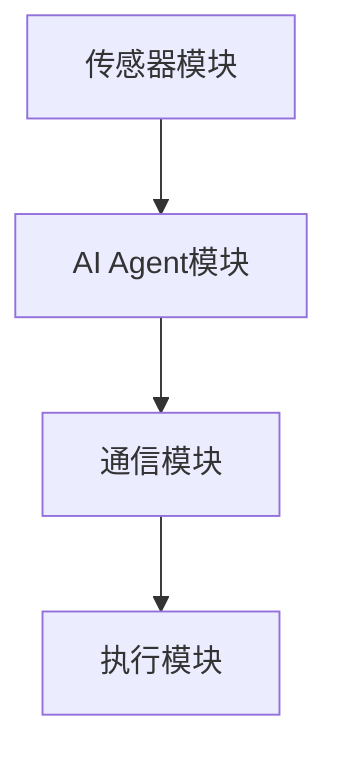
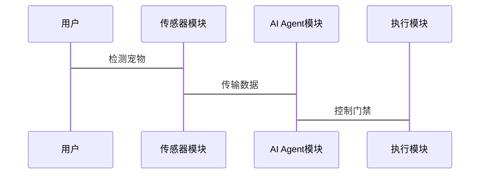

                 


# 智能宠物门：AI Agent的宠物出入管理

## 关键词：智能宠物门，AI Agent，宠物出入管理，物联网，机器学习

## 摘要：  
智能宠物门是一种结合AI Agent技术的智能设备，用于管理宠物的出入。本文详细介绍了智能宠物门的设计原理、AI Agent的核心算法、系统架构以及实际项目实现，为读者提供全面的技术解读。

---

# 第1章: 智能宠物门的背景与问题背景

## 1.1 智能宠物门的背景介绍

### 1.1.1 宠物管理的传统方式与痛点

传统宠物出入管理主要依赖手动操作，存在以下痛点：
- 宠物识别困难：无法准确识别不同宠物。
- 安全性低：手动管理容易出错，导致宠物随意出入。
- 不便性：主人需要频繁开关门，影响使用体验。

### 1.1.2 智能化宠物管理的需求

随着智能家居的发展，智能化宠物管理的需求日益增长：
- 自动识别宠物身份
- 实时监控宠物出入
- 提供便捷的管理方式

### 1.1.3 AI Agent技术的发展与应用

AI Agent技术在宠物管理中的应用为智能宠物门提供了技术支持：
- 自动识别宠物行为
- 实时反馈优化管理
- 提供智能化决策

## 1.2 智能宠物门的定义与问题描述

### 1.2.1 智能宠物门的定义

智能宠物门是一种结合AI Agent和物联网技术的智能设备，能够自动识别宠物身份，并根据预设规则控制宠物的出入。

### 1.2.2 宠物出入管理的核心问题

宠物出入管理的核心问题包括：
- 宠物身份识别
- 出入权限管理
- 出入行为监控

### 1.2.3 智能宠物门的功能边界与外延

智能宠物门的功能边界包括：
- 宠物身份识别
- 出入权限控制
- 出入行为记录

功能外延包括：
- 宠物健康监测
- 宠物行为分析
- 用户远程控制

## 1.3 智能宠物门的核心要素与概念结构

### 1.3.1 核心要素组成

智能宠物门的核心要素包括：
- 智能传感器：用于采集宠物信息
- AI Agent：用于处理数据并做出决策
- 物联网通信：用于设备间的数据传输

### 1.3.2 概念结构与功能模块

智能宠物门的概念结构包括：
- 传感器模块：负责采集宠物数据
- AI Agent模块：负责数据处理和决策
- 通信模块：负责数据传输和设备控制

### 1.3.3 核心概念的关联与对比

| 概念 | 描述 |
|------|------|
| 传感器模块 | 采集宠物数据 |
| AI Agent模块 | 处理数据并做出决策 |
| 通信模块 | 传输数据并控制设备 |

## 1.4 本章小结

本章详细介绍了智能宠物门的背景、定义、核心问题以及功能结构，为后续章节奠定了基础。

---

# 第2章: AI Agent的基本原理

## 2.1 AI Agent的定义与特点

### 2.1.1 AI Agent的定义

AI Agent是一种智能体，能够感知环境、自主决策并执行任务。

### 2.1.2 AI Agent的核心特点

- 智能感知：能够感知环境并做出决策
- 自主性：能够自主完成任务
- 反应性：能够实时响应环境变化

## 2.2 AI Agent的决策机制

### 2.2.1 基于规则的决策

基于规则的决策通过预设规则来做出决策，适用于简单的场景。

### 2.2.2 基于学习的决策

基于学习的决策通过机器学习算法来训练模型，适用于复杂场景。

### 2.2.3 基于反馈的优化

基于反馈的优化通过实时反馈来不断优化决策，提高准确性。

## 2.3 AI Agent与智能宠物门的结合

### 2.3.1 AI Agent在宠物出入管理中的应用

AI Agent用于宠物身份识别和出入权限管理。

### 2.3.2 智能宠物门的AI Agent架构

智能宠物门的AI Agent架构包括感知层、决策层和执行层。

### 2.3.3 AI Agent的核心算法与实现

AI Agent的核心算法包括机器学习算法和规则引擎。

---

# 第3章: AI Agent的算法原理

## 3.1 基于机器学习的宠物识别

### 3.1.1 机器学习的基本原理

机器学习通过数据训练模型，能够识别宠物的特征。

### 3.1.2 宠物识别的特征提取

特征提取是机器学习模型的关键步骤，常用的特征包括颜色、形状和纹理。

### 3.1.3 基于卷积神经网络的宠物识别

卷积神经网络（CNN）是一种常用的图像识别算法，适用于宠物识别。

## 3.2 基于规则的宠物行为分析

### 3.2.1 规则的定义与设计

规则是基于经验制定的，用于判断宠物的行为是否符合预期。

### 3.2.2 基于规则的决策流程

基于规则的决策流程包括数据采集、规则匹配和结果输出。

### 3.2.3 规则优化与调整

规则需要不断优化和调整，以适应不同场景的需求。

## 3.3 基于反馈的优化算法

### 3.3.1 反馈机制的定义

反馈机制是根据结果调整决策的过程。

### 3.3.2 基于反馈的优化流程

优化流程包括数据采集、反馈分析和规则调整。

### 3.3.3 优化

优化是通过反馈机制不断改进算法，提高准确性。

---

# 第4章: 智能宠物门的系统架构设计

## 4.1 系统架构概述

智能宠物门的系统架构包括感知层、决策层和执行层。

## 4.2 系统功能设计

### 4.2.1 宠物身份识别

通过传感器和AI Agent实现宠物身份识别。

### 4.2.2 出入权限管理

通过预设规则控制宠物的出入权限。

### 4.2.3 出入行为记录

记录宠物的出入时间和行为。

## 4.3 系统架构图



## 4.4 系统接口设计

系统接口包括传感器接口、通信接口和用户接口。

## 4.5 系统交互流程图



---

# 第5章: 项目实战

## 5.1 环境安装

### 5.1.1 硬件安装

安装传感器和通信模块，确保设备正常工作。

### 5.1.2 软件安装

安装AI Agent和通信模块的驱动程序。

## 5.2 核心代码实现

### 5.2.1 传感器数据采集

```python
import sensor

def get_pet_data():
    return sensor.read_data()
```

### 5.2.2 AI Agent决策

```python
import ai_agent

def make_decision(data):
    return ai_agent.decision(data)
```

### 5.2.3 门禁控制

```python
import actuator

def control_door(action):
    actuator.actuate(action)
```

## 5.3 代码应用解读与分析

通过上述代码实现宠物身份识别、决策和门禁控制。

## 5.4 实际案例分析

以实际案例说明智能宠物门的应用效果。

## 5.5 项目小结

总结项目实现的过程和经验。

---

# 第6章: 最佳实践与小结

## 6.1 最佳实践 tips

### 6.1.1 系统设计

建议采用模块化设计，便于维护和扩展。

### 6.1.2 算法选择

建议根据具体场景选择合适的算法。

### 6.1.3 硬件配置

建议选择高性能传感器和通信模块。

## 6.2 项目小结

总结智能宠物门的设计和实现过程。

## 6.3 注意事项

注意事项包括设备维护、数据安全和隐私保护。

## 6.4 拓展阅读

推荐相关书籍和论文，供读者进一步学习。

---

# 第7章: 附录

## 7.1 相关技术资料

包括传感器类型、通信协议等。

## 7.2 工具与资源

推荐开发工具和学习资源。

---

# 结语

智能宠物门通过AI Agent和物联网技术，为宠物出入管理提供了智能化的解决方案。本文详细介绍了智能宠物门的设计原理、算法实现和系统架构，并通过项目实战展示了具体实现过程。希望本文能为读者提供有价值的参考，推动智能宠物门技术的发展。

