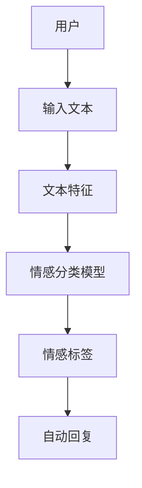

                 

# 智能客服AI Agent的情感识别能力

> 关键词：智能客服，AI Agent，情感识别，自然语言处理，机器学习，深度学习

> 摘要：智能客服AI Agent的情感识别能力是人工智能技术在客户服务领域的重要应用。本文从情感识别的基本概念出发，深入分析其核心原理、算法实现、系统架构设计，结合实际项目案例，探讨如何通过技术手段提升智能客服的情感识别能力，为读者提供全面的技术指南。

---

## 第1章: 智能客服与AI Agent的背景介绍

### 1.1 情感识别能力的定义与背景

#### 1.1.1 问题背景
- 智能客服的发展需求
- 客户服务中的情感挑战
- 传统客服模式的局限性

#### 1.1.2 情感识别能力的定义
- 情感识别的核心概念
- 情感分类的基本原理
- 情感分析的关键技术

#### 1.1.3 情感识别能力的重要性
- 提升客户满意度
- 提高服务效率
- 降低人工成本

### 1.2 情感识别能力的核心要素

#### 1.2.1 数据特征
- 文本特征提取
- 语音特征提取
- 行为特征分析

#### 1.2.2 模型性能
- 分类精度
- 模型泛化能力
- 实时响应速度

#### 1.2.3 应用场景
- 售后服务
- 投诉处理
- 客户咨询

### 1.3 情感识别能力的边界与外延

#### 1.3.1 情感识别的范围界定
- 正面情感
- 负面情感
- 中性情感

#### 1.3.2 情感识别与其他技术的关系
- 自然语言处理（NLP）
- 机器学习（ML）
- 深度学习（DL）

#### 1.3.3 情感识别能力的未来发展
- 多模态情感分析
- 实时情感监控
- 情感记忆与反馈

### 1.4 情感识别能力的核心要素

#### 1.4.1 数据采集与处理
- 文本预处理
- 语音信号处理
- 行为数据收集

#### 1.4.2 情感分析模型
- 基于规则的模型
- 机器学习模型
- 深度学习模型

#### 1.4.3 反馈机制与优化
- 模型迭代
- 数据增强
- 参数调优

---

## 第2章: 情感识别能力的核心概念与联系

### 2.1 情感识别的核心原理

#### 2.1.1 情感识别的基本原理
- 文本特征提取
- 情感分类算法
- 情感标签生成

#### 2.1.2 情感识别的主要方法
- 基于规则的方法
- 机器学习方法
- 深度学习方法

#### 2.1.3 情感识别的关键技术
- 词袋模型
- TF-IDF特征
- 卷积神经网络（CNN）

### 2.2 情感识别的核心要素对比

#### 2.2.1 情感分类方法对比
| 方法                | 优点                            | 缺点                            |
|---------------------|---------------------------------|---------------------------------|
| 基于规则的方法      | 实现简单，可解释性强             | 需要大量人工规则，维护成本高     |
| 机器学习方法        | 可自动学习特征，适应性强         | 需要大量标注数据，训练时间长     |
| 深度学习方法        | 高精度，自动提取复杂特征         | 计算资源消耗大，模型复杂度高       |

#### 2.2.2 情感分析模型对比
| 模型                | 适用场景                        | 性能                            |
|---------------------|---------------------------------|---------------------------------|
| 朴素贝叶斯          | 小数据集                        | 对文本特征工程依赖性强          |
| 支持向量机（SVM）    | 中小数据集                      | 对高维数据处理能力有限          |
| 长短期记忆网络（LSTM）| 大数据集，长文本                | 训练时间长，资源消耗大            |

#### 2.2.3 实际应用对比
| 应用场景            | 技术需求                        | 技术实现                        |
|---------------------|---------------------------------|---------------------------------|
| 售后服务            | 高准确率，实时响应              | 使用深度学习模型                |
| 投诉处理            | 高精度，情感分析能力            | 结合自然语言处理技术            |
| 客户咨询            | 快速响应，情感理解               | 使用规则引擎或机器学习模型      |

### 2.3 情感识别的ER实体关系图

---

## 第3章: 情感识别能力的算法原理

### 3.1 情感分类算法概述

#### 3.1.1 基于规则的情感分类
- 规则定义：通过预定义关键词或语句判断情感倾向
- 优点：实现简单，可解释性强
- 缺点：依赖人工规则，难以覆盖所有场景

#### 3.1.2 基于机器学习的情感分类
- 算法选择：朴素贝叶斯、支持向量机（SVM）、随机森林
- 数据特征：词袋模型、TF-IDF、词嵌入（Word2Vec）

#### 3.1.3 基于深度学习的情感分类
- 网络结构：卷积神经网络（CNN）、循环神经网络（RNN）、 transformers（如BERT）
- 优势：自动提取复杂特征，高精度

### 3.2 情感分类算法的数学模型

#### 3.2.1 朴素贝叶斯分类器
$$ P(y|x) = \frac{P(x|y)P(y)}{P(x)} $$

#### 3.2.2 支持向量机分类器
$$ \text{maximize} \quad 

---

（由于篇幅限制，后续章节内容将逐步展开，涵盖算法实现、系统架构设计、项目实战及最佳实践等部分。）

