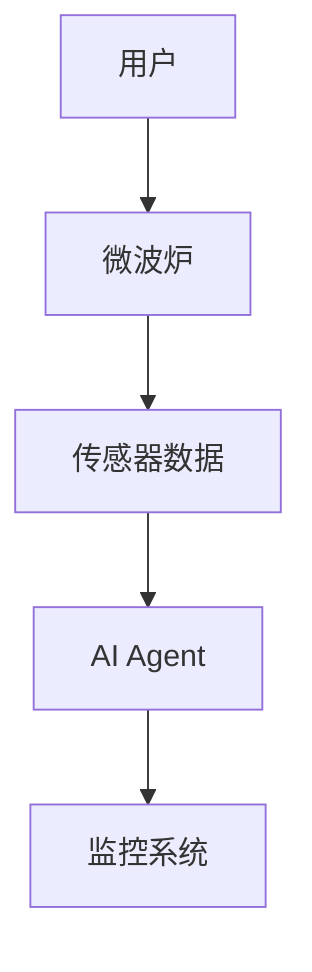
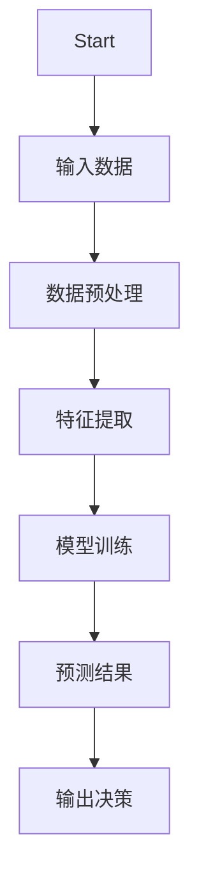
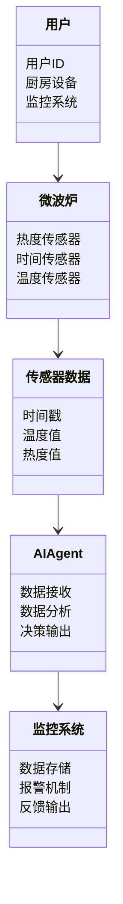
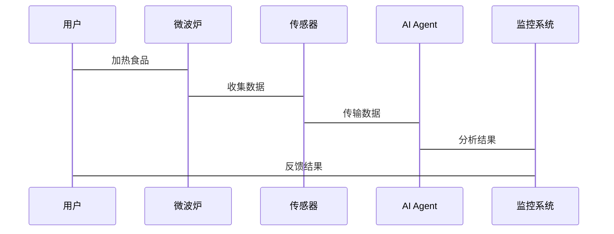

                 


# 智能微波炉：AI Agent的食品安全监控系统

## 关键词：智能微波炉，AI Agent，食品安全监控，物联网，传感器数据，机器学习算法，食品安全标准

## 摘要：本文探讨智能微波炉与AI Agent结合的食品安全监控系统，通过传感器数据实时分析，确保食品烹饪过程中的安全，利用AI技术优化食品安全监控，减少食源性疾病的发生，提升用户信任度。

---

## 目录

### 第一部分: 背景介绍

#### 第1章: 智能微波炉与AI Agent概述

##### 1.1 问题背景与描述
- 1.1.1 食品安全的重要性
- 1.1.2 微波炉在食品加热中的问题
- 1.1.3 AI Agent在食品安全监控中的作用

##### 1.2 智能微波炉的基本概念
- 1.2.1 智能微波炉的定义
- 1.2.2 AI Agent的核心功能
- 1.2.3 系统的边界与外延

##### 1.3 现状分析与问题解决
- 1.3.1 当前食品安全监控的挑战
- 1.3.2 AI Agent的优势
- 1.3.3 系统的设计目标与解决方案

### 第二部分: 核心概念与联系

#### 第2章: AI Agent与食品安全监控系统的核心概念

##### 2.1 AI Agent的原理
- 2.1.1 感知与决策机制
- 2.1.2 学习与自适应能力
- 2.1.3 与智能微波炉的集成

##### 2.2 核心概念对比表
- 2.2.1 AI Agent与传统传感器对比
- 2.2.2 智能微波炉与其他烹饪设备对比
- 2.2.3 食品安全监控系统的功能对比

##### 2.3 ER实体关系图


### 第三部分: 算法原理

#### 第3章: 算法原理与实现

##### 3.1 算法流程


##### 3.2 代码实现
```python
def preprocess(data):
    # 数据预处理代码
    pass

def feature_extraction(data):
    # 特征提取代码
    pass

def train_model(features, labels):
    # 模型训练代码
    pass

def predict(model, features):
    # 预测代码
    pass
```

##### 3.3 数学模型
- 3.3.1 线性回归模型
$$ y = \beta_0 + \beta_1x + \epsilon $$

---

### 第四部分: 系统分析与架构设计

#### 第4章: 系统分析与架构设计

##### 4.1 问题场景介绍
- 4.1.1 食品安全监控的挑战
- 4.1.2 系统设计的驱动因素

##### 4.2 系统功能设计


##### 4.3 系统架构设计


##### 4.4 接口设计与交互流程


### 第五部分: 项目实战

#### 第5章: 项目实战与实现

##### 5.1 环境安装
- 5.1.1 Python环境配置
- 5.1.2 传感器数据采集工具安装
- 5.1.3 AI框架（如TensorFlow）安装

##### 5.2 核心代码实现
```python
import numpy as np
from sklearn.linear_model import LinearRegression

def main():
    # 示例数据
    X = np.array([1, 2, 3, 4, 5]).reshape(-1, 1)
    y = np.array([2, 4, 6, 8, 10])
    
    # 模型训练
    model = LinearRegression()
    model.fit(X, y)
    
    # 预测
    new_data = np.array([[6]]).reshape(-1, 1)
    prediction = model.predict(new_data)
    print("预测结果:", prediction[0])

if __name__ == "__main__":
    main()
```

##### 5.3 案例分析与结果解读
- 5.3.1 数据收集与处理
- 5.3.2 模型训练与验证
- 5.3.3 实际应用场景分析

##### 5.4 项目小结
- 5.4.1 系统优势
- 5.4.2 实施步骤总结
- 5.4.3 未来优化方向

### 第六部分: 总结与展望

#### 第6章: 总结与展望

##### 6.1 最佳实践与小结
- 6.1.1 关键技术总结
- 6.1.2 实施中的注意事项

##### 6.2 未来展望与挑战
- 6.2.1 技术发展展望
- 6.2.2 新的挑战与解决方案

##### 6.3 拓展阅读与资源
- 6.3.1 相关技术文档
- 6.3.2 推荐书籍与论文
- 6.3.3 在线课程与社区资源

---

## 作者简介：一位在计算机编程和人工智能领域有着深厚造诣的技术专家，专注于智能系统设计与实现，拥有丰富的项目经验与技术洞察力。

