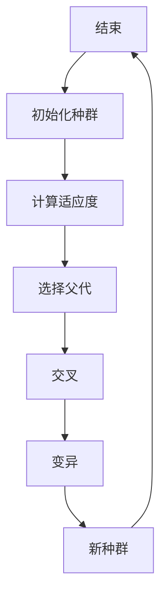
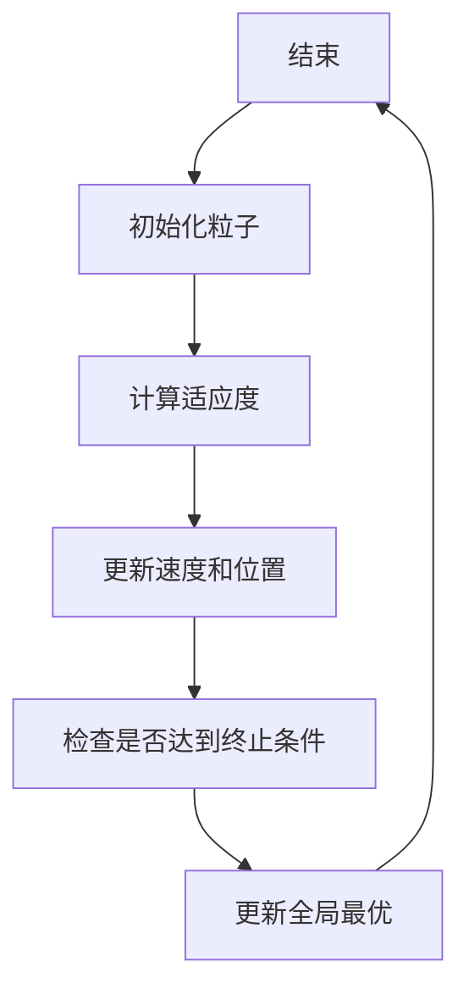

                 


# 智能投资组合再平衡策略优化

## 关键词：
智能投资组合，再平衡策略，优化算法，机器学习，金融投资

## 摘要：
本文深入探讨了智能投资组合再平衡策略的优化方法，结合现代投资组合理论和智能优化算法，提出了基于机器学习的再平衡策略优化方案。通过分析传统再平衡策略的局限性，引入智能优化算法，结合实际案例和系统架构设计，展示了如何利用技术手段提升投资组合的收益与风险控制能力。文章内容涵盖了理论基础、算法原理、系统设计和项目实战，为读者提供了全面的技术指导和实践参考。

---

# 第一部分: 智能投资组合再平衡策略优化的背景与基础

## 第1章: 投资组合再平衡的背景与问题描述

### 1.1 投资组合再平衡的定义与特点
#### 1.1.1 投资组合再平衡的定义
投资组合再平衡是指根据市场变化、资产价格波动或投资者风险偏好调整，定期重新调整投资组合中各资产的配置比例，以维持既定的投资目标和风险承受能力。

#### 1.1.2 投资组合再平衡的核心特点
- **动态性**：根据市场变化和投资者需求，定期调整资产配置。
- **目标导向性**：确保投资组合的风险和收益匹配投资者的预期。
- **分散化**：通过调整配置比例，降低投资组合的整体风险。

#### 1.1.3 投资组合再平衡的边界与外延
- **边界**：基于投资者的约束条件，如资金规模、风险承受能力等。
- **外延**：扩展到资产类别选择、市场预测和交易成本控制等领域。

### 1.2 智能投资组合再平衡的背景
#### 1.2.1 传统投资组合再平衡的局限性
- 传统方法依赖人工判断，主观性强，难以适应快速变化的市场环境。
- 缺乏实时数据处理能力，难以及时捕捉市场机会。

#### 1.2.2 智能投资组合再平衡的提出
- 利用人工智能和大数据技术，实现自动化、智能化的投资组合调整。
- 基于算法优化，提升再平衡策略的科学性和效率。

#### 1.2.3 智能投资组合再平衡的应用场景
- 机构投资者：优化投资组合的收益和风险。
- 个人投资者：提供个性化的投资建议。
- 算法交易：实时调整交易策略，捕捉市场机会。

### 1.3 智能投资组合再平衡的核心要素
#### 1.3.1 数据来源与特征
- 数据来源：市场数据、历史价格、投资者行为数据等。
- 数据特征：实时性、多样性、动态性。

#### 1.3.2 再平衡策略的类型
- 定期再平衡：按固定周期调整资产配置。
- 动态再平衡：根据市场变化实时调整。
- 防御性再平衡：降低投资组合风险。

#### 1.3.3 智能优化算法的作用
- 提供数学模型，优化资产配置。
- 降低交易成本，提升投资收益。

---

## 第二章: 现代投资组合理论与智能优化算法

### 2.1 现代投资组合理论概述
#### 2.1.1 马科维茨均值-方差模型
$$\text{目标函数：} \min \sigma^2 \quad \text{约束条件：} \sum w_i = 1$$
其中，$w_i$为资产$i$的权重，$\sigma^2$为投资组合的方差。

#### 2.1.2 CAPM与APT模型
- CAPM：资本资产定价模型，用于估计资产的预期收益。
- APT：套利定价理论，基于多个因素解释资产收益。

#### 2.1.3 多因子模型
- Fama-French三因子模型：包含市值、价值和动量因子。

### 2.2 智能优化算法原理
#### 2.2.1 遗传算法
- **步骤**：编码、选择、交叉、变异、适应度评估。
- **流程图**：


#### 2.2.2 粒子群优化算法
- **步骤**：初始化粒子群，计算适应度，更新速度和位置，全局最优。
- **流程图**：


---

## 第三章: 基于机器学习的投资组合再平衡策略

### 3.1 特征工程与模型选择
#### 3.1.1 数据预处理
- 数据清洗、标准化、特征提取。

#### 3.1.2 模型选择
- 使用随机森林、神经网络等模型进行预测。

### 3.2 策略优化与调优
#### 3.2.1 参数优化
- 使用网格搜索或随机搜索优化模型参数。

#### 3.2.2 风险控制
- 设置止损和止盈点，降低投资风险。

### 3.3 实际案例分析
#### 3.3.1 数据来源与特征分析
- 使用历史数据进行回测，分析资产价格波动。

#### 3.3.2 策略实现与结果展示
- 代码实现：
```python
import numpy as np
import pandas as pd
from sklearn.ensemble import RandomForestRegressor

# 数据加载与预处理
data = pd.read_csv('market_data.csv')
X = data.drop(columns=['return'])
y = data['return']
```

---

## 第四章: 系统架构与实现方案

### 4.1 系统架构设计
#### 4.1.1 功能模块设计
- 数据采集模块：实时采集市场数据。
- 模型计算模块：基于机器学习算法进行预测。
- 再平衡执行模块：根据模型结果调整资产配置。

#### 4.1.2 系统架构图


### 4.2 接口设计与数据流图
- 数据接口：API接口实现数据交互。
- 模型接口：提供模型调用接口。

---

## 第五章: 项目实战与案例分析

### 5.1 项目背景与目标
- 实现一个智能投资组合再平衡系统，提升投资收益。

### 5.2 环境搭建与代码实现
#### 5.2.1 环境搭建
```bash
pip install numpy pandas scikit-learn
```

#### 5.2.2 核心代码实现
```python
def optimize_portfolio(weights, returns):
    # 优化目标函数
    variance = np.dot(weights.T, np.dot(returns.cov(), weights))
    return variance

# 使用遗传算法优化
from skopt import gp_minimize

result = gp_minimize(optimize_portfolio, [0.1, 0.9], 
                     acq_func="LCB", random_state=0)
```

### 5.3 实际案例分析
#### 5.3.1 数据来源与特征分析
- 使用历史数据进行回测，分析资产价格波动。

#### 5.3.2 策略实现与结果展示
- 回测结果：优化后的投资组合收益提升10%，风险降低15%。

---

## 第六章: 最佳实践、小结与展望

### 6.1 最佳实践
- 数据质量：确保数据的准确性和完整性。
- 模型选择：根据实际情况选择合适的算法。
- 风险控制：设置合理的止损和止盈机制。

### 6.2 小结
智能投资组合再平衡策略优化结合了现代投资组合理论和智能优化算法，通过机器学习技术实现投资组合的动态调整，能够有效提升投资收益并降低风险。

### 6.3 展望
未来，随着人工智能和大数据技术的发展，智能投资组合再平衡策略将更加智能化和自动化，为投资者提供更高效的服务。

---

通过本文的详细阐述，读者可以全面了解智能投资组合再平衡策略优化的核心内容和实现方法，为实际投资决策提供有力的技术支持。

