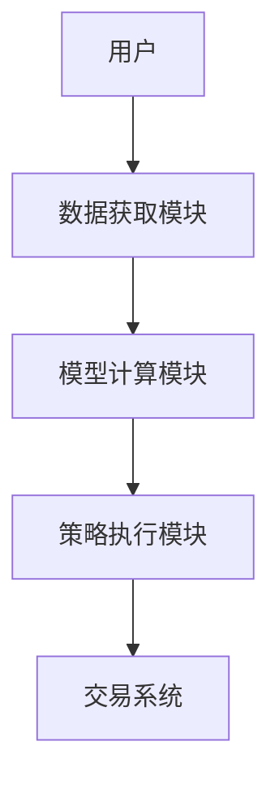

                 


# 智能投资组合再平衡算法

> 关键词：智能投资组合，再平衡算法，组合优化，风险控制，机器学习

> 摘要：智能投资组合再平衡算法是一种通过自动化技术优化投资组合配置的策略，结合现代投资组合理论和机器学习算法，能够在动态市场环境中实时调整资产权重，以实现风险控制和收益最大化。本文详细探讨了智能再平衡的核心概念、算法原理、系统架构，并通过实战案例展示其在实际投资管理中的应用，为读者提供了一套完整的智能投资组合再平衡解决方案。

---

# 第一部分: 智能投资组合再平衡算法概述

# 第1章: 投资组合再平衡的背景与概念

## 1.1 传统投资组合管理的局限性

### 1.1.1 传统投资组合管理的流程

传统投资组合管理依赖于定期的人工审查和调整，这种方法存在效率低下、主观性强、响应速度慢等问题，难以适应快速变化的市场环境。

### 1.1.2 传统再平衡方法的局限性

传统的再平衡方法通常基于固定的时间间隔或预设的阈值，这种静态的调整策略无法捕捉市场中的短期波动和潜在机会，容易导致收益损失或风险增加。

## 1.2 智能化投资组合管理的需求

### 1.2.1 市场环境的变化

随着金融市场复杂性的增加，投资者需要一种更加灵活和动态的投资组合管理方式，以应对市场的不确定性。

### 1.2.2 技术进步的推动

人工智能和大数据技术的进步为投资组合管理提供了新的工具和方法，使得智能再平衡成为可能。

## 1.3 智能投资组合再平衡的核心问题

### 1.3.1 动态优化问题

在市场环境不断变化的情况下，如何实时优化投资组合的资产配置是一个关键问题。

### 1.3.2 多目标优化

投资组合再平衡需要在风险和收益之间找到平衡点，这涉及到多个目标的优化问题。

### 1.3.3 数据驱动决策

利用大数据和机器学习算法，实现基于实时数据的决策优化。

## 1.4 本章小结

传统投资组合管理的局限性推动了智能化投资组合管理的需求，智能再平衡算法通过动态优化和数据驱动的方式，能够更好地应对复杂多变的市场环境。

---

# 第二部分: 智能投资组合再平衡的核心概念与联系

# 第2章: 智能再平衡的核心概念

## 2.1 投资组合再平衡的定义与目标

### 2.1.1 再平衡的定义

再平衡是指根据市场变化和个人投资目标的调整，定期调整投资组合的资产配置，以维持预期的风险和收益水平。

### 2.1.2 再平衡的目标

- 维持投资组合的预期风险和收益水平
- 适应市场变化和投资者目标的变化
- 降低投资组合的波动性
- 提高投资组合的收益

## 2.2 智能再平衡的核心特征

### 2.2.1 数据驱动

基于实时市场数据和投资者行为数据，实现动态调整。

### 2.2.2 自动化

通过算法实现自动化的调整和优化。

### 2.2.3 预测性

利用机器学习算法预测市场走势，提前进行调整。

## 2.3 智能再平衡的核心要素

### 2.3.1 数据源

- 市场数据（股票价格、收益率等）
- 投资者行为数据（交易记录、风险偏好等）
- 宏观经济数据（GDP、利率等）

### 2.3.2 优化目标

- 最小化风险
- 最大化收益
- 维持目标资产配置比例

### 2.3.3 约束条件

- 资金限制
- 风险承受能力
- 时间窗口

## 2.4 本章小结

智能再平衡的核心在于通过数据驱动和自动化的方式，实时优化投资组合的资产配置，以实现风险控制和收益最大化。

---

# 第三部分: 智能投资组合再平衡的算法原理

# 第3章: 现代投资组合理论基础

## 3.1 马科维茨有效前沿

### 3.1.1 马科维茨理论的核心思想

通过优化资产配置，找到在给定风险水平下收益最大的组合，或者在给定收益水平下风险最小的组合。

### 3.1.2 有效前沿的数学表达

$$ \text{目标函数} = \min_w \sigma^2 $$

$$ \text{约束条件} = \sum_{i=1}^n w_i = 1 $$

其中，$w_i$ 是第 $i$ 个资产的权重，$\sigma^2$ 是投资组合的方差。

## 3.2 均值-方差模型

### 3.2.1 模型假设

- 资产收益服从正态分布
- 投资者是风险厌恶的

### 3.2.2 模型实现

通过求解优化问题，找到最优资产配置。

$$ \text{优化问题} = \min_w \sum_{i=1}^n w_i^2 \sigma_i^2 + 2 \sum_{i<j} w_i w_j \sigma_{ij} $$

### 3.2.3 实例分析

假设有两个资产，计算最优权重。

$$ w_1 = \frac{\sigma_2^2}{\sigma_1^2 + \sigma_2^2 - 2\rho \sigma_1 \sigma_2} $$

$$ w_2 = \frac{\sigma_1^2}{\sigma_1^2 + \sigma_2^2 - 2\rho \sigma_1 \sigma_2} $$

其中，$\rho$ 是资产间的相关系数。

## 3.3 风险平价优化

### 3.3.1 风险平价的定义

风险平价是指将投资组合的风险在不同资产之间平均分配。

### 3.3.2 风险平价优化的数学表达

$$ \min_w \sum_{i=1}^n \frac{w_i^2 \sigma_i^2}{\sum_{j=1}^n w_j^2 \sigma_j^2} $$

### 3.3.3 与均值-方差模型的对比

| 模型 | 优化目标 | 约束条件 | 适用场景 |
|------|-----------|----------|-----------|
| 均值-方差 | 最小化方差或最大化收益 | 投资额为1 | 风险厌恶投资者 |
| 风险平价 | 平均分配风险 | 无 | 风险中性的投资者 |

---

# 第四部分: 智能投资组合再平衡的系统架构

# 第4章: 系统架构设计

## 4.1 系统功能模块

### 4.1.1 数据获取模块

从金融市场数据源获取实时数据。

### 4.1.2 模型计算模块

基于机器学习算法计算最优资产配置。

### 4.1.3 策略执行模块

根据计算结果生成再平衡指令。

## 4.2 系统架构设计

### 4.2.1 系统架构图



### 4.2.2 核心模块交互流程

1. 用户输入投资目标和风险偏好。
2. 数据获取模块从数据源获取实时数据。
3. 模型计算模块基于实时数据计算最优资产配置。
4. 策略执行模块根据计算结果生成再平衡指令。
5. 交易系统执行指令并反馈结果。

## 4.3 本章小结

智能再平衡系统的架构设计包括数据获取、模型计算和策略执行三个核心模块，通过模块化设计实现高效的再平衡操作。

---

# 第五部分: 智能投资组合再平衡的实战案例

# 第5章: 实战项目实现

## 5.1 环境安装

### 5.1.1 安装必要的Python库

```bash
pip install numpy pandas scipy matplotlib
```

### 5.1.2 安装量化交易平台接口

```bash
pip install pyquant
```

## 5.2 核心实现代码

### 5.2.1 数据获取与预处理

```python
import pandas as pd
import numpy as np

# 获取历史数据
data = pd.read_csv('stock_data.csv')
# 计算收益率
returns = data.pct_change().dropna()
```

### 5.2.2 模型计算

```python
from scipy.optimize import minimize

def optimize_portfolio(weights, returns):
    # 定义目标函数
    def objective(weights):
        return (weights.T @ returns @ weights).item()
    # 定义约束条件
    constraints = [{'type': 'eq', 'fun': lambda w: np.sum(w) - 1}]
    # 求解优化问题
    result = minimize(objective, np.ones(len(weights)) / len(weights), constraints=constraints)
    return result.x

weights = optimize_portfolio(weights, returns)
```

### 5.2.3 策略执行

```python
from pyquant import trade

def execute_rebalance(weights, current_weights, portfolio_value):
    # 计算调整金额
    adjustment = portfolio_value * (weights - current_weights)
    # 执行交易
    trade.execute(adjustment)
```

## 5.3 实战案例分析

### 5.3.1 数据分析

分析历史数据，计算最优资产配置。

### 5.3.2 策略测试

在回测环境中测试再平衡策略的收益和风险。

### 5.3.3 结果展示

通过图表展示再平衡前后的资产配置变化和收益表现。

---

# 第六部分: 智能投资组合再平衡的最佳实践

# 第6章: 小结与展望

## 6.1 本章小结

智能投资组合再平衡算法通过数据驱动和自动化的方式，显著提升了投资组合管理的效率和效果，为投资者在复杂市场环境中实现风险控制和收益最大化提供了有力工具。

## 6.2 注意事项

- 数据质量对结果影响重大，需确保数据源的可靠性和完整性。
- 优化算法的选择需根据具体场景和目标进行调整。
- 再平衡策略的执行需考虑交易成本和税务影响。

## 6.3 拓展阅读

- 《投资学》
- 《机器学习在金融中的应用》
- 《Python量化投资实战》

## 6.4 本章小结

智能再平衡算法的应用前景广阔，随着技术的进步，其在投资组合管理中的作用将更加重要。

---

# 附录: 智能投资组合再平衡算法的数学模型

## 附录A: 优化问题的数学表达

### A.1 均值-方差模型

$$ \min_w \sum_{i=1}^n \sum_{j=1}^n w_i w_j \sigma_{ij} $$

$$ \text{s.t.} \quad \sum_{i=1}^n w_i = 1 $$

### A.2 风险平价模型

$$ \min_w \sum_{i=1}^n \frac{w_i^2 \sigma_i^2}{\left(\sum_{j=1}^n w_j^2 \sigma_j^2\right)} $$

## 附录B: 优化算法的实现细节

### B.1 拉格朗日乘数法

通过引入拉格朗日乘数，将约束条件转化为无约束优化问题。

### B.2 数值优化方法

常用的数值优化算法包括梯度下降、牛顿法和拟牛顿法等。

---

通过以上目录结构，文章详细探讨了智能投资组合再平衡算法的核心概念、算法原理、系统架构和实战案例，为读者提供了一套完整的解决方案。

