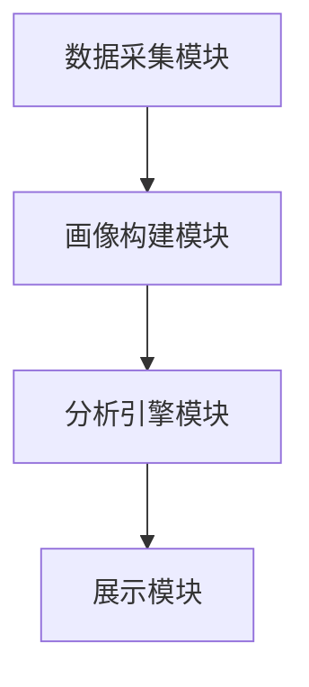

                 


# 智能投资者画像分析平台

## 关键词：
智能投资者画像、人工智能、画像分析、金融数据分析、投资者行为分析、机器学习

## 摘要：
智能投资者画像分析平台通过人工智能技术，对投资者的行为、偏好和风险承受能力进行深度分析，帮助金融机构更好地理解和服务客户。本文从背景、概念、算法、系统架构到项目实战，全面解析智能投资者画像分析平台的构建与应用。

---

## 第1章: 智能投资者画像分析平台的背景与意义

### 1.1 投资者画像的概念与定义
#### 1.1.1 投资者画像的定义
投资者画像是一种基于数据分析和人工智能技术构建的投资者特征描述，旨在通过数据挖掘和机器学习算法，揭示投资者的行为模式、风险偏好和投资习惯。

#### 1.1.2 投资者画像的核心要素
投资者画像的核心要素包括：
- **基本信息**：年龄、性别、职业、资产规模等。
- **行为特征**：投资频率、交易时间、资产配置偏好等。
- **风险偏好**：风险承受能力、收益目标、投资风格等。
- **认知特征**：对市场的看法、信息处理能力等。

#### 1.1.3 投资者画像的分类与特点
投资者画像可以根据不同的维度进行分类，例如：
- **按资产规模**：分为机构投资者和散户投资者。
- **按投资风格**：分为保守型、稳健型和激进型投资者。

---

### 1.2 智能投资者画像分析的背景
#### 1.2.1 传统投资者分析的局限性
传统投资者分析方法依赖于经验判断和简单的统计分析，存在以下问题：
- 数据维度有限，难以全面捕捉投资者特征。
- 分析结果缺乏个性化，难以满足不同投资者的需求。
- 手工分析效率低，难以应对海量数据。

#### 1.2.2 人工智能技术在金融领域的应用
人工智能技术在金融领域的广泛应用，使得投资者画像分析更加精准和高效：
- 数据挖掘技术可以提取海量数据中的隐含信息。
- 机器学习算法可以发现投资者行为中的非线性关系。
- 自然语言处理技术可以分析投资者的文本数据。

#### 1.2.3 智能投资者画像的必要性与价值
智能投资者画像的构建对于金融机构具有重要意义：
- **提升客户体验**：通过个性化服务满足投资者需求。
- **优化投资决策**：基于画像分析提供精准的投资建议。
- **降低风险**：通过画像分析识别潜在风险，优化投资组合。

---

## 第2章: 智能投资者画像的核心概念与联系

### 2.1 投资者画像模型
#### 2.1.1 投资者画像模型的构建
投资者画像模型的构建过程包括以下步骤：
1. **数据采集**：收集投资者的基本信息、交易数据、市场反馈等。
2. **数据清洗**：去除无效数据，处理缺失值。
3. **特征提取**：从数据中提取具有代表性的特征。
4. **模型训练**：使用机器学习算法构建画像模型。
5. **模型优化**：通过调整参数和优化算法提升模型性能。

#### 2.1.2 投资者画像模型的属性特征对比
以下是几种常见的投资者画像模型的属性特征对比：

| 特性               | 聚类模型       | 分类模型       | 回归模型       |
|--------------------|---------------|---------------|---------------|
| 输入数据类型       | 数值型         | 分类型         | 数值型         |
| 输出结果           | 聚类簇         | 标签           | 预测值         |
| 适用场景           | 数据分群       | 标签预测       | 数值预测       |

#### 2.1.3 投资者画像模型的ER实体关系图

```mermaid
erDiagram
    投资者 : [投资者ID, 姓名, 性别, 年龄]
    资产信息 : [资产ID, 资产规模, 投资类型]
    交易记录 : [交易ID, 交易时间, 交易金额]
    风险偏好 : [风险ID, 风险等级, 收益目标]
    投资者 <<--- 资产信息 : 拥有
    投资者 <<--- 交易记录 : 进行
    投资者 <<--- 风险偏好 : 具有
```

---

### 2.2 投资者画像分析流程
#### 2.2.1 数据采集与处理
数据采集与处理是投资者画像分析的基础：
1. **数据采集**：通过API、数据库等方式获取投资者数据。
2. **数据清洗**：去除无效数据，处理缺失值和异常值。
3. **特征提取**：从数据中提取有意义的特征，例如交易频率、资产配置比例等。

#### 2.2.2 数据分析与建模
数据分析与建模是投资者画像分析的核心：
1. **数据预处理**：对数据进行标准化、归一化处理。
2. **模型训练**：使用聚类、分类、回归等算法训练模型。
3. **模型评估**：通过准确率、召回率等指标评估模型性能。

#### 2.2.3 结果展示与应用
结果展示与应用是投资者画像分析的最终目标：
1. **结果展示**：通过可视化工具展示投资者画像。
2. **个性化服务**：根据画像结果提供个性化投资建议。
3. **风险控制**：基于画像结果优化投资组合。

---

## 第3章: 智能投资者画像分析的算法原理

### 3.1 常见算法介绍
#### 3.1.1 聚类算法
聚类算法用于将投资者分成不同的群体，例如：
- K-means算法：将投资者分成K个簇。
- DBSCAN算法：基于密度的聚类算法。

#### 3.1.2 分类算法
分类算法用于根据投资者特征预测其类型，例如：
- logistic回归：用于二分类问题。
- 随机森林：用于多分类问题。

#### 3.1.3 回归算法
回归算法用于预测投资者的某些连续性特征，例如：
- 线性回归：用于预测资产规模。
- 支持向量回归：用于非线性回归问题。

---

### 3.2 算法实现流程
#### 3.2.1 数据预处理
数据预处理是算法实现的基础：
```python
# 示例代码：数据预处理
import pandas as pd
import numpy as np

data = pd.read_csv('investor_data.csv')
data.dropna(inplace=True)  # 删除缺失值
data['年龄'].fillna(data['年龄'].mean(), inplace=True)  # 填充缺失值
```

#### 3.2.2 模型训练
模型训练是算法实现的核心：
```python
# 示例代码：模型训练
from sklearn.cluster import KMeans

X = data[['资产规模', '交易频率']]
model = KMeans(n_clusters=3, random_state=42)
model.fit(X)
```

#### 3.2.3 模型评估
模型评估是算法实现的关键步骤：
```python
# 示例代码：模型评估
from sklearn.metrics import silhouette_score

score = silhouette_score(X, model.labels_)
print('Silhouette Score:', score)
```

---

## 第4章: 智能投资者画像分析系统的架构设计

### 4.1 系统模块划分
智能投资者画像分析系统包括以下几个模块：
1. **数据采集模块**：负责采集投资者数据。
2. **画像构建模块**：负责构建投资者画像模型。
3. **分析引擎模块**：负责模型训练和结果分析。
4. **展示模块**：负责结果展示和可视化。

---

### 4.2 系统架构图
以下是系统的架构图：



---

## 第5章: 智能投资者画像分析平台的项目实战

### 5.1 环境搭建与数据准备
#### 5.1.1 开发环境安装
安装所需的开发环境：
```bash
pip install pandas numpy scikit-learn matplotlib
```

#### 5.1.2 数据源获取与处理
获取投资者数据并进行预处理：
```python
import pandas as pd

data = pd.read_csv('investor_data.csv')
data.head()
```

---

### 5.2 核心功能实现
#### 5.2.1 投资者画像构建的Python代码实现
```python
from sklearn.cluster import KMeans

# 示例代码：投资者画像构建
X = data[['资产规模', '交易频率']]
model = KMeans(n_clusters=3, random_state=42)
model.fit(X)
print('聚类中心:', model.cluster_centers_)
```

#### 5.2.2 分析模型的训练与优化
```python
from sklearn.model_selection import GridSearchCV

# 示例代码：模型优化
param_grid = {'n_clusters': [2, 3, 4]}
grid_search = GridSearchCV(KMeans(), param_grid, cv=5)
grid_search.fit(X)
print('最优参数:', grid_search.best_params_)
```

---

### 5.3 案例分析与结果解读
#### 5.3.1 实际案例分析
通过分析实际案例，可以发现不同投资者群体的行为特征。

#### 5.3.2 结果
通过结果分析，可以优化投资策略，提高投资收益。

---

## 第6章: 智能投资者画像分析平台的未来展望

### 6.1 技术发展趋势
随着人工智能技术的不断发展，投资者画像分析平台将更加智能化和个性化。

### 6.2 挑战与机遇
尽管投资者画像分析平台面临数据隐私、模型解释性等挑战，但其应用前景广阔。

### 6.3 未来展望
未来，投资者画像分析平台将与更多金融场景结合，为投资者和金融机构创造更大的价值。

---

## 总结

智能投资者画像分析平台通过人工智能技术，帮助金融机构更好地理解和服务投资者。本文从背景、概念、算法、系统架构到项目实战，全面解析了智能投资者画像分析平台的构建与应用。未来，随着技术的进步，投资者画像分析平台将发挥更大的作用，为金融行业带来更多的创新和价值。

