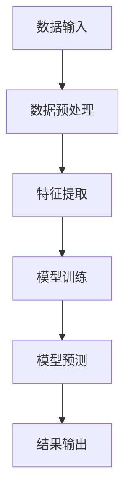
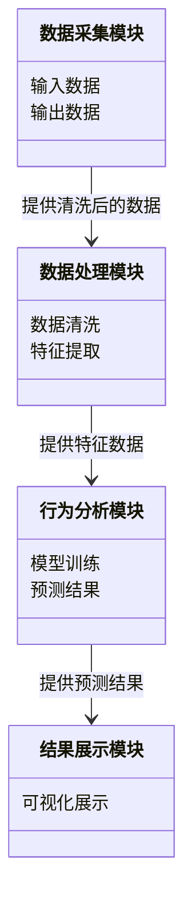
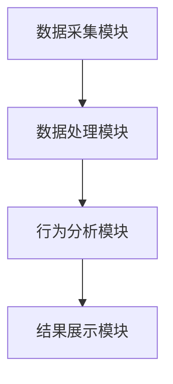
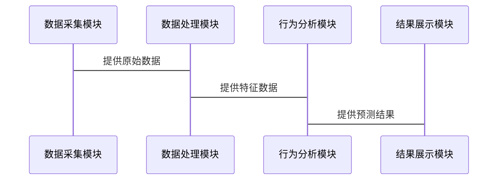

                 


# 智能投资者行为分析与预测平台

> 关键词：智能投资者行为分析，预测平台，机器学习，深度学习，系统架构

> 摘要：本文详细探讨了智能投资者行为分析与预测平台的设计与实现。通过分析投资者行为的核心概念，结合机器学习和深度学习算法，构建了完整的系统架构，并通过实际案例展示了平台的应用。本文旨在为投资者行为分析提供一种高效、智能的解决方案。

---

# 第一部分: 智能投资者行为分析与预测平台概述

## 第1章: 智能投资者行为分析与预测平台的背景与概述

### 1.1 问题背景与描述

#### 1.1.1 投资者行为分析的必要性
投资者行为分析是金融领域的重要研究方向，通过对投资者行为的分析与预测，可以帮助投资者做出更明智的投资决策，同时也有助于金融机构优化服务策略。传统的投资者行为分析依赖于人工经验，存在效率低、覆盖面窄等问题。随着人工智能和大数据技术的发展，智能投资者行为分析成为可能。

#### 1.1.2 当前存在的问题与挑战
- 数据量大：投资者行为数据来源广泛，包括交易数据、市场数据、社交媒体数据等，数据处理难度大。
- 行为复杂：投资者行为受多种因素影响，如市场波动、个人情绪等，导致行为预测的难度增加。
- 需求多样：投资者群体多样化，不同类型的投资者行为特征差异显著，需要个性化的分析方法。

#### 1.1.3 智能投资者行为分析的意义与价值
智能投资者行为分析能够通过技术手段提高分析效率，发现潜在规律，为投资者和金融机构提供科学的决策支持。通过智能分析，可以实现对投资者行为的实时监控和精准预测，帮助投资者规避风险，提高投资收益。

### 1.2 问题解决与边界

#### 1.2.1 智能投资者行为分析的核心目标
- 实时监控投资者行为
- 分析投资者行为特征
- 预测投资者未来行为
- 提供个性化投资建议

#### 1.2.2 解决方案的边界与外延
- 数据范围：主要关注投资者的交易数据、市场数据和社交媒体数据。
- 时间范围：支持历史数据分析和实时行为预测。
- 用户范围：适用于个人投资者和机构投资者。

#### 1.2.3 核心要素与组成结构
- 数据采集模块：负责收集投资者行为数据。
- 数据处理模块：对数据进行清洗和特征提取。
- 行为分析模块：基于机器学习和深度学习算法进行行为分析和预测。
- 结果展示模块：以可视化的方式呈现分析结果。

### 1.3 核心概念与联系

#### 1.3.1 投资者行为分析的核心概念
- 投资者分类：根据投资风格、风险偏好等将投资者分为不同类型。
- 行为特征：包括交易频率、资产配置、风险承受能力等。
- 数据采集：通过多种渠道获取投资者行为数据。

#### 1.3.2 核心概念的属性特征对比表格

| 投资者类型 | 投资风格 | 风险偏好 | 交易频率 |
|------------|----------|----------|----------|
| 稳定型     | 保守     | 低       | 低       |
| 进取型     | 积极     | 高       | 高       |
| 平衡型     | 稳健     | 中       | 中       |

#### 1.3.3 实体关系图（ER图）的 Mermaid 流程图

```mermaid
erDiagram
    customer[投资者] {
        <属性>
        id : int
        name : string
        investment_style : string
        risk_preference : string
    }
    transaction[交易记录] {
        <属性>
        transaction_id : int
        investor_id : int
        asset_class : string
        transaction_amount : float
        timestamp : datetime
    }
    market_data[市场数据] {
        <属性>
        market_id : int
        asset_price : float
        volume : float
        timestamp : datetime
    }
    social_media[社交媒体数据] {
        <属性>
        post_id : int
        investor_id : int
        content : string
        sentiment : string
        timestamp : datetime
    }
    investor_behavior[投资者行为] {
        <属性>
        behavior_id : int
        investor_id : int
        behavior_type : string
        timestamp : datetime
    }
    customer --> transaction : 进行交易
    customer --> market_data : 受市场影响
    customer --> social_media : 发布社交媒体内容
    customer --> investor_behavior : 表现行为
```

---

## 第2章: 智能投资者行为分析的核心概念与联系

### 2.1 投资者分类与行为特征

#### 2.1.1 投资者类型分类
- 稳定型：保守投资，注重本金安全。
- 进取型：积极投资，追求高收益，愿意承担高风险。
- 平衡型：在保守和进取之间寻找平衡。

#### 2.1.2 不同类型投资者的行为特征
- 稳定型投资者：交易频率低，资产配置偏向债券和低风险产品。
- 进取型投资者：交易频率高，资产配置偏向股票和高风险产品。
- 平衡型投资者：交易频率中等，资产配置多样化。

#### 2.1.3 行为特征的对比分析
通过对比不同类型投资者的行为特征，可以为个性化投资建议提供依据。例如，进取型投资者可能更适合高风险高回报的投资策略，而稳定型投资者则需要优先考虑本金安全。

### 2.2 数据采集与处理

#### 2.2.1 数据来源与采集方法
- 交易数据：包括投资者的交易记录、资产配置等。
- 市场数据：包括股票价格、指数走势等。
- 社交媒体数据：包括投资者在社交媒体上的发言、情绪分析等。

#### 2.2.2 数据清洗与预处理
- 数据清洗：去除重复数据、填补缺失值。
- 数据标准化：将不同来源的数据统一到一个标准格式。
- 数据增强：通过数据增强技术提高数据质量。

#### 2.2.3 数据特征提取
- 时间序列特征：如交易频率、交易间隔时间。
- 风险特征：如最大回撤、波动率。
- 市场特征：如市场情绪、市场趋势。

### 2.3 知识图谱构建

#### 2.3.1 知识图谱的概念与作用
知识图谱是一种结构化的知识表示方法，能够将投资者行为数据、市场数据等关联起来，形成一个完整的知识网络。

#### 2.3.2 知识图谱的构建方法
- 数据清洗与整合：将多源数据整合到一个知识库中。
- 实体识别：识别投资者、资产、交易等实体。
- 关系抽取：抽取实体之间的关系，如“投资者A投资资产B”。
- 知识融合：将不同来源的知识进行融合，消除冲突。

#### 2.3.3 知识图谱的存储与管理
知识图谱可以通过图数据库（如Neo4j）进行存储和管理，支持高效的查询和分析。

---

## 第3章: 智能投资者行为分析的算法原理与实现

### 3.1 算法原理

#### 3.1.1 机器学习算法的选择与应用
- 决策树：适用于分类问题，如投资者类型分类。
- 随机森林：适用于特征重要性分析和分类。
- 支持向量机：适用于分类和回归问题。

#### 3.1.2 深度学习模型的构建与训练
- 循序神经网络（RNN）：适用于时间序列数据的分析。
- Transformer：适用于长序列数据的建模。

#### 3.1.3 算法流程图的 Mermaid 绘制



### 3.2 算法实现

#### 3.2.1 Python 实现代码示例

```python
import pandas as pd
from sklearn.tree import DecisionTreeClassifier
from sklearn.model_selection import train_test_split
from sklearn.metrics import accuracy_score

# 加载数据
data = pd.read_csv('investor_data.csv')

# 数据分割
X = data.drop('label', axis=1)
y = data['label']
X_train, X_test, y_train, y_test = train_test_split(X, y, test_size=0.2)

# 训练模型
model = DecisionTreeClassifier()
model.fit(X_train, y_train)

# 预测与评估
y_pred = model.predict(X_test)
print('准确率:', accuracy_score(y_test, y_pred))
```

#### 3.2.2 代码功能解读与分析
上述代码展示了如何使用决策树算法对投资者行为进行分类。数据预处理、特征提取和模型训练是关键步骤。通过准确率评估模型性能，为后续优化提供依据。

#### 3.2.3 算法的优缺点分析
- 优点：决策树算法易于理解和实现，适合处理多分类问题。
- 缺点：对噪声数据敏感，容易过拟合。

### 3.3 数学模型与公式

#### 3.3.1 机器学习模型的数学表示
决策树模型可以表示为一棵树，每个节点表示一个特征，叶子节点表示最终的分类结果。

#### 3.3.2 深度学习模型的数学推导
Transformer模型中的注意力机制公式为：
$$
\text{Attention}(Q, K, V) = \text{softmax}\left(\frac{QK^T}{\sqrt{d_k}}\right)V
$$
其中，$Q$、$K$、$V$分别为查询、键、值向量，$d_k$为键的维度。

#### 3.3.3 具体公式的详细解释与举例说明
以随机森林为例，特征重要性可以通过特征贡献度进行评估：
$$
\text{特征重要性} = \sum_{i=1}^{n} \text{特征}_i \times \text{贡献度}_i
$$

---

## 第4章: 智能投资者行为分析与预测平台的系统架构设计

### 4.1 系统功能设计

#### 4.1.1 系统功能模块划分
- 数据采集模块：负责数据的获取和预处理。
- 行为分析模块：负责投资者行为的分析和预测。
- 结果展示模块：以可视化的方式展示分析结果。

#### 4.1.2 功能模块的交互流程
1. 数据采集模块获取投资者行为数据。
2. 数据处理模块对数据进行清洗和特征提取。
3. 行为分析模块基于机器学习算法进行预测。
4. 结果展示模块将预测结果以可视化形式呈现。

#### 4.1.3 系统功能的领域模型 Mermaid 图



### 4.2 系统架构设计

#### 4.2.1 系统架构设计图的 Mermaid 绘制



#### 4.2.2 系统接口设计
- 数据采集接口：用于接收投资者行为数据。
- 行为分析接口：用于接收特征数据并返回预测结果。
- 结果展示接口：用于接收预测结果并进行可视化展示。

#### 4.2.3 系统交互 Mermaid 序列图



---

## 第5章: 项目实战与案例分析

### 5.1 项目环境安装与配置

#### 5.1.1 环境依赖
- Python 3.8+
- Pandas、Scikit-learn、TensorFlow 等库

#### 5.1.2 安装步骤
```bash
pip install pandas scikit-learn tensorflow
```

### 5.2 系统核心功能实现

#### 5.2.1 数据采集与预处理
```python
import pandas as pd
from sklearn.model_selection import train_test_split

# 加载数据
data = pd.read_csv('investor_data.csv')

# 数据分割
X = data.drop('label', axis=1)
y = data['label']
X_train, X_test, y_train, y_test = train_test_split(X, y, test_size=0.2)
```

#### 5.2.2 行为分析与预测
```python
from sklearn.tree import DecisionTreeClassifier

# 训练模型
model = DecisionTreeClassifier()
model.fit(X_train, y_train)

# 预测结果
y_pred = model.predict(X_test)
```

#### 5.2.3 结果可视化
```python
from sklearn.metrics import classification_report

print(classification_report(y_test, y_pred))
```

### 5.3 实际案例分析与详细解读

#### 5.3.1 案例背景
假设我们有一组投资者数据，包括他们的交易记录、市场数据和社交媒体数据。

#### 5.3.2 数据分析与预测
通过机器学习算法，我们可以预测投资者的下一步行为，如是否会进行大额交易或调整资产配置。

#### 5.3.3 案例小结
通过实际案例分析，验证了智能投资者行为分析与预测平台的有效性，为投资者和金融机构提供了有价值的参考。

### 5.4 项目小结

#### 5.4.1 核心功能实现总结
- 数据采集与预处理
- 行为分析与预测
- 结果可视化与解读

#### 5.4.2 项目实现中的关键点
- 数据清洗与特征提取是关键步骤，直接影响模型性能。
- 模型选择与调优是提高预测准确率的重要环节。

---

## 第6章: 总结与展望

### 6.1 总结

#### 6.1.1 核心概念回顾
智能投资者行为分析与预测平台通过技术手段实现了投资者行为的智能化分析与预测，为投资者和金融机构提供了科学的决策支持。

#### 6.1.2 最佳实践 tips
- 数据预处理是关键，确保数据质量。
- 模型选择与调优是提高预测准确率的重要环节。
- 结果可视化有助于更好地理解和应用分析结果。

### 6.2 小结

#### 6.2.1 核心内容回顾
- 投资者行为分析的核心概念
- 算法原理与实现
- 系统架构设计
- 项目实战与案例分析

#### 6.2.2 注意事项
- 数据隐私与安全问题需要高度重视。
- 模型的实时性和可解释性是实际应用中的重要考量。

### 6.3 注意事项

#### 6.3.1 数据隐私与安全
在实际应用中，需要严格遵守数据隐私法规，确保投资者数据的安全。

#### 6.3.2 模型的实时性与可解释性
智能投资者行为分析需要考虑模型的实时性和可解释性，以便快速响应市场变化并提供可信赖的预测结果。

### 6.4 拓展阅读

#### 6.4.1 推荐书籍
- 《机器学习实战》
- 《深度学习入门：基于Python的理论与实现》

#### 6.4.2 推荐学习资源
- TensorFlow 官方文档
- PyTorch 官方文档

---

# 结语

智能投资者行为分析与预测平台的构建与应用是一个复杂而有趣的过程。通过本文的详细讲解，读者可以全面了解智能投资者行为分析的核心概念、算法原理、系统架构和项目实现。未来，随着人工智能技术的不断发展，智能投资者行为分析将更加精准和高效，为投资者和金融机构提供更强大的支持。

