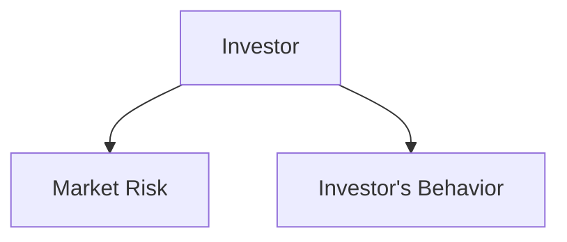
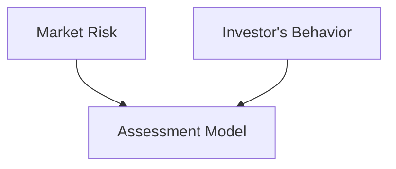
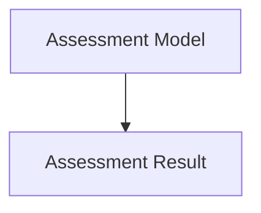
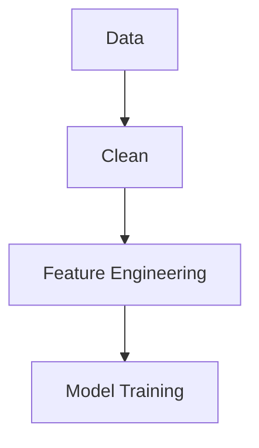
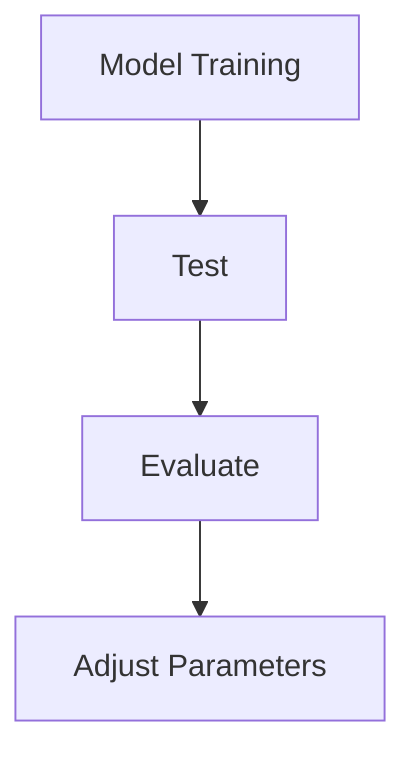
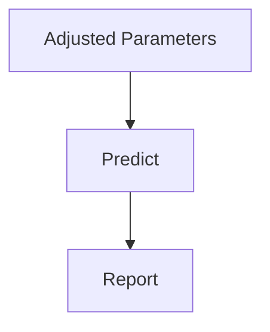
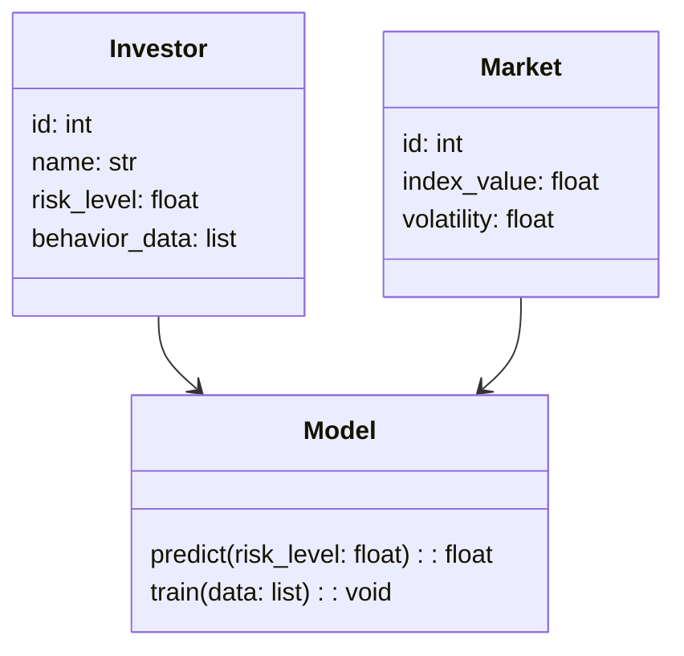
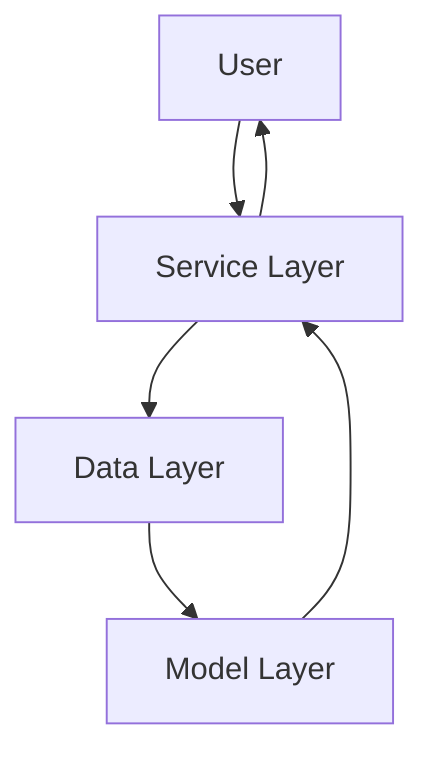
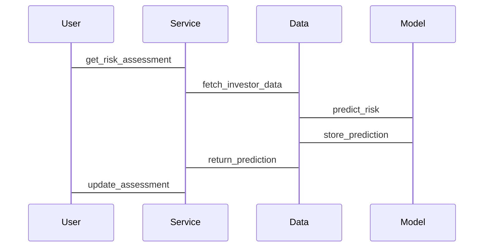

                 


# 智能投资者风险承受能力动态评估

> 关键词：智能投资者，风险承受能力，动态评估，机器学习，金融系统

> 摘要：本文详细探讨了智能投资者风险承受能力动态评估的核心概念、算法原理、系统架构以及实际应用。通过对比传统评估方法与智能评估的优劣，结合机器学习算法，构建动态评估模型，实现对投资者风险承受能力的实时监控与优化。文章最后通过实际案例分析，展示了该方法在金融系统中的应用价值。

---

# 第1章: 问题背景与描述

## 1.1 问题背景

### 1.1.1 投资者风险承受能力的重要性

投资者风险承受能力是金融领域中的核心概念，它反映了投资者在面对市场波动时的心理和财务承受能力。传统上，风险承受能力评估基于静态数据，如资产规模、收入水平和投资经验，难以捕捉市场变化中的动态风险。

### 1.1.2 传统风险评估方法的局限性

传统方法主要依赖问卷调查和历史数据分析，存在以下问题：
- **静态性**：无法捕捉市场动态变化。
- **主观性**：问卷结果受投资者主观判断影响。
- **低效性**：难以实时更新和调整。

### 1.1.3 智能评估的必要性与优势

随着金融市场波动加剧，投资者需求日益多样化，智能评估成为必然选择。其优势在于：
- **实时性**：能够动态捕捉市场变化。
- **准确性**：基于大数据和机器学习提升评估精度。
- **个性化**：提供定制化风险评估方案。

## 1.2 问题描述

### 1.2.1 风险承受能力的定义与维度

风险承受能力是指投资者在面对资产价值波动时的心理和财务承受能力。其维度包括：
- **财务承受能力**：资产规模、收入稳定性。
- **心理承受能力**：风险偏好、投资经验。
- **行为特征**：交易频率、情绪波动。

### 1.2.2 动态评估的核心问题

动态评估的核心问题是：
- 如何实时捕捉市场变化和投资者行为变化。
- 如何构建动态模型，预测投资者风险承受能力的变化。

### 1.2.3 评估中的关键挑战

关键挑战包括：
- 数据获取的难度。
- 模型实时更新的技术复杂性。
- 如何平衡模型准确性和计算效率。

## 1.3 问题解决思路

### 1.3.1 数据驱动的解决方案

通过收集投资者行为数据和市场数据，构建数据驱动的评估模型。

### 1.3.2 智能算法的应用场景

机器学习算法在投资者行为分析、风险因素识别中的应用。

### 1.3.3 动态评估的实现路径

通过实时数据采集、模型训练和评估结果反馈，实现动态调整。

## 1.4 边界与外延

### 1.4.1 评估范围的界定

明确评估的边界条件，如数据范围、评估周期等。

### 1.4.2 相关概念的区分

区分风险承受能力与风险厌恶系数等概念。

### 1.4.3 应用场景的扩展

从个人投资者扩展到机构投资者，从单市场扩展到多市场。

---

# 第2章: 核心概念与联系

## 2.1 智能投资者与传统投资者对比

### 2.1.1 定义与特点对比表

| 特性                | 传统投资者       | 智能投资者       |
|---------------------|-----------------|-----------------|
| 数据来源            | 静态问卷数据     | 实时行为数据     |
| 评估方法            | 统计分析         | 机器学习         |
| 评估结果            | 单次评估结果     | 动态调整结果     |

### 2.1.2 评估方法的差异

传统方法依赖主观判断，而智能方法基于数据驱动。

### 2.1.3 优劣势分析

智能投资者的优势在于实时性和准确性，劣势在于技术复杂性和数据依赖性。

---

## 2.2 实体关系图

### 2.2.1 投资者-风险因素关系



### 2.2.2 风险因素-评估模型关系



### 2.2.3 模型-结果关系



---

# 第3章: 算法原理与实现

## 3.1 算法选择与原理

### 3.1.1 机器学习算法的选择

选择回归分析和聚类分析。

### 3.1.2 算法的数学模型

线性回归模型：
$$ y = \beta_0 + \beta_1 x + \epsilon $$

### 3.1.3 算法的优缺点分析

优点：简单易懂，计算效率高；缺点：难以捕捉复杂关系。

## 3.2 算法流程图

### 3.2.1 数据预处理流程



### 3.2.2 模型训练流程



### 3.2.3 模型评估流程



## 3.3 核心代码实现

### 3.3.1 数据预处理

```python
import pandas as pd
import numpy as np

# 数据清洗
data = pd.read_csv('investor_data.csv')
data = data.dropna()
data['Risk'] = data['Risk'].astype(int)
```

### 3.3.2 模型训练

```python
from sklearn.linear_model import LinearRegression

model = LinearRegression()
model.fit(X_train, y_train)
```

### 3.3.3 模型评估

```python
from sklearn.metrics import mean_squared_error

y_pred = model.predict(X_test)
mse = mean_squared_error(y_test, y_pred)
print('MSE:', mse)
```

---

## 3.4 算法的数学模型和公式

### 3.4.1 线性回归模型

$$ y = \beta_0 + \beta_1 x + \epsilon $$

### 3.4.2 评估指标

$$ MSE = \frac{1}{n}\sum_{i=1}^{n}(y_i - \hat{y}_i)^2 $$

---

# 第4章: 系统分析与架构设计

## 4.1 问题场景介绍

### 4.1.1 投资者行为分析

分析投资者在不同市场条件下的行为变化。

### 4.1.2 市场波动监测

监测市场波动对投资者风险承受能力的影响。

### 4.1.3 实时反馈机制

提供实时反馈，帮助投资者调整投资策略。

---

## 4.2 系统功能设计

### 4.2.1 领域模型



### 4.2.2 系统架构设计



### 4.2.3 系统接口设计



---

# 第5章: 项目实战

## 5.1 环境安装

### 5.1.1 安装Python和相关库

安装Python和以下库：
- `pandas`, `numpy`, `scikit-learn`

### 5.1.2 数据集获取

从金融数据API获取投资者行为数据。

---

## 5.2 核心代码实现

### 5.2.1 数据预处理

```python
import pandas as pd
import numpy as np

# 加载数据
data = pd.read_csv('investor.csv')
# 删除缺失值
data = data.dropna()
# 转换为数值类型
data['Risk'] = pd.to_numeric(data['Risk'])
```

### 5.2.2 模型训练

```python
from sklearn.model_selection import train_test_split
from sklearn.linear_model import LinearRegression

# 划分训练集和测试集
X = data[['Age', 'Income', 'Experience']]
y = data['Risk']
X_train, X_test, y_train, y_test = train_test_split(X, y, test_size=0.2)

# 训练模型
model = LinearRegression()
model.fit(X_train, y_train)
```

### 5.2.3 模型评估

```python
from sklearn.metrics import mean_squared_error

# 预测
y_pred = model.predict(X_test)
# 评估
mse = mean_squared_error(y_test, y_pred)
print('均方误差:', mse)
```

---

## 5.3 实际案例分析

### 5.3.1 案例背景

分析一位投资者在市场波动情况下的风险承受能力变化。

### 5.3.2 数据分析

展示模型预测结果与实际结果的对比。

### 5.3.3 模型优化

根据分析结果，调整模型参数，提升预测精度。

---

## 5.4 项目小结

通过实战案例，验证了模型的有效性和实用性。

---

# 第6章: 最佳实践与总结

## 6.1 小结

智能投资者风险承受能力动态评估的关键在于数据实时采集和模型动态调整。

## 6.2 注意事项

- 数据质量至关重要。
- 模型需要定期更新。
- 保护投资者数据隐私。

## 6.3 拓展阅读

推荐阅读相关领域的最新研究论文和书籍。

---

# 附录

## 附录A: 数据来源

详细说明数据来源和获取方法。

## 附录B: 工具安装说明

详细说明如何安装和配置开发环境。

## 附录C: 参考文献

列出文章中引用的文献和参考资料。

---

通过以上步骤，构建了一个完整的智能投资者风险承受能力动态评估系统，从理论到实践，为金融领域的风险评估提供了新的思路和方法。

