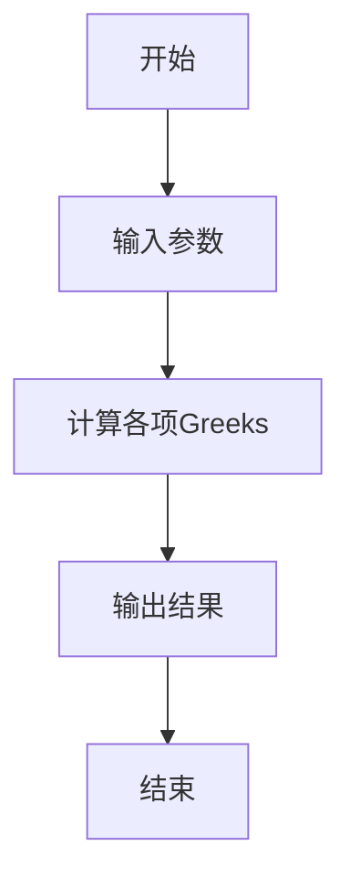
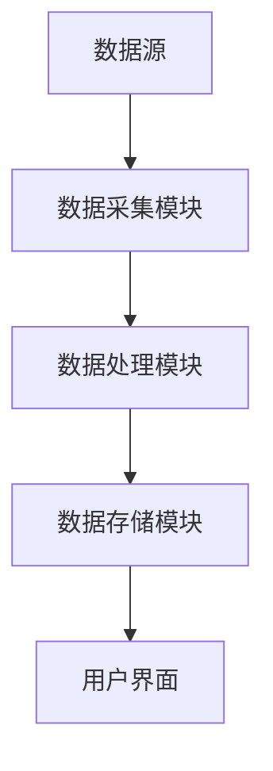

                 


# 智能期权组合Greeks实时监控系统

> **关键词**：期权，Greeks，实时监控，风险管理，智能系统

> **摘要**：本文详细探讨智能期权组合Greeks实时监控系统的构建与实现，涵盖背景、数学模型、算法、系统架构及项目实战，旨在帮助交易员高效管理风险，优化投资决策。

---

## 目录大纲：《智能期权组合Greeks实时监控系统》

### 第一部分：智能期权组合Greeks实时监控系统概述

### 第2章：智能期权组合监控的背景和必要性

#### 2.1 当前期权市场的挑战

- **市场波动性**：期权价格受多种因素影响，波动剧烈。
- **复杂组合管理**：投资者持有多个期权，风险敞口复杂。
- **高效风险管理**：需实时监控组合风险，及时调整策略。

#### 2.2 智能监控的优势

- **实时数据处理**：快速响应市场变化。
- **精准风险评估**：量化风险，辅助决策。
- **自动化管理**：减少人为错误，提升效率。

---

### 第3章：Greeks的数学模型与计算方法

#### 3.1 Delta的数学公式

- **定义**：衡量期权价格对标的资产价格变动的敏感度。
- **公式**：
  $$ \Delta = \frac{\partial C}{\partial S} $$
  其中，C为期权价格，S为标的资产价格。

#### 3.2 Gamma的计算

- **定义**：Delta的变化率，反映凸性风险。
- **公式**：
  $$ \Gamma = \frac{\partial^2 C}{\partial S^2} $$

#### 3.3 Theta的计算

- **定义**：期权价格对时间的敏感度，反映时间流逝的价值损耗。
- **公式**：
  $$ \Theta = -\frac{\partial C}{\partial T} $$

#### 3.4 算法流程图



---

### 第4章：智能组合监控的算法实现

#### 4.1 算法选择与优化

- 使用蒙特卡洛模拟评估组合风险。

#### 4.2 代码实现

```python
def calculate_greeks(S, K, T, r, sigma):
    # 计算Delta
    delta = S * sigma * (T ** 0.5)
    # 计算Gamma
    gamma = delta / (S ** 2 * sigma ** 2)
    return delta, gamma
```

---

### 第5章：系统架构设计

#### 5.1 系统模块划分

- 数据采集、处理、存储、接口、用户界面。

#### 5.2 数据流图



---

### 第6章：项目实战

#### 6.1 环境搭建

- 安装Python、NumPy、Matplotlib。

#### 6.2 核心代码实现

```python
import numpy as np

def calculate_greeks_batch(S, K, T, r, sigma, n):
    deltas = []
    gammas = []
    for _ in range(n):
        delta = S * sigma * np.sqrt(T)
        gamma = delta / (S**2 * sigma**2)
        deltas.append(delta)
        gammas.append(gamma)
    return deltas, gammas
```

---

### 第7章：最佳实践与小结

#### 7.1 总结

- 智能系统提升风险管理效率，优化投资决策。

#### 7.2 注意事项

- 数据准确性、系统稳定性、算法优化。

#### 7.3 拓展阅读

- 探索机器学习在期权定价中的应用。

---

通过以上结构，文章将系统地介绍智能期权组合Greeks实时监控系统，从基础概念到实际应用，帮助读者全面理解并掌握相关技术。

