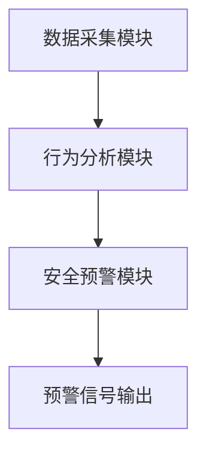

                 


# 智能汽车：AI Agent的驾驶行为分析与安全预警

> 关键词：智能汽车，AI Agent，驾驶行为分析，安全预警，算法原理

> 摘要：本文深入探讨AI Agent在智能汽车驾驶行为分析与安全预警中的应用，分析驾驶行为的特征、模型构建、算法实现、系统架构设计及实际应用案例，为智能驾驶技术的发展提供理论支持与实践指导。

---

# 第一部分: 智能汽车与AI Agent概述

## 第1章: 智能汽车与AI Agent的背景与概念

### 1.1 智能汽车的发展历程

#### 1.1.1 从传统汽车到智能汽车的演进
- **传统汽车**：机械控制为主，依赖驾驶员操作。
- **早期智能汽车**：引入电子控制系统（如ABS、ESP）。
- **现代智能汽车**：整合AI、大数据、5G等技术，实现自动驾驶。

#### 1.1.2 AI技术在智能汽车中的应用
- **AI算法**：深度学习、神经网络、强化学习。
- **AI传感器**：摄像头、激光雷达、毫米波雷达。
- **AI决策**：路径规划、行为预测、环境理解。

#### 1.1.3 智能汽车的定义与分类
- **定义**：集成了AI技术，能够实现部分或完全自动驾驶的车辆。
- **分类**：按自动驾驶等级分为L0到L5。

### 1.2 AI Agent的基本概念

#### 1.2.1 AI Agent的定义
- **AI Agent**：智能体，能够感知环境并做出决策的实体。
- **Agent类型**：反应式Agent、基于模型的Agent、效用导向的Agent。

#### 1.2.2 AI Agent的核心特征
- **感知能力**：通过传感器获取环境信息。
- **决策能力**：基于感知信息做出行为决策。
- **学习能力**：通过数据优化行为策略。

#### 1.2.3 AI Agent与传统驾驶的区别
- **传统驾驶**：依赖驾驶员经验与判断。
- **AI Agent驾驶**：依赖算法与数据驱动的决策。

### 1.3 驾驶行为分析与安全预警的重要性

#### 1.3.1 驾驶行为分析的背景
- **背景**：驾驶员行为影响驾驶安全，AI Agent可辅助分析与优化。
- **目标**：识别驾驶员行为模式，预防事故发生。

#### 1.3.2 安全预警的必要性
- **必要性**：实时监测驾驶环境，提前预警潜在危险。
- **作用**：减少事故风险，提升驾驶安全性。

#### 1.3.3 驾驶行为分析与安全预警的结合
- **结合方式**：通过分析驾驶行为数据，优化安全预警策略。

### 1.4 本章小结
本章介绍了智能汽车的发展历程、AI Agent的基本概念及其在驾驶行为分析中的重要性。

---

# 第二部分: AI Agent的驾驶行为分析原理

## 第2章: 驾驶行为分析的核心概念

### 2.1 驾驶行为分析的背景与目标

#### 2.1.1 驾驶行为分析的背景
- **背景**：驾驶员行为是影响驾驶安全的关键因素。
- **目标**：通过AI技术分析驾驶行为，优化驾驶安全。

#### 2.1.2 驾驶行为分析的目标
- **目标**：识别驾驶员行为模式，预测潜在风险。
- **方法**：基于传感器数据与AI算法进行分析。

#### 2.1.3 驾驶行为分析的边界与外延
- **边界**：仅分析驾驶员行为，不涉及车辆机械控制。
- **外延**：结合环境数据，进行更全面的安全分析。

### 2.2 AI Agent驾驶行为分析的核心要素

#### 2.2.1 驾驶数据的采集与处理
- **数据采集**：通过车载传感器采集驾驶员行为数据。
- **数据处理**：清洗、归一化、特征提取。

#### 2.2.2 驾驶行为模型的构建
- **模型构建**：基于机器学习算法，建立驾驶行为模型。
- **模型训练**：使用历史驾驶数据进行模型训练。

#### 2.2.3 行为分析算法的设计
- **算法设计**：选择适合的机器学习算法，优化分析效果。

### 2.3 驾驶行为分析与安全预警的关系

#### 2.3.1 行为分析在安全预警中的作用
- **作用**：通过分析驾驶行为，提前识别潜在危险。

#### 2.3.2 安全预警系统的工作流程
1. **数据采集**：获取环境与驾驶行为数据。
2. **行为分析**：分析驾驶行为，识别异常情况。
3. **预警触发**：当检测到潜在危险时，发出预警信号。

#### 2.3.3 行为分析与预警系统的结合
- **结合方式**：实时分析驾驶行为，动态调整预警策略。

### 2.4 本章小结
本章详细介绍了驾驶行为分析的核心概念，包括背景、目标、核心要素及与安全预警的关系。

---

# 第三部分: AI Agent驾驶行为分析的算法原理

## 第3章: 驾驶行为分析的算法基础

### 3.1 驾驶行为分析的数学模型

#### 3.1.1 概率模型在行为分析中的应用
- **概率模型**：贝叶斯网络、马尔可夫链。
- **应用**：预测驾驶员行为概率，优化驾驶策略。

#### 3.1.2 聚类分析在驾驶数据中的应用
- **聚类分析**：K-means、DBSCAN。
- **应用**：将驾驶员行为分为不同类别，便于分析与优化。

#### 3.1.3 分类算法在行为预测中的应用
- **分类算法**：支持向量机、随机森林、神经网络。
- **应用**：预测驾驶员行为，优化驾驶策略。

### 3.2 强化学习在驾驶行为分析中的应用

#### 3.2.1 强化学习的基本原理
- **强化学习**：通过奖励机制优化决策过程。
- **核心概念**：状态、动作、奖励、策略。

#### 3.2.2 强化学习在驾驶决策中的应用
- **应用**：模拟驾驶员决策过程，优化驾驶行为。

#### 3.2.3 强化学习的优缺点分析
- **优点**：能够处理复杂环境下的决策问题。
- **缺点**：需要大量数据训练，计算成本高。

### 3.3 目标检测与跟踪算法

#### 3.3.1 目标检测算法的原理
- **目标检测算法**：YOLO、Faster R-CNN。
- **原理**：通过卷积神经网络检测图像中的目标。

#### 3.3.2 车辆跟踪算法的应用
- **车辆跟踪**：通过目标检测与跟踪技术，实现车辆行为分析。

#### 3.3.3 目标检测与跟踪的结合
- **结合方式**：实时检测与跟踪车辆，优化驾驶行为分析。

### 3.4 本章小结
本章介绍了驾驶行为分析的数学模型与算法原理，包括概率模型、强化学习与目标检测等技术。

---

# 第四部分: AI Agent驾驶行为分析的系统架构

## 第4章: 驾驶行为分析系统的架构设计

### 4.1 系统架构设计概述

#### 4.1.1 系统架构的目标
- **目标**：构建一个高效、可靠的驾驶行为分析系统。

#### 4.1.2 系统架构的组成
- **数据采集模块**：采集驾驶员行为数据。
- **行为分析模块**：分析驾驶员行为，识别潜在风险。
- **安全预警模块**：根据分析结果，发出预警信号。

#### 4.1.3 系统架构的设计原则
- **原则**：模块化设计、高可用性、可扩展性。

### 4.2 系统功能设计

#### 4.2.1 数据采集模块的功能设计
- **功能**：采集驾驶员行为数据，如方向盘转角、油门踏板、刹车踏板等。

#### 4.2.2 行为分析模块的功能设计
- **功能**：分析驾驶员行为，识别异常行为，预测潜在风险。

#### 4.2.3 安全预警模块的功能设计
- **功能**：根据分析结果，发出预警信号，提醒驾驶员注意。

### 4.3 系统接口设计

#### 4.3.1 数据接口的设计
- **接口**：传感器数据接口、分析模块接口、预警模块接口。

#### 4.3.2 系统交互设计
- **交互流程**：数据采集 → 行为分析 → 预警触发。

### 4.4 本章小结
本章详细介绍了驾驶行为分析系统的架构设计，包括模块组成、功能设计与接口设计。

---

# 第五部分: 项目实战与优化

## 第5章: 项目实战——驾驶行为分析系统实现

### 5.1 项目背景与目标

#### 5.1.1 项目背景
- **背景**：开发一个基于AI Agent的驾驶行为分析系统，提升驾驶安全性。

#### 5.1.2 项目目标
- **目标**：实现驾驶员行为分析，优化驾驶安全性。

### 5.2 环境搭建与数据采集

#### 5.2.1 环境搭建
- **环境要求**：安装Python、TensorFlow、OpenCV等开发工具。

#### 5.2.2 数据采集
- **数据采集工具**：使用车载传感器采集驾驶员行为数据。
- **数据格式**：结构化数据，包含时间戳、传感器数据等。

### 5.3 系统核心实现

#### 5.3.1 数据预处理
- **数据清洗**：去除噪声数据，确保数据准确性。
- **特征提取**：提取关键特征，便于模型训练。

#### 5.3.2 行为分析算法实现
- **算法实现**：基于机器学习算法，实现驾驶员行为分析。

#### 5.3.3 安全预警模块实现
- **预警规则**：设定预警条件，触发预警信号。

### 5.4 项目小结

#### 5.4.1 实验结果分析
- **分析**：通过实验验证系统的有效性与准确性。

#### 5.4.2 优化建议
- **优化建议**：进一步优化算法，提升系统性能。

---

# 第六部分: 最佳实践与展望

## 第6章: 最佳实践与未来展望

### 6.1 最佳实践

#### 6.1.1 数据采集与处理
- **建议**：确保数据质量，合理选择数据处理方法。

#### 6.1.2 算法选择与优化
- **建议**：根据实际需求选择合适的算法，优化模型性能。

#### 6.1.3 系统设计与实现
- **建议**：模块化设计，确保系统可扩展性与可维护性。

### 6.2 未来展望

#### 6.2.1 技术进步
- **技术进步**：AI、5G等技术的进一步发展，推动驾驶行为分析技术的进步。

#### 6.2.2 应用领域
- **应用领域**：驾驶行为分析技术在智能汽车、公共交通等领域的广泛应用。

### 6.3 本章小结
本章总结了驾驶行为分析系统的最佳实践，并展望了未来的发展方向。

---

# 附录

## 附录A: 项目代码示例

### 附录A.1 数据预处理代码
```python
import numpy as np
import pandas as pd

# 数据加载
data = pd.read_csv('驾驶行为数据.csv')

# 数据清洗
data.dropna(inplace=True)
data = data[~data['速度'].isnull()]
```

### 附录A.2 行为分析算法代码
```python
from sklearn.ensemble import RandomForestClassifier

# 数据特征提取
X = data[['转角', '油门', '刹车']]
y = data['驾驶行为标签']

# 模型训练
model = RandomForestClassifier()
model.fit(X, y)
```

### 附录A.3 安全预警模块代码
```python
def 发出预警(风险等级):
    if 风险等级 >= 0.9:
        print("发出预警信号！")
    else:
        print("未检测到风险。")
```

## 附录B: 系统架构图


---

# 结语

智能汽车的驾驶行为分析与安全预警是AI技术在汽车领域的核心应用之一。通过本文的分析与实践，我们深入了解了AI Agent在驾驶行为分析中的重要作用，掌握了相关算法与系统设计的方法。未来，随着技术的不断进步，驾驶行为分析系统将更加智能化、精准化，为智能驾驶技术的发展提供更有力的支持。

