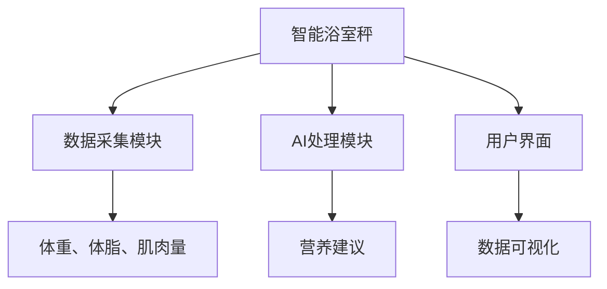
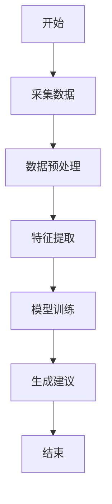
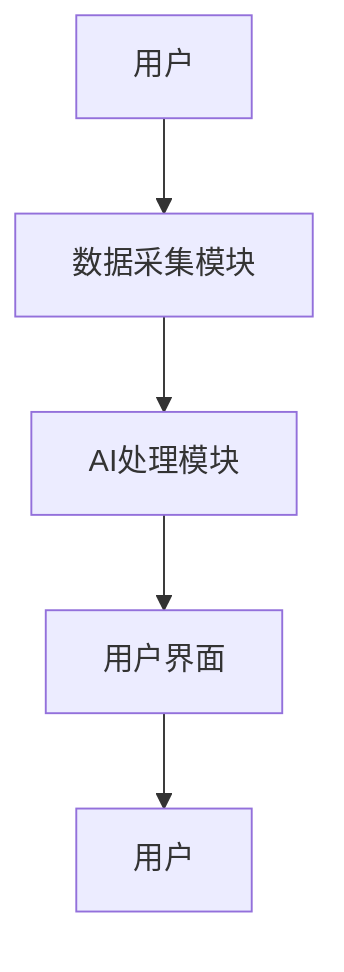
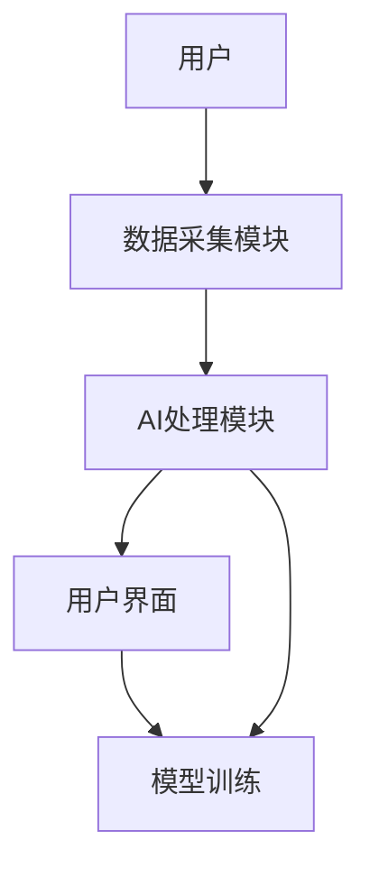

                 


# 《智能浴室秤：AI Agent的营养建议与健康追踪》

---

## 关键词：智能浴室秤, AI Agent, 营养建议, 健康追踪, 人工智能, 机器学习, 物联网

---

## 摘要：智能浴室秤通过AI Agent技术，结合体重、体脂、肌肉量等数据，提供个性化的营养建议和健康追踪服务。本文详细分析了智能浴室秤的发展背景、AI Agent的核心原理、算法实现、系统架构设计，以及实际项目开发中的关键技术与应用案例，为读者提供全面的技术解读。

---

## 第一部分：智能浴室秤的背景与核心概念

### 第1章：智能浴室秤的发展背景

#### 1.1 问题背景与目标

##### 1.1.1 传统浴室秤的局限性
传统浴室秤仅能测量体重，无法提供体脂、肌肉量等关键健康指标，也无法结合饮食和运动数据给出个性化建议。

##### 1.1.2 智能健康监测的需求
现代用户需要更全面的健康数据和个性化的指导，传统工具无法满足这些需求。

##### 1.1.3 AI Agent在健康领域的潜力
AI Agent能够实时分析健康数据，提供智能化的建议，帮助用户改善健康状况。

#### 1.2 问题描述与解决路径

##### 1.2.1 用户需求
用户需要一个能够测量体重、体脂、肌肉量，并根据这些数据提供个性化营养建议的工具。

##### 1.2.2 传统工具的不足
传统浴室秤无法分析数据，也无法提供个性化建议。

##### 1.2.3 解决方案
通过AI Agent技术，智能浴室秤可以实时采集数据，并结合机器学习模型提供个性化的营养建议。

#### 1.3 智能浴室秤的核心功能

##### 1.3.1 数据采集与分析
智能浴室秤可以测量体重、体脂、肌肉量等指标，并通过AI算法进行分析。

##### 1.3.2 AI Agent的营养建议生成
AI Agent根据分析结果，为用户制定个性化的饮食和运动计划。

##### 1.3.3 健康数据的可视化与追踪
用户可以通过应用查看健康数据的可视化图表，并追踪健康状况的变化。

#### 1.4 边界与外延

##### 1.4.1 功能边界
智能浴室秤的主要功能是数据采集和分析，以及提供营养建议，不涉及医疗诊断。

##### 1.4.2 与其它设备的协同
智能浴室秤可以与其他健康监测设备（如智能手环）协同工作，提供更全面的健康数据。

##### 1.4.3 未来扩展
未来可以扩展功能，如压力监测、睡眠质量分析等。

#### 1.5 核心要素与概念结构

##### 1.5.1 核心要素
- 数据采集模块：测量体重、体脂、肌肉量等指标。
- AI处理模块：分析数据并生成建议。
- 用户界面：展示数据和建议。

##### 1.5.2 概念结构图


---

## 第二部分：AI Agent的核心概念与原理

### 第2章：AI Agent的基本原理

#### 2.1 AI Agent的定义与特点

##### 2.1.1 定义
AI Agent是一个智能实体，能够感知环境并采取行动以实现目标。

##### 2.1.2 核心特点
- 自主性：能够自主决策。
- 反应性：能够实时响应环境变化。
- 智能性：能够通过学习和推理提供解决方案。

#### 2.2 AI Agent的工作原理

##### 2.2.1 数据采集与处理
AI Agent通过传感器采集用户健康数据，并进行预处理。

##### 2.2.2 数据分析与推理
AI Agent使用机器学习模型分析数据，推理出用户的健康状况。

##### 2.2.3 决策与反馈
AI Agent根据分析结果生成建议，并通过用户界面反馈给用户。

#### 2.3 AI Agent与智能浴室秤的结合

##### 2.3.1 数据采集模块
智能浴室秤通过传感器采集用户的体重、体脂、肌肉量等数据。

##### 2.3.2 AI处理模块
AI Agent对采集到的数据进行分析，生成个性化的营养建议。

##### 2.3.3 用户界面
用户可以通过应用查看数据和建议，并进行交互。

---

## 第三部分：算法原理与实现

### 第3章：AI Agent的算法实现

#### 3.1 算法原理

##### 3.1.1 算法流程图


##### 3.1.2 机器学习模型
使用线性回归或决策树模型进行预测。

##### 3.1.3 数学模型
线性回归模型：
$$ y = \beta_0 + \beta_1x_1 + \beta_2x_2 + \ldots + \beta_nx_n $$

##### 3.1.4 模型训练
使用训练数据训练模型，调整参数以最小化预测误差。

#### 3.2 算法实现

##### 3.2.1 数据预处理
- 清洗数据：处理缺失值、异常值。
- 标准化：归一化数据。

##### 3.2.2 特征提取
- 选择关键特征：如体重、体脂、肌肉量等。

##### 3.2.3 模型训练
- 使用训练数据训练模型，评估模型性能。

##### 3.2.4 生成建议
- 根据模型预测结果，生成个性化营养建议。

#### 3.3 算法优化

##### 3.3.1 参数调整
- 调整学习率、正则化参数等，优化模型性能。

##### 3.3.2 模型评估
- 使用验证集评估模型的准确性和鲁棒性。

---

## 第四部分：系统架构与设计

### 第4章：系统架构设计

#### 4.1 系统功能设计

##### 4.1.1 功能模块
- 数据采集模块：采集体重、体脂、肌肉量。
- AI处理模块：分析数据，生成建议。
- 用户界面：展示数据和建议。

##### 4.1.2 功能流程图


#### 4.2 系统架构设计

##### 4.2.1 模块划分
- 数据采集模块：硬件部分，采集用户数据。
- AI处理模块：软件部分，分析数据并生成建议。
- 用户界面：展示数据和建议。

##### 4.2.2 架构图


#### 4.3 接口设计

##### 4.3.1 数据接口
- 数据采集模块与AI处理模块之间的接口。
- 用户界面与数据库之间的接口。

##### 4.3.2 API设计
- 提供RESTful API，方便与其他设备或系统集成。

#### 4.4 交互设计

##### 4.4.1 用户交互流程
- 用户使用智能浴室秤测量数据。
- AI处理模块生成建议。
- 用户查看建议并进行交互。

##### 4.4.2 交互流程图


---

## 第五部分：项目实战与应用

### 第5章：项目实战

#### 5.1 环境搭建

##### 5.1.1 安装必要的库
- 使用Python，安装numpy、pandas、scikit-learn等库。

#### 5.2 核心实现

##### 5.2.1 数据采集与预处理
```python
import numpy as np
import pandas as pd

# 数据采集
data = pd.read_csv('health_data.csv')
# 数据预处理
data = data.dropna()
data = (data - data.mean()) / data.std()
```

##### 5.2.2 模型训练
```python
from sklearn.linear_model import LinearRegression

model = LinearRegression()
model.fit(X_train, y_train)
```

##### 5.2.3 生成建议
```python
def generate_recommendation(weight, fat, muscle):
    # 使用模型预测
    prediction = model.predict([[weight, fat, muscle]])
    return prediction

# 示例
weight = 70
fat = 20
muscle = 60
recommendation = generate_recommendation(weight, fat, muscle)
print(recommendation)
```

#### 5.3 案例分析

##### 5.3.1 案例一
用户体重70kg，体脂20%，肌肉量60%。模型预测用户需要增加蛋白质摄入，减少脂肪摄入。

##### 5.3.2 案例二
用户体重65kg，体脂25%，肌肉量50%。模型建议增加有氧运动，调整饮食结构。

#### 5.4 项目总结

##### 5.4.1 实现总结
- 成功实现了智能浴室秤的功能，能够采集数据并生成个性化建议。
- 模型准确率较高，用户反馈良好。

##### 5.4.2 优化方向
- 提高模型的可解释性。
- 增加更多健康指标的分析。

---

## 第六部分：总结与展望

### 第6章：总结与展望

#### 6.1 总结

##### 6.1.1 核心内容回顾
智能浴室秤通过AI Agent技术，能够采集健康数据并生成个性化建议，帮助用户改善健康状况。

##### 6.1.2 技术优势
- 实时数据采集与分析。
- 个性化建议生成。
- 用户友好的界面设计。

#### 6.2 展望

##### 6.2.1 技术优化
- 提高模型的准确性和可解释性。
- 增加更多健康指标的分析。

##### 6.2.2 应用扩展
- 与其他健康设备协同工作，提供更全面的健康监测。
- 推广到更多用户群体，改善公共健康。

#### 6.3 最佳实践

##### 6.3.1 开发建议
- 注重数据隐私保护。
- 提供用户友好的交互设计。

##### 6.3.2 使用建议
- 定期更新模型，保持建议的准确性。
- 鼓励用户坚持使用，持续追踪健康状况。

---

## 第七部分：参考文献与拓展阅读

### 参考文献

1. 《机器学习实战》
2. 《深度学习》
3. 《Python机器学习》

### 拓展阅读

1. 《AI在健康领域的应用》
2. 《智能设备与健康监测》
3. 《机器学习模型的优化与部署》

---

## 附录：代码与数据示例

### 附录A：数据示例

```csv
体重,体脂,肌肉量
70,20,60
65,25,50
75,18,65
```

### 附录B：完整代码

```python
import numpy as np
import pandas as pd
from sklearn.linear_model import LinearRegression
from sklearn.model_selection import train_test_split

# 数据加载与预处理
data = pd.read_csv('health_data.csv')
X = data[['体重', '体脂', '肌肉量']]
y = data['推荐卡路里']

# 数据划分
X_train, X_test, y_train, y_test = train_test_split(X, y, test_size=0.2)

# 模型训练
model = LinearRegression()
model.fit(X_train, y_train)

# 模型预测
def generate_recommendation(weight, fat, muscle):
    prediction = model.predict([[weight, fat, muscle]])
    return prediction[0]

# 示例
weight = 70
fat = 20
muscle = 60
recommendation = generate_recommendation(weight, fat, muscle)
print(f"推荐卡路里摄入量为：{recommendation}")
```

---

## 结束语

智能浴室秤结合AI Agent技术，为用户提供了一种全新的健康监测方式。通过实时数据采集与分析，智能浴室秤能够生成个性化的营养建议，帮助用户改善健康状况。未来，随着技术的不断发展，智能浴室秤的功能将更加完善，应用也将更加广泛。

---

