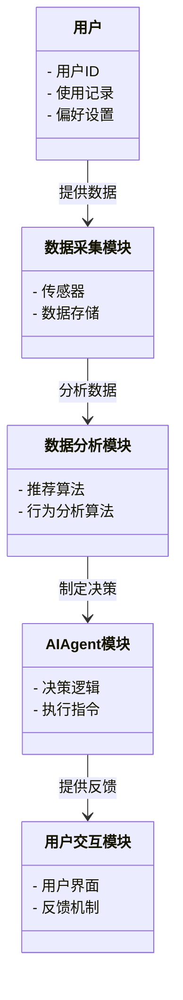
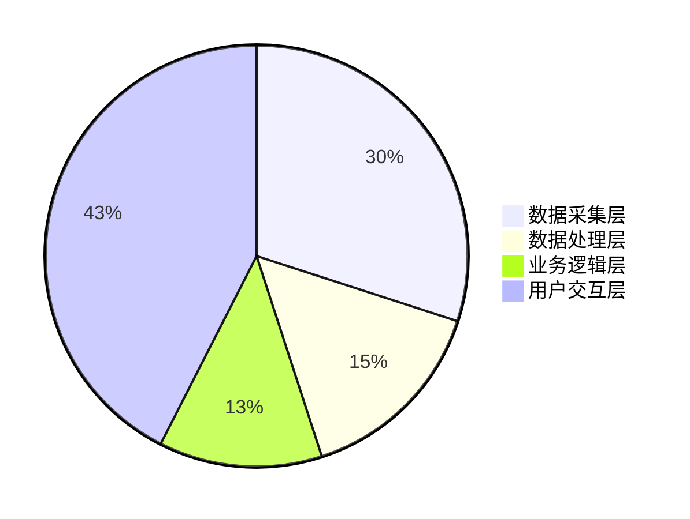
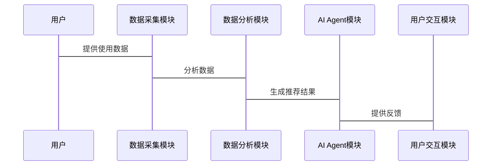

                 


# 智能浴室置物架：AI Agent的个人卫生习惯改善

> 关键词：AI Agent，智能浴室置物架，个人卫生，行为分析，推荐算法，数学模型

> 摘要：本文探讨了AI Agent在智能浴室置物架中的应用，详细分析了其在个人卫生习惯改善中的作用。通过技术背景、核心算法、系统架构和项目实战的多维度解析，展示了如何利用AI技术提升浴室用品的管理效率和卫生水平。

---

# 第一部分: 背景介绍与核心概念

## 第1章: 问题背景与需求分析

### 1.1 个人卫生习惯的重要性

#### 1.1.1 卫生习惯对健康的影响
良好的卫生习惯是预防疾病、保持身体健康的重要基础。浴室作为日常生活中使用频率较高的场所，其卫生管理尤为重要。然而，传统的浴室置物架功能单一，难以满足现代人对智能化、个性化卫生管理的需求。

#### 1.1.2 智能化卫生管理的必要性
随着人工智能技术的快速发展，智能化设备逐渐渗透到生活的方方面面。浴室置物架的智能化改造不仅是技术进步的体现，更是提升生活质量的重要手段。

#### 1.1.3 智能浴室置物架的定位与目标
智能浴室置物架通过AI Agent技术，实现对浴室用品的智能化管理。其目标是通过数据分析和行为优化，帮助用户改善卫生习惯，提升生活品质。

---

### 1.2 智能浴室置物架的场景分析

#### 1.2.1 浴室环境的特点
浴室是一个相对封闭且湿度较高的环境，传统的置物架存在空间利用率低、物品管理混乱等问题。

#### 1.2.2 传统置物架的痛点与不足
- 空间利用率低：传统置物架设计固定，难以根据用户需求灵活调整。
- 物品管理混乱：缺乏智能化管理，用户难以快速找到所需物品。
- 卫生维护困难：物品摆放不当可能导致卫生死角，增加清洁难度。

#### 1.2.3 智能化改造的可行性分析
通过引入AI Agent技术，智能浴室置物架可以实现物品的智能推荐、行为分析和环境监测，从而解决传统置物架的痛点。

---

### 1.3 AI Agent在卫生管理中的作用

#### 1.3.1 AI Agent的基本概念
AI Agent（智能体）是指能够感知环境、做出决策并采取行动的智能系统。它能够通过数据采集、分析和学习，为用户提供个性化的服务。

#### 1.3.2 AI Agent在个人卫生中的应用场景
- 物品推荐：根据用户的使用习惯，推荐合适的洗漱用品。
- 行为分析：通过分析用户的使用行为，优化物品摆放策略。
- 环境监测：实时监测浴室环境，提醒用户及时清洁。

#### 1.3.3 AI Agent的核心功能与价值
- 提高浴室用品的使用效率。
- 帮助用户养成良好的卫生习惯。
- 通过智能化管理，降低卫生维护成本。

---

## 第2章: 智能浴室置物架的核心概念与系统架构

### 2.1 系统核心概念

#### 2.1.1 系统组成与功能模块
智能浴室置物架系统由以下几个核心模块组成：
- 数据采集模块：负责采集用户的使用行为和环境数据。
- 数据分析模块：对采集的数据进行分析和处理。
- AI Agent模块：基于分析结果，做出决策并执行相应的操作。
- 用户交互模块：与用户进行实时互动，提供反馈。

#### 2.1.2 AI Agent的算法模型
AI Agent的核心算法包括推荐算法和行为分析算法。推荐算法用于为用户提供个性化的物品推荐，行为分析算法用于优化用户的使用习惯。

#### 2.1.3 系统的输入输出关系
系统通过传感器和用户输入获取数据，经过分析和处理后，输出相应的物品推荐和行为优化建议。

---

### 2.2 核心概念属性对比表

| 概念       | 属性1 | 属性2 | 属性3 |
|------------|-------|-------|-------|
| AI Agent   | 数据采集 | 数据分析 | 行为决策 |
| 置物架      | 物理结构 | 智能控制 | 交互方式 |

---

### 2.3 ER实体关系图

```mermaid
er
actor: 用户
actor: AI Agent
actor: 置物架
```

---

---

# 第二部分: 算法原理与数学模型

## 第3章: AI Agent的核心算法

### 3.1 推荐算法

#### 3.1.1 基于用户行为的推荐算法
推荐算法通过分析用户的使用行为，预测用户的偏好，从而推荐合适的物品。常用的方法包括协同过滤和深度学习模型。

#### 3.1.2 基于协同过滤的推荐算法
协同过滤算法通过分析用户的相似性，推荐用户可能感兴趣的物品。其公式如下：
$$相似度计算公式：sim(i,j) = \frac{\sum_{k} (r_{ik} - \bar{r_i})(r_{jk} - \bar{r_j})}{\sqrt{\sum_{k}(r_{ik} - \bar{r_i})^2} \cdot \sqrt{\sum_{k}(r_{jk} - \bar{r_j})^2}}$$

#### 3.1.3 基于深度学习的推荐算法
深度学习模型（如神经网络）能够捕捉用户的复杂行为模式，推荐效果更优。其损失函数如下：
$$损失函数：L = \sum_{i=1}^{n} (y_i - \hat{y_i})^2$$

---

### 3.2 行为分析算法

#### 3.2.1 用户行为数据的采集与处理
行为分析算法通过采集用户的使用数据，分析其行为模式。常用的时间序列分析模型包括ARIMA模型。

#### 3.2.2 基于时间序列的行为分析
ARIMA模型用于预测用户的未来行为，公式如下：
$$ARIMA模型：ARIMA(p, d, q)$$

#### 3.2.3 基于聚类的行为模式识别
聚类分析模型（如K-means算法）用于识别用户的相似行为模式。其公式如下：
$$K-means算法：\min_{\sum_{i=1}^{k} \sum_{j=1}^{n} (x_{ij} - c_j)^2}$$

---

## 第4章: 数学模型与公式

### 4.1 推荐算法的数学模型

#### 4.1.1 协同过滤算法的数学表达
协同过滤算法通过计算用户之间的相似度，推荐相似用户的物品。其相似度公式为：
$$sim(i,j) = \frac{\sum_{k} (r_{ik} - \bar{r_i})(r_{jk} - \bar{r_j})}{\sqrt{\sum_{k}(r_{ik} - \bar{r_i})^2} \cdot \sqrt{\sum_{k}(r_{jk} - \bar{r_j})^2}}$$

#### 4.1.2 基于深度学习的推荐模型
深度学习模型通过神经网络捕捉用户的复杂行为，其损失函数为：
$$L = \sum_{i=1}^{n} (y_i - \hat{y_i})^2$$

---

### 4.2 行为分析算法的数学模型

#### 4.2.1 时间序列分析模型
时间序列分析模型用于预测用户的未来行为。其公式为：
$$ARIMA模型：ARIMA(p, d, q)$$

#### 4.2.2 聚类分析模型
聚类分析模型用于识别用户的相似行为模式。其公式为：
$$K-means算法：\min_{\sum_{i=1}^{k} \sum_{j=1}^{n} (x_{ij} - c_j)^2}$$

---

---

# 第三部分: 系统分析与架构设计

## 第5章: 系统分析与架构设计

### 5.1 系统功能设计

#### 5.1.1 领域模型
领域模型展示了系统的核心功能模块及其关系。如下图所示：



---

### 5.2 系统架构设计

#### 5.2.1 系统架构图
系统采用分层架构，如下图所示：



---

### 5.3 系统接口设计

#### 5.3.1 接口设计
系统通过RESTful API实现模块间的通信。例如，AI Agent模块通过调用数据采集模块的接口，获取用户的使用数据。

---

### 5.4 系统交互流程图



---

---

# 第四部分: 项目实战

## 第6章: 项目实战

### 6.1 环境安装

#### 6.1.1 安装Python和相关库
安装Python和以下库：
- `numpy`
- `pandas`
- `scikit-learn`
- `tensorflow`

---

### 6.2 系统核心实现

#### 6.2.1 推荐算法实现
以下是协同过滤算法的Python实现示例：

```python
import numpy as np
from sklearn.metrics.pairwise import cosine_similarity

# 示例数据矩阵
X = np.array([[1, 2, 3],
              [4, 5, 6],
              [7, 8, 9]])

# 计算相似度矩阵
similarity = cosine_similarity(X)
print(similarity)
```

#### 6.2.2 行为分析实现
以下是基于K-means算法的行为分析实现示例：

```python
from sklearn.cluster import KMeans

# 示例数据
X = np.array([[1, 2], [3, 4], [5, 6], [7, 8], [9, 10]])

# 训练模型
model = KMeans(n_clusters=2, random_state=0)
model.fit(X)

# 获取聚类结果
labels = model.labels_
print(labels)
```

---

### 6.3 案例分析

#### 6.3.1 案例分析
假设用户A的使用记录如下：
- 使用牙刷频率：每天两次
- 使用毛巾习惯：每次使用后未及时晾干
AI Agent通过分析用户的使用行为，推荐更合理的物品摆放方式，并提醒用户及时清洁毛巾。

---

## 第7章: 最佳实践与小结

### 7.1 最佳实践

#### 7.1.1 环境维护
定期清洁智能浴室置物架的传感器和机械部件，确保其正常运行。

#### 7.1.2 数据隐私
注意保护用户的使用数据，确保其不被滥用。

---

### 7.2 小结

本文详细介绍了AI Agent在智能浴室置物架中的应用，从技术背景、核心算法到系统架构和项目实战，全面解析了其在个人卫生习惯改善中的作用。通过智能化的管理和优化，智能浴室置物架不仅提升了浴室用品的使用效率，还帮助用户养成了良好的卫生习惯。

---

### 7.3 注意事项

- 系统运行时需保持网络连接，以确保AI Agent能够正常工作。
- 使用过程中避免将物品放置在传感器附近，以免影响数据采集。

---

### 7.4 拓展阅读

- 《机器学习实战》
- 《深度学习入门：基于Python》
- 《人工智能：现代方法》

---

通过本文的分析，读者可以深入了解AI Agent在智能浴室置物架中的应用，为未来的智能化卫生管理提供参考。

