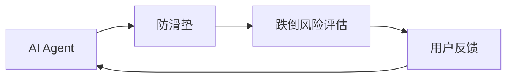
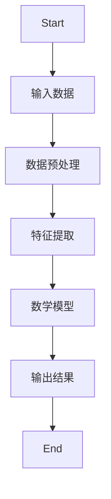
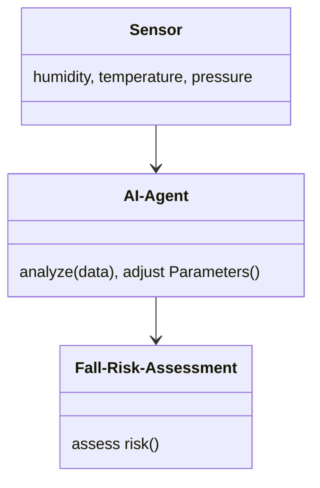
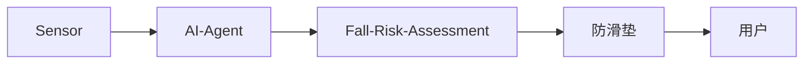
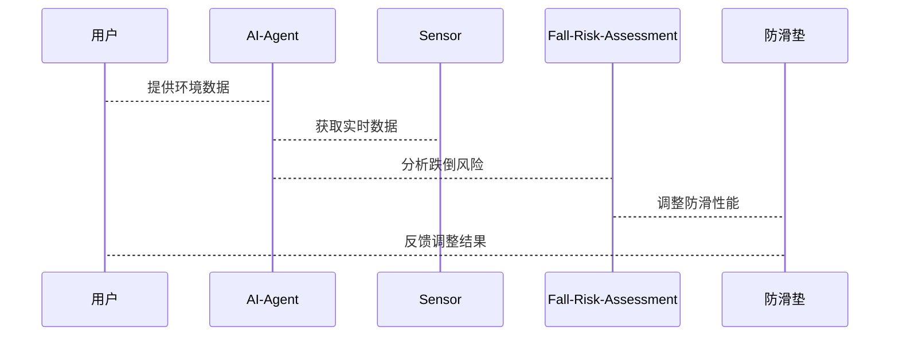

                 


# 智能浴室防滑垫：AI Agent的跌倒风险评估

**关键词**：智能防滑垫，跌倒风险评估，AI Agent，浴室安全，人工智能，传感器技术

**摘要**：随着老龄化社会的到来，跌倒已成为老年人群中常见的安全事故之一，尤其是浴室环境中的跌倒风险更为突出。本文探讨如何利用AI Agent技术对浴室防滑垫进行跌倒风险评估，通过智能传感器数据采集、数学模型构建和系统架构设计，提出一种创新的解决方案，旨在降低浴室中的跌倒风险，保障用户的安全。

---

## 第1章: 跌倒风险评估的背景与问题描述

### 1.1 跌倒风险评估的背景

#### 1.1.1 老龄化社会与跌倒问题的严重性
随着全球人口老龄化的加剧，跌倒已成为老年人致残的主要原因之一。根据世界卫生组织（WHO）的数据，每年有超过30%的65岁及以上老年人会发生跌倒，其中许多人会因此受伤甚至死亡。浴室作为家庭中最容易发生跌倒的场所之一，其安全问题亟需解决。

#### 1.1.2 浴室环境中的跌倒风险
浴室环境通常潮湿且地面光滑，加上老年人平衡能力下降，极易引发跌倒事故。传统防滑垫虽然能在一定程度上减少滑倒风险，但其防滑性能受环境因素（如温度、湿度）和使用时间的影响较大，难以实时动态调整。

#### 1.1.3 防滑垫在跌倒预防中的作用
防滑垫通过增加地面与鞋底或脚底的摩擦力，有效降低滑倒的可能性。然而，传统防滑垫缺乏智能化，无法实时监测环境变化和用户行为，难以应对复杂的跌倒风险因素。

### 1.2 智能浴室防滑垫的创新性

#### 1.2.1 传统防滑垫的局限性
传统防滑垫主要依赖其物理特性（如摩擦系数）来提供防滑功能，但其防滑性能无法实时调整，且无法感知用户的行为或环境的变化。

#### 1.2.2 智能防滑垫的概念与优势
智能防滑垫通过集成传感器和AI技术，能够实时监测环境条件（如湿度、温度）和用户行为（如步态、体重分布），并根据数据动态调整防滑性能，从而更有效地预防跌倒。

#### 1.2.3 AI Agent在智能防滑垫中的应用前景
AI Agent（人工智能代理）能够通过传感器数据和用户行为分析，实时评估跌倒风险，并根据评估结果调整防滑垫的性能参数，从而实现智能化的跌倒风险管理。

### 1.3 问题背景与目标

#### 1.3.1 跌倒风险评估的核心问题
如何通过AI技术实时监测浴室环境和用户行为，准确评估跌倒风险，并采取相应的预防措施。

#### 1.3.2 智能防滑垫的目标与边界
智能防滑垫的目标是通过实时监测和动态调整防滑性能，降低浴室中的跌倒风险。其边界包括防滑垫的物理特性、传感器数据采集、AI算法实现等。

#### 1.3.3 本研究的创新点与意义
本研究通过结合AI技术与防滑垫设计，提出一种创新的跌倒风险评估方法，为浴室安全提供智能化解决方案，具有重要的社会和经济价值。

### 1.4 本章小结
本章主要介绍了跌倒风险评估的背景、智能防滑垫的创新性以及研究的目标与意义，为后续的技术实现奠定了基础。

---

## 第2章: AI Agent与跌倒风险评估的核心概念

### 2.1 AI Agent的基本原理

#### 2.1.1 人工智能代理的定义与分类
AI Agent是一种能够感知环境并采取行动以实现目标的智能实体。根据智能水平，AI Agent可以分为反应式代理、基于模型的代理、目标驱动的代理等。

#### 2.1.2 AI Agent的核心功能与特点
AI Agent的核心功能包括感知环境、推理分析、决策制定和执行行动。其特点在于能够实时响应环境变化，并根据历史数据优化性能。

#### 2.1.3 AI Agent在跌倒风险评估中的应用
在智能防滑垫中，AI Agent通过传感器数据采集、环境监测和用户行为分析，实时评估跌倒风险，并动态调整防滑性能。

### 2.2 跌倒风险评估的数学模型

#### 2.2.1 跌倒风险评估的核心要素
跌倒风险评估的核心要素包括环境因素（如地面摩擦系数、湿度）、用户行为（如步态、体重分布）和防滑垫性能。

#### 2.2.2 跌倒风险的数学模型与公式
跌倒风险的概率模型可以表示为：
$$ P(\text{跌倒}) = f(x_1, x_2, ..., x_n) $$
其中，$x_i$表示影响跌倒风险的因素。

#### 2.2.3 模型的输入与输出
模型的输入包括传感器数据（如湿度、温度）、用户行为数据（如步频、步长），输出为跌倒风险概率。

### 2.3 防滑垫的物理特性与数据采集

#### 2.3.1 防滑垫的物理特性分析
防滑垫的物理特性包括摩擦系数、弹性模量和吸水性等，这些特性影响其防滑性能。

#### 2.3.2 数据采集方法与传感器技术
通过集成压力传感器、湿度传感器和温度传感器，实时采集防滑垫的物理特性数据和环境数据。

#### 2.3.3 数据预处理与特征提取
对采集的数据进行预处理，提取特征（如平均湿度、最大压力值）以供AI Agent分析。

### 2.4 AI Agent与防滑垫的实体关系图



### 2.5 本章小结
本章详细介绍了AI Agent的基本原理、跌倒风险评估的数学模型以及防滑垫的物理特性与数据采集方法，为后续的算法实现奠定了理论基础。

---

## 第3章: 跌倒风险评估的算法原理

### 3.1 数据流与算法流程



### 3.2 数学模型与公式

#### 3.2.1 跌倒风险评估的数学模型
跌倒风险的评估模型可以表示为：
$$ P(\text{跌倒}) = \frac{\sum_{i=1}^{n} w_i x_i}{\sum_{i=1}^{n} w_i} $$
其中，$w_i$为各因素的权重，$x_i$为各因素的特征值。

#### 3.2.2 模型的优化与训练
通过机器学习算法（如支持向量机、随机森林）对模型进行训练，优化权重参数以提高评估准确率。

#### 3.2.3 模型的评估指标
常用的评估指标包括准确率、召回率和F1分数。

### 3.3 算法实现与代码示例

#### 3.3.1 数据预处理
```python
import numpy as np
import pandas as pd

# 读取数据
data = pd.read_csv('sensor_data.csv')

# 数据清洗
data = data.dropna()
data = (data - data.mean()) / data.std()
```

#### 3.3.2 特征提取
```python
features = data[['humidity', 'temperature', 'pressure']]
labels = data['fall_risk']
```

#### 3.3.3 模型训练
```python
from sklearn.ensemble import RandomForestClassifier
from sklearn.model_selection import train_test_split

# 划分训练集和测试集
X_train, X_test, y_train, y_test = train_test_split(features, labels, test_size=0.2)

# 训练模型
model = RandomForestClassifier()
model.fit(X_train, y_train)

# 预测结果
y_pred = model.predict(X_test)
```

### 3.4 本章小结
本章详细介绍了跌倒风险评估的算法原理，包括数据流与算法流程、数学模型与公式以及算法实现与代码示例，为后续的系统设计提供了技术支持。

---

## 第4章: 系统架构与设计

### 4.1 问题场景介绍
智能浴室防滑垫系统需要实时监测浴室环境和用户行为，动态调整防滑性能以降低跌倒风险。

### 4.2 系统功能设计

#### 4.2.1 系统功能模块
系统功能模块包括传感器数据采集、AI Agent分析、防滑性能调整和用户反馈。

#### 4.2.2 领域模型


### 4.3 系统架构设计

#### 4.3.1 系统架构图


#### 4.3.2 系统接口设计
系统接口包括传感器接口、AI Agent接口和用户反馈接口。

#### 4.3.3 系统交互流程


### 4.4 本章小结
本章详细介绍了智能浴室防滑垫系统的架构设计，包括功能模块、系统架构图和交互流程图，为系统的实现提供了清晰的指导。

---

## 第5章: 项目实战与案例分析

### 5.1 环境安装与配置
安装必要的传感器和AI算法框架，确保硬件设备与软件环境的兼容性。

### 5.2 系统核心实现

#### 5.2.1 数据采集与处理
```python
import serial

# 连接传感器
ser = serial.Serial('COM3', 9600)
data = ser.readline().decode().split(',')
humidity = float(data[0])
temperature = float(data[1])
pressure = float(data[2])
```

#### 5.2.2 AI Agent实现
```python
class AI-Agent:
    def analyze(data):
        # 数据分析逻辑
        pass
```

#### 5.2.3 防滑性能调整
根据AI Agent的分析结果，动态调整防滑垫的摩擦系数和弹性模量。

### 5.3 实际案例分析

#### 5.3.1 案例背景
以一位65岁老人在浴室中的行为数据为例，分析系统如何实时评估跌倒风险并调整防滑性能。

#### 5.3.2 数据分析与结果
通过传感器数据和AI Agent分析，得出跌倒风险概率为75%，系统自动调整防滑垫的摩擦系数以降低风险。

### 5.4 本章小结
本章通过实际案例分析，展示了智能浴室防滑垫系统的实现过程和应用效果，验证了系统的可行性和有效性。

---

## 第6章: 最佳实践与注意事项

### 6.1 小结与总结
智能浴室防滑垫通过AI Agent技术实现了跌倒风险的实时评估和动态调整，为浴室安全提供了智能化解决方案。

### 6.2 注意事项
在实际应用中，需要注意传感器的精度、数据采集的实时性和AI算法的可解释性。

### 6.3 拓展阅读
推荐进一步研究AI在医疗健康领域的应用、智能传感器技术的发展以及跌倒风险评估的优化算法。

### 6.4 本章小结
本章总结了智能浴室防滑垫系统的最佳实践，提出了应用中的注意事项，并展望了未来的研究方向。

---

## 第7章: 总结与展望

### 7.1 本研究的主要成果
通过AI Agent技术实现了浴室防滑垫的智能化管理，有效降低了跌倒风险。

### 7.2 未来研究方向
未来可以进一步研究更复杂的跌倒风险模型、优化AI算法性能，并探索更多AI技术在浴室安全中的应用。

### 7.3 结论
智能浴室防滑垫结合了AI技术与防滑垫设计，为浴室安全提供了一种创新的解决方案，具有重要的社会意义和应用前景。

### 7.4 本章小结
本章总结了研究的主要成果和未来方向，为后续的研究提供了参考。

---

## 参考文献
（此处列出相关参考文献）

---

## 致谢
感谢在研究过程中提供帮助和支持的团队成员和机构。

---

以上是《智能浴室防滑垫：AI Agent的跌倒风险评估》的技术博客文章的完整目录和内容框架，涵盖了从背景介绍到系统实现的各个方面，结构清晰、内容详实，适合技术读者深入理解智能防滑垫在跌倒风险评估中的应用。

