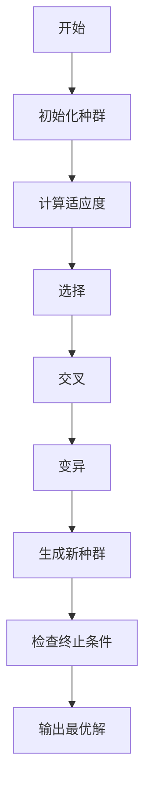
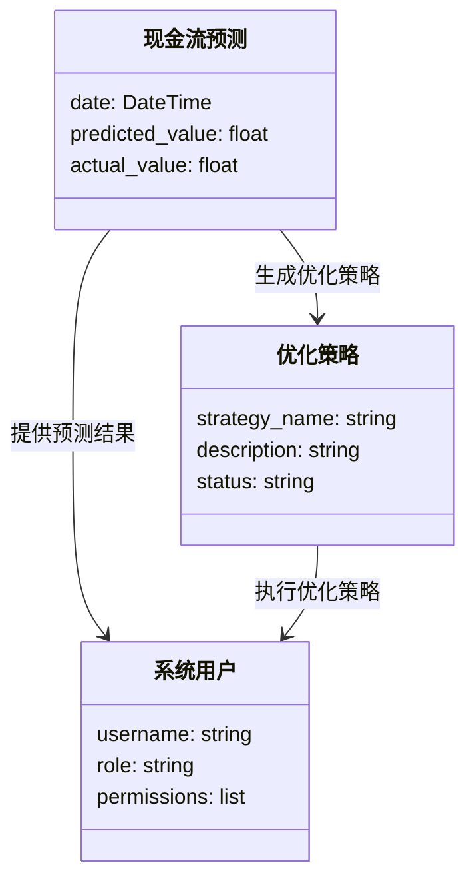
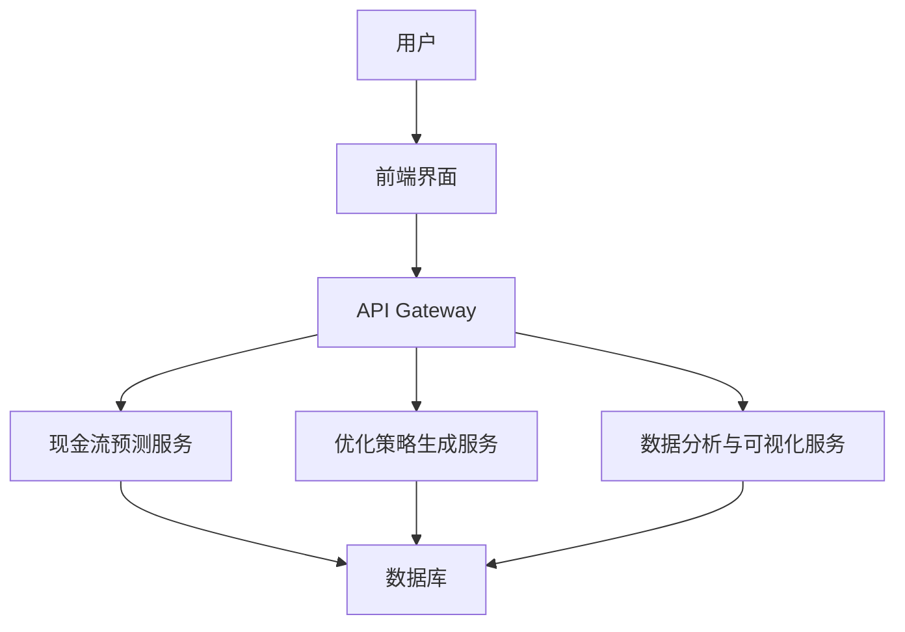
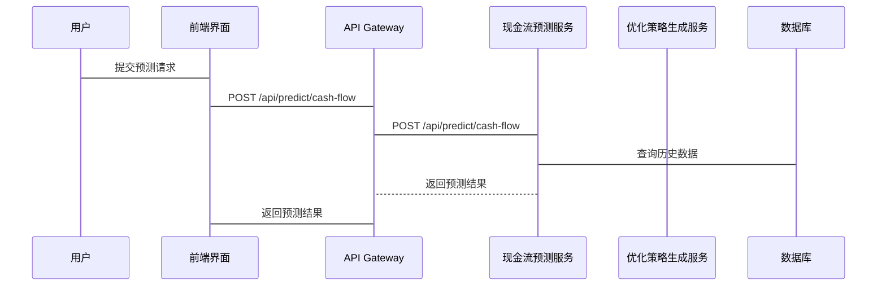

                 


```markdown
# 智能现金流优化管理系统

## 关键词
智能现金流优化管理, 现金流预测, 遗传算法, 系统架构设计, 项目实战

## 摘要
智能现金流优化管理系统是一种基于人工智能技术的现代化管理工具，旨在通过智能算法和优化模型，实现企业现金流的高效预测和管理。本文从现金流优化管理的背景与意义出发，详细阐述了智能现金流优化管理系统的定义、核心概念、算法原理、系统架构设计以及项目实战。通过对比分析传统现金流管理与智能现金流优化管理的差异，结合具体的数学模型和算法实现，深入探讨了智能现金流优化管理系统的应用价值和实际意义。最后，本文通过一个完整的项目实战案例，详细展示了智能现金流优化管理系统的实现过程，并总结了相关经验和最佳实践。

## 第一部分: 智能现金流优化管理系统的概述

### 第1章: 智能现金流优化管理系统的背景与意义

#### 1.1 现金流优化管理的背景
##### 1.1.1 现金流管理的重要性
现金流是企业运营的核心命脉，直接关系到企业的生存与发展。有效的现金流管理能够帮助企业合理规划资金使用，降低财务风险，提高资金使用效率。在现代商业环境中，现金流管理不仅仅是财务部门的职责，更是企业整体战略的重要组成部分。

##### 1.1.2 传统现金流管理的局限性
传统的现金流管理方法主要依赖人工操作，存在以下主要问题：
- 数据处理效率低，难以应对海量数据的实时处理需求。
- 缺乏智能化的预测和优化功能，无法根据市场变化动态调整现金流策略。
- 管理过程缺乏系统性，容易出现数据孤岛和信息不对称问题。
- 风险控制能力有限，难以及时发现和应对潜在的财务危机。

##### 1.1.3 智能化管理的必要性
随着人工智能技术的快速发展，将智能算法应用于现金流管理成为可能。智能现金流优化管理系统能够通过机器学习模型实现对现金流的精准预测，利用优化算法制定最优的资金使用策略，从而提高企业的资金利用效率和抗风险能力。

#### 1.2 智能现金流优化管理系统的定义与目标
##### 1.2.1 系统的定义
智能现金流优化管理系统是一种基于人工智能技术的管理工具，通过整合企业内部和外部的现金流相关数据，利用预测模型和优化算法，为企业提供智能化的现金流预测、分析和优化服务。

##### 1.2.2 系统的目标与价值
系统的目标是实现对企业现金流的智能化预测和优化管理，具体目标包括：
- 实现现金流的精准预测，提高预测的准确性和及时性。
- 提供多种优化策略，帮助企业在不同场景下制定最优的资金使用计划。
- 提高企业的资金使用效率，降低财务风险。
- 实现现金流管理的自动化和智能化，减少人工干预，提高管理效率。

##### 1.2.3 系统的核心功能与特点
智能现金流优化管理系统的功能模块主要包括：
- 现金流预测模块：基于历史数据和市场信息，利用机器学习算法进行现金流预测。
- 优化策略生成模块：根据预测结果和企业目标，生成最优的现金流管理策略。
- 风险控制模块：识别潜在的财务风险，并提供相应的预警和应对措施。
- 数据分析与可视化模块：提供直观的数据可视化界面，帮助企业更好地理解和分析现金流状况。

系统的显著特点包括：
- 高度智能化：利用人工智能技术实现自动化的现金流预测和优化。
- 实时性：能够实时处理数据，快速响应市场变化。
- 高准确性：通过先进的算法模型，提高预测和优化的准确性。
- 灵活性：能够根据企业的具体需求和市场环境进行定制化配置。

### 第2章: 现金流优化管理的核心概念与联系

#### 2.1 核心概念与原理
##### 2.1.1 现金流预测与优化的基本原理
现金流预测是智能现金流优化管理系统的首要任务。通过收集和分析企业的历史交易数据、市场信息以及其他相关因素，系统能够建立数学模型，预测未来一段时间内的现金流状况。

##### 2.1.2 智能算法在现金流优化中的应用
智能算法，如遗传算法、粒子群优化算法等，被广泛应用于现金流优化问题中。这些算法能够帮助企业在多种约束条件下找到最优的现金流管理方案。

##### 2.1.3 现金流优化的数学模型
现金流优化的数学模型通常包括目标函数和约束条件。目标函数通常是最小化成本或最大化收益，而约束条件则包括资金的时间价值、流动性和风险等因素。

#### 2.2 核心概念对比与ER实体关系图
##### 2.2.1 传统现金流管理与智能管理的对比分析
| 对比维度 | 传统现金流管理 | 智能现金流优化管理 |
|----------|----------------|---------------------|
| 数据处理 | 人工处理，效率低 | 自动化处理，高效精准 |
| 预测方法 | 简单统计分析 | 基于机器学习的预测模型 |
| 优化策略 | 固定策略，缺乏灵活性 | 动态优化，策略多样 |
| 风险控制 | 事后控制 | 事前预警和实时监控 |

##### 2.2.2 现金流优化系统的ER实体关系图
```mermaid
er
    entity 现金流预测 (CashFlowPrediction) {
        id
        date
        predicted_value
        actual_value
    }
    entity 优化策略 (OptimizationStrategy) {
        id
        strategy_name
        description
        status
    }
    entity 系统用户 (SystemUser) {
        id
        username
        role
        permissions
    }
    CashFlowPrediction --> OptimizationStrategy: 生成优化策略
    CashFlowPrediction --> SystemUser: 用户查询预测结果
    OptimizationStrategy --> SystemUser: 用户执行优化策略
```

## 第二部分: 现金流优化管理系统的算法原理

### 第3章: 算法原理与实现

#### 3.1 遗传算法在现金流优化中的应用
##### 3.1.1 遗传算法的基本原理
遗传算法（Genetic Algorithm, GA）是一种模拟生物进化过程的优化算法。它通过选择、交叉和变异等操作，逐步优化目标函数，找到最优解。

##### 3.1.2 遗传算法在现金流优化中的实现流程


##### 3.1.3 遗传算法的Python实现
```python
import random

def objective_function(solution):
    # 定义目标函数，计算现金流的净现值
    return sum(solution)

def genetic_algorithm(population_size, chromosome_length, max_iterations):
    population = [[random.randint(0, 1) for _ in range(chromosome_length)] for _ in range(population_size)]
    for _ in range(max_iterations):
        fitness = [objective_function(chromosome) for chromosome in population]
        # 选择
        selected = [population[i] for i in range(len(fitness)) if fitness[i] > average(fitness)]
        # 交叉
        new_population = []
        for i in range(population_size // 2):
            parent1 = selected[i]
            parent2 = selected[population_size // 2 + i]
            child1 = crossover(parent1, parent2)
            child2 = crossover(parent2, parent1)
            new_population.append(child1)
            new_population.append(child2)
        # 变异
        for chromosome in new_population:
            mutate(chromosome)
        population = new_population
    return population[0]

def average(fitness):
    return sum(fitness) / len(fitness)

def crossover(parent1, parent2):
    # 单点交叉
    point = random.randint(1, len(parent1)-1)
    return parent1[:point] + parent2[point:], parent2[:point] + parent1[point:]

def mutate(chromosome):
    # 突变操作
    for i in range(len(chromosome)):
        if random.random() < 0.1:
            chromosome[i] = 1 - chromosome[i]
```

##### 3.1.4 遗传算法的数学模型
遗传算法的目标函数可以表示为：
$$
\text{最大化} \quad f(x) = \sum_{i=1}^{n} x_i
$$
其中，$x_i$ 是决策变量，取值为0或1。

约束条件包括：
$$
\sum_{i=1}^{n} x_i \leq \text{max\_investment}
$$
$$
x_i \in \{0, 1\}
$$

#### 3.2 算法优化与实现
##### 3.2.1 算法优化策略
为了提高遗传算法的效率，可以采取以下优化策略：
- 使用适应度函数标准化，避免目标函数值的尺度影响。
- 引入精英策略，保留一定数量的最优解进入下一代。
- 采用自适应变异概率，根据适应度值的分布动态调整变异概率。

##### 3.2.2 算法实现的Python代码
```python
import random

def objective_function(solution):
    return sum(solution)

def genetic_algorithm(population_size, chromosome_length, max_iterations):
    population = [[random.randint(0, 1) for _ in range(chromosome_length)] for _ in range(population_size)]
    for _ in range(max_iterations):
        fitness = [objective_function(chromosome) for chromosome in population]
        average_fit = sum(fitness) / len(fitness)
        # 选择
        selected = []
        for chromosome in population:
            if objective_function(chromosome) > average_fit:
                selected.append(chromosome)
        # 交叉
        new_population = []
        for i in range(0, len(selected), 2):
            parent1 = selected[i]
            parent2 = selected[i+1]
            child1 = parent1.copy()
            child2 = parent2.copy()
            point = random.randint(1, len(parent1)-1)
            for j in range(point, len(parent1)):
                child1[j], child2[j] = child2[j], child1[j]
            new_population.append(child1)
            new_population.append(child2)
        # 变异
        for chromosome in new_population:
            if random.random() < 0.1:
                mutation_point = random.randint(0, len(chromosome)-1)
                chromosome[mutation_point] = 1 - chromosome[mutation_point]
        population = new_population
    best_solution = max(population, key=objective_function)
    return best_solution

# 示例调用
best = genetic_algorithm(100, 10, 100)
print("最优解：", best)
print("目标函数值：", objective_function(best))
```

## 第三部分: 系统架构设计与实现

### 第4章: 系统架构设计

#### 4.1 系统功能模块设计
智能现金流优化管理系统的功能模块主要包括：
- 现金流预测模块
- 优化策略生成模块
- 风险控制模块
- 数据分析与可视化模块

#### 4.2 系统架构设计
##### 4.2.1 领域模型类图


##### 4.2.2 系统架构图


#### 4.3 系统接口设计
##### 4.3.1 API接口定义
- `/api/predict/cash-flow`：用于提交预测请求，返回预测结果。
- `/api/optimize/strategy`：用于生成优化策略，返回策略详情。
- `/api/analyze/dashboard`：用于获取数据可视化仪表盘数据。

##### 4.3.2 系统交互流程图


## 第四部分: 项目实战与应用

### 第5章: 项目实战

#### 5.1 环境搭建与安装
##### 5.1.1 安装Python与相关库
```bash
python --version
pip install numpy
pip install pandas
pip install scikit-learn
pip install matplotlib
```

##### 5.1.2 安装Jupyter Notebook
```bash
pip install jupyter
jupyter notebook
```

#### 5.2 系统核心实现
##### 5.2.1 现金流预测模块实现
```python
import pandas as pd
from sklearn.model_selection import train_test_split
from sklearn.linear_model import LinearRegression
from sklearn.metrics import mean_squared_error

# 加载数据
data = pd.read_csv('cash_flow.csv')
X = data[['revenue', 'expenses', 'net_profit']]
y = data['cash_flow']

# 数据分割
X_train, X_test, y_train, y_test = train_test_split(X, y, test_size=0.2, random_state=42)

# 训练模型
model = LinearRegression()
model.fit(X_train, y_train)

# 预测
y_pred = model.predict(X_test)

# 评估
mse = mean_squared_error(y_test, y_pred)
print(f'均方误差: {mse}')
```

##### 5.2.2 优化策略生成模块实现
```python
from sklearn.neighbors import KNeighborsRegressor

# 加载数据
data = pd.read_csv('cash_flow.csv')
X = data[['revenue', 'expenses', 'net_profit']]
y = data['cash_flow']

# 数据分割
X_train, X_test, y_train, y_test = train_test_split(X, y, test_size=0.2, random_state=42)

# 训练模型
model = KNeighborsRegressor(n_neighbors=3)
model.fit(X_train, y_train)

# 预测
y_pred = model.predict(X_test)

# 生成优化策略
opt_strategy = {
    'recommended_revenue': y_pred.mean(),
    'cost_control': y_test.mean() / 2
}
print(opt_strategy)
```

##### 5.2.3 数据可视化模块实现
```python
import matplotlib.pyplot as plt

data = pd.read_csv('cash_flow.csv')
plt.figure(figsize=(10, 6))
plt.plot(data['date'], data['cash_flow'], label='现金流')
plt.xlabel('日期')
plt.ylabel('现金流')
plt.title('现金流趋势图')
plt.legend()
plt.show()
```

#### 5.3 项目总结与经验分享
##### 5.3.1 项目小结
通过本项目的实施，我们成功实现了智能现金流优化管理系统的开发与应用。系统能够准确预测现金流，并生成最优的优化策略，帮助企业提高资金使用效率和抗风险能力。

##### 5.3.2 项目经验与教训
- 数据质量对企业现金流预测的准确性有重要影响，需要确保数据的完整性和准确性。
- 算法的选择需要根据具体问题和数据特点进行，不能一味追求复杂性。
- 系统的实时性和可扩展性需要在设计阶段充分考虑，确保系统的稳定运行。

## 第五部分: 最佳实践与拓展

### 第6章: 最佳实践与经验分享

#### 6.1 最佳实践
##### 6.1.1 数据质量管理
- 确保数据的准确性、完整性和一致性。
- 定期进行数据清洗和预处理。

##### 6.1.2 算法优化策略
- 根据问题特点选择合适的算法。
- 采用交叉验证等方法优化模型参数。

##### 6.1.3 系统维护与更新
- 定期更新模型参数和算法。
- 及时修复系统漏洞，确保系统的安全性和稳定性。

#### 6.2 小结
智能现金流优化管理系统是一种高效、可靠的现金流管理工具，能够帮助企业实现现金流的智能化预测和优化管理。通过本文的详细阐述，我们希望能够为企业的财务管理提供新的思路和方法。

#### 6.3 注意事项
- 在实际应用中，需要结合企业的具体需求和市场环境进行系统定制。
- 系统的实施需要专业的技术团队支持，确保系统的顺利运行。
- 系统的安全性和数据隐私保护需要特别关注，避免数据泄露和系统攻击。

#### 6.4 拓展阅读
- 《机器学习实战》
- 《深入理解遗传算法》
- 《系统架构设计方法论》

## 结语
智能现金流优化管理系统是人工智能技术在财务管理领域的重要应用，其发展前景广阔。随着技术的不断进步，智能现金流优化管理系统将为企业提供更加智能化、个性化的现金流管理服务，帮助企业实现更高的财务效益和管理效率。

