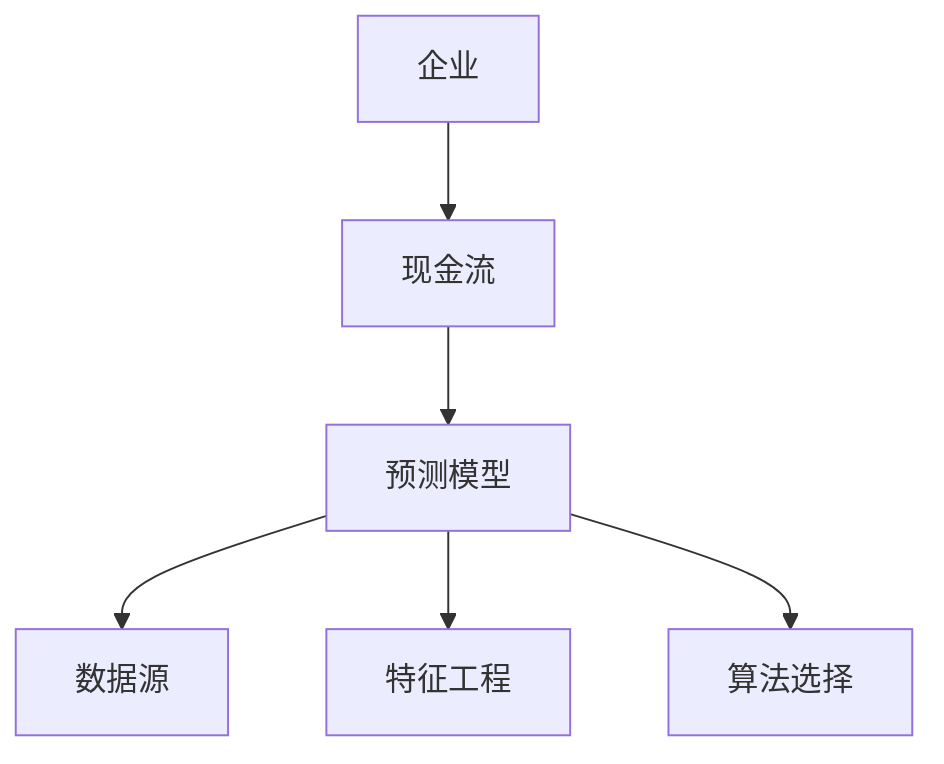
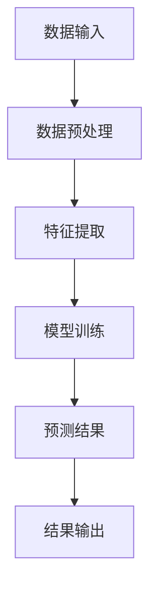
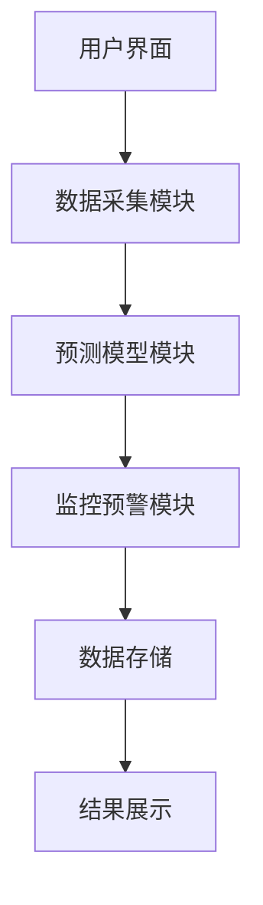

                 


# 智能现金流管理系统

> 关键词：智能现金流管理，人工智能，财务系统，现金流预测，机器学习，数据预处理

> 摘要：智能现金流管理系统是一种结合人工智能技术的财务管理系统，旨在优化现金流预测和管理。本文详细探讨了智能现金流管理的核心概念、算法原理、系统架构以及项目实战，帮助读者理解如何利用AI技术提升现金流管理的效率和准确性。

---

# 第一部分: 智能现金流管理系统概述

# 第1章: 智能现金流管理的背景与意义

## 1.1 现金流管理的重要性

### 1.1.1 现金流管理的基本概念
现金流管理是企业财务管理的核心部分，涉及现金流入和流出的预测、监控和优化。有效的现金流管理能够确保企业的运营资金充足，降低财务风险。

### 1.1.2 现金流管理在企业中的作用
现金流管理不仅影响企业的日常运营，还关系到企业的长期发展。良好的现金流管理可以优化资金使用效率，支持投资决策，增强企业的抗风险能力。

### 1.1.3 现金流管理的常见问题与挑战
传统现金流管理方法存在数据处理效率低、预测准确性差、缺乏动态调整等问题。这些问题可能导致企业资金链断裂，影响经营稳定性。

## 1.2 传统现金流管理的局限性

### 1.2.1 传统现金流预测方法的不足
传统预测方法如线性回归和简单时间序列分析难以捕捉数据中的复杂模式，预测结果不够准确。

### 1.2.2 数据处理的低效性
传统方法依赖大量人工操作，数据清洗和预处理耗时且容易出错，影响整体效率。

### 1.2.3 缺乏实时性和动态调整能力
传统方法难以实时更新预测结果，无法快速响应市场变化和企业内部调整。

## 1.3 智能现金流管理的概念与优势

### 1.3.1 智能现金流管理的定义
智能现金流管理是利用人工智能技术，结合大数据分析，实现现金流预测、监控和优化的智能化管理系统。

### 1.3.2 智能现金流管理的核心优势
智能现金流管理通过机器学习算法和实时数据分析，提高预测准确性，实现动态调整，优化资金使用效率。

### 1.3.3 智能现金流管理的应用场景
适用于企业日常现金流预测、投资决策支持、风险评估和控制等领域。

## 1.4 本章小结
智能现金流管理通过引入人工智能技术，克服了传统方法的局限性，为企业提供了更高效、准确的现金流管理解决方案。

---

# 第2章: 智能现金流管理的核心概念与联系

## 2.1 核心概念原理

### 2.1.1 现金流预测模型
现金流预测模型是智能系统的基石，利用历史数据和机器学习算法预测未来现金流。

### 2.1.2 数据预处理与特征提取
数据预处理包括清洗、标准化和特征工程，提取有用的特征用于模型训练。

### 2.1.3 算法选择与优化
选择合适的算法如ARIMA、随机森林和XGBoost，并进行参数调优以提高预测准确率。

## 2.2 核心概念属性特征对比

### 2.2.1 现金流预测模型的属性对比
| 模型 | 参数数量 | 预测精度 | 计算复杂度 |
|------|----------|----------|------------|
| ARIMA | 中等     | 中等     | 较低        |
| 随机森林 | 较多     | 高       | 较高        |
| XGBoost | 较多     | 高       | 较高        |

### 2.2.2 数据预处理方法的特征对比
| 方法 | 数据类型支持 | 是否需要特征工程 | 处理时间 |
|------|--------------|------------------|----------|
| 数据清洗 | 数值型       | 是               | 较长      |
| 数据标准化 | 数值型       | 是               | 较短      |

### 2.2.3 不同算法的性能对比
| 算法 | 预测精度 | 训练时间 | �易用性 |
|------|----------|----------|--------|
| ARIMA | 中等     | 较短     | 高      |
| 随机森林 | 高       | 较长     | 中等    |
| XGBoost | 高       | 较长     | 中等    |

## 2.3 ER实体关系图



---

# 第3章: 智能现金流管理系统的算法原理

## 3.1 算法选择与实现

### 3.1.1 时间序列分析
使用ARIMA模型进行时间序列预测，适用于具有趋势和季节性的数据。

### 3.1.2 机器学习算法
采用随机森林和XGBoost进行特征重要性分析和预测，提升预测精度。

## 3.2 算法原理图



## 3.3 数学模型与公式

### 3.3.1 ARIMA模型公式
$$ ARIMA(p, d, q) $$
其中，p为自回归阶数，d为差分阶数，q为移动平均阶数。

### 3.3.2 随机森林算法
随机森林通过构建多个决策树并行投票或平均化，提高预测准确性和鲁棒性。

---

# 第4章: 智能现金流管理系统的架构设计

## 4.1 系统功能设计

### 4.1.1 数据采集模块
负责从数据库或外部API获取现金流数据。

### 4.1.2 预测模型模块
实现现金流预测的核心算法，包括数据预处理和模型训练。

### 4.1.3 监控预警模块
实时监控现金流状态，设置预警机制，及时通知相关人员。

## 4.2 系统架构图



---

# 第5章: 智能现金流管理系统的项目实战

## 5.1 环境安装与配置

### 5.1.1 安装Python和相关库
安装Python 3.8及以上版本，安装numpy、pandas、scikit-learn等库。

## 5.2 系统核心实现

### 5.2.1 数据预处理代码
```python
import pandas as pd
from sklearn.preprocessing import StandardScaler

# 数据加载
data = pd.read_csv('cash_flow.csv')

# 数据清洗
data.dropna(inplace=True)

# 标准化处理
scaler = StandardScaler()
scaled_data = scaler.fit_transform(data)
```

### 5.2.2 算法实现代码
```python
from sklearn.ensemble import RandomForestRegressor
from sklearn.metrics import mean_squared_error

# 训练模型
model = RandomForestRegressor(n_estimators=100)
model.fit(X_train, y_train)

# 预测结果
y_pred = model.predict(X_test)

# 评估模型
mse = mean_squared_error(y_test, y_pred)
print(f"均方误差: {mse}")
```

## 5.3 实际案例分析

### 5.3.1 数据分析与处理
通过分析历史数据，提取关键特征，如收入、支出、季节性因素等。

### 5.3.2 模型训练与优化
训练随机森林模型，调整参数如n_estimators和max_depth，优化预测精度。

## 5.4 系统功能展示

### 5.4.1 数据可视化
使用Matplotlib或Seaborn绘制现金流趋势图，直观展示数据变化。

### 5.4.2 预测结果展示
展示预测结果与实际值的对比，评估模型性能。

---

# 第6章: 智能现金流管理系统的最佳实践

## 6.1 项目小结

### 6.1.1 核心收获
通过本项目，掌握了智能现金流管理的核心概念和实现方法，熟悉了相关算法和工具。

### 6.1.2 项目经验总结
数据预处理和特征工程是影响模型性能的关键因素，选择合适的算法和优化参数可以显著提高预测精度。

## 6.2 注意事项

### 6.2.1 数据质量的重要性
确保数据的准确性和完整性，数据预处理是模型训练的基础。

### 6.2.2 模型选择与调优
根据数据特性和业务需求选择合适的算法，通过交叉验证和网格搜索优化模型性能。

## 6.3 拓展阅读

### 6.3.1 推荐书籍
- 《机器学习实战》
- 《时间序列分析与应用》

### 6.3.2 在线资源
- scikit-learn官方文档
- Kaggle上的相关项目

---

# 结语

智能现金流管理系统通过人工智能技术，显著提升了现金流预测和管理的效率和准确性。本文从背景、核心概念、算法原理到系统架构和项目实战，全面解析了智能现金流管理的实现过程。希望读者能够通过本文掌握相关知识，并在实际工作中应用这些技术，优化企业的财务管理和运营效率。

