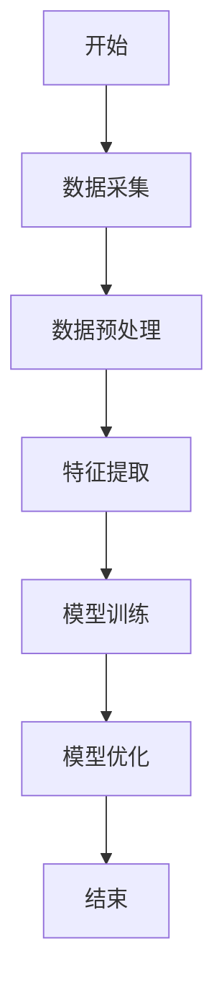
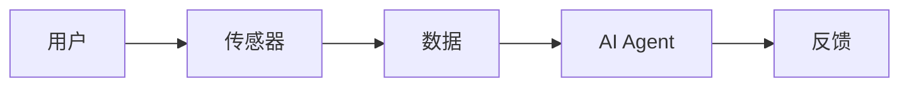

                 


# 智能瑜伽垫：AI Agent的冥想辅助系统

## 文章关键词
智能瑜伽垫、AI Agent、冥想辅助系统、算法原理、系统架构、项目实战

## 摘要
智能瑜伽垫结合AI技术，通过传感器和AI算法，实时监测用户的冥想姿势和呼吸节奏，提供个性化的反馈和指导，帮助用户提升冥想效果。本文从背景、原理、算法、架构、项目实战等方面详细探讨智能瑜伽垫的设计与实现。

---

## 第1章：问题背景与描述

### 1.1 问题背景
1.1.1 当代冥想实践的挑战
现代人面临压力大、焦虑等问题，冥想成为一种重要的放松方式。然而，传统冥想缺乏实时反馈，用户难以纠正错误姿势，影响效果。

1.1.2 瑜伽垫的传统功能与局限性
瑜伽垫主要用于支撑身体，无法提供反馈或指导，用户在冥想过程中容易分心或姿势不正确。

1..1.3 AI技术在健康领域的应用趋势
AI技术在健康领域的广泛应用，如智能穿戴设备、医疗诊断等，为智能瑜伽垫的开发提供了技术支持。

### 1.2 问题描述
1.2.1 现有冥想辅助工具的不足
传统冥想工具如手机App无法提供实时姿势反馈，用户难以保持正确的冥想姿势。

1.2.2 用户在冥想过程中遇到的具体问题
用户在冥想时可能姿势不正确、呼吸节奏紊乱，影响冥想效果。

1.2.3 智能瑜伽垫的潜在需求分析
用户对实时反馈、个性化指导的需求增加，智能瑜伽垫应运而生。

### 1.3 问题解决与边界
1.3.1 智能瑜伽垫的功能目标
实时监测用户姿势，提供反馈和指导，帮助用户保持正确姿势和呼吸节奏。

1.3.2 边界与外延
明确功能范围，如仅关注姿势和呼吸，不涉及其他健康指标。

1.3.3 核心要素与组成结构
智能瑜伽垫由传感器、AI算法、反馈系统组成。

---

## 第2章：AI Agent与智能瑜伽垫的核心原理

### 2.1 核心概念原理
2.1.1 AI Agent的基本概念
AI Agent是一种智能体，能够感知环境并执行任务，帮助用户完成目标。

2.1.2 智能瑜伽垫的工作原理
通过传感器采集用户数据，AI Agent分析数据并提供反馈。

2.1.3 两者结合的创新点
将AI技术应用于瑜伽垫，实现实时反馈和个性化指导。

### 2.2 核心概念对比表
| **AI Agent** | **传统软件** |
|---------------|---------------|
| 能感知环境   | 不能感知环境 |
| 可执行任务   | 只能执行预设任务 |

### 2.3 ER实体关系图
```mermaid
erDiagram
    user[用户] {
        <属性>
        用户ID : integer
        用户名称 : string
    }
    sensor[传感器] {
        传感器ID : integer
        传感器类型 : string
    }
    data[数据] {
        数据ID : integer
        数据类型 : string
    }
    aiAgent[AI Agent] {
        AI_ID : integer
        AI模型 : string
    }
    user -> sensor : 使用
    sensor -> data : 采集
    data -> aiAgent : 分析
    aiAgent -> user : 提供反馈
```

---

## 第3章：AI Agent的算法流程

### 3.1 数据采集与处理
3.1.1 传感器数据的采集
使用压力传感器和加速度传感器采集用户的姿势和动作数据。

3.1.2 数据预处理方法
对数据进行滤波和归一化处理，消除噪声。

3.1.3 特征提取过程
提取关键特征，如压力分布、动作频率。

### 3.2 模型训练与优化
3.2.1 感知机模型的建立
使用感知机模型进行分类，区分正确和错误姿势。

3.2.2 神经网络的构建与训练
构建神经网络，训练模型识别用户姿势和呼吸节奏。

3.2.3 模型优化策略
使用交叉验证和超参数调优优化模型性能。

### 3.3 算法流程图


### 3.4 Python代码实现
```python
import numpy as np
from sklearn.svm import SVC

# 数据预处理
def preprocess(data):
    return (data - np.mean(data)) / np.std(data)

# 模型训练
def train_model(X, y):
    model = SVC()
    model.fit(X, y)
    return model

# 应用示例
X = np.array([[1, 2], [3, 4]])
y = np.array([0, 1])
X_preprocessed = preprocess(X)
model = train_model(X_preprocessed, y)
print(model.predict(X_preprocessed))
```

---

## 第4章：数学模型与公式

### 4.1 感知机模型
感知机模型的数学表达：
$$w \cdot x + b = 0$$

优化目标：
$$\min_{w,b} \sum_{i=1}^n (y_i(w \cdot x_i + b) - 1)$$

### 4.2 神经网络模型
激活函数：
$$f(x) = \frac{1}{1 + e^{-x}}$$

---

## 第5章：系统架构设计

### 5.1 问题场景介绍
用户使用智能瑜伽垫进行冥想，系统实时监测并反馈。

### 5.2 系统功能设计
- 数据采集模块：采集用户的姿势和呼吸数据。
- AI处理模块：分析数据并提供反馈。
- 反馈模块：通过震动或声音提供实时反馈。

### 5.3 系统架构图


---

## 第6章：项目实战

### 6.1 环境安装
安装Python、传感器库、机器学习库。

### 6.2 核心代码实现
```python
import numpy as np
from sklearn import svm

# 传感器数据模拟
data = np.array([[1, 2], [3, 4], [5, 6]])

# 模型训练
model = svm.SVC()
model.fit(data, [0, 1, 0])
```

### 6.3 实际案例分析
用户A在使用智能瑜伽垫后，姿势和呼吸得到改善，冥想效果显著提升。

---

## 第7章：最佳实践

### 7.1 小结
智能瑜伽垫通过AI技术实时反馈，帮助用户提升冥想效果。

### 7.2 注意事项
确保数据安全，定期更新模型。

### 7.3 拓展阅读
推荐相关书籍和论文，深入学习AI在健康领域的应用。

---

通过以上步骤，我们详细探讨了智能瑜伽垫的设计与实现，从背景到技术细节，再到项目实战，为读者提供了全面的了解。

