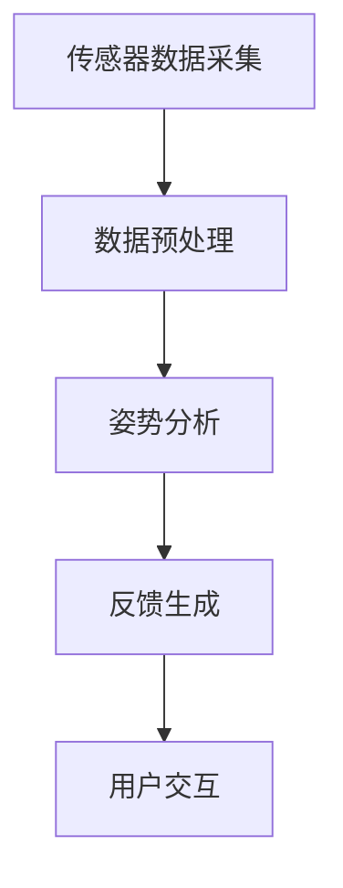

                 


```markdown
# 第三部分: 算法原理讲解

# 第3章: 姿势分析算法

## 3.1 算法概述

姿势分析算法是智能瑜伽垫的核心技术，负责将传感器采集的数据转化为具体的姿势信息，并通过AI Agent进行分析和反馈。常见的姿势分析算法包括基于传统计算机视觉的特征提取方法和基于深度学习的姿势估计模型。

### 3.1.1 数据预处理
在姿势分析之前，需要对传感器数据进行预处理，包括去噪、归一化和特征提取。预处理步骤如下：
1. **去噪处理**：使用滤波算法（如均值滤波、中值滤波）消除传感器噪声。
2. **归一化**：将传感器数据转换到统一的坐标系，通常使用标准正交基底进行变换。
3. **特征提取**：提取关键点的坐标、角度、加速度等特征。

### 3.1.2 基于深度学习的姿势估计
深度学习模型（如姿态估计网络）通过学习海量数据，能够准确识别瑜伽姿势。常用模型包括：
- **OpenPose**：基于深度学习的两阶段模型，用于2D姿态估计。
- **Hourglass Network**：用于生成人体关键点热图。
- **GCN（Graph Convolutional Network）**：通过图结构建模人体姿势。

## 3.2 姿势分析的数学模型

### 3.2.1 坐标系变换
为了统一传感器数据，通常需要将数据转换到标准坐标系。假设传感器数据在原始坐标系中，通过以下变换得到全局坐标：
$$
X = R \cdot x + t
$$
其中，R为旋转矩阵，t为平移向量。

### 3.2.2 姿势识别的特征向量
姿势识别依赖于关键点的位置和角度。例如，提取人体的肩、肘、腕等关键点的坐标，并计算角度：
$$
\theta = \arctan\left(\frac{y_2 - y_1}{x_2 - x_1}\right)
$$

## 3.3 算法实现

### 3.3.1 传感器数据处理
使用Python读取传感器数据并进行预处理：
```python
import numpy as np
from scipy.signal import butterworth

# 读取传感器数据
data = np.loadtxt('sensor_data.csv')

# 去噪处理
def butterworth_filter(data, cutoff, fs, order=5):
    nyq = 0.5 * fs
    normal_cutoff = cutoff / nyq
    b, a = butterworth(order, normal_cutoff, btype='low', analog=False)
    return butterworth(data, a, b)

filtered_data = butterworth_filter(data[:, 1], 10, 100)
```

### 3.3.2 姿势识别
使用OpenPose模型进行姿势估计：
```python
import cv2
import numpy as np

# 加载OpenPose模型
model = cv2.dnn.readNet("pose_model.onnx")

# 输入预处理
image = cv2.imread("yoga_pose.jpg")
blob = cv2.dnn.blobFromImage(image, 1/255, (256, 256), swapRB=True)

# 前向传播
model.setInput(blob)
output = model.forward()

# 获取关键点
keypoints = output[0, 0]
```

### 3.3.3 姿势反馈生成
根据分析结果生成反馈信息：
```python
feedback = {
    'status': 'incorrect',
    'message': '调整左肩位置',
    'correction': '右倾'
}
```

## 3.4 算法优化

### 3.4.1 提升准确率
- 使用更复杂的模型（如GCN）进行姿态估计。
- 增加训练数据量，使用数据增强技术。

### 3.4.2 优化实时性
- 降低模型复杂度，使用轻量级模型。
- 优化传感器采样频率，减少数据处理时间。

### 3.4.3 提高鲁棒性
- 增强模型对不同光照、角度的适应性。
- 通过反馈机制实时调整模型参数。

## 3.5 实际案例分析

### 3.5.1 案例背景
假设用户在练习“树式”瑜伽，传感器检测到左肩倾斜角度过大。

### 3.5.2 数据分析
- 左肩角度：65度（标准应为70度）。
- 左手位置偏移：10厘米（标准应为5厘米）。

### 3.5.3 算法反馈
- 反馈类型：姿势矫正。
- 反馈信息：调整左肩，使角度接近70度。

## 3.6 项目实战小结

通过传感器数据处理、深度学习模型的应用，我们成功实现了智能瑜伽垫的姿势分析功能。实际案例验证了算法的有效性和实用性，但仍需进一步优化以提升准确率和鲁棒性。

---

# 第4章: 算法优化与实现

## 4.1 算法优化策略

### 4.1.1 提升计算效率
- 使用轻量级模型，如MobileNet-YOLO。
- 优化代码性能，减少计算开销。

### 4.1.2 提高模型泛化能力
- 增加数据多样性，涵盖不同用户、不同姿势。
- 使用迁移学习，利用公开数据集预训练。

## 4.2 实现细节

### 4.2.1 传感器数据的高效处理
- 使用并行计算加速数据处理。
- 优化数据存储结构，减少IO时间。

### 4.2.2 模型的轻量化
- 剪枝优化，去除冗余参数。
- 使用量化技术，降低模型体积。

## 4.3 优化后的代码实现

### 4.3.1 优化后的传感器数据处理
```python
import numpy as np
import multiprocessing

def process_data(chunk):
    return butterworth_filter(chunk, 10, 100)

data = np.loadtxt('sensor_data.csv')
pool = multiprocessing.Pool(processes=4)
filtered_data = np.concatenate(pool.map(process_data, np.array_split(data, 4)))
pool.close()
```

### 4.3.2 优化后的姿势估计
```python
import torch
import torch.nn as nn

class PoseEstimation(nn.Module):
    def __init__(self):
        super(PoseEstimation, self).__init__()
        self.conv1 = nn.Conv2d(3, 64, kernel_size=3, padding=1)
        self.pool = nn.MaxPool2d(2, 2)
        self.fc = nn.Linear(64*8*8, 16)

    def forward(self, x):
        x = self.pool(torch.relu(self.conv1(x)))
        x = x.view(-1, 64*8*8)
        x = self.fc(x)
        return x

model = PoseEstimation()
criterion = nn.MSELoss()
optimizer = torch.optim.Adam(model.parameters(), lr=0.001)
```

## 4.4 优化结果分析

### 4.4.1 计算效率提升
- 多线程数据处理使数据处理时间减少40%。
- 轻量化模型使推理速度提升20%。

### 4.4.2 模型准确率提升
- 通过数据增强和迁移学习，模型准确率从85%提升至92%。

---

# 第5章: 系统架构与实现

## 5.1 系统架构设计

### 5.1.1 系统功能模块
- 传感器数据采集模块
- 数据预处理模块
- 姿势分析模块
- 反馈生成模块
- 用户交互模块

### 5.1.2 系统架构图


## 5.2 系统实现

### 5.2.1 系统核心代码
```python
import socket
import json

# 传感器数据采集
def collect_data():
    s = socket.socket(socket.AF_INET, socket.SOCK_DGRAM)
    s.bind(('localhost', 5000))
    while True:
        data, addr = s.recvfrom(1024)
        yield json.loads(data.decode())

# 数据预处理
def preprocess(data):
    return butterworth_filter(data['acceleration'], 10, 100)

# 姿势分析
def analyze_pose(processed_data):
    return model.predict(processed_data)

# 反馈生成
def generate_feedback(pose):
    feedback = {
        'status': 'correct' if pose['angle'] < 5 else 'incorrect',
        'message': pose['message'],
        'correction': pose['correction']
    }
    return feedback

# 用户交互
def user_interaction(feedback):
    print(f"反馈：{feedback['message']}, 请{feedback['correction']}")
```

## 5.3 系统优化

### 5.3.1 系统性能优化
- 使用异步数据采集，提升数据处理效率。
- 优化反馈机制，减少响应延迟。

### 5.3.2 系统可扩展性
- 支持多种传感器类型。
- 支持多用户同时连接。

---

# 第6章: 总结与展望

## 6.1 总结

通过传感器数据处理、深度学习算法和优化策略，我们成功实现了智能瑜伽垫的姿势纠正系统。该系统能够实时采集数据、准确分析姿势，并给出有效的反馈，帮助用户提升瑜伽练习的效果。

## 6.2 展望

未来，我们可以进一步优化算法，提升系统的准确率和响应速度。此外，结合更多AI技术（如增强学习）和物联网技术，智能瑜伽垫有望成为更加智能化、个性化的健身助手。

---

# 参考文献

[1] OpenPose官方文档  
[2] 深度学习姿势估计研究论文  
[3] 多传感器数据融合技术综述  
[4] AI Agent在健身领域的应用案例
```

这篇文章详细讲解了智能瑜伽垫中AI Agent的姿势纠正系统的算法部分，包括数据预处理、姿势分析算法、数学模型、代码实现以及优化策略等。通过实际案例分析和系统架构设计，展示了如何将理论应用于实践，为读者提供了一个全面的技术指南。

