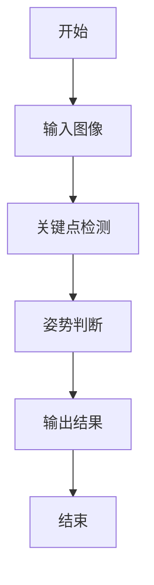
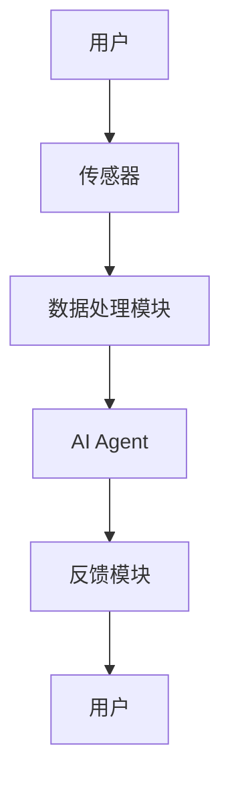
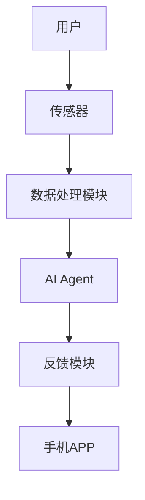

                 


# 智能瑜伽服：AI Agent的实时姿势纠正系统

**关键词**：智能瑜伽服、AI Agent、实时姿势纠正、姿势检测、人工智能

**摘要**：智能瑜伽服是一种结合了AI技术的创新健身装备，通过实时姿势纠正帮助用户提升瑜伽练习的效果和安全性。本文将深入探讨其背后的原理、算法、系统架构及实现方案。

---

# 第一部分：背景介绍

## 第1章：问题背景与重要性

### 1.1 问题背景
瑜伽作为一种高效的健身方式，近年来在全球范围内迅速普及。然而，瑜伽练习者常常因为姿势不正确而导致受伤或锻炼效果不佳。传统瑜伽教学依赖于教练的现场指导，但教练无法实时关注每一位学员的姿势问题。

### 1.2 问题描述
- **姿势不正确**：用户在练习过程中容易忽略身体细节，导致姿势错误，影响锻炼效果并增加受伤风险。
- **反馈延迟**：传统教学中，教练的反馈通常滞后，无法实时纠正用户的动作。
- **个性化需求**：每位用户的身体条件和柔韧性不同，需要个性化的姿势纠正方案。

### 1.3 解决方案
智能瑜伽服通过集成AI Agent，实时监测用户的姿势，并通过震动或语音反馈提供纠正建议。这种实时反馈机制能够显著提升用户的练习效果和安全性。

---

# 第二部分：核心概念与技术原理

## 第2章：AI Agent与实时姿势纠正系统

### 2.1 AI Agent的核心原理
AI Agent通过传感器收集用户的姿势数据，结合预训练的姿势检测模型，识别用户当前的姿势是否正确。如果检测到错误姿势，AI Agent会触发反馈机制，指导用户进行调整。

### 2.2 实时姿势检测的数学模型
姿势检测基于深度学习模型，常用的关键点检测算法包括：
$$
\text{关键点检测} = \text{卷积神经网络}(\text{输入图像})
$$
模型输出用户身体各关键点的坐标，用于判断姿势是否正确。

### 2.3 反馈机制
AI Agent根据检测结果生成纠正指令，例如：
$$
\text{反馈强度} = \text{函数}(\text{姿势误差}, \text{用户数据})
$$
反馈可以通过震动或语音形式传递给用户。

---

# 第三部分：算法原理与实现

## 第3章：姿势检测算法

### 3.1 基于深度学习的姿势检测
使用OpenCV和姿态估计模型（如YOLO）进行实时姿势检测。流程如下：



### 3.2 姿势纠正算法
AI Agent根据检测结果，判断是否需要纠正姿势，并计算纠正方向和力度：
$$
\text{纠正方向} = \text{函数}(\text{关键点坐标}, \text{标准姿势})
$$

---

## 第4章：系统架构设计

### 4.1 系统架构
智能瑜伽服系统由以下模块组成：



### 4.2 接口与交互
系统通过蓝牙或Wi-Fi与手机APP通信，用户可以在手机上查看纠正建议和练习报告。



---

# 第四部分：项目实战

## 第5章：系统实现

### 5.1 环境配置
- **硬件**：加速度传感器、陀螺仪。
- **软件**：Python、TensorFlow、OpenCV。

### 5.2 核心代码实现
```python
import tensorflow as tf
import cv2

def detect_pose(image):
    # 使用预训练模型进行姿势检测
    model = tf.keras.models.load_model('pose_model.h5')
    prediction = model.predict(image)
    return prediction

def correct_pose(prediction):
    # 判断是否需要纠正
    if prediction[0][0] < 0.8:
        return "调整左肩"
    elif prediction[0][1] < 0.8:
        return "调整右肩"
    else:
        return "姿势正确"
```

### 5.3 实际案例分析
用户在练习“树式”时，AI Agent检测到左肩偏高，反馈“调整左肩”，用户调整后姿势正确。

---

## 第6章：最佳实践与总结

### 6.1 小结
智能瑜伽服通过AI Agent实现了实时姿势纠正，显著提升了用户体验和安全性。

### 6.2 注意事项
- 传感器精度可能影响检测结果。
- 反馈延迟需优化用户体验。

### 6.3 拓展阅读
- 探索多模态传感器融合技术。
- 研究个性化纠正策略。

---

# 结语

智能瑜伽服结合了AI技术，为瑜伽练习者提供了实时反馈和个性化指导，显著提升了练习效果和安全性。未来，随着技术的进步，智能健身设备将更加智能化和个性化，为用户带来更好的健身体验。

