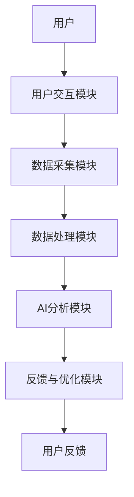

                 


# 智能瑜伽球：AI Agent的核心训练指导系统

---

## 关键词  
智能瑜伽球, AI Agent, 人工智能, 机器学习, 深度学习, 图像识别, 动作分析

---

## 摘要  
随着人工智能技术的快速发展，智能健身设备逐渐成为现代人追求健康生活的首选工具。本文将深入探讨智能瑜伽球这一创新产品，结合AI Agent的核心训练指导系统，分析其技术原理、系统架构以及实际应用场景。文章通过详细的技术分析和实际案例，揭示智能瑜伽球如何利用AI技术为用户提供个性化的瑜伽训练指导，帮助用户更高效、更安全地完成瑜伽练习。

---

# 第一部分: 智能瑜伽球与AI Agent概述

## 第1章: 智能瑜伽球与AI Agent的概述

### 1.1 智能瑜伽球的定义与特点

#### 1.1.1 智能瑜伽球的基本概念  
智能瑜伽球是一种结合了传统瑜伽球与人工智能技术的创新产品。它通过内置的传感器和AI算法，能够实时捕捉用户的动作数据，并提供个性化的训练指导。与传统瑜伽球相比，智能瑜伽球不仅能够帮助用户完成基础的瑜伽动作，还能通过AI技术优化用户的训练效果，避免运动损伤。

#### 1.1.2 AI Agent在智能瑜伽球中的作用  
AI Agent（人工智能代理）是智能瑜伽球的核心技术之一。它能够通过分析用户的动作数据，实时调整训练计划，提供个性化的反馈和建议。AI Agent不仅能够识别用户的动作是否标准，还能根据用户的体能水平和健康状况，动态调整训练强度和训练内容。

#### 1.1.3 智能瑜伽球的核心功能与优势  
智能瑜伽球的核心功能包括动作识别、实时反馈、个性化训练计划生成以及数据记录与分析。其优势在于能够通过AI技术为用户提供高效、个性化的瑜伽训练体验，同时降低运动损伤的风险。

---

### 1.2 AI Agent的基本原理

#### 1.2.1 AI Agent的定义与分类  
AI Agent是一种能够感知环境、执行任务并做出决策的智能实体。它可以分为简单反射型、基于模型的反应型、目标驱动型和实用驱动型四种类型。在智能瑜伽球中，AI Agent主要以目标驱动型为主，其目标是帮助用户完成高质量的瑜伽训练。

#### 1.2.2 AI Agent的核心技术特点  
AI Agent的核心技术特点包括感知能力、决策能力、学习能力和执行能力。在智能瑜伽球中，AI Agent通过传感器和摄像头感知用户的动作数据，利用机器学习算法进行分析和决策，并通过反馈机制指导用户的训练过程。

#### 1.2.3 AI Agent与传统瑜伽球的区别  
与传统瑜伽球相比，智能瑜伽球通过AI Agent实现了智能化的训练指导。传统瑜伽球需要用户自行掌握动作标准和训练节奏，而智能瑜伽球能够实时提供反馈和建议，帮助用户更高效地完成训练。

---

### 1.3 智能瑜伽球的应用场景与用户需求

#### 1.3.1 健身用户的多样化需求  
现代用户对健康和健身的需求日益增长，但许多人缺乏专业的健身指导。智能瑜伽球的出现正好满足了这一需求，为用户提供个性化的瑜伽训练指导。

#### 1.3.2 AI Agent如何满足用户需求  
AI Agent通过实时分析用户的动作数据，能够识别动作是否标准，并根据用户的体能水平和健康状况，动态调整训练计划。这种个性化的训练方式能够帮助用户更高效地达到健身目标。

#### 1.3.3 智能瑜伽球的市场潜力  
随着健康意识的提升和科技的进步，智能健身设备的市场潜力巨大。智能瑜伽球作为一种创新的健身工具，具有广阔的市场前景。

---

## 1.4 本章小结  
本章介绍了智能瑜伽球的基本概念、AI Agent的核心作用以及智能瑜伽球的应用场景和市场潜力。通过对比传统瑜伽球与智能瑜伽球，读者可以更好地理解智能瑜伽球的优势和技术创新点。

---

# 第二部分: AI Agent的核心训练系统

## 第2章: AI Agent的核心算法原理

### 2.1 AI Agent的核心算法概述

#### 2.1.1 机器学习算法在AI Agent中的应用  
机器学习算法是AI Agent的核心技术之一。在智能瑜伽球中，机器学习算法主要用于动作识别和训练计划生成。通过训练模型，AI Agent能够识别用户的瑜伽动作，并根据动作数据生成个性化的训练计划。

#### 2.1.2 深度学习算法的基本原理  
深度学习算法是一种基于人工神经网络的机器学习方法。在智能瑜伽球中，深度学习算法主要用于动作识别和姿态估计。通过训练深度神经网络，AI Agent能够更准确地识别用户的动作。

#### 2.1.3 强化学习在AI Agent训练中的作用  
强化学习是一种通过试错机制来优化决策的算法。在智能瑜伽球中，强化学习可以用于动态调整训练计划，帮助用户逐步提高训练效果。

---

### 2.2 基于图像识别的瑜伽动作分析算法

#### 2.2.1 图像识别技术在瑜伽动作分析中的应用  
图像识别技术是AI Agent实现瑜伽动作分析的核心技术之一。通过摄像头捕捉用户的动作图像，AI Agent能够实时分析用户的动作是否标准。

#### 2.2.2 基于深度学习的瑜伽动作识别模型  
基于深度学习的瑜伽动作识别模型是一种常见的图像识别方法。通过训练深度神经网络，模型能够从图像中提取特征，并识别出具体的瑜伽动作。

#### 2.2.3 算法实现的步骤与流程  
瑜伽动作识别算法的实现步骤包括数据采集、数据预处理、模型训练、模型推理和结果反馈。通过这些步骤，AI Agent能够实时识别用户的动作，并提供个性化的反馈。

---

### 2.3 瑜伽动作分析的数学模型与公式

#### 2.3.1 瑜伽动作分析的数学模型  
瑜伽动作分析的数学模型通常包括特征提取、分类和回归三个部分。特征提取用于从图像中提取动作相关的特征，分类用于识别动作类型，回归用于预测动作的质量。

#### 2.3.2 基于图像的特征提取公式  
基于图像的特征提取公式通常包括图像的灰度值、边缘检测和纹理分析等。例如，灰度值计算公式为：  
$$ G = 0.299R + 0.584G + 0.211B $$  
其中，R、G、B分别为图像的红、绿、蓝通道值。

#### 2.3.3 动作识别的分类算法公式  
动作识别的分类算法公式通常基于机器学习模型，例如支持向量机（SVM）或随机森林（Random Forest）。以SVM为例，其分类公式为：  
$$ y = \text{sign}(\sum_{i=1}^{n} \alpha_i y_i (x_i \cdot x) + b) $$  
其中，$\alpha_i$是拉格朗日乘子，$y_i$是训练样本的标签，$x_i$是训练样本的特征向量，$x$是待分类样本的特征向量，$b$是偏置项。

---

## 2.4 本章小结  
本章详细介绍了AI Agent的核心算法原理，包括机器学习、深度学习和强化学习的应用。通过具体的数学公式和算法流程，读者可以更好地理解智能瑜伽球中AI Agent的实现机制。

---

# 第三部分: 智能瑜伽球的系统架构设计

## 第3章: 智能瑜伽球系统架构设计

### 3.1 系统功能模块划分

#### 3.1.1 用户交互模块  
用户交互模块是智能瑜伽球的前端部分，包括用户界面和语音反馈。用户可以通过触摸屏或语音指令与系统进行交互。

#### 3.1.2 数据采集模块  
数据采集模块负责采集用户的动作数据，包括图像数据和传感器数据。图像数据通过摄像头采集，传感器数据通过加速度计和陀螺仪采集。

#### 3.1.3 数据处理模块  
数据处理模块负责对采集到的数据进行预处理，包括图像增强、特征提取和数据标准化。预处理后的数据将被传输到AI分析模块进行分析。

#### 3.1.4 AI分析模块  
AI分析模块是智能瑜伽球的核心部分，负责对数据进行分析和决策。通过机器学习模型，AI分析模块能够识别用户的动作，并生成个性化的训练计划。

#### 3.1.5 反馈与优化模块  
反馈与优化模块负责将AI分析模块的决策结果反馈给用户，并根据用户的反馈不断优化训练计划。例如，如果用户在某个动作上表现不佳，系统会调整训练强度或提供更详细的动作指导。

---

### 3.2 系统架构设计图

#### 3.2.1 系统架构的Mermaid图  
以下是智能瑜伽球系统架构的Mermaid图：  



#### 3.2.2 各模块之间的交互关系  
用户通过用户交互模块与系统进行交互，数据采集模块负责采集用户的动作数据，数据处理模块对数据进行预处理，AI分析模块对数据进行分析并生成反馈，反馈与优化模块根据反馈结果优化训练计划。

#### 3.2.3 系统架构的扩展性设计  
为了保证系统的扩展性，智能瑜伽球的架构设计采用了模块化设计。各个功能模块之间通过标准接口进行通信，便于后续的功能扩展和升级。

---

### 3.3 系统接口设计

#### 3.3.1 用户端接口设计  
用户端接口包括触摸屏和语音指令两种形式。用户可以通过触摸屏选择训练模式或通过语音指令与系统进行交互。

#### 3.3.2 数据采集接口设计  
数据采集接口包括摄像头接口和传感器接口。摄像头用于采集用户的动作图像，传感器用于采集用户的动作数据。

#### 3.3.3 AI分析接口设计  
AI分析接口用于与AI分析模块进行通信。数据处理模块通过AI分析接口将预处理后的数据传输到AI分析模块进行分析。

#### 3.3.4 反馈与优化接口设计  
反馈与优化接口用于将AI分析模块的反馈结果传递给用户，并根据反馈结果优化训练计划。

---

## 3.4 本章小结  
本章详细介绍了智能瑜伽球的系统架构设计，包括功能模块划分、系统架构图和接口设计。通过模块化设计和标准接口，智能瑜伽球能够高效地实现个性化训练指导。

---

# 第四部分: 项目实战与实现

## 第4章: 智能瑜伽球项目的实战实现

### 4.1 环境搭建与工具安装

#### 4.1.1 开发环境的选择  
智能瑜伽球的开发环境包括硬件和软件两部分。硬件部分需要摄像头、传感器和嵌入式开发板，软件部分需要安装Python、TensorFlow和OpenCV等开发工具。

#### 4.1.2 开发工具的安装与配置  
开发工具的安装包括Python、TensorFlow、OpenCV和ROS（机器人操作系统）的安装与配置。以下是安装命令示例：  
```bash
pip install tensorflow
pip install opencv-python
conda install -n ros ros-robot
```

#### 4.1.3 数据集的准备与获取  
数据集是训练AI模型的基础。需要准备包含多种瑜伽动作的图像数据集，可以从公开数据集或自己采集数据。

---

### 4.2 系统核心代码实现

#### 4.2.1 数据采集模块的代码实现  
以下是数据采集模块的Python代码示例：  
```python
import cv2

def capture_image():
    cap = cv2.VideoCapture(0)
    ret, frame = cap.read()
    if ret:
        cv2.imwrite("yoga_pose.jpg", frame)
    cap.release()

capture_image()
```

#### 4.2.2 数据处理模块的代码实现  
数据处理模块的代码实现包括图像预处理和数据增强：  
```python
import cv2
import numpy as np

def preprocess_image(image_path):
    image = cv2.imread(image_path)
    image = cv2.resize(image, (224, 224))
    image = image / 255.0  # 归一化处理
    return image

preprocessed_image = preprocess_image("yoga_pose.jpg")
```

#### 4.2.3 AI分析模块的代码实现  
以下是基于TensorFlow的AI分析模块代码示例：  
```python
import tensorflow as tf
from tensorflow.keras.models import load_model

model = load_model("yoga_model.h5")
prediction = model.predict(tf.expand_dims(preprocessed_image, axis=0))
print("Predicted pose:", np.argmax(prediction))
```

#### 4.2.4 反馈与优化模块的代码实现  
反馈与优化模块的代码实现包括根据预测结果生成反馈信息：  
```python
def generate_feedback(predicted_pose):
    feedback = ""
    if predicted_pose == 0:
        feedback = "你的动作不够标准，请调整姿态。"
    elif predicted_pose == 1:
        feedback = "动作正确，继续保持！"
    return feedback

feedback = generate_feedback(np.argmax(prediction))
print(feedback)
```

---

### 4.3 代码解读与分析

#### 4.3.1 数据采集模块的代码解读  
数据采集模块通过摄像头捕获用户的动作图像，并将图像保存为JPEG格式的文件。

#### 4.3.2 数据处理模块的代码解读  
数据处理模块对捕获的图像进行预处理，包括图像缩放和归一化处理，以适应AI模型的输入要求。

#### 4.3.3 AI分析模块的代码解读  
AI分析模块加载预训练的深度学习模型，对预处理后的图像进行预测，并输出预测结果。

#### 4.3.4 反馈与优化模块的代码解读  
反馈与优化模块根据AI分析模块的预测结果生成反馈信息，并通过用户交互模块将反馈信息传递给用户。

---

### 4.4 项目测试与优化

#### 4.4.1 项目测试  
在项目测试阶段，需要对各个功能模块进行逐一测试，确保数据采集、数据处理、AI分析和反馈与优化模块的正常运行。

#### 4.4.2 项目优化  
在项目优化阶段，可以通过调整模型参数、增加数据量或优化算法来提高系统的准确率和响应速度。

---

## 4.5 本章小结  
本章详细介绍了智能瑜伽球项目的实战实现过程，包括环境搭建、代码实现和测试优化。通过具体的代码示例，读者可以更好地理解智能瑜伽球的实现机制。

---

# 第五部分: 总结与展望

## 第5章: 总结与展望

### 5.1 本章总结  
智能瑜伽球是一种结合了传统瑜伽球与人工智能技术的创新产品。通过AI Agent的核心训练指导系统，智能瑜伽球能够实时分析用户的动作数据，提供个性化的训练指导。本文详细介绍了智能瑜伽球的技术原理、系统架构和实际实现过程。

### 5.2 未来展望  
随着人工智能技术的不断发展，智能瑜伽球的功能和性能将不断提升。未来，智能瑜伽球可以通过引入更多的传感器和更复杂的AI算法，进一步提高动作识别的准确率和训练计划的个性化程度。此外，智能瑜伽球还可以与其他智能设备联动，形成一个完整的智能健身生态系统。

---

# 结语  

智能瑜伽球作为人工智能技术在健身领域的创新应用，为用户提供了高效、个性化的瑜伽训练体验。通过本文的详细讲解，读者可以更好地理解智能瑜伽球的技术实现和应用场景。希望本文能够为智能健身设备的开发和研究提供一定的参考和启示。

--- 

**END**

