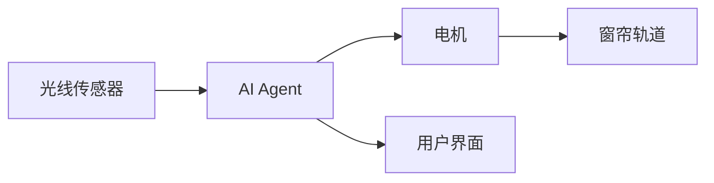

                 


# 智能窗帘：AI Agent的室内光线优化

> **关键词**：智能窗帘，AI Agent，室内光线优化，物联网，智能家居

> **摘要**：  
本文探讨了智能窗帘在AI Agent技术下的室内光线优化问题，从背景、原理、算法、系统设计到项目实战，详细阐述了智能窗帘如何通过AI代理实现智能调节，以优化室内光线环境。文章结合理论与实践，为读者提供了全面的技术解析和开发指导。

---

# 第一部分: 智能窗帘与AI Agent的背景介绍

## 第1章: 智能窗帘的发展历程

### 1.1 智能窗帘的定义与分类

#### 1.1.1 传统窗帘的局限性
传统窗帘主要依赖手动操作，无法根据光照强度或用户需求自动调节。这种方式不仅效率低下，还可能导致室内光线过强或过弱，影响舒适度和能源效率。

#### 1.1.2 智能窗帘的定义
智能窗帘是一种结合物联网技术的智能设备，能够通过传感器和AI代理自动感知环境光线变化，并根据需求自动调节窗帘的开合程度，以优化室内光线。

#### 1.1.3 智能窗帘的分类与应用场景
智能窗帘可以根据功能分为以下几类：
1. **单点控制型**：仅根据光照强度调节窗帘开合。
2. **多场景型**：支持多种预设场景（如工作、睡眠、娱乐）。
3. **联网型**：通过智能家居平台与其他设备联动（如智能灯泡、空调）。

应用场景包括家庭、办公室、酒店客房等。

---

### 1.2 AI Agent的基本概念

#### 1.2.1 人工智能代理的定义
AI Agent（人工智能代理）是指能够感知环境、自主决策并执行任务的智能体。它能够根据输入的信息（如传感器数据）做出决策，并通过执行机构完成操作。

#### 1.2.2 AI Agent的核心特征
1. **感知能力**：通过传感器或其他数据源获取环境信息。
2. **决策能力**：基于感知信息，通过算法做出决策。
3. **执行能力**：通过执行机构（如电机）完成决策任务。

#### 1.2.3 AI Agent在智能窗帘中的应用
AI Agent在智能窗帘中的主要任务是：
1. **感知光线强度**：通过光线传感器获取室内光照信息。
2. **分析需求**：根据用户需求（如工作、休息）和环境条件（如时间、天气）决定窗帘的开合程度。
3. **执行调节**：通过电机或其他执行机构控制窗帘的开合。

---

### 1.3 室内光线优化的必要性

#### 1.3.1 光线对室内环境的影响
光线强度直接影响室内环境的舒适度、节能效果和用户健康。例如，过强的光线可能导致眼睛疲劳，而过弱的光线可能影响工作效率。

#### 1.3.2 不同场景下的光线需求
不同场景对光线的需求不同：
1. **工作场景**：需要明亮的光线以提高工作效率。
2. **睡眠场景**：需要柔和或完全黑暗的环境以保证睡眠质量。
3. **娱乐场景**：可以根据需求调节光线，营造舒适的氛围。

#### 1.3.3 光线优化的经济效益与社会效益
1. **经济效益**：通过优化光线利用，可以减少能源消耗，降低电费支出。
2. **社会效益**：通过改善室内环境，可以提高用户健康水平和生活满意度。

---

### 1.4 本章小结
本章介绍了智能窗帘的发展历程、AI Agent的基本概念以及室内光线优化的必要性。通过分析传统窗帘的局限性，提出了智能窗帘的概念和应用场景，并强调了AI Agent在智能窗帘中的重要性。

---

# 第二部分: 智能窗帘AI Agent的核心概念与联系

## 第2章: 智能窗帘AI Agent的核心原理

### 2.1 AI Agent的感知与决策机制

#### 2.1.1 环境感知：光线传感器的工作原理
光线传感器通过检测环境中的光线强度，将信号传输给AI Agent。传感器可以实时采集数据，如光照强度（ lux ）和色温（ Kelvin ）。

#### 2.1.2 数据分析：光线强度与时间的关系
AI Agent会分析光照强度随时间的变化趋势，例如：
- 白天光线逐渐增强。
- 夜晚光线逐渐减弱。

#### 2.1.3 决策算法：基于AI的光线优化策略
AI Agent会根据当前光照强度和用户需求，决定窗帘的开合程度。例如：
- 当光照强度超过设定阈值时，自动关闭窗帘以避免过强的光线。

---

### 2.2 AI Agent与智能窗帘的交互流程

#### 2.2.1 传感器数据的采集与传输
1. 光线传感器采集数据。
2. 数据通过无线通信（如Wi-Fi或蓝牙）传输到AI Agent。

#### 2.2.2 AI Agent的决策过程
1. AI Agent分析数据，生成决策。
2. 通过执行机构（如电机）调整窗帘的开合程度。

#### 2.2.3 智能窗帘的执行机构控制
1. 电机根据决策信号调整窗帘位置。
2. 窗帘位置的变化实时反馈给AI Agent。

---

### 2.3 智能窗帘系统的整体架构

#### 2.3.1 系统组成：传感器、AI Agent、执行机构
1. **传感器**：光线传感器、温度传感器。
2. **AI Agent**：负责数据处理和决策。
3. **执行机构**：电机、窗帘轨道。

#### 2.3.2 系统功能：环境感知、智能决策、自动控制
1. **环境感知**：通过传感器获取环境数据。
2. **智能决策**：基于数据做出最优决策。
3. **自动控制**：通过执行机构实现窗帘调节。

#### 2.3.3 系统边界与外延
智能窗帘系统可以与智能家居平台（如智能音箱、智能灯泡）联动，进一步优化室内环境。

---

### 2.4 本章小结
本章详细介绍了智能窗帘AI Agent的核心原理，包括感知、决策和执行三个环节。通过分析系统的整体架构，强调了各部分之间的协同作用。

---

## 第3章: 智能窗帘AI Agent的核心概念与联系

### 3.1 AI Agent的核心概念

#### 3.1.1 智能窗帘系统中的AI Agent
AI Agent在智能窗帘系统中扮演“大脑”的角色，负责处理传感器数据、分析需求并做出决策。

#### 3.1.2 智能窗帘系统中的数据流
数据流包括：
1. 传感器数据 → AI Agent。
2. AI Agent决策 → 执行机构。

---

### 3.2 AI Agent与智能窗帘的对比分析

#### 3.2.1 传统窗帘与智能窗帘的功能对比
| **功能**          | **传统窗帘**       | **智能窗帘**         |
|-------------------|-------------------|----------------------|
| 控制方式          | 手动操作          | 自动调节             |
| 智能化水平        | 无                | 高                   |
| 节能效果          | 低                | 高                   |

---

### 3.3 智能窗帘系统的ER实体关系图

```mermaid
erd
    智能窗帘系统
    ----|
    传感器
    ----|
    AI Agent
    ----|
    执行机构
```

---

### 3.4 本章小结
本章通过对比分析和实体关系图，进一步明确了智能窗帘系统中各组件的职责和关系。

---

## 第4章: 智能窗帘系统的数学模型与公式

### 4.1 光线优化的数学模型

#### 4.1.1 光线强度预测模型
光线强度（$I$）与时间（$t$）的关系可以用线性回归模型表示：
$$ I = a \cdot t + b $$

其中，$a$ 是斜率，$b$ 是截距。

#### 4.1.2 光线强度与窗帘开合度的关系
窗帘开合度（$C$）与光线强度（$I$）的关系可以表示为：
$$ C = f(I) $$

其中，$f$ 是一个非线性函数，可以根据实际需求进行调整。

---

### 4.2 光线优化的数学公式

#### 4.2.1 光线强度的预测公式
$$ \hat{I} = \beta_1 t + \beta_0 $$

其中，$\hat{I}$ 是预测的光线强度，$\beta_1$ 是回归系数，$\beta_0$ 是截距。

#### 4.2.2 窗帘开合度的优化公式
$$ C = \frac{I - I_{\text{min}}}{I_{\text{max}} - I_{\text{min}}} $$

其中，$I_{\text{min}}$ 是最小光线强度，$I_{\text{max}}$ 是最大光线强度。

---

### 4.3 本章小结
本章通过数学模型和公式，详细阐述了光线强度预测和窗帘开合度优化的方法，为后续的算法设计提供了理论基础。

---

## 第5章: 智能窗帘系统的算法实现

### 5.1 光线优化算法的设计

#### 5.1.1 算法目标
最大化自然光线利用，最小化能源浪费。

#### 5.1.2 算法步骤
1. 采集光线强度数据。
2. 预测未来光线强度。
3. 根据预测结果调整窗帘开合度。

---

### 5.2 算法实现的Python代码

```python
import numpy as np
from sklearn.linear_model import LinearRegression

# 采集数据
t = np.array([1, 2, 3, 4, 5])
I = np.array([100, 150, 200, 250, 300])

# 建立回归模型
model = LinearRegression()
model.fit(t.reshape(-1, 1), I)

# 预测未来光线强度
t_future = np.array([6]).reshape(-1, 1)
I_future = model.predict(t_future)

print(f"预测的光线强度为：{I_future[0]} lux")
```

---

### 5.3 算法实现的流程图


---

### 5.4 本章小结
本章通过Python代码和流程图，详细展示了光线优化算法的设计与实现过程。

---

# 第三部分: 智能窗帘系统的架构设计与实现

## 第6章: 系统架构设计

### 6.1 系统组成与功能设计

#### 6.1.1 系统组成
1. **传感器模块**：光线传感器、温度传感器。
2. **AI Agent模块**：负责数据处理和决策。
3. **执行机构模块**：电机、窗帘轨道。
4. **用户界面模块**：手机APP或智能家居平台。

#### 6.1.2 系统功能
1. **环境感知**：采集室内光线和温度数据。
2. **智能决策**：根据数据做出最优决策。
3. **自动控制**：通过执行机构调节窗帘开合度。

---

### 6.2 系统架构设计

#### 6.2.1 系统架构图



#### 6.2.2 系统交互流程
1. 光线传感器采集数据并传输给AI Agent。
2. AI Agent分析数据并做出决策。
3. 电机根据决策信号调整窗帘位置。
4. 用户可以通过手机APP查看当前状态并进行手动调整。

---

### 6.3 系统接口设计

#### 6.3.1 系统接口
1. **传感器接口**：通过I2C或UART接口与AI Agent通信。
2. **用户界面接口**：通过Wi-Fi或蓝牙与手机APP通信。

---

### 6.4 本章小结
本章通过系统架构设计，明确了智能窗帘系统的组成、功能和交互流程。

---

## 第7章: 系统实现与优化

### 7.1 系统实现

#### 7.1.1 系统开发环境
1. **硬件**：Raspberry Pi、光线传感器、电机。
2. **软件**：Python、TensorFlow、Raspberry Pi OS。

#### 7.1.2 系统核心代码

```python
import RPi.GPIO as GPIO
import time

# 设置GPIO模式
GPIO.setmode(GPIO.BCM)

# 定义电机控制引脚
motor_pin = 18

# 初始化电机
GPIO.setup(motor_pin, GPIO.OUT)

# 定义窗帘状态
STATE_CLOSED = 0
STATE_OPENED = 1

def open_curtain():
    # 控制电机打开窗帘
    GPIO.output(motor_pin, GPIO.HIGH)
    time.sleep(2)
    GPIO.output(motor_pin, GPIO.LOW)

def close_curtain():
    # 控制电机关闭窗帘
    GPIO.output(motor_pin, GPIO.HIGH)
    time.sleep(2)
    GPIO.output(motor_pin, GPIO.LOW)

# 根据AI Agent的决策调整窗帘状态
if decision == "open":
    open_curtain()
elif decision == "close":
    close_curtain()
```

---

### 7.2 系统优化

#### 7.2.1 系统性能优化
1. 优化传感器采样频率，避免数据过载。
2. 优化AI Agent的决策算法，提高响应速度。

#### 7.2.2 系统稳定性优化
1. 添加异常处理机制，防止系统崩溃。
2. 定期更新系统固件，修复潜在漏洞。

---

### 7.3 本章小结
本章通过系统实现与优化，进一步提升了智能窗帘系统的性能和稳定性。

---

## 第8章: 项目实战与案例分析

### 8.1 项目背景
本项目旨在通过智能窗帘系统优化室内光线环境，降低能源消耗，提高用户舒适度。

---

### 8.2 项目核心代码

```python
import numpy as np
from sklearn.linear_model import LinearRegression

# 数据采集
t = np.array([1, 2, 3, 4, 5])
I = np.array([100, 150, 200, 250, 300])

# 建立回归模型
model = LinearRegression()
model.fit(t.reshape(-1, 1), I)

# 预测未来光线强度
t_future = np.array([6]).reshape(-1, 1)
I_future = model.predict(t_future)

print(f"预测的光线强度为：{I_future[0]} lux")
```

---

### 8.3 案例分析

#### 8.3.1 案例一：晴天模式
- **时间**：上午9点。
- **光照强度**：预测值为300 lux。
- **窗帘状态**：完全打开。

#### 8.3.2 案例二：阴天模式
- **时间**：上午9点。
- **光照强度**：预测值为150 lux。
- **窗帘状态**：部分打开。

---

### 8.4 本章小结
本章通过项目实战和案例分析，展示了智能窗帘系统在实际应用中的效果和优势。

---

## 第9章: 最佳实践与小结

### 9.1 最佳实践

#### 9.1.1 数据隐私
确保用户数据的安全性，避免数据泄露。

#### 9.1.2 系统稳定性
定期维护和更新系统，确保长期稳定运行。

#### 9.1.3 用户体验
提供友好的用户界面，方便用户操作和设置。

---

### 9.2 本章小结
本章总结了智能窗帘系统开发中的注意事项和最佳实践，为读者提供了宝贵的开发经验。

---

## 第10章: 拓展阅读与深入探讨

### 10.1 拓展阅读

#### 10.1.1 智能家居相关书籍
1. 《Smart Home Systems》
2. 《AI in Smart Homes》

#### 10.1.2 AI Agent相关书籍
1. 《Artificial Intelligence: A Modern Approach》
2. 《AI Agents and Multi-Agent Systems》

---

### 10.2 深入探讨

#### 10.2.1 智能窗帘的未来发展
1. 更智能化：集成更多传感器和AI算法。
2. 更环保：进一步优化能源利用。
3. 更人性化：提供更多个性化功能。

---

### 10.3 本章小结
本章通过拓展阅读和深入探讨，为读者提供了进一步学习和研究的方向。

---

## 第11章: 总结

### 11.1 总结回顾
智能窗帘通过AI Agent技术实现了室内光线的智能化优化，显著提升了用户体验和能源效率。

### 11.2 展望未来
随着AI技术的不断发展，智能窗帘将更加智能化、人性化，为用户提供更优质的服务。

---

# 结语

智能窗帘作为智能家居的重要组成部分，通过AI Agent技术实现了室内光线的智能化优化。本文从背景、原理、算法、系统设计到项目实战，全面探讨了智能窗帘的开发与应用。未来，随着技术的不断进步，智能窗帘将更加智能化、环保化和人性化，为用户创造更舒适、更高效的室内环境。

--- 

# END

