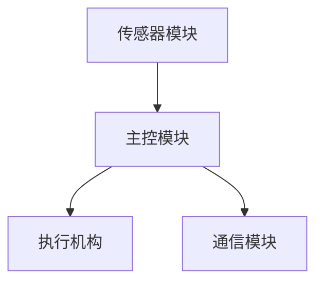

                 


# 智能窗帘：AI Agent的室内环境全面调节

## 关键词：智能窗帘，AI Agent，物联网，环境调节，智能家居，传感器，算法，系统架构

## 摘要：  
本文深入探讨了智能窗帘在AI Agent技术下的室内环境调节应用，从背景、技术原理到系统架构，再到项目实战，全面解析智能窗帘如何通过AI技术实现智能化、自动化调节，为智能家居行业提供新的思路和技术解决方案。

---

## 第1章: 智能窗帘的发展背景与现状

### 1.1 智能窗帘的定义与概念  
智能窗帘是一种结合了物联网和人工智能技术的智能家居设备，能够通过传感器感知室内环境变化，并利用AI算法进行智能决策，实现窗帘的自动开合以及室内环境的调节。  

#### 1.1.1 智能窗帘的定义  
智能窗帘是智能家居系统的一部分，具备环境感知、智能决策和自动执行的功能，能够根据室内外环境变化以及用户需求，自动调节窗帘的开合状态，进而影响室内光照、温度和空气质量等。  

#### 1.1.2 智能窗帘的核心概念  
- **环境感知**：通过传感器采集室内外光照、温度、湿度等数据。  
- **智能决策**：基于传感器数据和用户需求，AI Agent生成控制指令。  
- **自动执行**：通过电机、舵机等执行机构实现窗帘的开合和调节。  

#### 1.1.3 智能窗帘的分类与特点  
智能窗帘可以根据功能和应用场景分为以下几类：  
1. **单功能型**：仅支持窗帘开合，无法调节其他环境参数。  
2. **多功能型**：结合温度、湿度、光照等传感器，能够联动调节室内环境。  
3. **智能联动型**：与智能家居系统联动，与其他设备（如空调、灯光）协同工作。  

---

### 1.2 智能窗帘的发展背景  
智能窗帘的发展离不开物联网和人工智能技术的进步。  

#### 1.2.1 物联网技术的发展  
物联网技术的成熟为智能窗帘提供了硬件支持，使得设备间的互联互通成为可能。通过Wi-Fi、蓝牙、ZigBee等通信协议，智能窗帘可以与手机、智能家居中枢等设备无缝连接。  

#### 1.2.2 AI技术的成熟与应用  
人工智能技术的快速发展使得智能窗帘具备了环境感知和智能决策的能力。通过机器学习算法，AI Agent能够根据历史数据和当前环境变化，预测用户需求并做出最优决策。  

#### 1.2.3 智能家居的兴起  
随着智能家居市场的快速发展，用户对家居设备的智能化和联动化需求日益增长。智能窗帘作为智能家居的重要组成部分，市场需求持续增长。  

---

### 1.3 智能窗帘的市场现状  
目前，智能窗帘市场呈现出以下特点：  

#### 1.3.1 市场规模与增长趋势  
智能窗帘市场近年来保持快速增长，市场规模预计在未来几年内将以年均20%以上的速度增长。  

#### 1.3.2 主流品牌与技术路线  
主流品牌如Lutron、Somfy、Honeywell等，采用的技术路线包括 ZigBee、Wi-Fi、蓝牙等多种通信协议，且逐步向AI驱动的方向发展。  

#### 1.3.3 用户需求与痛点分析  
用户需求主要集中在便捷性、舒适性和节能性上。痛点包括设备兼容性差、功能单一、用户体验不佳等问题。  

---

## 第2章: AI Agent在智能窗帘中的应用  

### 2.1 AI Agent的基本概念  
AI Agent是一种能够感知环境、自主决策并执行任务的智能体。  

#### 2.1.1 AI Agent的定义  
AI Agent是具有感知、推理、规划和执行能力的智能系统，能够根据环境信息做出决策并执行任务。  

#### 2.1.2 AI Agent的核心特征  
- **自主性**：能够自主决策，无需人工干预。  
- **反应性**：能够实时感知环境变化并做出反应。  
- **学习能力**：通过机器学习算法不断优化决策模型。  

#### 2.1.3 AI Agent与传统算法的区别  
AI Agent的核心在于其自主性和学习能力，传统算法通常需要人工设定规则，而AI Agent能够通过数据驱动的方式不断优化决策策略。  

---

### 2.2 AI Agent在智能窗帘中的作用  
智能窗帘通过AI Agent实现以下功能：  

#### 2.2.1 环境感知与数据采集  
AI Agent通过传感器采集室内环境数据，如光照强度、温度、湿度等。  

#### 2.2.2 智能决策与控制  
AI Agent基于传感器数据和用户需求，生成控制指令，驱动窗帘执行机构动作。  

#### 2.2.3 用户行为分析与个性化服务  
AI Agent通过分析用户的使用习惯，提供个性化的环境调节服务，如根据用户的作息时间自动调节窗帘开合状态。  

---

### 2.3 AI Agent的实现原理  

#### 2.3.1 数据采集与处理  
AI Agent通过传感器采集数据，经过预处理后输入到决策模型中。  

#### 2.3.2 智能算法与决策模型  
AI Agent采用强化学习算法，通过与环境的交互不断优化决策策略。  

#### 2.3.3 系统控制与反馈  
AI Agent根据决策结果控制执行机构动作，并通过反馈机制不断优化系统性能。  

---

## 第3章: 智能窗帘的感知系统  

### 3.1 智能窗帘的传感器技术  
传感器是智能窗帘感知环境的核心部件。  

#### 3.1.1 温度传感器  
温度传感器用于采集室内温度数据，帮助AI Agent判断是否需要调节窗帘开合状态以改善室内温度。  

#### 3.1.2 湿度传感器  
湿度传感器用于监测室内湿度，AI Agent可以根据湿度数据调节窗帘开合状态，防止室内潮湿或干燥。  

#### 3.1.3 光线传感器  
光线传感器用于检测室内外光照强度，AI Agent可以根据光照数据调节窗帘的开合程度，以优化室内光照环境。  

#### 3.1.4 压力传感器  
压力传感器用于检测窗帘的开合状态，帮助AI Agent判断窗帘是否完全打开或关闭。  

---

### 3.2 传感器数据的采集与处理  
传感器数据的采集与处理是智能窗帘系统的重要环节。  

#### 3.2.1 数据采集的实现  
通过传感器采集模块将数据传输到主控芯片，如Arduino或Raspberry Pi。  

#### 3.2.2 数据预处理与特征提取  
对采集到的原始数据进行去噪、归一化等预处理，提取有用的特征数据。  

#### 3.2.3 数据存储与管理  
将处理后的数据存储到本地数据库或云端，便于后续分析和处理。  

---

### 3.3 多传感器融合技术  
多传感器融合技术可以提高系统的感知精度和可靠性。  

#### 3.3.1 多传感器数据融合的原理  
通过融合多种传感器的数据，利用加权平均、卡尔曼滤波等方法提高数据的准确性。  

#### 3.3.2 常见的融合算法  
- 加权平均法  
- 卡尔曼滤波算法  
- 红外线传感器与光线传感器融合算法  

#### 3.3.3 融合技术在智能窗帘中的应用  
多传感器融合技术可以提高智能窗帘对环境变化的感知能力，例如在光线不足的情况下，结合温度和湿度数据进行综合判断。  

---

## 第4章: AI Agent的决策与执行机制  

### 4.1 决策算法的实现  
AI Agent通过强化学习算法实现智能决策。  

#### 4.1.1 强化学习算法的基本原理  
强化学习通过智能体与环境的交互，逐步优化决策策略，以最大化累计奖励。  

#### 4.1.2 状态空间与动作空间  
- 状态空间：包括当前环境数据（如光照强度、温度等）和用户需求。  
- 动作空间：包括窗帘的开合程度，如完全关闭、半开、完全打开等。  

#### 4.1.3 奖励函数设计  
奖励函数用于衡量AI Agent的决策效果，例如：  
- 当室内光照强度达到目标值时，奖励值为1。  
- 当窗帘开合状态与用户需求匹配时，奖励值为1。  

---

### 4.2 系统控制与反馈机制  

#### 4.2.1 系统控制的实现  
AI Agent根据决策结果生成控制指令，驱动执行机构动作。  

#### 4.2.2 反馈机制的实现  
系统通过反馈机制不断优化决策模型，例如：  
- 当用户对窗帘位置进行调整时，AI Agent记录用户的偏好并更新决策模型。  
- 根据环境数据反馈不断优化预测模型。  

---

## 第5章: 智能窗帘的系统架构与通信协议  

### 5.1 系统架构设计  
智能窗帘系统通常包括以下几部分：  
- **传感器模块**：负责采集环境数据。  
- **主控模块**：负责数据处理和决策控制。  
- **执行机构**：负责执行窗帘的开合动作。  
- **通信模块**：负责与智能家居中枢或其他设备通信。  

#### 5.1.1 系统架构图  


---

### 5.2 通信协议的选择  
智能窗帘系统可以选择以下通信协议：  
- **Wi-Fi**：适用于长距离通信，支持与智能家居中枢的联动。  
- **蓝牙**：适用于短距离通信，便于手机APP控制。  
- **ZigBee**：适用于低功耗、多设备联动的场景。  

---

## 第6章: 智能窗帘的项目实战  

### 6.1 环境搭建  

#### 6.1.1 硬件设备安装  
- 安装窗帘电机、光线传感器、温湿度传感器等硬件设备。  

#### 6.1.2 软件环境配置  
- 安装Arduino IDE或Raspberry Pi操作系统。  

---

### 6.2 核心实现  

#### 6.2.1 传感器数据采集代码  
```python
import serial

ser = serial.Serial('COM3', 9600)

while True:
    data = ser.readline().decode().strip()
    print("传感器数据：", data)
```

#### 6.2.2 AI Agent决策算法实现  
```python
import numpy as np
from sklearn import linear_model

# 数据预处理
X = np.array([[光照强度], [温度], [湿度]])
y = np.array([目标状态])

model = linear_model.LinearRegression()
model.fit(X, y)

# 预测窗帘状态
predicted = model.predict(new_data)
```

---

### 6.3 案例分析  

#### 6.3.1 典型场景  
- **场景一**：早晨光照强度达到预设值，窗帘自动打开。  
- **场景二**：室内温度过高，窗帘部分打开以调节温度。  

#### 6.3.2 代码实现与解读  
```python
# 示例代码：根据光照强度调整窗帘开合状态
def adjust_curtain(light_intensity):
    if light_intensity > 100:
        return "完全打开"
    elif light_intensity > 50:
        return "半开"
    else:
        return "关闭"

# 调用示例
print(adjust_curtain(75))  # 输出："半开"
```

---

## 第7章: 智能窗帘的优化与扩展  

### 7.1 系统优化  

#### 7.1.1 算法优化  
- 引入深度学习算法，如神经网络，提高决策精度。  

#### 7.1.2 系统性能优化  
- 优化传感器数据采集频率，减少数据延迟。  

---

### 7.2 功能扩展  

#### 7.2.1 新增功能  
- **空气质量检测**：通过PM2.5传感器联动净化器。  
- **语音控制**：支持智能音箱的语音指令。  

#### 7.2.2 系统扩展设计  
- 与智能家居中枢（如HomeKit、Google Nest）联动，实现全屋智能化控制。  

---

### 7.3 注意事项与最佳实践  

#### 7.3.1 注意事项  
- 确保系统安全性，防止未经授权的访问。  
- 定期维护传感器和执行机构，确保设备正常运行。  

#### 7.3.2 最佳实践  
- 在设计系统时，优先考虑用户体验，简化操作流程。  
- 定期收集用户反馈，持续优化系统功能。  

---

## 总结  
智能窗帘作为智能家居的重要组成部分，通过AI Agent技术实现了室内环境的全面调节。本文从背景、技术原理到系统架构，再到项目实战，全面解析了智能窗帘的实现过程。未来，随着AI和物联网技术的进一步发展，智能窗帘的功能将更加丰富，用户体验将更加智能化和便捷化。

