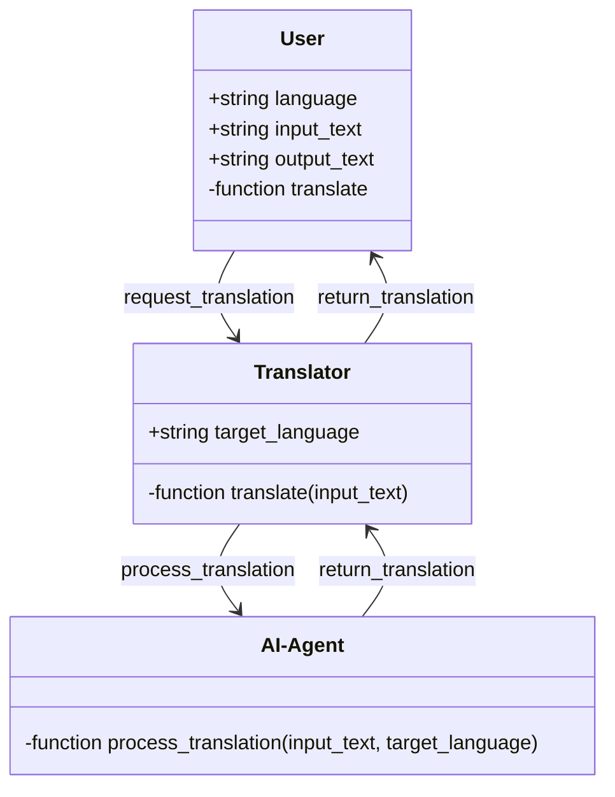
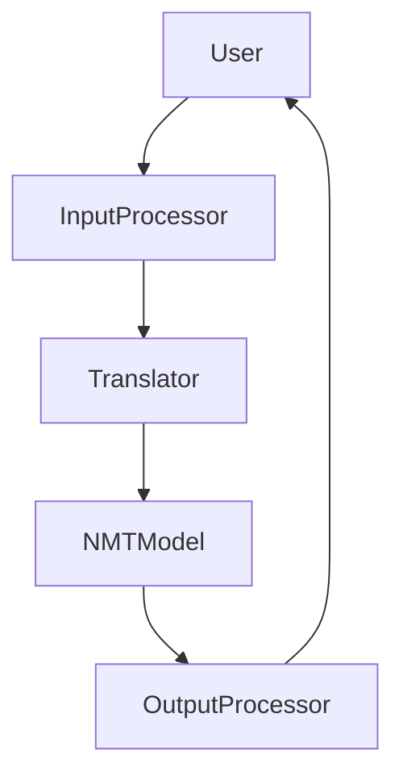

                 


# 智能翻译：AI Agent的多语言实时翻译

## 关键词：智能翻译、AI Agent、多语言翻译、实时翻译、神经机器翻译、自然语言处理、AI系统设计

## 摘要：  
本文详细探讨了AI Agent在多语言实时翻译中的应用，从背景、核心概念到算法原理、系统设计，再到项目实战，全面解析智能翻译的技术实现。通过本文，读者将了解如何利用AI技术实现高效的多语言翻译，并掌握相关算法和系统设计的关键点。

---

# 第一部分: 智能翻译与AI Agent的背景与基础

## 第1章: 智能翻译与AI Agent的背景介绍

### 1.1 问题背景与描述

#### 1.1.1 多语言翻译的挑战与痛点
在日益全球化的背景下，多语言交流的需求急剧增加。然而，传统的翻译工具和方法存在以下痛点：
- **效率低下**：人工翻译耗时长，成本高。
- **准确性不足**：依赖规则的统计翻译模型难以处理复杂语境。
- **实时性差**：传统翻译工具无法实现快速响应。

#### 1.1.2 AI Agent在实时翻译中的作用
AI Agent（智能代理）能够通过自然语言处理（NLP）技术，实时理解和生成多种语言的文本，显著提升翻译效率和准确性。AI Agent的核心优势在于：
- **实时响应**：能够在短时间内完成翻译任务。
- **上下文理解**：通过语境分析，提供更准确的翻译结果。
- **自适应学习**：能够根据用户反馈优化翻译质量。

#### 1.1.3 当前翻译技术的局限性与改进方向
当前的翻译技术主要依赖于统计机器翻译（SMT）和基于规则的翻译方法，存在以下局限性：
- **准确性受限**：难以处理复杂的语言结构和文化差异。
- **实时性不足**：无法满足实时翻译的需求。
- **可扩展性差**：难以支持多种语言的高效翻译。

改进方向包括引入深度学习技术（如神经机器翻译）和优化AI Agent的算法，以实现更高效、更准确的翻译。

### 1.1.4 翻译的边界与外延
- **边界**：智能翻译仅处理语言转换，不涉及翻译内容的语义理解和生成。
- **外延**：AI Agent可以集成其他功能，如语音识别和翻译结果反馈。

### 1.1.5 核心要素
- **语言模型**：构建多语言的NLP模型。
- **翻译算法**：优化神经机器翻译的训练和推理过程。
- **实时性要求**：确保翻译过程的快速响应。

---

## 第2章: AI Agent与多语言翻译的核心概念

### 2.1 AI Agent的基本原理

#### 2.1.1 AI Agent的定义与分类
AI Agent是一种能够感知环境并采取行动以实现目标的智能系统。根据功能和应用场景，AI Agent可以分为：
- **简单反射型**：基于规则的简单响应。
- **基于模型的反应型**：基于环境模型做出决策。
- **目标驱动型**：根据目标选择最优行动。

#### 2.1.2 AI Agent的核心属性与特征对比
| 特性 | 简单反射型 | 基于模型的反应型 | 目标驱动型 |
|------|------------|------------------|------------|
| 智能水平 | 低 | 中 | 高 |
| 决策依据 | 规则 | 环境模型 | 目标 |
| 适用场景 | 简单任务 | 中等复杂任务 | 复杂任务 |

#### 2.1.3 AI Agent的实体关系图（ER图）
```mermaid
erDiagram
    actor User {
        string language
        string input_text
    }
    agent AI-Agent {
        string target_language
        function translate
    }
    relation Translate-Invocation {
        User --> AI-Agent
        input_text --> translate --> output_text
    }
```

### 2.2 多语言翻译的实现原理

#### 2.2.1 神经机器翻译的原理
神经机器翻译（NMT）基于编码器-解码器架构，通过神经网络直接从源语言生成目标语言文本。

##### 2.2.1.1 编码器-解码器结构
- **编码器**：将源语言文本转换为向量表示。
- **解码器**：根据编码器的输出生成目标语言文本。

##### 2.2.1.2 注意力机制的引入
注意力机制帮助模型关注输入文本中重要的部分，提升翻译质量。

#### 2.2.2 多语言模型的构建与训练
多语言模型能够同时处理多种语言，通过共享语言间的特征，减少训练数据需求。

#### 2.2.3 翻译质量评估指标
常用的评估指标包括BLEU、ROUGE和METEOR等。

### 2.3 AI Agent与多语言翻译的结合

#### 2.3.1 AI Agent在翻译中的角色
AI Agent作为翻译引擎，负责接收输入、调用翻译模型并返回结果。

#### 2.3.2 多语言翻译的流程与步骤
1. 接收输入文本。
2. 确定目标语言。
3. 调用翻译模型生成输出。
4. 返回翻译结果。

#### 2.3.3 实时翻译的实现机制
- **异步处理**：通过多线程或异步调用提升性能。
- **缓存优化**：缓存常用翻译结果，减少重复计算。

### 2.4 核心概念对比与联系

#### 2.4.1 AI Agent与传统翻译工具的对比
| 特性 | AI Agent | 传统翻译工具 |
|------|-----------|---------------|
| 实时性 | 高 | 低 |
| 准确性 | 高 | 中 |
| 可扩展性 | 高 | 低 |

#### 2.4.2 多语言翻译与单语言翻译的差异
- **输入多样性**：多语言翻译需要处理多种语言输入。
- **模型复杂性**：多语言模型通常更复杂，但效率更高。

#### 2.4.3 翻译质量与实时性的权衡
在实时翻译中，需要在翻译速度和准确性之间找到平衡点。

---

## 第3章: 多语言翻译的算法原理

### 3.1 神经机器翻译的算法流程

#### 3.1.1 编码器-解码器结构
- **编码器**：将源语言文本转换为向量表示。
- **解码器**：根据编码器的输出生成目标语言文本。

#### 3.1.2 注意力机制的引入
- **注意力计算**：计算输入文本中每个词的关注程度。
- **上下文表示**：将注意力权重与词向量结合，生成上下文表示。

#### 3.1.3 翻译模型的训练过程
- **训练数据**：使用平行文本对进行训练。
- **损失函数**：最小化预测输出与真实输出的差异。

### 3.2 基于AI Agent的翻译算法

#### 3.2.1 实时翻译的算法实现
```python
def translate(source_text, target_language):
    encoded = encoder(source_text)
    attention_weights = compute_attention(encoded)
    decoded = decoder(encoded, attention_weights, target_language)
    return decoded
```

#### 3.2.2 多语言模型的优化策略
- **共享参数**：多语言模型共享语言间的参数，减少训练参数数量。
- **动态调整**：根据输入语言动态调整模型参数。

#### 3.2.3 翻译结果的自适应调整
- **反馈机制**：根据用户反馈优化翻译结果。
- **上下文记忆**：记录上下文信息，提升翻译准确性。

### 3.3 算法原理的数学模型与公式

#### 3.3.1 编码器-解码器结构
- 编码器将输入序列 \( x_1, x_2, ..., x_n \) 转换为隐藏状态 \( h_1, h_2, ..., h_n \)。
- 解码器根据隐藏状态生成输出序列 \( y_1, y_2, ..., y_m \)。

#### 3.3.2 注意力机制
- 注意力权重 \( \alpha_{i,j} \) 表示输入位置 \( j \) 对输出位置 \( i \) 的关注程度。
- 上下文向量 \( c_i \) 由注意力权重加权求和得到：
  $$ c_i = \sum_{j=1}^{n} \alpha_{i,j} x_j $$

---

## 第4章: 系统分析与架构设计

### 4.1 问题场景介绍
- **用户需求**：实时多语言翻译。
- **技术需求**：高效、准确的翻译算法。

### 4.2 系统功能设计
- **输入处理**：接收多语言文本输入。
- **翻译引擎**：调用AI Agent进行翻译。
- **输出结果**：返回翻译后的文本。

### 4.3 系统架构设计

#### 4.3.1 领域模型类图


#### 4.3.2 系统架构图


### 4.4 接口设计与交互流程
- **输入接口**：接收用户输入的源语言文本和目标语言。
- **输出接口**：返回翻译结果。
- **交互流程**：
  1. 用户输入文本。
  2. 翻译引擎调用NMT模型。
  3. 返回翻译结果。

---

## 第5章: 项目实战

### 5.1 环境安装
- **Python 3.8+**
- **TensorFlow或Keras**
- **Numpy**

### 5.2 核心功能实现

#### 5.2.1 翻译模型的实现
```python
import tensorflow as tf
from tensorflow.keras.layers import LSTM, Dense, Input, Attention
from tensorflow.keras.models import Model

# 编码器
encoder_input = Input(shape=(None, input_dim))
encoder_lstm = LSTM(units, return_sequences=True)(encoder_input)
encoder_output = encoder_lstm

# 解码器
decoder_input = Input(shape=(None, output_dim))
decoder_lstm = LSTM(units, return_sequences=True)(decoder_input)
attention = Attention()([encoder_output, decoder_lstm])
decoder_output = Dense(output_dim, activation='softmax')(attention)
model = Model(inputs=[encoder_input, decoder_input], outputs=decoder_output)
model.compile(optimizer='adam', loss='sparse_categorical_crossentropy')
```

#### 5.2.2 AI Agent的实现
```python
class AIAgent:
    def __init__(self):
        self.model = build_model()

    def translate(self, source_text, target_language):
        encoded = self.encoder(source_text)
        attention_weights = compute_attention(encoded)
        decoded = self.decoder(encoded, attention_weights, target_language)
        return decoded
```

### 5.3 实际案例分析
- **案例输入**：中文句子“你好，今天天气很好。”
- **翻译目标**：英文。
- **翻译结果**：“Hello, today's weather is very good.”

### 5.4 项目小结
- **实现细节**：详细解读代码实现。
- **经验总结**：总结项目中的难点和解决方案。

---

## 第6章: 最佳实践与小结

### 6.1 本章小结
- 本文详细探讨了AI Agent在多语言实时翻译中的应用，从背景、核心概念到算法原理、系统设计，再到项目实战，全面解析了智能翻译的技术实现。

### 6.2 最佳实践
- **模型优化**：使用更先进的模型架构（如Transformer）提升翻译质量。
- **性能优化**：通过并行计算和缓存优化提升翻译速度。

### 6.3 注意事项
- 确保翻译模型的泛化能力。
- 处理好语言间的文化差异。

### 6.4 未来趋势
- **多模态翻译**：结合视觉和听觉信息提升翻译准确性。
- **自适应学习**：模型能够根据反馈实时优化翻译结果。

---

# 结语
通过本文的深入探讨，读者将能够理解并掌握AI Agent在多语言实时翻译中的技术实现。从算法原理到系统设计，再到项目实战，本文为读者提供了全面的知识和实践指导，帮助他们在智能翻译领域取得进一步的突破。

