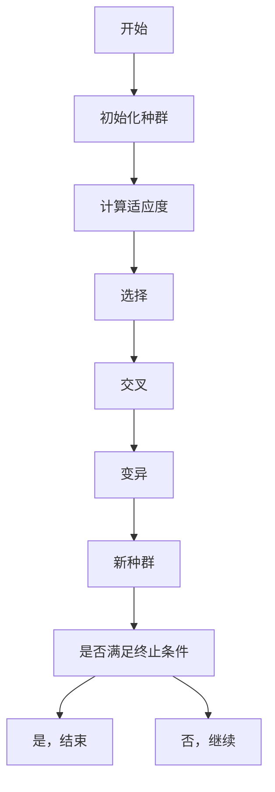
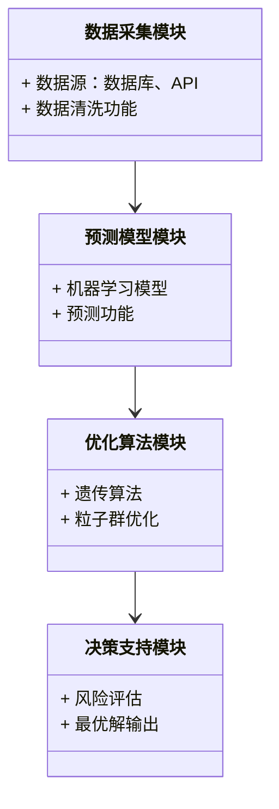
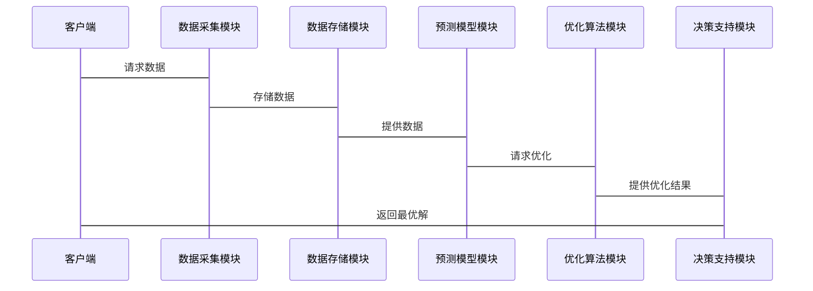

                 


# 智能营运资本管理优化系统

> 关键词：智能营运资本管理、优化系统、机器学习、遗传算法、系统架构设计、项目实战

> 摘要：本文系统地探讨了智能营运资本管理优化系统的构建与实现，从背景介绍、核心概念、算法原理到系统架构设计、项目实战，全面剖析了如何利用人工智能技术优化资本管理流程。通过详细的理论分析和实践案例，展示了如何在实际场景中应用智能技术提升资本运作效率和决策精准度。

---

# 第一部分: 智能营运资本管理优化系统概述

# 第1章: 智能营运资本管理优化系统背景介绍

## 1.1 智能营运资本管理的定义与背景

### 1.1.1 营运资本管理的基本概念

营运资本管理是指对企业日常运营所需的流动资产和流动负债进行规划和控制，以优化资金使用效率、降低风险并实现企业价值最大化。传统的营运资本管理依赖于人工决策和经验判断，而随着人工智能技术的快速发展，智能化的管理方式逐渐成为趋势。

### 1.1.2 智能化管理的兴起

人工智能、大数据和机器学习等技术的快速发展，为企业的智能化管理提供了技术支撑。通过智能技术，企业可以实时分析海量数据，快速做出最优决策，显著提升管理效率和准确性。

### 1.1.3 智能营运资本管理的必要性

传统营运资本管理存在以下问题：
1. 数据量大、复杂，难以快速分析和决策。
2. 人工判断存在主观性和片面性。
3. 风险控制能力有限，难以应对复杂多变的市场环境。

智能营运资本管理通过引入机器学习、优化算法等技术，能够有效解决上述问题，实现资本管理的智能化和精准化。

## 1.2 智能营运资本管理优化系统的核心问题

### 1.2.1 资金流动性与风险的平衡

企业需要在资金流动性与风险之间找到平衡点。流动性不足可能导致运营中断，而过度流动性可能导致资金闲置或投资回报率低下。

### 1.2.2 数据驱动的决策优化

通过分析历史数据和实时数据，智能系统可以预测未来的资金需求和市场趋势，为决策提供科学依据。

### 1.2.3 系统化管理的实现路径

智能营运资本管理优化系统通过整合企业内外部数据，构建统一的管理平台，实现资本管理的系统化和标准化。

## 1.3 智能营运资本管理优化系统的边界与外延

### 1.3.1 系统边界定义

智能营运资本管理优化系统的核心功能包括资金预测、风险评估、优化决策等，其边界主要集中在资本管理的业务流程中。

### 1.3.2 系统功能的外延

系统不仅能够优化资本管理，还可以与其他企业管理模块（如供应链、财务）进行数据交互，提供更全面的管理支持。

### 1.3.3 系统与外部环境的交互

系统需要与企业内部的ERP系统、财务系统以及外部的金融市场数据源进行交互，获取和输出数据。

## 1.4 智能营运资本管理优化系统的概念结构

### 1.4.1 核心要素组成

- 数据采集与处理模块
- 预测模型构建模块
- 优化算法模块
- 决策支持模块

### 1.4.2 系统功能模块划分

1. 数据采集与处理
2. 预测模型构建
3. 优化算法实现
4. 决策支持

### 1.4.3 系统架构的初步设想

- 数据层：负责数据的采集、存储和管理。
- 业务逻辑层：实现系统的业务逻辑和算法。
- 用户界面层：提供人机交互界面。

## 1.5 本章小结

通过本章的介绍，我们了解了智能营运资本管理优化系统的背景、核心问题以及系统架构的基本概念。下一章将深入探讨系统的算法原理，分析如何利用智能算法实现资本管理的优化。

---

# 第二部分: 智能营运资本管理优化系统的算法原理

# 第2章: 智能营运资本管理优化算法原理

## 2.1 智能优化算法概述

### 2.1.1 常见优化算法介绍

- 遗传算法（Genetic Algorithm, GA）
- 粒子群优化算法（Particle Swarm Optimization, PSO）
- 模拟退火算法（Simulated Annealing, SA）
- 灰色理论优化算法

### 2.1.2 智能优化算法的特点

- 全局搜索能力
- 自适应调整能力
- 并行计算能力

### 2.1.3 优化算法的适用场景

- 复杂非线性问题
- 多目标优化问题
- 高维空间优化问题

## 2.2 基于机器学习的优化算法

### 2.2.1 机器学习在优化中的应用

- 通过机器学习模型预测资金需求和风险
- 利用聚类算法识别市场趋势

### 2.2.2 常用机器学习优化算法

- 线性回归优化
- 支持向量机优化
- 神经网络优化

## 2.3 遗传算法在资本优化中的应用

### 2.3.1 遗传算法的基本原理

遗传算法模拟生物进化的过程，包括选择、交叉和变异三个基本操作。

### 2.3.2 遗传算法在资本优化中的实现

1. 初始化种群
2. 计算适应度
3. 选择操作
4. 交叉操作
5. 变异操作
6. 代际交替

### 2.3.3 遗传算法的优缺点分析

- 优点：全局搜索能力强，能够找到全局最优解。
- 缺点：计算复杂度高，收敛速度慢。

## 2.4 算法流程图（Mermaid）



## 2.5 算法实现代码示例

```python
def genetic_algorithm(population, fitness_func, mutation_rate=0.1):
    while True:
        # 计算适应度
        fitness = [fitness_func(individual) for individual in population]
        # 选择
        selected = selection(population, fitness)
        # 交叉
        crossed = crossover(selected)
        # 变异
        mutated = mutation(crossed, mutation_rate)
        # 更新种群
        population = mutated
        # 检查终止条件
        if is_converged(population):
            break
    return population
```

## 2.6 算法的数学模型和公式

遗传算法的基本操作可以用以下数学公式表示：

$$
\text{适应度} = f(x) \\
\text{选择概率} = \frac{f(x)}{\sum f(x)} \\
\text{交叉概率} = p_c \\
\text{变异概率} = p_m
$$

---

# 第三部分: 智能营运资本管理优化系统的系统架构设计

# 第3章: 系统分析与架构设计方案

## 3.1 系统分析

### 3.1.1 问题场景介绍

企业面临资金流动性不足、风险控制能力弱、决策效率低下等问题。

### 3.1.2 项目介绍

本项目旨在构建一个智能营运资本管理优化系统，通过智能化技术提升企业的资本管理能力。

## 3.2 系统功能设计

### 3.2.1 领域模型（Mermaid 类图）



### 3.2.2 系统架构设计（Mermaid 架构图）

```mermaid
archiecture
    客户端 --> API网关
    API网关 --> 数据采集模块
    数据采集模块 --> 数据存储模块
    数据存储模块 --> 预测模型模块
    预测模型模块 --> 优化算法模块
    优化算法模块 --> 决策支持模块
    决策支持模块 --> 客户端
```

### 3.2.3 系统接口设计

- 数据接口：提供数据采集和存储的接口
- API接口：提供给其他系统调用的接口
- 用户界面：提供人机交互的界面

### 3.2.4 系统交互（Mermaid 序列图）



## 3.3 本章小结

通过本章的系统分析与架构设计，我们明确了智能营运资本管理优化系统的功能模块和系统架构，为后续的实现奠定了基础。

---

# 第四部分: 项目实战

# 第4章: 项目实战

## 4.1 环境安装与配置

### 4.1.1 环境要求

- Python 3.6+
- Anaconda 或虚拟环境
- 相关开发工具（PyCharm、Jupyter）

### 4.1.2 安装依赖库

```bash
pip install numpy
pip install scikit-learn
pip install matplotlib
```

## 4.2 系统核心实现

### 4.2.1 数据采集模块实现

```python
import requests
import pandas as pd

def fetch_data(api_url):
    response = requests.get(api_url)
    data = response.json()
    df = pd.DataFrame(data)
    return df
```

### 4.2.2 预测模型实现

```python
from sklearn.linear_model import LinearRegression

def train_model(X_train, y_train):
    model = LinearRegression()
    model.fit(X_train, y_train)
    return model
```

### 4.2.3 优化算法实现

```python
def genetic_algorithm(population, fitness_func, mutation_rate=0.1):
    while True:
        fitness = [fitness_func(individual) for individual in population]
        selected = selection(population, fitness)
        crossed = crossover(selected)
        mutated = mutation(crossed, mutation_rate)
        population = mutated
        if is_converged(population):
            break
    return population
```

### 4.2.4 决策支持模块实现

```python
def risk_assessment(capitals):
    # 实现风险评估逻辑
    pass

def optimal_solution(capitals):
    # 实现最优解逻辑
    pass
```

## 4.3 实际案例分析

### 4.3.1 数据准备与分析

假设我们有以下数据：

| 时间 | 资金 | 风险 |
|------|------|------|
| 2023-01 | 100 | 低 |
| 2023-02 | 150 | 中 |
| 2023-03 | 200 | 高 |

通过机器学习模型预测未来资金需求，并利用遗传算法优化资本分配。

## 4.4 项目小结

通过本章的实战项目，我们详细讲解了智能营运资本管理优化系统的实现过程，从数据采集到算法实现，再到决策支持，全面展示了系统的实际应用。

---

# 第五部分: 最佳实践与总结

# 第5章: 最佳实践

## 5.1 小结

智能营运资本管理优化系统通过智能化技术，显著提升了资本管理的效率和准确性，为企业带来了显著的经济效益。

## 5.2 注意事项

- 数据质量是系统的核心，需确保数据的准确性和完整性。
- 算法选择需结合具体问题和数据特点，避免盲目使用热门算法。
- 系统的安全性和稳定性需高度重视，确保数据安全和系统运行。

## 5.3 拓展阅读

- 《机器学习实战》
- 《遗传算法与工程应用》
- 《系统架构设计的艺术》

---

# 附录

## 附录A: 算法详细代码

## 附录B: 系统架构设计图

## 附录C: 数据样本与分析

---

通过以上目录结构和内容安排，我们可以系统地撰写一篇关于智能营运资本管理优化系统的高质量技术博客文章。

