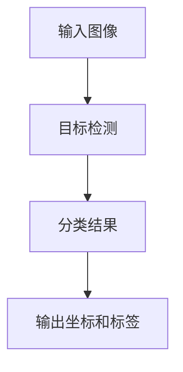
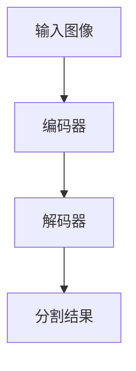
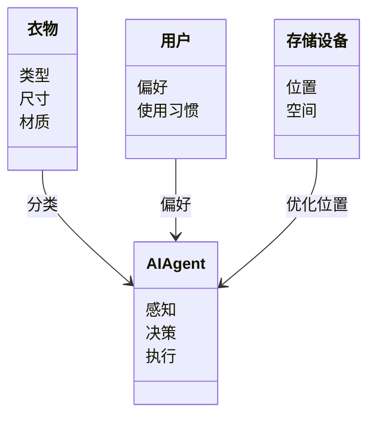
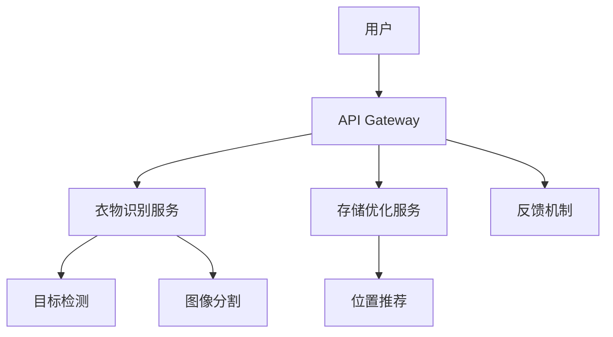
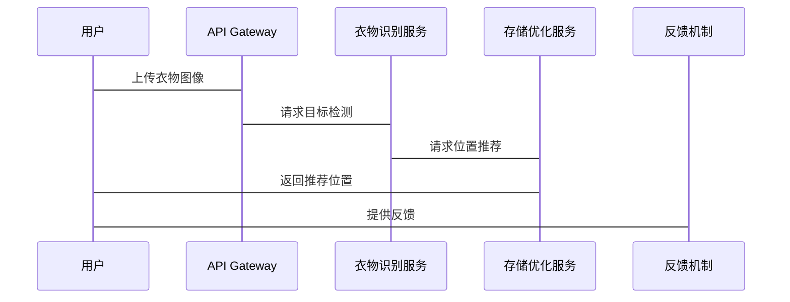

                 


# 智能衣架：AI Agent的衣物保养与存储优化

> 关键词：智能衣架，AI Agent，衣物保养，存储优化，目标检测，图像分割，系统架构

> 摘要：本文将探讨如何利用AI Agent技术优化衣物的保养与存储管理。通过分析传统衣物管理方式的不足，结合现代AI技术，提出一种智能化的衣物管理解决方案。文章从背景介绍、核心概念、算法原理、系统架构、项目实战到最佳实践，全面解析智能衣架的设计与实现。通过详细的技术分析和案例解读，为读者提供一套高效、智能的衣物管理方法。

---

# 第一部分：智能衣架的背景与问题背景

## 第1章：智能衣架的背景介绍

### 1.1 问题背景与描述

#### 1.1.1 衣物管理的传统方式与挑战
传统的衣物管理方式主要依赖人工分类和存储，这种方式存在以下问题：
- **分类效率低**：手动分类衣物耗时且容易出错。
- **存储空间浪费**：缺乏智能化的存储优化，导致空间利用率低。
- **保养不当**：未能根据衣物材质提供个性化的保养建议。

#### 1.1.2 智能化衣物管理的需求与痛点
随着智能家居和AI技术的发展，用户对衣物管理的需求逐渐智能化：
- **快速分类**：通过AI识别技术实现衣物的快速分类。
- **智能存储**：根据衣物类型和使用频率优化存储位置。
- **自动提醒**：定期提醒用户进行衣物保养和更换。

#### 1.1.3 AI Agent在衣物管理中的应用前景
AI Agent（智能代理）能够通过感知、决策和执行帮助用户完成衣物管理任务。其优势在于：
- **自动化**：AI Agent可以自动识别衣物并执行分类和存储操作。
- **智能化**：基于AI算法提供个性化建议，如最优存储位置和保养计划。
- **实时反馈**：通过传感器和反馈机制，AI Agent能够实时调整管理策略。

### 1.2 问题解决与边界

#### 1.2.1 AI Agent如何优化衣物存储与保养
AI Agent通过以下方式优化衣物存储与保养：
- **智能分类**：利用图像识别技术快速分类衣物。
- **动态存储优化**：根据衣物使用频率和材质推荐最优存储位置。
- **自动提醒**：结合日历和用户习惯，自动提醒用户进行清洗或更换。

#### 1.2.2 智能衣架的功能边界与外延
智能衣架的核心功能包括：
- **衣物识别与分类**：通过图像识别技术识别衣物类型。
- **存储优化**：根据衣物特性推荐存储位置。
- **保养提醒**：根据衣物材质和使用情况推荐保养计划。

功能边界包括：
- 不处理衣物的清洗和熨烫过程。
- 不涉及衣物的购买和搭配建议。

#### 1.2.3 核心概念与组成要素分析
智能衣架的组成要素包括：
- **AI Agent**：负责感知、决策和执行。
- **图像识别模块**：用于衣物分类。
- **存储优化算法**：用于推荐存储位置。
- **用户交互界面**：用于用户操作和反馈。

---

# 第二部分：AI Agent的核心概念与原理

## 第2章：AI Agent的原理与核心概念

### 2.1 AI Agent的定义与属性

#### 2.1.1 AI Agent的定义
AI Agent是一种能够感知环境、自主决策并执行任务的智能系统。在智能衣架中，AI Agent负责识别衣物、分类和存储优化。

#### 2.1.2 AI Agent的核心属性对比表

| 属性 | 描述 |
|------|------|
| 感知能力 | 通过图像识别和传感器感知环境 |
| 决策能力 | 基于感知数据做出最优决策 |
| 执行能力 | 执行决策任务，如分类衣物 |
| 学习能力 | 通过反馈优化算法和策略 |

#### 2.1.3 AI Agent的实体关系图（ER图）

```mermaid
erDiagram
    衣物 : 衣物信息表
    用户 : 用户信息表
    存储设备 : 存储位置表
    AI Agent : AI代理模块
    衣物 <--> AI Agent : 分类和存储
    用户 <--> AI Agent : 请求和反馈
    存储设备 <--> AI Agent : 位置优化
```

### 2.2 AI Agent的感知与决策模块

#### 2.2.1 感知模块：图像识别与目标检测

- **图像识别**：通过卷积神经网络（CNN）识别衣物类型。
- **目标检测**：使用YOLO算法检测衣物的位置和大小。

#### 2.2.2 决策模块：基于AI的分类与优化

- **分类算法**：基于KNN或SVM进行衣物分类。
- **存储优化**：使用贪心算法推荐存储位置。

#### 2.2.3 执行模块：智能存储与提醒功能

- **存储执行**：将衣物放置在推荐位置。
- **提醒功能**：通过手机APP提醒用户保养衣物。

### 2.3 AI Agent的算法原理

#### 2.3.1 目标检测算法（YOLO）的流程图



#### 2.3.2 图像分割算法（U-Net）的实现



---

# 第三部分：算法原理与数学模型

## 第3章：目标检测与图像分割算法

### 3.1 目标检测算法原理

#### 3.1.1 YOLO算法的数学模型
YOLO的目标检测损失函数由分类损失和定位损失组成：

$$
\text{损失函数} = \lambda _{1} \text{分类损失} + \lambda _{2} \text{定位损失}
$$

其中，$\lambda_1$ 和 $\lambda_2$ 是权重系数。

#### 3.1.2 案例分析：基于YOLO的衣物识别
假设我们有一个包含T恤、衬衫和外套的图像，YOLO算法能够检测并标记出每件衣物的位置和类型。

### 3.2 图像分割算法原理

#### 3.2.1 U-Net的数学模型
U-Net的损失函数由交叉熵损失和Dice损失组成：

$$
\text{损失函数} = \text{交叉熵损失} + \text{Dice损失}
$$

#### 3.2.2 案例分析
通过U-Net分割一张包含多种衣物的图像，生成衣物的掩膜（mask）。

---

# 第四部分：系统分析与架构设计

## 第4章：系统分析与架构设计

### 4.1 问题场景介绍

#### 4.1.1 使用场景
- 用户上传衣物图像到系统。
- 系统识别衣物类型并推荐存储位置。
- 用户根据推荐进行操作，并通过反馈优化系统。

### 4.2 系统功能设计

#### 4.2.1 领域模型


#### 4.2.2 系统架构设计



#### 4.2.3 系统接口设计
- **输入接口**：接收衣物图像和用户偏好。
- **输出接口**：推荐存储位置和保养建议。

#### 4.2.4 系统交互流程图



---

# 第五部分：项目实战

## 第5章：项目实战

### 5.1 环境安装

#### 5.1.1 安装Python环境
使用Anaconda或虚拟环境安装Python 3.8+。

#### 5.1.2 安装依赖包
```bash
pip install numpy matplotlib tensorflow keras
```

### 5.2 系统核心实现源代码

#### 5.2.1 图像识别代码示例
```python
import numpy as np
import tensorflow as tf
from tensorflow.keras.models import Model
from tensorflow.keras.layers import Input, Conv2D, MaxPooling2D, UpSampling2D

def build_unet():
    inputs = Input(shape=(256, 256, 3))
    conv1 = Conv2D(64, 3, activation='relu')(inputs)
    pool1 = MaxPooling2D(pool_size=(2, 2))(conv1)
    conv2 = Conv2D(128, 3, activation='relu')(pool1)
    pool2 = MaxPooling2D(pool_size=(2, 2))(conv2)
    conv3 = Conv2D(256, 3, activation='relu')(pool2)
    upsample = UpSampling2D(size=(2, 2))(conv3)
    conv4 = Conv2D(128, 3, activation='relu')(upsample)
    upsample2 = UpSampling2D(size=(2, 2))(conv4)
    conv5 = Conv2D(64, 3, activation='relu')(upsample2)
    outputs = Conv2D(1, 1, activation='sigmoid')(conv5)
    return Model(inputs=inputs, outputs=outputs)
```

#### 5.2.2 目标检测代码示例
```python
import cv2
def detect_objects(image_path):
    img = cv2.imread(image_path)
    height, width = img.shape[:2]
    net = cv2.dnn.readNet("yolov4.cfg", "yolov4.weights")
    blob = cv2.dnn.blobFromImage(img, 0.00392, (416, 416), swapRB=True, crop=False)
    net.setInput(blob)
    outs = net.forward(cv2.dnn.getOutputsNames(net))
    boxes = []
    for out in outs:
        for detection in out:
            confidence = detection[5]
            if confidence > 0.5:
                x = int(detection[0] * width)
                y = int(detection[1] * height)
                w = int(detection[2] * width)
                h = int(detection[3] * height)
                boxes.append([x, y, w, h])
    return boxes
```

### 5.3 代码应用解读与分析

#### 5.3.1 图像分割代码分析
上述U-Net模型用于分割衣物图像，输出每个像素的分类结果。

#### 5.3.2 目标检测代码分析
YOLO算法用于检测衣物的位置和大小，输出检测结果。

### 5.4 实际案例分析

#### 5.4.1 案例一：分类T恤和衬衫
输入一张包含T恤和衬衫的图像，系统识别并分类衣物。

#### 5.4.2 案例二：存储位置优化
根据衣物类型和用户偏好，系统推荐最优存储位置。

### 5.5 项目小结

- **实现成果**：成功实现基于AI Agent的衣物分类和存储优化。
- **技术总结**：结合图像识别和优化算法，实现了高效的衣物管理。
- **经验教训**：需要优化算法的运行效率和用户体验。

---

# 第六部分：最佳实践

## 第6章：最佳实践

### 6.1 小结

- **核心总结**：AI Agent通过感知、决策和执行实现衣物的智能化管理。
- **关键点回顾**：图像识别、目标检测、存储优化是智能衣架的核心技术。

### 6.2 注意事项

- **数据隐私**：确保用户数据的安全性和隐私性。
- **算法优化**：持续优化AI算法以提高识别准确率和运行效率。
- **用户体验**：设计友好的用户界面和交互流程。

### 6.3 未来趋势

- **多模态AI**：结合语音识别和自然语言处理实现更智能的交互。
- **边缘计算**：在本地设备上部署AI模型，减少数据传输延迟。
- **自适应学习**：AI Agent能够根据用户行为动态调整管理策略。

### 6.4 拓展阅读

- **推荐书籍**：《Deep Learning》、《Hands-On Machine Learning with Scikit-Learn, Keras, and TensorFlow》
- **推荐博客**：Towards Data Science, Medium上的AI相关文章
- **推荐工具**：TensorFlow官方文档、Keras官方文档

---

# 第七部分：总结与展望

## 第7章：总结与展望

### 7.1 总结

通过本文的详细讲解，我们了解了AI Agent在智能衣架中的应用，从背景介绍到算法实现，再到系统设计和项目实战，全面解析了智能衣架的设计与实现过程。

### 7.2 展望

未来，随着AI技术的不断发展，智能衣架将更加智能化和个性化。结合物联网技术，智能衣架将与智能家居无缝连接，为用户提供更加便捷的衣物管理体验。

---

# 结语

智能衣架的实现不仅提升了衣物管理的效率，也为AI技术在智能家居中的应用提供了新的思路。希望本文的内容能够为读者提供有价值的参考和启发，激发更多创新的想法和技术探索。

